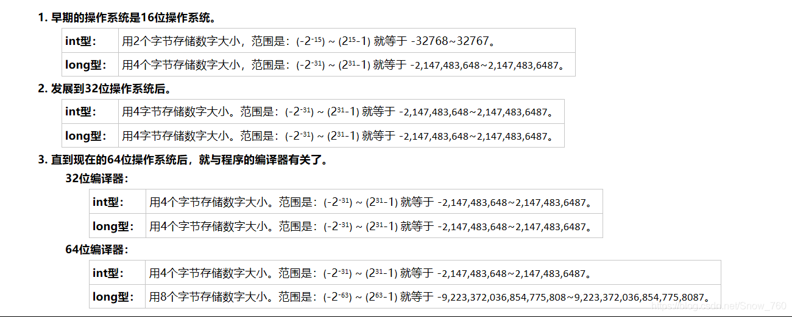
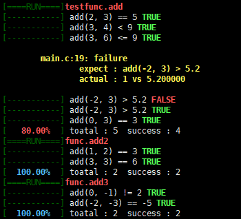

# 第一章 语言入门基础

## printf函数和scanf函数

+ printf返回字符成功打印字符的数量
+ 格式：printf(格式控制字符串, 变参列表)

* scanf的返回值代表成功读入**参数**的个数


Linux中ctrl + c代表EOF

- stdin：标准输入
- stout：标准输出

` printf("%4d\n", 3);` 
输出：   3  
` printf("%04d\n", 3);` 
输出：0003

vim output


# 第二章 数学运算

- 赋值运算符
- 基本四则运算
- 求余运算符
- 位运算
- 左移和右移

异或运算符满足交换律和结合律，同时满足如下规律：
```c
a ^ b == c;
a ^ c == b;
b ^ c == a;
```
交换两数的数值，常规方法：
```c
int temp;
temp = a;
a = b;
b = temp;
```
也可以用异或运算符实现：
```c
a ^= b;
b ^= a;
a ^= b;
```


# 第三章 程序流程控制方法

## 分支结构

归一化：

> !!(x) 
> 若x非0，则!!(x) = 1 
> 若x为0，则!!(x) = 0

三大语句：顺序语句，分支语句，循环语句

逗号是表达式，不是语句

空语句，平语句，复合语句

非零即为真


## 循环结构

++n和n++的区别：  

> 前者先给n加上1再使用n的值 
> 后者先使用n的值再给n加上1 
> 如func(n++)输入func函数的实际上是n，而func(++n)输入的是(n + 1) 
> --n和n--同理

逻辑&&和||如果判断前者为false则后面的判断语句就不会执行了

```c
//以下代码可生成一个随机数
#include <stdlib.h>//rand和srand函数的头文件
#include <time.h>//time函数的头文件

srand(time(0));//随机数种子
rand();//调用rand函数生成随机数种子；函数原型：int rand(void)
```


# 第四章 函数

## 递归

一种编程技巧

1. 边界条件处理
2. 针对于问题的*处理过程*和*递归过程*
3. 结果返回

分为头递归和尾递归  
> 头递归在调用下一层时没有进行计算，而是直到下一层返回才进行计算  
> 尾递归在调用下一层前会先计算，并把计算的结果传入下一层，在一般条件满足后，会将最后的计算结果逐层返回

复杂的递归可结合数学归纳法进行验证  

> 使用数学归纳法证明分下面两步
>
> 1. 证明当$n$取第一个值时命题成立(如$n=n_1$)
> 2. 假设$n=k$($k$为正整数且$k≥n_1$)时命题成立，证明当$n=k+1$时命题也成立

关于整数类型：




## 函数指针

```c
//定义g函数，其第1，2，3个形参为整数型的函数指针，且指向的函数其参量均为int型
int g(int (*f1)(int), int (*f2)(int), int (*f3)(int), int x) {
    if (x < 0) {
        return f1(x);
    }
    if (x < 100) {
        return f2(x);
    }
}
```


## 二分查找法 - 算法1

[二分查找](https://baike.baidu.com/item/%E4%BA%8C%E5%88%86%E6%9F%A5%E6%89%BE/10628618?fr=aladdin)，又称折半查找（Binary Search），源于[二分法](https://baike.baidu.com/item/%E4%BA%8C%E5%88%86%E6%B3%95/1364267?fr=aladdin) 
查找N个数，计算量（时间复杂度）为$\log_2 N$​​ 
前提条件：**数据满足单调性**（单调递增或单调递减）

代码实现：

```c
//实现在一个数组arr中查找数字x是否存在，数组长度为n，如果找到了，返回x所在数组下标，否则返回-1
int binary_search(int *arr, int n, int x) {
    int head = 0, tail = n - 1, mid;
    while (head <= tail) {
        mid = (head + tail) >> 1;
        if (arr[mid] == x) return mid;
        if (arr[mid] < x) head = mid + 1;
        else tail = mid - 1;
    }
    return -1;
}
```

二分查找法代码实现sqrt函数：

```c
#include <stdio.h>
#include <math.h>

double func(int x) {
    return x * x;
}

double binary_search(double (*arr)(double), double x) {
    double head = 0, tail = x / 2.0, mid = 0;
    #define ESPL 1e-6
    while (fabs(arr(mid) - x) > ESPL) {
        mid = (head + tail) / 2.0;
        if (arr(mid) < x) head = mid + 1;
        else tail = mid - 1;
    }
    return -1;
}

int main() {
    double n;
    while(~scanf("%d", &n)) { //读到输入流结尾时scanf()返回EOF
        double x = binary_search(func, n);
        printf("%g * %g = %g\n", x, x, n);
    }
    return 0;
}
```


欧拉工程第45题：

> Triangle, pentagonal, and hexagonal numbers are generated by the following formulae:
>
> | Triangle   | T*n*=*n*(*n*+1)/2  | 1, 3, 6, 10, 15, ...  |
> | ---------- | ------------------ | --------------------- |
> | Pentagonal | P*n*=*n*(3*n*−1)/2 | 1, 5, 12, 22, 35, ... |
> | Hexagonal  | H*n*=*n*(2*n*−1)   | 1, 6, 15, 28, 45, ... |
>
> It can be verified that T285 = P165 = H143 = 40755.
>
> Find the next triangle number that is also pentagonal and hexagonal.

代码实现范例：  

```c
//查找40755后的下一个三角形数
#include <stdio.h>
#include <inttypes.h>//引入int64_t型，防止计算结果过大溢出

int64_t Triangle(int64_t n) {
    return n * (n + 1) / 2;
}

int64_t Pentagonal(int64_t n) {
    return n * (3 * n - 1) / 2;
}
int64_t Hexagonal(int64_t n) {
    return n * (2 * n - 1);
}
//二分查找
int64_t binary_search(int64_t (*func)(int64_t), int64_t x) {//第一个形参为函数指针
    int64_t head = 1, tail = x, mid;//查找上限必然小于等于六边形数x
    while (head <= tail) {
        mid = (head + tail) >> 1;//右移1位，效果约等于除以2
        if (func(mid) == x) return mid;
        else if (func(mid) < x) head = mid + 1;
        else tail = mid -1;
    }
    return -1;
}

int main() {
    int n = 143;
    while (1) {
        n++;
        int64_t val = Hexagonal(n);
        //如果n计算的值是六边形数，则必然也是三角形数，故只需验证是否为五边形数
        if (binary_search(Pentagonal, val) == -1) continue;
        break;
    }
    printf("%d\n", Hexagonal(n));
    return 0;
}
```


## 欧几里得算法 - 算法2

**辗转相除法**又名**欧几里得法**，用于求两个整数的最大公约数  
易证明gcd(a, b) == gcd(b, a%d)，于是有：

```c
#include <stdio.h>
//a和b为输入的两个整数，无关大小顺序
int gcd(int a, int b) {
    return (b ? gcd(b, a % b) : a);//若b为0，则返回a
}

int main(void) {
    int a, b;
    while (~scanf("%d%d", &a, &b)) {
        printf("%d\n", gcd(a, b));
    }
    return 0;
}
```


### 扩展欧几里得法 - 算法3

可求出ax + by = 1的整数解x, y  
显然a和b的最大公约数为1，余下用数学归纳法可证  
以下程序实现了求ax+by=gcd(a, b)整数解的过程

```c
#include <stdio.h>

int ex_gcd(int a, int b, int *x, int *y) {
    if (!b) {
        *x = 1, *y = 0; //递推至最底层时必有a=1, b=0
        return a;
    }
    int xx, yy, ret = ex_gcd(b, a % b, &xx, &yy);
    *x = yy; //利用后一层y算出前一层的x
    *y = xx - a / b * yy; //利用后一层的x-ky算出前一层的y
    return ret;
}

int main() {
    int a, b, x, y;
    while (~scanf("%d%d", &a, &b)) {
        printf("gcd(%d, %d) = %d\n", a, b, ex_gcd(a, b, &x, &y));
        printf("%d * %d + %d * %d = %d\n", a, x, b, y, a * x + b* y);
    }
    return 0;
}
```


## 变参函数

实现可变参数` max_int`， 从若干个传入的非负整数参数中返回最大值

```c
#include <stidio.h>
#include <stdarg.h>

int max_int(int n, ...) {
    if (n < 0) return 0;//n为负数非法
    int ans = 0;
    va_list arg;
    va_start(arg, n);
    while (n--) {
        int temp = va_arg(arg, int);//注意va_arg输入的第二个参数是类型
        if (temp > ans) ans = temp;
    }
    va_end(arg);
    return ans;
}

int main() {
    printf("%d\n", max_int(3, 1, 2, 5));
    printf("%d\n", max_int(2, 1, 7, 17));
    printf("%d\n", max_int(3, 3, 6, 18));
}
```

va一组宏，所在头文件`#include <stdarg.h>`：
- `va_list` （获得n往后的参数列表）
- `va_start` （定位n后面第一个参数的位置）
- `va_arg` （获取下一个可变参数列表中的参数）
- `va_end` （结束整个获取可变参数列表的动作）

程序生成过程：源文件→预编译→编译→对象文件→链接→可执行文件
在**预编译**时处理头文件的编译
在**编译**生成对象文件的时候检查程序**有没有语法错误**（如函数未声明）
在**连接**对象文件时会检查程序**能否运行成功**（如函数未定义）


### printf简版实现

```c
#include <stdio.h>
#include <stdarg.h>
#include <inttypes.h>

int reverse_num(int num, int *temp) {
    int digit = 0;
    do {
        *temp = *temp * 10 + num % 10;
        num /= 10;
        digit += 1;
    } while (num);
    return digit;
}

int output_num(int num, int digit) {
    int cnt = 0;
    while (digit--) {
        putchar(num % 10 + 48);
        num /= 10;
        cnt++;
    }
    return cnt;
}

int my_printf(const char *frm, ...) {
    va_list arg;
    va_start(arg, frm);
    int cnt = 0;
    #define PUTC(a) putchar(a), ++cnt//宏定义实现逐个打印字符
    for (int i = 0; frm[i]; i++) {
        switch (frm[i]) {
            case '%': {
                switch (frm[++i]) {
            		case '%': {
                		PUTC(frm[i]);
            		} break;
            		case 'd': {
                		int xx =va_arg(arg, int);
                		uint32_t x;
                		if (xx < 0) PUTC('-'), x = -xx;
                		else x = xx;
                		int num1 = x / 100000, num2 = x % 100000;
                		int temp1= 0 , temp2 = 0;
                		int digit1 = reverse_num(num1, &temp1);
                		int digit2 = reverse_num(num2, &temp2);
                		if (num1) digit2 = 5;
                		else digit1 = 0;
                		cnt += output_num(temp1, digit1);
                		cnt += output_num(temp2, digit2);
                	} break;
                    case 's': {
                        const char *str = va_arg(arg, const char *);
                        for (int i = 0; str[i]; i++) {
                            PUTC(str[i]);
                        }
                    } break;
            	}
        	} break;
            default: PUTC(frm[i]); break;
        }
    }
    #undef PUTC//结束宏定义
    va_end(arg);
    return cnt;
}
//比较printf和my_printf的功能
int main() {
    int a = 123;
    printf("hello world\n");
    my_printf("hello world\n");
    printf("int a = %d\n", a);
    my_printf("int a = %d\n", a);
    printf("int a = %d\n", 1000);
    my_printf("int a = %d\n", 1000);
    printf("int a = %d\n", 0);
    my_printf("int a = %d\n", 0);
    printf("int a = %d\n", -123);
    my_printf("int a = %d\n", -123);
    printf("int a = %d\n", INT32_MAX);
    my_printf("int a = %d\n", INT32_MAX);
    printf("int a = %d\n", INT32_MIN);
    my_printf("int a = %d\n", INT32_MIN);
    int n;
    char str[] = "I love China!";
    printf("%s\n", str);
    my_printf("%s\n", str);
    while (~scanf("%d", &n)) {
        printf(" has %d digits!\n", printf("%d", n));
        my_printf(" has %d digits!\n", my_printf("%d", n));
    }
    return 0;
}
```


# 第五章 数组与预处理命令

## 数组

数组声明与初始化：类型 数组名[数组大小]  
arr[n]代表数组里第**n-1**个元素  
数组是一片<u>连续的内存空间</u>  
数组首地址：arr[0]或arr  
arr + 1代表向后跳动一个元素类型的大小（如int，char等）  
访问时间最少为O(1)  
`arr[100] = {0}` 代表把数组所有元素初始化为0  
数组定义在函数内部，则开辟在内存**栈区**，每一位不一定为0，；定义在函数外，则开辟在**堆区**，并将所有位初始化为0  
栈区：最大8MB；在栈区数组大小最大开到大约两百万  
**数组是展开的函数，函数是压缩的数组**


### 数组的传参

`arr + 1`代表向后移动一个**元素类型**的大小  
`arr + i == &arr[i]`同理`*(arr + i) == arr[i]`  
32位系统中，一个指针变量占4个字节；64位系统中，一个指针变量占8个字节

| 数组     | 实参             | 形参                              |
| -------- | ---------------- | --------------------------------- |
| 一维数组 | `func(arr)`      | `void func(int *arr)`             |
|          | `func(arr)`      | `void func(int arr[])`            |
|          | `func(100, arr)` | `void func(int n, arr[n])`        |
| 二维数组 | `func(arr)`      | `void func(int (*arr)[200])`      |
|          | `func(arr)`      | `void func(int arr[][200])`       |
| 三维数组 | `func(arr)`      | `void func(int (*arr)[200][300])` |
|          | `func(arr)`      | `void func(int arr[][200][300)`   |


### 素数筛 - 算法4

> 1. 标记一个范围内的数字是否是合数，没有被标记的则为素数
> 2. 算法的空间复杂度为O(N)，时间复杂度为O(N * loglogN)
> 3. 总体思想是用素数去标记掉不是素数的数字，例如若知道了i是素数，那么2 * i、3 * i、4 * i... 就都不是素数

代码实现：  

```c
#include <stdio.h>
#define MAX_N 100

int prime[MAX_N + 5];

void init() {
    for (int i = 2; i <= MAX_N; i++) {
        if (prime[i]) continue;
        prime[++prime[0]] = i;//数组第1个元素prime[0]记录素数个数，并在数组内依次存储素数值
        for (int j = i * i; j <= MAX_N; j += i) {//直接从i*i开始查找，提高了查找效率
            prime[j] = 1;//标记为合数
        }
    }
    return;
}

int main() {
    init();
    for (int i = 2; i <= prime[0]; i++) {
        printf("%d\n", prime[i]);
    }
    return 0;
}
```


欧拉工程第7题：

> By listing the first six prime numbers: 2, 3, 5, 7, 11, and 13, we can see that the 6th prime is 13.
>
> What is the 10 001st prime number?

```c
#include <stdio.h>
#define MAX_N 100

int prime[MAX_N + 5]
void init() {
    for (int i = 2; i <= MAX_N; i++) {
        if (prime[i]) continue;
        prime[++prrime[0]] = i;
        for (int j = i; j <= MAX_N; j += i) {
            prime[j] = i;
        }
    }
    return;
}

int main() {
    init();
    for (int i = 1; i <= prime[0]; i++) {
        printf("mini_factor(%d) = %d\n", i, prime[i]);
    }
    return 0;
}
```


### 线性筛 - 算法5

> 1. 标记一个范围内的数字是否是合数，没有被标记的则为素数
>
> 2. 算法的空间复杂度为O(N)，时间复杂度为O(N)
>
> 3. 总体思想是用一个整数M去标记合数N，其中N和M具有如下性质：
>
>    1) N中最小的素数为p
>
>    2) N可以表示成为p * M
>
>    3) p一定小于等于M中最小的素因子
>
>    4) 利用M * P'（所有不大于M中最小素数的集合）标记N1、N2、N3 ...

从以上4条性质易推得：M一定为N最大的因子（除N本身以外）

代码实现：

```c
#include <stdio.h>
#define MAX_N 100

int prime[MAX_N + 5];
void init() {
    for (int i = 2; i <= MAX_N; i++) {
        if (!prime[i]) prime[++prime[0]] = i;
        for (int j = 1; j <= prime[0]; j++) {
            if (prime[j] * i > MAX_N) break;
            prime[prime[j] * i] = 1;
            if (i % prime[j] == 0) break;
        }
    }
    return;
}

int main() {
    init();
    for (int i = 1; i <= prime[0]; i++) {
        printf("%d\n", prime[i]);
    }
    return 0;
}
```


### 牛顿迭代法 - 算法6

一般用于求一元高次方程的根

```c
//牛顿迭代法实现sqrt函数的功能
#include <stdio.h>
//原函数
double F(double x, double n) {
    return x * x - n;
}
//导数
double f(double x) {
    return 2 * x;
}

double NewTon(double (*F)(double, double), double (*f)(double), double n) {
    double x = n / 2.0; //设迭代初值
    #define EPSL 1e-6 //宏定义精度
    while (fabs(F(x, n)) > EPSL) {
        x -= F(x) / f(x);
    }
    #undef EPSL
    return x;
}

double my_sqrt(double n ) {
    return NewTon(F, f, n);
}

int main() {
    double n;
    while (~scanf("%lf", &n)) {
        printf("%g\n", my_sqrt(n));
    }
    return 0;
}
```


## 预处理命令

### 宏定义

宏定义是预处理命令中的一种，**只起到代码替换的作用，不做计算**  
在编译阶段前（预编译期）就开始预编译（预处理），即开始做代码替换  
凡是以`#`开头的代码都是预处理命令  

- 定义符号常量

- 定义表达式

- 定义代码段  

  ```c
  #define P(a) {\
  	printf("%d\n", a);
  }//函数内容是多行则需在{}外加上()
  ```

> 宏定义代码中  
> `#`用于连接字符串  
> `##`用于连接代码

预定义的宏

| 宏                    | 说明                      |
| --------------------- | ------------------------- |
| `__DATE__`            | 编译时的日期：Mmm dd yyyy |
| `__TIME__`            | 编译时的时间：hh:mm:ss    |
| `__LINE__`            | 行号                      |
| `__FILE__`            | 文件名                    |
| `__func__`            | 函数名/*非标准*           |
| `__FUNC__`            | 函数名/*非标准*           |
| `__PRETTY_FUNCTION__` | 更详细的函数信息/*非标准* |

条件式编译

| 函数             | 说明                 |
| ---------------- | -------------------- |
| #ifdef DEBUG     | 是否定义了DEBUG宏    |
| #ifndef DUBUG    | 是否没定义DEBUG宏    |
| #if MAX_N == 5   | 宏MAX_N是否等于5     |
| #elif MAX_N == 4 | 否则宏MAX_N是否等于4 |
| #else            |                      |
| #endif           |                      |

```c
//实现一个MAX宏
#include <stdio.h>
#define MAX(a, b) ({\
	__typeof(a) _a = a;\
    __typeof(b) _b = b;\
    _a > _b ? _a : _b;\//宏的返回值为最后一行表达式的值
})
#define P(a) {\
	printf("%s = %d\n", #a, a);\//#a表示把a的内容转化成字符串
}

int main() {
    int a = 7;
    P(MAX(2, 3));
    P(5 + MAX(2, 3));
    P(MAX(2, MAX(3, 4)));
    P(MAX(2, 3 > 4 ? 3 : 4));
    P(MAX(a++, 6));
    P(a);
    return 0;
}
```

linux命令`g++ -E`可以通过g++编译器对cpp源代码预编译过程展示出来


```c
//实现一个打印LOG的函数，需要输出所在函数及行号等信息
//输入gcc -DDEBUG [文件名] 进行编译
#include <stdio.h>
#ifdef DEBUG//如果预定义了DEBUG，则定义log函数
#define log(frm, argc...) {\//argc代表变参列表所有变量
	printf("[%s : %d] ", __func__, __LINE__);\
	printf(frm, ##argc);\//注意第一个参量是字面量
	printf("\n");\
}
#else
#define log(frm, argc...)
#endif

#define contact(a, b) a##b

void func(int a) {
    a += 1;
    log("%d", a);
    return;
}

int main() {
    int a = 123, abcdef = 0;
    func(a);
    log("%d", a);
    log("hello world");
    contact(abc, def) = 24;
    log("%d", abcdef);
    return 0;
}
```

`#a`字符串a  
`abc##def`连接字符串abc和def


## 字符串

定义字符数组：`char str[size];`  
初始化字符数组：`char str[] = "hello world"` 或 `char str[size] = {'h', 'e', 'l', 'l', 'o'};`

- `strlen(str)`获取字符串不包括`\0`的长度
- `strcmp(str1, str2)`字符串比较，依次比较各字符大小；返回该位置相应两个ASCII码**差值**
- `strcpy(dest, src)`将`str`字符串对于按位进行拷贝至`dest`
- `strncmp(str1, str2, n)`安全的字符串比较，遇到`\0`或n - 1的位置停止
- `strncpy(str1, str2, n)`安全的字符串拷贝，遇到`\0`或n - 1的位置停止
- `memcpy(str1, str2, n)`内存拷贝
- `memcmp(str1, str2, n)`内存比较
- `memset(str1, c, n)`将str1内存的**每一位**都设置为`c`，比如0或1


### 字符串相关操作

头文件：`stdio.h`  

- `sscanf(str1, format, ...)` 从字符串str1读入内容
- `sprintf(str1, format, ...)` 将内容输出到str1中


# 第六章 复杂结构与指针

## 结构体

结构体用于存储不同类型的数据（数组用于存储相同类型的数据）

```c
struct [结构体名] {
    字段1
    字段2
    ...
} [结构体声明简写名]
```

- 直接引用：`结构体原始变量.变量名`
- 间接引用：`结构体指针变量->变量名`

**结构体对齐方式**：默认以**内存空间最大的类型**为基准进行所有字段的内存开辟  
故不同字段排列顺序影响到结构体内存的大小（尽量将相同类型字段摆放在一起）  
有相关宏可以强制改变结构体的对齐大小  

> 结构体内存对齐原则：  
>
> 1. 起始地址为该变量的类型所占的整数倍，若不足则不足部分用无关数据填充至所占内存的整数倍；
> 2. 该结构体所占内存为结构体成员变量中最大数据类型的整数倍。


## 共用体

共用体中的所有变量共用**同一片**内存空间

```c
#include <stdio.h>

union IP {//定义共用体
    struct {
        unsigned char a1;
        unsigned char a2;
        unsigned char a3;
        unsigned char a4;
    } ip
    unsigned int num;
};

int is_little( {
    static int num = 1;
    return ((char *)(&num))[0];
})

int main() {
    printf("%d\n", is_little());
    union IP p;
    char str[100];
    int arr[4];
    while (~scanf("%s", str)) {
        sscanf(str, "%d.%d.%d.%d", arr + 0, arr + 1, arr + 2, arr + 3);
        p.ip.a1 = arr[3]; //如果操作系统为小端记忆，则如此倒过来赋值
        p.ip.a2 = arr[2];
        p.ip.a3 = arr[1];
        p.ip.a4 = arr[0];
        printf("%u\n", p.num);
    }
}
```

**大端记忆**：声明的变量低位放到内存空间中的高位地址存储  
**小端记忆**：声明的变量低位放到内存空间中的低位地址存储


## 变量的地址

64位操作系统指针变量占8个字节  
32位操作系统指针变量占4个字节

`p + 1`表示p的地址加上指针类型大小  
如64位操作系统中64位编译器，`int *p = &a`则`p + 1`表示`a`的地址加4字节

```c
int a;
int *p = &a;
*p = 5;//注意前后两个*具有不同的含义
```

**指针变量，也是变量**


### 等价形式转换

- `*p` 等价于 `a`（原始变量）
- `p + 1` 等价于 `&p[1]`
- `p->filed` 等价于 `(*p).filed` 等价于 `a.filed`

```c
#include <stdio.h>
#define P(a) {\
	printf("%s = %d\n", #a, a);\
}

struct Data {
    int x, y;
}

int main() {
    struct Data a[2], *p = a;//用多种不同方式表示a[1].x
    a[0] = 1, a[0].y = 1;
    a[1].x = 2, a[1].y = 2;
    P(a[1].x);
    P((a + 1)->x);
    P((p + 1)->x);
    P(p[1].x);
    P((*p + 1)).x);
    P((*(a + 1)).x);
    return 0;
}
```


### 函数指针

**定义方式：** `int (*add)(int, int)` 表示参数为两个`int`型，返回值也为`int`型的函数指针`add`

`typedef [声明变量]` = `[声明类型]`


### MAIN函数参数

main函数由操作系统调用，返回值给操作系统

`int main(int argc, char *argv[], char **env);`

> `argc` 代表参数个数，`argv`代表具体某个参数，`env`代表环境变量

结构体指针与地址代码演示：

```c
#include <stdio.h>
#define offset(T, a) (long)(&(((T*)(NULL))->a))

struct Data {
    int a;
    double b;
    char c;
};

int main() {
    int num1 = 0x616263;
    int num2 = 0x61626364;
    printf("%s\n", (char *)(&num2 + 1));
    printf("%ld\n", offset(struct Data, a));
    printf("%ld\n", offset(struct Data, b));
    printf("%ld\n", offset(struct Data, c));
    return 0;
}
```

main主函数代码演示：

```c
#include <stdio.h>
#include <string.h>
#include <stdlib.h>
#define ppchar char *
typedef char * pchar;

void output(int argc, char *argv[], char **env) {
    printf("argc = %d\n", argc);
    for (int i = 0; i < argc; i++) {
        printf("%s\n", argv[i]);
    }
    for (int i = 0; env[i]; i++) {
        if (!strncmp(env[i] + 5, "username")) {
            printf("welcome!\n");
        } else {
            printf("you are not the user!\n");
            exit(0);
        }
    }
    return;
}

int main() {
    pchar p1, p2;
    ppchar p3, p4;
    printf("p1 = %lu, p2 = %lu\n", sizeof(p1), sizeof(p2));
    printf("p3 = %lu, p4 = %lu\n", sizeof(p3), sizeof(p4));
    output(argc, argv, env);
    return 0;
}
```


# 第七章 工程项目开发

## 函数的声明与定义

循环调用的出现导致必须要对各函数先声明再定义

> 常见代码结构：  
> 各函数的声明  
> main函数  
> 各函数的定义

源文件在编译时只检查是否有声明等语法问题，连接时将检查声明和定义是否完整  
每个目标文件需要有使用到的函数的声明，其中一个目标文件需要有某个函数的定义（多个目标文件都有定义则导致**重定义**）

```c
//以下三段宏可解决源文件在编译时的重复包含问题
#ifndef _HEADER_H
#define _HEADER_H
//代码段
#endif
```


头文件放声明，源文件放定义  
头文件中，`<>`搜索系统目录，`""`搜索当前目录  
若都使用`<>`进行声明，则须在编译时添加命令`-I./`，即把当前目录添加进搜索的系统目录中


### 静态链接库和动态链接库

链接静态库时，系统自动忽略文件名前边的`lib`和后边的`.a`
不同系统的链接命令有所不同


### makefile

一个用于封装编译过程的工具

在工程项目的开发中，常常有许多个对象文件，使用命令进行编译、链接，会很麻烦，而makefile可以简化这个过程

```makefile
#makefile中的规则
目标: 依赖1 依赖2 ...
	命令
#命令前必需是制表符\t
```

**makefile使用流程：**

1. 创建makefile文件：`touch makefile`

2. 打开makefile文件进行编辑：`vim makefile`

3. ```makefile
   #makefile文件格式举例
   .PHONY: clean #在虚拟空间中映射clean，避免了文件名跟命令重名等问题
   all: header1.o header2.o header3.o test.o #需要的所有文件
       g++ header1.o header2.o header3.o test.o
   header1.o: ./src/header1.cc
       g++ -I./include -c ./src/header1.cc
   header2.o: ./src/header2.cc
       g++ -I./include -c ./src/header2.cc
   header3.o: ./src/header3.cc
       g++ -I./include -c ./src/header3.cc
   test.o: test.cpp
       g++ -I./include -c test.cpp
   clean: #命令：将需要删掉的文件删除
   	rm -rf *.o a.out #删除所有对象文件和a.out文件
   ```

4. 输入命令：`make` 生成`a.out`文件  
   *即使之后再修改源文件，`make` 命令也可以自动编译相应新的对象文件*  
   *makefile文件里的除当前目录隐藏文件外的第一个目标会成为运行`make`不指定目标时的默认目标*
   
5. 输入`make clean` 命令执行清除命令


### gtest测试框架

[GTest的安装与使用教程](https://www.cnblogs.com/helloworldcode/p/9606838.html)

`makefile`用于编译链接  
`cmake`也是一类用于编译、链接的工具，可以生成当前环境下的`makefile`文件（类似于宏跟函数的关系）

`TEST(func1, func2)`是一个宏  
`EXPECT_EQ(a, b)`是一个用于判断`a`和`b`是否相等的宏

头文件`#include <gtest/gtest.h>`


[Linux C/C++ 如何输出彩色字体](https://blog.csdn.net/hn_tzy/article/details/92565047)


泛型宏`_Generic` (c11标准)
*注意：c++的编译器并不是对c语言绝对兼容的*


### 设置链表

> [**链表**](https://baike.baidu.com/item/%E9%93%BE%E8%A1%A8/9794473?fr=aladdin)是一种物理存储单元上非连续、非顺序的**存储结构**，数据元素的逻辑顺序是通过链表中的指针链接次序实现的。

一种结构体
具体结构：数据域+指针域

结构定义
结构操作


## 工程项目-简易计算结果检查

实现效果图：



文件树：

> .
> ├── bin
> │   └── haizei
> ├── haizei
> │   ├── linklist.h
> │   ├── test.c
> │   ├── test.h
> │   └── test.o
> ├── include
> ├── lib
> ├── main.c
> ├── main.o
> └── makefile

makefile文件：

```makefile
.PHONY: run clean

all: main.o haizei/test.o haizei/test.h
	gcc -I./ main.o haizei/test.o -o ./bin/haizei
main.o: main.c haizei/test.h
	gcc -I./ -c main.c
haizei/test.o: haizei/test.c haizei/test.h
	gcc -I./ -c haizei/test.c -o haizei/test.o
run:
	./bin/haizei
clean:
	rm -rf bin/haizei main.o haizei/test.o
```

main.c源文件：

```c
#include <stdio.h>
#include <haizei/test.h>

int add(int a, int b) {
    return a + b;
}

TEST(testfunc, add) {
    EXPECT_EQ(add(2, 3), 5);
    EXPECT_LT(add(3, 4), 9);
    EXPECT_LE(add(3, 6), 9);
    EXPECT_GT(add(-2, 3), 5.2);
    EXPECT_EQ(add(0, 3), 3);
}

TEST(func, add2) {
    EXPECT_EQ(add(1, 2), 3);
    EXPECT_EQ(add(3, 3), 6);
}

TEST(func, add3) {
    EXPECT_NE(add(0, -1), 2);
    EXPECT_EQ(add(-2, -3), -5);
}

int main(int argc, char *argv[]) {
    return RUN_ALL_TESTS();
}
```

/haizei/test.h文件：

```c
#ifndef _TEST_H
#define _TEST_H
#include <haizei/linklist.h>

#define TEST(a, b)\
void a##_##b();\
__attribute__((constructor))\
void add##_##a##_##b() {\
    add_function(a##_##b, #a "." #b);\
}\
void a##_##b()

#define CORLOR(a, b) "\033[" #b "m" a "\033[0m"
#define CORLOR_HL(a, b) "\033[1;" #b "m" a "\033[0m"

#define GREEN(a) CORLOR(a, 32)
#define RED(a) CORLOR(a, 31)
#define BLUE(a) CORLOR(a, 34)
#define YELLOW(a) CORLOR(a, 33)

#define GREEN_HL(a) CORLOR_HL(a, 32)
#define RED_HL(a) CORLOR_HL(a, 31)
#define BLUE_HL(a) CORLOR_HL(a, 34)
#define YELLOW_HL(a) CORLOR_HL(a, 33)

#define TYPE(a) _Generic((a), \
    int : "%d",\
    double : "%lf",\
    float : "%f",\
    long long : "%lld",\
    const char * : "%s",\
    char * : "%s"\
)

#define P(a, color) {\
    char frm[1000];\
    sprintf(frm, color("%s"), TYPE(a));\
    printf(frm, a);\
}

#define EXPECT(a, b, comp) {\
    haizei_test_info.total += 1;\
    __typeof(a) _a = (a);\
    __typeof(b) _b = (b);\
    if ((a) comp (b)) {\
        haizei_test_info.success += 1;\
    } else {\
        printf(YELLOW_HL("\n\t%s:%d: failure\n"), __FILE__, __LINE__);\
        printf(YELLOW_HL("\t\texpect : " #a " " #comp " " #b "\n\t\t" "actual : "));\
        P(a, YELLOW_HL);\
        P(" vs ", YELLOW_HL);\
        P(b, YELLOW_HL);\
        printf("\n\n");\
        printf(GREEN("[-----------] ") #a " " #comp " " #b);\
        printf(" %s\n", RED_HL("FALSE"));\
    }\
    printf(GREEN("[-----------] ") #a " " #comp " " #b);\
    printf(" %s\n", GREEN_HL("TRUE"));\
}

#define EXPECT_EQ(a, b) EXPECT(a, b, ==)
#define EXPECT_NE(a, b) EXPECT(a, b, !=)
#define EXPECT_LT(a, b) EXPECT(a, b, <)
#define EXPECT_LE(a, b) EXPECT(a, b, <=)
#define EXPECT_GT(a, b) EXPECT(a, b, >)
#define EXPECT_GE(a, b) EXPECT(a, b, >=)

typedef void (*TestFunc)();

typedef struct Function {
    TestFunc func;
    const char *str;
    struct LinkNode p;
} Function;

struct FunctionInfo {
    int total, success;
};
extern struct FunctionInfo haizei_test_info;
int RUN_ALL_TESTS();
void add_function(TestFunc, const char*);

#endif
```

/haizei/test.c文件：

```c
#include <haizei/test.h>
#include <string.h>
#include <stdio.h>
#include <math.h>
#include <stdlib.h>

Function func_head, *func_tail = &func_head;
struct FunctionInfo haizei_test_info;

int RUN_ALL_TESTS() {
    for (struct LinkNode *p = func_head.p.next; p; p = p->next) {
        Function *func = Head(p, Function, p);
        printf(GREEN("[====RUN====]") RED_HL("%s")"\n", func->str);
        haizei_test_info.total = 0, haizei_test_info.success = 0;
        func->func();
        double rate = 100.0 * haizei_test_info.success / haizei_test_info.total;
        printf(GREEN("[  "));
        if (fabs(rate - 100.0) < 1e-6) {
            printf(BLUE_HL("%6.2lf%%"), rate);
        } else {
            printf(RED_HL("%6.2lf%%"), rate);
        }
        printf(GREEN("  ]")" toatal : %d  success : %d\n", 
               haizei_test_info.total, 
               haizei_test_info.success
        );
    }
    return 0;
}

void add_function(TestFunc func, const char *str) {
    Function *temp = (Function *)calloc(1, sizeof(Function));
    temp->func = func;
    temp->str = strdup(str);
    func_tail->p.next = &(temp->p);
    func_tail = temp;
    return;
}
```

/haizei/linklist.h文件：

```c
#ifndef _LINKLIST_H
#define _LINKLIST_H

#define offset(T, name) (long long)(&(((T *)(0))->name))
#define Head(p, T, name) (T *)((char *)(p) - offset(T, name))

struct LinkNode {
    struct LinkNode *next;
};

#endif
```

