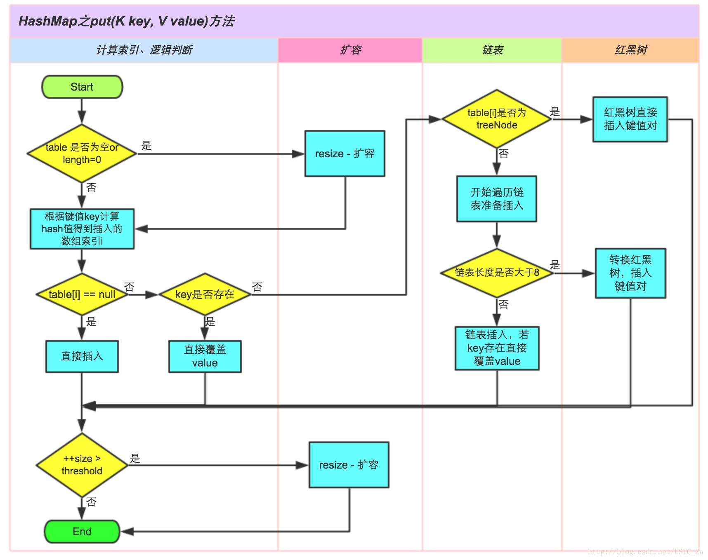

# HashMap系列

## 第1节 HashMap

### 1 概述

HashMap是一个关联数组、哈希表

继承了AbstractMap抽象类，实现了Map、Cloneable、Serializeble接口

线程不安全

允许一个key为null，多个vaule为null


HashMap的底层数据结构是数组，称为**哈希桶**

```java
// transient用于取消序列化
transient Node<K,V>[] table;
```

每个桶里面存放的是**链表**，链表中的每个节点 `Node` 就是哈希表中的每个元素

JDK 8之后在链表节点超过8是会将链表转化成红黑树，使用 `TreeNode` 作为红黑树的节点


当HashMap的容量达到`threshold`阈值时，就会触发扩容

扩容前后，哈希桶的长度一定会是2的幂


HashMap的源码中，充斥个各种位运算代替常规运算的地方，以提升效率：

- 与运算替代模运算。比如用 `hash & (table.length-1)` 替代 `hash % table.length`
- 用`if ((e.hash & oldCap) == 0)`判断扩容后，节点e处于低区还是高区


HashMap的存储结构：


[HashMap源码分析](https://blog.csdn.net/zxt0601/article/details/77413921)

[HashMap Jdk8的实现原理](https://blog.csdn.net/goosson/article/details/81029729)

[HashMap全面分析及JDK8对HashMap的相关优化](https://blog.csdn.net/lch_2016/article/details/81045480)


### 2 字段

HashMap的字段：

| 字段名                   | 字段说明                        | JDK 7 | JDK 8 |
| ------------------------ | ------------------------------- | ----- | ----- |
| DEFAULT_INITIAL_CAPACITY | 默认初始容量=16                 | Yes   | Yes   |
| MAXIMUM_CAPACITY         | 最大容量=2的30次方              | Yes   | Yes   |
| DEFAULT_LOAD_FACTOR      | 默认加载因子=0.75               | Yes   | Yes   |
| TREEIFY_THRESHOLD        | 转变为红黑树的临界值=8          | No    | Yes   |
| UNTREEIFY_THRESHOLD      | 与拆分操作有关的临界值=6        | No    | Yes   |
| MIN_TREEIFY_CAPACITY     | TreeNode最小容量=64             | No    | Yes   |
| table                    | Node数组，即表                  | Yes   | Yes   |
| entrySet                 | 键值对对象Map.Entry的Set        | Yes   | Yes   |
| size                     | 此map保存的键值对数量           | Yes   | Yes   |
| loadFactor               | 加载因子，与扩容有关            | Yes   | Yes   |
| threshold                | 阈值，table元素数达到后触发扩容 | Yes   | Yes   |
| modCount                 | HashMap结构改变次数的统计       | Yes   | Yes   |


### 3 hash值

key的hash值，并不仅仅只是key对象的`hashCode()`方法的返回值，还会经过**扰动函数**的扰动，以使hash值更加均衡

因为`hashCode()`是int类型，取值范围是40多亿，只要哈希函数映射的比较均匀松散，碰撞几率是很小的。 但就算原本的`hashCode()`取得很好，每个key的`hashCode()`不同，但是由于HashMap的哈希桶的长度（默认是16）远比hash取值范围小，所以当对hash值以桶的长度取余，以找到存放该key的桶的下标时，由于取余是通过与操作完成的，会忽略hash值的高位，即只有`hashCode()`的低位参加运算来产生不同的hash值，得到的index相同的情况的几率会大大增加，这种情况称之为**hash碰撞**。

#### hash

源码：

```java
static final int hash(Object key) {
    int h;
    // 小于2的16次方的值的hashCode都是其本身
    return (key == null) ? 0 : (h = key.hashCode()) ^ (h >>> 16);
}
```


### 4 链表节点Node

#### Node

链表的结构为单链表，存储hash值、key、value和后置节点

源码：

```java
	static class Node<K,V> implements Map.Entry<K,V> {
        final int hash;
        final K key;
        V value;
        Node<K,V> next;

        Node(int hash, K key, V value, Node<K,V> next) {
            this.hash = hash;
            this.key = key;
            this.value = value;
            this.next = next;
        }

        public final K getKey()        { return key; }
        public final V getValue()      { return value; }
        public final String toString() { return key + "=" + value; }

    	// 每一个节点的hash值由key的hashCode和value的hashCode异或得到
        public final int hashCode() {
            return Objects.hashCode(key) ^ Objects.hashCode(value);
        }

        public final V setValue(V newValue) {
            V oldValue = value;
            value = newValue;
            return oldValue;
        }

        // 同一个节点引用或键值对对象k-v相同都会返回true
        public final boolean equals(Object o) {
            if (o == this)
                return true;
            if (o instanceof Map.Entry) {
                Map.Entry<?,?> e = (Map.Entry<?,?>)o;
                if (Objects.equals(key, e.getKey()) &&
                    Objects.equals(value, e.getValue()))
                    return true;
            }
            return false;
        }
    }
```


### 5 构造方法

所有构造方法：

```java
	// 最大容量 2的30次方
	static final int MAXIMUM_CAPACITY = 1 << 30;

	// 默认加载因子
	static final float DEFAULT_LOAD_FACTOR = 0.75f;

	// 默认构造方法
	public HashMap() {
    	// 所有其他字段默认
        this.loadFactor = DEFAULT_LOAD_FACTOR;
    }

	// 指定初始化容量的构造方法
	public HashMap(int initialCapacity) {
        this(initialCapacity, DEFAULT_LOAD_FACTOR);
    }

	// 指定初始化容量和加载因子的构造方法
	public HashMap(int initialCapacity, float loadFactor) {
        // 越界判断
        if (initialCapacity < 0)
            throw new IllegalArgumentException("Illegal initial capacity: " +
                                               initialCapacity);
        if (initialCapacity > MAXIMUM_CAPACITY)
            initialCapacity = MAXIMUM_CAPACITY;
        if (loadFactor <= 0 || Float.isNaN(loadFactor))
            throw new IllegalArgumentException("Illegal load factor: " +
                                               loadFactor);
        this.loadFactor = loadFactor;
        this.threshold = tableSizeFor(initialCapacity);
    }

	// 传入一个Map的构造方法 将传入的map里所有元素加入新建的HashMap中
	public HashMap(Map<? extends K, ? extends V> m) {
        this.loadFactor = DEFAULT_LOAD_FACTOR;
        putMapEntries(m, false);
    }

```


指定初始化容量和加载因子的构造方法调用了`tableSizeFor()`方法：

```java
	// 返回值一定是大于等于cap的2的n次方
	static final int tableSizeFor(int cap) {
        // 经过下面的运算 n最终各位都是1
        int n = cap - 1;
        n |= n >>> 1;
        n |= n >>> 2;
        n |= n >>> 4;
        n |= n >>> 8;
        n |= n >>> 16;
        // 判断n是否越界
        return (n < 0) ? 1 : (n >= MAXIMUM_CAPACITY) ? MAXIMUM_CAPACITY : n + 1;
    }
```


传入Map的构造方法调用了 `putMapEntries()` 方法：

```java
final void putMapEntries(Map<? extends K, ? extends V> m, boolean evict) {
    	// 当前Map的元素数量
        int s = m.size();
        if (s > 0) {
            if (table == null) { // pre-size
                // 根据Map的元素数量和当前HashMap的加载因子计算出阈值
                float ft = ((float)s / loadFactor) + 1.0F;
                int t = ((ft < (float)MAXIMUM_CAPACITY) ?
                         (int)ft : MAXIMUM_CAPACITY);
                if (t > threshold)
                    threshold = tableSizeFor(t);
            }
            // 如果Map的元素数量大于阈值 则要先扩容
            else if (s > threshold)
                resize();
            // 遍历Map依次将元素放入当前的HashMap
            for (Map.Entry<? extends K, ? extends V> e : m.entrySet()) {
                K key = e.getKey();
                V value = e.getValue();
                putVal(hash(key), key, value, false, evict);
            }
        }
    }
```


### 6 扩容方法

扩容方法 `resize()` 用来初始化或**加倍**table的大小

如果是当前哈希桶是null，分配符合当前阈值的初始容量目标；否则，扩容成以前的两倍

因为扩容是容量翻倍，所以原链表上的每个节点，现在可能存放在**原来的索引**（low位）或者**扩容后的索引**（high位）的位置

high位 = low位 + 原table容量


#### resize

扩容方法源码：

```java
final Node<K,V>[] resize() {
    	// oldTab为当前map的哈希桶
        Node<K,V>[] oldTab = table;
    	// 当前table的容量
        int oldCap = (oldTab == null) ? 0 : oldTab.length;
    	// 当前阈值
        int oldThr = threshold;
    	// 初始化新的容量和阈值为0
        int newCap, newThr = 0;
        if (oldCap > 0) {
            // 若当前容量已达上限 则不再扩容
            if (oldCap >= MAXIMUM_CAPACITY) {
                threshold = Integer.MAX_VALUE;
                return oldTab;
            }
            // 否则扩容为2倍
            else if ((newCap = oldCap << 1) < MAXIMUM_CAPACITY &&
                     oldCap >= DEFAULT_INITIAL_CAPACITY)
                newThr = oldThr << 1; // double threshold
        }
    	// 空表但是有阈值 新表容量就赋值为旧表阈值
        else if (oldThr > 0) // initial capacity was placed in threshold
            newCap = oldThr;
    	// 空表且无阈值
        else {               // zero initial threshold signifies using defaults
            newCap = DEFAULT_INITIAL_CAPACITY;//容量默认16
            newThr = (int)(DEFAULT_LOAD_FACTOR * DEFAULT_INITIAL_CAPACITY);//阈值默认0.75*16=12
        }
    	// 如果空表但有阈值
        if (newThr == 0) {
            // 新阈值
            float ft = (float)newCap * loadFactor;
            // 阈值越界修复
            newThr = (newCap < MAXIMUM_CAPACITY && ft < (float)MAXIMUM_CAPACITY ?
                      (int)ft : Integer.MAX_VALUE);
        }
    	// 更新阈值
        threshold = newThr;
        @SuppressWarnings({"rawtypes","unchecked"})
    	// 根据新容量构建新表
        Node<K,V>[] newTab = (Node<K,V>[])new Node[newCap];
        table = newTab;
    	// 如果旧表中有元素 则开始将旧表中所有节点转移到新的表中
        if (oldTab != null) {
            // 遍历旧表
            for (int j = 0; j < oldCap; ++j) {
                Node<K,V> e;
                // 如果当前bucket有元素 则将链表头赋值给e
                if ((e = oldTab[j]) != null) {
                    oldTab[j] = null;
                    // 如果当前链表就一个节点 则直接放入新表
                    if (e.next == null)
                        // 注意这里等效于模运算
                        newTab[e.hash & (newCap - 1)] = e;
                    // 如果链表已转换为红黑树
                    else if (e instanceof TreeNode)
                        ((TreeNode<K,V>)e).split(this, newTab, j, oldCap);
                    else { // preserve order
                        // 低位链表的头结点、尾节点
                        Node<K,V> loHead = null, loTail = null;
                        // 高位链表的头结点、尾节点
                        Node<K,V> hiHead = null, hiTail = null;
                        // 临时节点 存放e的下一个节点
                        Node<K,V> next;
                        // 遍历链表
                        do {
                            next = e.next;
                            // 等于0代表hash值取模后小于oldCap 应该存放在低位 否则存放在高位
                            if ((e.hash & oldCap) == 0) {
                                if (loTail == null)
                                    loHead = e;
                                else
                                    loTail.next = e;
                                loTail = e;
                            }
                            else {
                                if (hiTail == null)
                                    hiHead = e;
                                else
                                    hiTail.next = e;
                                hiTail = e;
                            }
                        } while ((e = next) != null);
                        // 将低位链表存放在原索引处
                        if (loTail != null) {
                            loTail.next = null;
                            newTab[j] = loHead;
                        }
                        // 将高位链表存放在新索引处
                        if (hiTail != null) {
                            hiTail.next = null;
                            newTab[j + oldCap] = hiHead;
                        }
                    }
                }
            }
        }
        return newTab;
    }
```


### 7 增改节点

HashMap的 `put(K key, V value)` 方法流程图：




#### put

往表中插入或覆盖一个键值对：

```java
public V put(K key, V value) {
    	// 注意key经过了扰动函数的处理得到hash值
        return putVal(hash(key), key, value, false, true);
    }
```


#### putVal

`put()` 方法调用了`putVal()` 方法

如果参数`onlyIfAbsent` 为true，则不会覆盖相同key的值value

如果参数 `evict` 为fasle，则表明 `putVal()` 是在初始化时调用的

```java
final V putVal(int hash, K key, V value, boolean onlyIfAbsent,
                   boolean evict) {
    	// tab存放当前的表 p用作临时链表节点 n表示容量 i表示当前索引
        Node<K,V>[] tab; Node<K,V> p; int n, i;
    	// 若为空表代表还未初始化
        if ((tab = table) == null || (n = tab.length) == 0)
            // 通过扩容操作初始化 返回新容量
            n = (tab = resize()).length;
    	// 如果当前索引位置是空节点 注意计算i这里等效于i = hash % n
        if ((p = tab[i = (n - 1) & hash]) == null)
            // 新建节点放入此处
            tab[i] = newNode(hash, key, value, null);
    	// 否则 发生哈希碰撞
        else {
            Node<K,V> e; K k;
            // 如果要存放的节点与当前节点hash值相等且key也相等
            if (p.hash == hash &&
                ((k = p.key) == key || (key != null && key.equals(k))))
                // 直接覆盖value即可
                e = p;
            // 若当前节点为红黑树节点
            else if (p instanceof TreeNode)
                // 执行红黑树插入操作
                e = ((TreeNode<K,V>)p).putTreeVal(this, tab, hash, key, value);
            // 否则 遍历链表
            else {
                for (int binCount = 0; ; ++binCount) {
                    // 当遍历到尾部还没有发现重复 则追加新节点到尾部
                    if ((e = p.next) == null) {
                        p.next = newNode(hash, key, value, null);
                        // 若添加新节点后总节点数>=8 则转化为红黑树
                        if (binCount >= TREEIFY_THRESHOLD - 1) // -1 for 1st
                            treeifyBin(tab, hash);
                        break;
                    }
                    // 如果找到了hash值相同且key相同的节点
                    if (e.hash == hash &&
                        ((k = e.key) == key || (key != null && key.equals(k))))
                        break;
                    // 用p记录当前节点引用
                    p = e;
                }
            }
            // e不为null说明存在可以覆盖的节点
            if (e != null) { // existing mapping for key
                V oldValue = e.value;
                if (!onlyIfAbsent || oldValue == null)
                    e.value = value;
                // 一个空方法 用于LinkedHashMap重写
                afterNodeAccess(e);
                // 覆盖成功 返回旧value
                return oldValue;
            }
        }
    	// modCount代表HashMap的结构被修改的次数
        ++modCount;
    	// 更新size 并判断如果超过阈值则进行扩容操作
        if (++size > threshold)
            resize();
    	// 一个空方法 用于LinkedHashMap重写
        afterNodeInsertion(evict);
    	// 插入成功 返回null
        return null;
    }
```


#### newNode

`putVal()` 中调用了 `newNode()` 方法来创建一个新链表节点：

```java
Node<K,V> newNode(int hash, K key, V value, Node<K,V> next) {
        return new Node<>(hash, key, value, next);
    }
```


#### putAll

要复制一个Map并放入此HashMap使用 `putAll()` 方法，这样将覆盖掉任何key重复的节点

此时应将 `evict` 置为true表明不是从构造方法调用

```java
public void putAll(Map<? extends K, ? extends V> m) {
        putMapEntries(m, true);
    }
```


#### putIfAbsent

往表中存放键值对，若key已存在则不会覆盖

重写自Map接口，JDK 8新增的方法

```java
@Override
    public V putIfAbsent(K key, V value) {
        return putVal(hash(key), key, value, true, true);
    }
```


### 8 删除节点

#### remove

**传入key来删除**：若相等的key存在则删除这个键值对，并返回删除的value；若不存在则返回null

matchValue置为false，表示不需要匹配value

```java
public V remove(Object key) {
        Node<K,V> e;
        return (e = removeNode(hash(key), key, null, false, true)) == null ?
            null : e.value;
    }
```


**传入key和value来删除**：matchValue置为true

```java
@Override
    public boolean remove(Object key, Object value) {
        return removeNode(hash(key), key, value, true, true) != null;
    }
```


#### removeNode

`remove()` 方法调用了 `removeNode()` 方法

matchValue参数为ture表示只在value也相等的条件下删除

movable参数为false表示删除节点时不移动其他节点

```java
final Node<K,V> removeNode(int hash, Object key, Object value,
                               boolean matchValue, boolean movable) {
    	// p是链表头节点或待删节点的前置节点
        Node<K,V>[] tab; Node<K,V> p; int n, index;
        if ((tab = table) != null && (n = tab.length) > 0 &&
            (p = tab[index = (n - 1) & hash]) != null) {
            // node是待删除的节点
            Node<K,V> node = null, e; K k; V v;
            // 若链表头节点就是要删除的节点 则直接将p的引用赋给node
            if (p.hash == hash &&
                ((k = p.key) == key || (key != null && key.equals(k))))
                node = p;
            // 否则 遍历链表
            else if ((e = p.next) != null) {
                if (p instanceof TreeNode)
                    node = ((TreeNode<K,V>)p).getTreeNode(hash, key);
                else {
                    do {
                        if (e.hash == hash &&
                            ((k = e.key) == key ||
                             (key != null && key.equals(k)))) {
                            node = e;
                            break;
                        }
                        p = e;
                    } while ((e = e.next) != null);
                }
            }
            // 判断是否满足matchValue为false或value相等 满足则删除节点
            if (node != null && (!matchValue || (v = node.value) == value ||
                                 (value != null && value.equals(v)))) {
                // 调用红黑树删除节点的方法
                if (node instanceof TreeNode)
                    ((TreeNode<K,V>)node).removeTreeNode(this, tab, movable);
                // 删除链表头节点
                else if (node == p)
                    tab[index] = node.next;
                else
                    p.next = node.next;
                ++modCount;
                --size;
                // 一个空方法 用于LinkedHashMap重写
                afterNodeRemoval(node);
                return node;
            }
        }
        return null;
    }
```


### 9 查找节点

#### get

传入key，找到节点返回其value，否则返回null

`get()` 方法源码：

```java
public V get(Object key) {
        Node<K,V> e;
        return (e = getNode(hash(key), key)) == null ? null : e.value;
    }
```


#### getNode

`get()` 方法调用了 `getNode()` 方法，过程与 `removeNode()` 方法类似

```java
final Node<K,V> getNode(int hash, Object key) {
        Node<K,V>[] tab; Node<K,V> first, e; int n; K k;
        if ((tab = table) != null && (n = tab.length) > 0 &&
            (first = tab[(n - 1) & hash]) != null) {
            if (first.hash == hash && // always check first node
                ((k = first.key) == key || (key != null && key.equals(k))))
                return first;
            if ((e = first.next) != null) {
                if (first instanceof TreeNode)
                    return ((TreeNode<K,V>)first).getTreeNode(hash, key);
                do {
                    if (e.hash == hash &&
                        ((k = e.key) == key || (key != null && key.equals(k))))
                        return e;
                } while ((e = e.next) != null);
            }
        }
        return null;
    }
```


#### containsKey

判断是否包含传入的key：

```java
public boolean containsKey(Object key) {
        return getNode(hash(key), key) != null;
    }
```


#### containsValue

判断是否包含value：

```java
public boolean containsValue(Object value) {
        Node<K,V>[] tab; V v;
        if ((tab = table) != null && size > 0) {
            // 遍历table的每一个链表头节点
            for (int i = 0; i < tab.length; ++i) {
                // 遍历链表的每一个节点
                for (Node<K,V> e = tab[i]; e != null; e = e.next) {
                    if ((v = e.value) == value ||
                        (value != null && value.equals(v)))
                        return true;
                }
            }
        }
        return false;
    }
```


#### getOrDefault

以传入的key为条件去查找节点，找到了返回其value，否则返回defaultValue

JDK 8新增的方法

```java
@Override
    public V getOrDefault(Object key, V defaultValue) {
        Node<K,V> e;
        return (e = getNode(hash(key), key)) == null ? defaultValue : e.value;
    }
```


## 第2节 Hashtable

Hashtable与HashMap的区别：

- Hashtable键值对必须非空
- 大多数方法都被synchronized关键字修饰，所以（相对）线程安全
- Hashtable默认容量为11，不是2的次方，不利于位运算优化
- Hashtable直接使用 `hashCode()` 方法，而HashMap使用 `hash()` 对hashCode进行了扰动
- Hashtable的table下标直接使用模运算%
- Hashtable扩容时容量是原来的2倍+1
- Hashtable继承了Dictionary抽象类，而HashMap继承了AbstractMap抽象类


## 第3节 LinkedHashMap

LinkedHashMap是HashMap的子类，实现了Map接口

HashMap的三个空方法被LinkedHashMap重写了，包括 `afterNodeAccess()`  、 `afterNodeInsertion()` 和 `afterNodeRemoval()`，从而可以实现记录顺序

在初始化LinkedHashMap时，设置字段 `accessOrder` 为true表示按访问顺序存储，false表示按插入顺序存储


## 第4节 TreeMap


## 第5节 ConcurrentHashMap


## 第6节 HashSet
