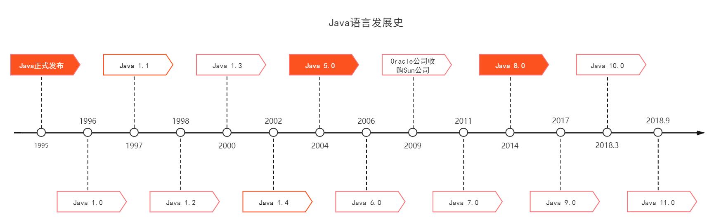

# 第一部分 Java基础语法

## 第1节 Java概述

### 1 Java语言发展史

Java是一种由Sun公司在1995年推出的计算机语言

Java之父：James Gosling



目前工程中最常用的是Java 8.0


### 2 Java语言跨平台原理

**跨平台原理**

**JVM**(Java Virtual Machine)：Java虚拟机，有windosw版、Mac版、Linux版等等，在不同的操作系统上安装对应版本即可翻译Java语言


### 3 JRE和JDK

**JRE**(Java Runtime Environment)：是Java程序的运行时环境，包含JVM和运行时所需要的核心类库

**JDK**(Java Development Kit)：Java程序开发工具包

包含关系：


### 4 JDK的下载和安装

官网：http://www.oracle.com


## 第2节 第一个程序

### 1 常用DOS命令

| 操作                | 说明                            |
| ------------------- | ------------------------------- |
| 盘符名称：          | 盘符切换。E:回车，表示切换到E盘 |
| dir                 | 查看当前路径下的内容            |
| cd 目录             | 进入单级目录                    |
| cd ..               | 回退到上一级目录                |
| cd 目录1\目录2\\... | 进入多级目录                    |
| cd \                | 回退到盘符目录                  |
| cls                 | 清屏                            |
| exit                | 退出命令提示符窗口              |


### 2 Path环境变量的配置

[WIN10下Java环境变量配置](https://www.cnblogs.com/qiuyu666/p/10779799.html)


### 3 HelloWolrd案例

```java
public class HelloWorld {
	public static void main(String[] args) {
		System.out.println("HelloWorld");
	}
}
```


### 4 Notepad软件的安装和使用

Notepad++是一款免费的轻量级文本编辑器，支持多种编程语言


## 第3节 基础语法

### 1 注释

注释分类：

- 单行注释：`//注释信息`
- 多行注释：`/*注释信息*/`
- 文档注释：`/**注释信息*/`

```java
/*
Java程序中最基本的组成单位是类。
类的定义格式：
	public class 类名 {
	
	}
	HelloWorld类
*/
public class HelloWorld {
    /*
    这是main方法
    main方法是程序的入口方法，代码的执行是从main方法开始的
    */
	public static void main(String[] args) {
        //这是输出语句
		System.out.println("HelloWorld");
	}
}
```


### 2 关键字

关键字就是被Java语言赋予了特定含义的单词 *（Java的关键字有50个左右）*

关键字字母全部小写


### 3 常量

常量分类：字符串常量、整数常量、小数常量、字符常量、布尔常量（`true`和`false`）、空常量（`null`）

（空常量是不能通过`System.out.println()`直接输出的）


### 4 数据类型

**计算机存储单元：**位（bit）、字节（byte或B）

数据类型分类：


基本数据类型内存占用和取值范围：

| 数据类型 |      关键字      | 内存占用 |                           取值范围                           |
| :------: | :--------------: | :------: | :----------------------------------------------------------: |
|   整数   |       byte       |    1     |                           -128~127                           |
|   整数   |      short       |    2     |                         -32768~32767                         |
|   整数   |  **int(默认)**   |    4     |                    -2147483648~2147483647                    |
|   整数   |       long       |    8     |                     $-2^{63}$​~$2^{63}-1$​                     |
|  浮点数  |      float       |    4     | 负数：-3.402823E+38~-1.401298E-45<br />正数：1.401298E-45~3.402823E+38 |
|  浮点数  | **double(默认)** |    8     | 负数：-1.797693E+308~-4.9000000E-234<br />正数：4.9000000E-324~1.797693E+308 |
|   字符   |       char       |    2     |                           0~65535                            |
|   布尔   |     boolean      |    1     |                         true, false                          |


引用数据类型：

1. 引用本身的大小和虚拟机及操作系统的位数有关，比如HotSpot虚拟机，在64位平台上，占8个字节，在32位平台上占4个字节
2. 引用本身是保留在栈中的
3. 引用所指的对象，是存放在堆中的


一维数组在堆上**连续**的内存空间直接存储**值**，二维数组在**连续**的地址上存储一维数组的**引用地址**

一维数组之间并不一定靠在一起，但是这些一维数组内部的值是在连续地址上的

更高维的数组继续以此类推，只有最后一维数组在连续地址上保存值，其他维度均在连续地址上保存下一维度的引用地址

数组类是一个由虚拟机自动生成的、直接继承自 Object 的子类，其中包含了数组的属性和方法


### 5 变量

格式：数据类型 变量名=变量值

```java
//long类型的变量定义的时候，为了防止整数过大，后面要加L
//定义long类型的变量
long l = 10000000000L;
System.out.println(l);

//float类型的变量定义的时候，为了防止类型不兼容，后面要加F
//定义float类型的变量
float f = 13.14F;
System.out.println(f);
```


### 6 标识符

标识符常见命名约定：

1. 小驼峰命名法：<u>方法</u>、<u>变量</u>
2. 大驼峰命名法：<u>类</u>


### 7 类型转换

自动类型转换：

表示数据范围从小到大：


强制类型转换：可能会有数据丢失


## 第4节 运算符

### 1 算术运算符

在ASCII码中：
`A`对应65，A-Z是连续的
`a`对应97，a-z是连续的
`0`对应48，0-9是连续的

自动类型提升

当"+"操作中出现字符串时，这个"+"是字符串连接符，而不是算术运算


### 2 赋值运算符

扩展的赋值运算符（如"+="）底层隐含了强制类型转换


### 3 自增自减运算符

自增运算符：`i++`和`++i`

自减运算符：`i--`和`--i`


### 4 关系运算符

关系运算符：小于、大于、小于等于、大于等于、等于、不等于

运算结果一定为boolean型

`instanceof`用于测试其左边的对象是否是其右边的类的实例，返回boolean型


### 5 逻辑运算符

基本逻辑运算符：`&`、`|`、`^`、`!`

短路逻辑运算符：`&&`、`||`


### 6 三元运算符

格式：关系表达式?表达式1:表达式2
范例：`a > b ? a : b`
含义：若`a>b`为`true`，则运算结果是表达式1的值，否则是表达式2的值


## 第5节 数据输入

### 1 数据输入

```java
//数据输入流程
//导包
import java.util.Scanner;

public class ScannerDemo {
    public static void main(String[] args) {
        //创建对象
        Scanner sc = new Scanner(System.in);
        //接收数据
        int x = sc.nextInt();
        //输出数据
        System.out.println("x:" + x);
    }
}
```


## 第6节 分支语句

### 1 流程控制

流程控制语句的分类：

- 顺序结构
- 分支结构
- 循环结构

对于一个程序，通常的数据测试要包含：正确数据，边界数据，错误数据
这样的程序才具有健壮性


### 2 if语句


### 3 switch语句

```java
switch(expression) {
    case value1 :
       //语句
       break; //可选
    case value2 :
       //语句
       break; //可选
    //可以有任意数量的case语句
    default : //可选
       //语句
}
```


## 第7节 循环语句

### 1 for循环语句

任意数字的指定位上的数值如何求：先使用整除操作将要求的数字移动到个位上，再使用取余操作取出最后一位上的值

### 2 while循环语句


### 3 do...while循环语句


### 4 跳转控制语句

`continue`

`break`


### 5 循环嵌套


### 6 Random

`Random`用于产生一个随机数

```java
//导包
import java.util.Random;
public class RandomDemo {
    public static void main(String[] args) {
        //创建对象
        Random rand = new Random();
        //获取随机数
        int num = rand.nextInt(10); //获取一个0到9的随机数
        System.out.println("num = " + num);
    }
}
```


## 第8节 IDEA

### 1 IDEA概述和安装

IDEA全程IntelliJ IDEA，是用于Java语言开发的**集成环境**，它是业界公认的目前用于Java程序开发最好的工具

下载：https://www.jetbrains.com/idea

### 2 IDEA中HelloWorld

创建项目--->创建模块--->创建包--->新建类--->编写代码--->在IDEA中执行程序

### 3 IDEA中项目结构


### 4 IDEA中内容辅助键和快捷键


### 5 IDEA中模块操作


## 第9节 数组

### 1 数组定义格式

格式一：数据类型[] 变量名

格式二：数据类型 变量名[]


### 2 数组初始化之动态初始化

格式：数据类型[] 变量名=new 数据类型[数组长度]

其中`new`为数组申请内存空间


### 3 数组元素访问


### 4 内存分配

```java
int[] arr = new int[3];
//等号右侧在堆内存开辟
//使用完毕，会在垃圾回收器空闲时被回收
```


### 5 数组初始化之静态初始化

格式：数据类型[] 变量名=new 数据类型[]{数据1, 数据2, 数据3, ...}

简化格式：数据类型[] 变量名={数据1, 数据2, 数据3, ...}


### 6 数组操作的两个常见小问题

- 索引越界：访问了数组中不存在的索引对应的元素，造成索引越界问题
- 空指针异常：访问的数组已经不再指向堆内存的数据，造成空指针异常


### 7 数组常见操作

1. 遍历：通过循环实现

2. 获取数组元素数量：

   格式：数组名.length；如`arr.length`

3. 获取最值：通过循环和if语句实现

```java
//遍历通用格式
int[] arr = {1, 2, 3, 4, 5};
for (int i = 0; i < arr.length; i++) {
    //可对arr[i]进行操作
}
```


## 第10节 方法

### 1 方法概述

**方法**（method）是将具有独立功能的代码块组织成为一个整体，使其具有特殊功能的代码集


### 2 方法的定义和调用

```java
//方法的定义，其中isEvenNumber是方法名
public static void isEvenNumber() {
    //方法体
}
//方法的调用
isEvenNumber();
//main方法通常位于其他方法的上方
```


### 3 带参数方法的定义和调用

形参和实参


### 4 带返回值方法的定义和调用

```java
//带返回值方法定义示例
public static boolean isEvenNumber(int number) {
    return true;
}
//带返回值方法的调用示例
boolean flag = isEvenNumber(5);
```


### 5 方法的注意事项

- 方法不能嵌套定义
- `void`表示无返回值，可以省略`return`，也可以单独书写`return`，且后面不加数据


### 6 方法重载

多个方法在同一个类中且具有相同的方法名，但参数不同、类型不同或者数量不同，这样的多个方法相互构成**重载**

判断方法重载主要看是否在<u>同一个类</u>中和是否具有<u>相同的方法名</u>，并比较<u>参数列表</u>

在调用的时候，Java虚拟机会通过参数的不同来区分同名的方法

```java
public class MethodDemo {
    public static void main(String[] args) {
        int result1 = sum(10, 20);
        System.out.println(result1);
        double result2 = sum(10.0, 20.0);
        System.out.println(result2);
        int result3 = sum(10, 20, 30);
        System.out.println(result3);
    }
    
    public static int sum(int a, int b) {
        return a + b;
    }
    
    public static double sum(double a, double b) {
        return a + b;
    }
    
    public static int sum(int a, int b, int c) {
        return a + b + c;
    }
}
```


### 7 方法的参数传递

基本数据类型

引用数据类型

`System.out.println("")`换行，而`System.out.print("")`不换行

单独一个`System.out.println()`可以直接换行


## 第11节 Debug

### 1 Debug


## 第12节 大数

### 1 大数

如果整数超过long能表示的范围，则需要使用BigInteger类；

如果浮点数超过double能表示的范围，则需要使用BigDecimal类

BigInteger和BigDecimal都属于java.math包

- 普通数值转大数：`BigInteger a = BigInteger.valueOf(123);`
- 大数使用带字符串参数的构造器：`BigInteger reallyBig = new BigInteger("...")`...中为大数

对于大数，不能直接使用算术运算符处理，可以使用如下方法：

- 加：BigInteger add(BigInteger other)
- 减：BigInteger subtract(BigInteger other)
- 乘：BigInteger multiply(BigInteger other)
- 除以：BigInteger divide(BigInteger other)
- 取余：BigInteger mod(BigInteger other)

如：`BigInteger a = b.multiply(c.add(BigInteger.valueOf(1))); //a = b * (c + 1)`


# 第二部分 类和对象

## 第1节 面向对象基础

### 1 类和对象

类：class
对象：object

- 类是对象的数据类型
- 类是具有相同属性和行为的一组对象的集合

类是Java程序的基本组成单位

类的组成：**属性**和**行为**


### 2 对象内存图


### 3 成员变量和局部变量

成员变量：类中方法外的变量；堆内存；有默认的初始化值

局部变量：方法中的变量；栈内存；没有默认的初始化值


### 4 封装

`private`关键字：被`private`修饰的成员只在本类中才能访问

封装的原则：可以在该类中编写名称带`get`和`set`的方法来间接获取或修改`private`变量，从而对变量起到保护作用，提高了代码的安全性和复用性

`this`关键字：被`this`修饰的变量用于指代成员变量

若成员变量和局部变量重名且不使用`this`修饰，则成员变量会被默认为局部变量

面向对象的三大特征：**封装**，**继承**，**多态**


### 5 构造方法

构造方法是一种特殊的方法，主要用来完成对象**数据的初始化**

```java
//格式
public class ClassName {
    qualifier ClassName(parameters) {
        //代码块
    }
}
```

当类中没有构造方法时，系统会自动给出一个默认的<u>无参构造方法</u>

一个类中构造方法可以有多个构造方法（方法重载）

**标准类制作：**

1. 成员变量：使用`private`修饰
2. 构造方法：
   - 提供一个无参构造方法
   - 提供一个带多个参数的构造方法
3. 成员方法：
   - 提供每一个成员变量对应的`setXxx()`和`getXxx()`
   - 提供一个显示对象信息的`show()`
4. 创建对象并为其成员变量赋值的两种方式：
   - 无参构造方法创建对象后使用`setXxx()`赋值
   - 使用带参构造方法直接创建带有属性值的对象


## 第2节 字符串

### 1 API

API(Application Pragramming Interface)：应用程序编程接口

JDK帮助文档

`java.lang`不需要导包

从输入读入字符串：`String line = sc.nextLine();`


### 2 String

Java程序中所有的双引号字符串，都是String类的对象

字符串的特点：

- String的值在创建后不能被更改
- String的值可以被共享
- 字符串效果上相当于字符数组（char[]）。但是底层原理是字节数组（byte[]）

String构造方法：

| 方法名                    | 说明                                      |
| ------------------------- | ----------------------------------------- |
| pblic String()            | 创建一个空白字符串对象，不含有任何内容    |
| public String(char[] chs) | 根据字符数组的内容，来创建字符串对象      |
| public String(byte[] bys) | 根据字节数组的内容，来创建字符串对象      |
| String s = "abc";         | 直接赋值的方式创建字符串对象，内容就是abc |


```java
//String的构造方法演示

String s1 = new String();

char[] chs = {'a', 'b', 'c'};
String s2 = new String(chs);

bye[] bys = {97, 98, 99};
String s3 = new String(bys);

String s4 = "abc";

//第一种为空字符串，后三种的效果都是一样的
//前三种为构造方法的方式创建，每个字符串无论是否相同，地址值一定不同
//最后一种为赋值的方式创建，JVM会建立一个String对象放在字符串池中，这样赋值的字符串若相同，则本质是同一个对象
```

- 比较字符串地址值是否相同：`s1 == s2`
- 比较字符串内容是否相同：`s1.equals(s2)`相同则结果为`true`

```java
//遍历字符串的通用格式
for (int i = 0; i < str.length(); i++) {
    str.charAt(i); //返回指定索引处的char值
}
```

`boolean endsWith(String suffix)`测试字符串是否以指定的后缀结尾


### 3 StringBuilder

StringBuilder是一个可变的字符串类，可以看成一个容器

```java
public class StringBuilderDemo {
    public static void main(String[] args) {
        StringBuilder strbdr1 = new StringBuilder();
        StringBuilder strbdr2 = strbdr1.append("hello"); //添加数据
        System.out.println("strbdr1: " + strbdr1);
        System.out.println("strbdr2: " + strbdr2);
        System.out.println(strbdr1 == strbdr2);
        //链式编程
        strbdr1.append("Hello").append(" world!").append("java").append("123");
        System.out.println("strbdr1: " + strbdr1);
        //反转
        strbdr1.reverse();
        System.out.println("strbdr1 reversed: " + strbdr1);
        //StringBuilder转String
        String str = strbdr1.toString();
        System.out.println(str);
        //String转StringBuilder
        StringBuilder strbdr3 = new StringBuilder(str);
        System.out.println(strbdr3);
    }
}
```

StringBuilder和String的相互转换：

- StringBuilder转String：`toString()`
- String转StringBuilder：构造方法`StringBuilder(String str)`

通过StringBuilder实现字符串的反转代码演示

```java
import java.util.Scanner;

public class StringBuilderReverse {
    public static void main(String[] args) {
        Scanner sc = new Scanner(System.in);
        System.out.println("Please enter a string: ");
        String line = sc.nextLine();
        line = myReverse(line);
        System.out.println("string reversed: " + line);
    }

    public static String myReverse(String str) {
        return new StringBuilder(str).reverse().toString();
    }
}
```

`int length()`返回长度


## 第3节 集合基础

### 1 集合基础

集合的特点：存储容量可变

`ArrayList<E>`：可调整大小的数组实现；`<E>`是泛型

ArrayList底层使用数组实现，默认初始容量为10，超出后会自动扩容成原来的1.5倍

```java
//ArrayList使用方法

import java.util.ArrayList;

public class ArrayListDemo {
    public static void main(String[] args) {
//        ArrayList<String> arr = new ArrayList<>(); //java7以后支持的声明方式
        ArrayList<String> arr = new ArrayList<String>();
        arr.add("hello"); //在ArrayList尾部添加元素
        arr.add("world");
        arr.add("java");
        System.out.println("array: " + arr);
        arr.add(1, "javase"); //在指定位置添加元素
        System.out.println("array: " + arr);
        //删除指定的元素，返回删除是否成功
        System.out.println(arr.remove("world"));
        //删除指定索引处的元素，返回被删除的元素
        System.out.println(arr.remove(1));
        //修改指定索引处的元素，返回被修改的元素
        System.out.println(arr.set(1, "javaee"));
        //返回指定索引处的元素
        System.out.println(arr.get(0));
        System.out.println(arr.get(1));
        //返回集合中的元素个数
        System.out.println(arr.size());
    }
}
```


## 项目一 学生管理系统

> --------欢迎来到学生管理系统--------
>
> 1 添加学生信息
> 2 删除学生信息
> 3 修改学生信息
> 4 查看学生信息
> 5 退出

Student.java

```java
package stumngpack;

public class Student {
    private String sid;
    private String name;
    private String age;
    private String address;

    public Student() {
    }

    public Student(String sid, String name, String age, String address) {
        this.sid = sid;
        this.name = name;
        this.age = age;
        this.address = address;
    }

    public String getSid() {
        return sid;
    }

    public void setSid(String sid) {
        this.sid = sid;
    }

    public String getName() {
        return name;
    }

    public void setName(String name) {
        this.name = name;
    }

    public String getAge() {
        return age;
    }

    public void setAge(String age) {
        this.age = age;
    }

    public String getAddress() {
        return address;
    }

    public void setAddress(String address) {
        this.address = address;
    }
}

```

StudentManager.java

```java
package stumngpack;

import java.util.ArrayList;
import java.util.Scanner;

public class StudentManager {
    public static void main(String[] args) {
        ArrayList<Student> arr = new ArrayList<Student>();
        Scanner sc = new Scanner(System.in);
        String funcLine;
        while (true) {
            System.out.println("--------欢迎来到学生管理系统--------");
            System.out.println("1 添加学生信息");
            System.out.println("2 删除学生信息");
            System.out.println("3 修改学生信息");
            System.out.println("4 查看学生信息");
            System.out.println("5 退出");
            System.out.println("请选择一个功能并输入对应数字：");
            funcLine = sc.nextLine();
            switch (funcLine) {
                case "1":
                    System.out.println("添加学生信息");
                    addStu(arr);
                    break;
                case "2":
                    System.out.println("删除学生信息");
                    delStu(arr);
                    break;
                case "3":
                    System.out.println("修改学生信息");
                    updateStu(arr);
                    break;
                case "4":
                    System.out.println("查看所有学生信息");
                    findStu(arr);
                    break;
                case "5":
                    System.out.println("谢谢使用");
                    System.exit(0);
                default:
                    System.out.println("无效的输入！请重新输入（1~5）");
            }
        }
    }

    public static void addStu(ArrayList<Student> arr) {
        Scanner sc = new Scanner(System.in);
        Student stu = new Student();
        String sid;
        while (true) {
            System.out.print("请输入学号：");
            sid = sc.nextLine();
            if (isUsed(arr, sid)) {
                System.out.println("你输入的学号已被占用！");
            } else {
                stu.setSid(sid);
                System.out.print("请输入姓名：");
                stu.setName(sc.nextLine());
                System.out.print("请输入年龄：");
                stu.setAge(sc.nextLine());
                System.out.print("请输入地址：");
                stu.setAddress(sc.nextLine());
                System.out.println("添加成功");
                arr.add(stu);
                break;
            }
        }
    }

    public static void delStu(ArrayList<Student> arr) {
        Scanner sc = new Scanner(System.in);
        System.out.println("请输入要删除的学生的学号：");
        String sid = sc.nextLine();
        int i;
        for (i = 0; i < arr.size(); i++) {
            if (sid.equals(arr.get(i).getSid())) {
                arr.remove(i);
                System.out.println("删除成功");
                break;
            }
        }
        if (i == arr.size()) System.out.println("无此学号！");
    }

    public static void updateStu(ArrayList<Student> arr) {
        Scanner sc = new Scanner(System.in);
        System.out.println("请输入要修改的学生的学号：");
        String sid = sc.nextLine();
        int i;
        for (i = 0; i < arr.size(); i++) {
            if (sid.equals(arr.get(i).getSid())) {
                System.out.print("请输入姓名：");
                arr.get(i).setName(sc.nextLine());
                System.out.print("请输入年龄：");
                arr.get(i).setAge(sc.nextLine());
                System.out.print("请输入地址：");
                arr.get(i).setAddress(sc.nextLine());
                System.out.println("修改成功");
                break;
            }
        }
        if (i == arr.size()) System.out.println("无此学号！");
    }

    public static void findStu(ArrayList<Student> arr) {
        if (arr.size() == 0) {
            System.out.println("没有信息！");
            return;
        }
        System.out.println("学号\t\t\t姓名\t\t\t年龄\t\t\t地址");
        for (int i = 0; i < arr.size(); i++) {
            Student stu = arr.get(i);
            System.out.println(stu.getSid() + "\t\t" + stu.getName() + "\t\t\t" + stu.getAge() + "岁\t\t" + stu.getAddress());
        }
    }

    public static boolean isUsed(ArrayList<Student> arr, String sid) {
        for (int i = 0; i < arr.size(); i++) {
            if (sid.equals(arr.get(i).getSid())) {
                return true;
            }
        }
        return false;
    }
}

```


# 第三部分 面向对象

## 第1节 继承

### 1 继承

格式：public class 子类名 extends 父类名 {}

继承中子类的特点：

- 子类可以有父类的内容
- 子类还可以有自己特有的内容

继承提高了代码的**复用性**和**维护性**，但也增强了类的**耦合性**

`super`关键字与`this`关键字的用法相似

**子类中所有的构造方法默认都会访问父类中无参构造方法**

父类一定要在子类初始化前初始化，要么默认访问父类无参构造方法，要么在子类构造方法的顶端使用带参或无参的`super()`

子类是不能继承父类私有成员的

**方法重写**
IDEA中`@Override`可以帮助检查重写方法的方法声明的正确性
父类中私有方法子类不能重写
子类重写方法时该方法的访问权限不能比父类低（权限`public`>默认>`private`）

- Java中类只支持单继承，不支持多继承
- Java中类支持多层继承


## 第2节 修饰符

### 1 包

包（package）的作用：对类进行分类管理

- 手动建包
- 自动建包：`javac -d . HelloWorld.java`


### 2 导包


### 3 修饰符

修饰符分类：

1. 权限修饰符
2. 状态修饰符

**权限修饰符：**

- `private`：私有，其他类不能访问或继承
- 默认：不同包的子类不能继承
- `protected`：不同包的类不能访问
- `public`：都能访问

| 修饰符    | 同一个类中 | 同一个包中非子类 | 不同包的子类 | 不同包的非子类 |
| --------- | ---------- | ---------------- | ------------ | -------------- |
| private   | Y          | N                | N            | N              |
| 默认      | Y          | Y                | N            | N              |
| protected | Y          | Y                | Y            | N              |
| public    | Y          | Y                | Y            | Y              |

**状态修饰符：**

- `final`最终关键字：被`final`修饰的方法不能被重写；被`final`修饰的变量不能再被赋值；被`final`修饰的类不能被继承
- `static`静态关键字：被`static`修饰的成员被类的所有对象共享，可以通过类名调用；静态成员方法只能访问静态成员

Java 8中引入了`default`关键字用来修饰接口的默认方法，即称为虚拟扩展方法（Virtual extension methods）的新特性。简单说，**默认方法就是接口可以有实现方法，而且不需要实现类去实现其方法**。这样就解决了接口的修改与现有的实现不兼容的问题。


## 第3节 多态

### 1 多态

**多态**：同一个对象，在不同时刻表现出来的不同形态

多态的前提和体现：

- 有继承/实现关系
- 有方法**重写**（Override）
- 有父类引用指向子类对象

有多态性质的对象，其方法被重写*（注意仅方法）*

多态提高了程序的扩展性，但不能使用子类的特有功能

Java编译器支持向上转型，但不支持向下转型

- **向上转型**：父类引用指向子类对象

  自动转换

  通过子类去实例化父类，如B是A的子类，`A a = new B();`

  上转型对象不是父类创建的对象，而是子类对象的“简化”状态，它不关心子类新增的功能，只关心子类继承和重写的功能

- **向下转型**：父类引用转为子类对象

  强制转换

  如B是A的子类，`A a = new B(); B b = (B)a;` 如此可调用B类独有的方法


## 第4节 抽象类

### 1 抽象类

抽象类的特点：

- 抽象类和抽象方法必须使用`abstract`关键字修饰
- 有抽象方法的类一定是抽象类
- 抽象类只能通过多态的方式实例化（抽象类多态）


## 第5节 接口

### 1 接口

`interface`关键字修饰接口名

`implements`关键字修饰接入的类名

接口中的变量默认被`public static final`修饰

接口没有构造方法

一个类如果没有父类，默认继承自Object类

接口的成员方法默认被`public abstract`修饰

**抽象类**是对**事物**的抽象，**接口**是对**行为**的抽象


## 第6节 形参和返回值

### 1 形参和返回值


## 第7节 内部类

### 1 内部类

**内部类**的访问特定：

- 内部类可以直接访问外部类的成员，包括私有
- 外部类要访问内部类的成员，必须创建对象

属性屏蔽：内部类定义的变量或方法可以覆盖外部类同名变量或方法

外界创建另一个类的`public`型的内部类对象：
格式：外部类名.内部类名 对象名=外部类对象.内部类对象
如：`Outer.Inner oi = new Outer().new Inner();`

对于`private`的内部类，可以通过创建对象的方式间接调用


**局部内部类**：类里的方法中的内部类

调用方式：通过创建对象间接调用


**匿名内部类**：一种特殊的局部内部类

可用于匿名实现接口、匿名继承父类

匿名内部类只能访问外部类的final变量

- 原因是编译程序实现上的困难：内部类对象的生命周期通常会超过局部变量的生命周期
- 定义为final后，编译器会把匿名内部类对象要访问的所有final类型局部变量，都拷贝一份作为该对象的成员变量

匿名内部类代码演示

Inter.java

```java
//接口
public interface Inner {
    void show();
}
```

Outer.java

```java
//外部类
public class Outer {
    public void method() {
        //定义匿名内部类
    	Inner in = new Inner() {
        	//重写
        	public void show() {
            	System.out.println("匿名内部类");
        	}
    	};
    in.show;
    }
}
```

OuterDemo.java

```java
//测试类
public class OuterDemo {
    public static void main(String[] args) {
        Outer out = new Outer();
        out.method();
    }
}
```


## 第8节 常用API

### 1 Math

不需要导包


### 2 System

不需要导包


### 3 Object

根类（所有类的直接或间接的超类）

| 方法名                            | 说明                                                       |
| --------------------------------- | ---------------------------------------------------------- |
| public String toString()          | 返回对象的字符串表示形式。建议所有子类重写该方法，自动生成 |
| public boolean equals(Object obj) | 比较对象是否相等。默认比较地址，重写可以比较内容，自动生成 |


### 4 Arrays

冒泡排序：相邻数据两两比较，较大数放后面

导包：`java.util.Arrays`

Arrays类包含各种操作数组的方法

`Arrays.sort()`排序（底层是**快速排序**+**归并排序**）

`Arrays.toString()`数组转字符串

`Arrays.fill()`填充数组元素为某值

Math、System、Arrays的构造方法都被`private`修饰（防止外界创建对象），成员被`public static`修饰（使用类名访问方法）


### 5 基本类型包装类

`MIN_VALUE`是int型的最小值（$-2^{31}$）

`MAX_VALUE`是int型的最大值（$2^{31}-1$）

基本类型包装类（如`Integer`）

`Integer.valueOf(int num)`将int型或int型字符串初始化为Integer类的对象

`String.valueOf()`可以将多种类型的变量转换为字符串

`public static int parseInt(String s)`将字符串解析为int类型

- 装箱：基本数据类型--->包装类类型
  1. 手动装箱：`Integer in = Integer.valueOf(100)`
  2. 自动装箱：`Integer in = 100`
- 拆箱：包装类类型--->基本数据类型
  1. 手动拆箱：`in = in.inValue() + 200`
  2. 自动拆箱+自动装箱：`in += 200`

**只要是对象，在使用前就必须进行不为null的判断**


### 6 日期类

Date类的常用方法：`getTime()`，`setTime()`

SimpleDateFormat类：日期格式化和解析

Calendar类

```java
import java.util.Calendar;
import java.util.Scanner;

//获取任何一年的二月有多少天
public class CalendarTest {
    public static void main(String[] args) {
        Scanner sc = new Scanner(System.in);
        System.out.println("请输入年份：");
        int year = sc.nextInt();
        Calendar c = Calendar.getInstance();
        c.set(year, 2, 1); //设置为3月1日
        c.add(Calendar.DATE, -1); //往前推一天即是2月的最后一天
        int date = c.get(Calendar.DATE);
        System.out.println(year + "年的2月份有" + date + "天");
    }
}
```


## 第9节 异常

### 1 异常

Trowable类是Java中所有错误和异常的超类

Error类和Exception类是Throwable类的子类

派生于Error类或RuntimeException类的所有异常称为**非检查型（unchecked）异常**，所有其他异常称为**检查型（checked）异常**

对于所有检查型异常，编写代码时都必须提前做好应对措施


**异常处理方法一：捕获异常**

try...catch...代码演示

```java
public class ExceptionDemo {
    public static void main(String[] args) {
        System.out.println("开始");
        method();
        System.out.println("结束");
    }
    
    public static void method() {
        try { //可能出现异常的代码
            int[] arr = {1, 2, 3};
            System.out.println(arr[3]);
        } catch (ArrayIndexOutOfBoundsException e) { //catch(异常名 变量名)
            //System.out.println("你访问的数组的索引不存在"); //JVM退出程序
            e.printStackTrace(); //JVM在控制台输出堆栈轨迹信息并继续运行程序
        } //可以继续编写若干catch () {}以捕获每一种可能出现的异常
        //可以在最后加上finally {}语句块，该语句块总会执行
    }
}
```

try-with-resources语句

```java
try (Resource res = ...) {
    //work with res
}
//try块退出时，会自动调用res.close()
```

**异常处理方法二：抛出异常**

方法首部的异常规范声明可能抛出的异常

若有多个异常，用逗号隔开

对于子类重写的父类方法，其抛出的异常不能比父类抛出的异常更通用

throws代码演示

```java
public class Exception {
    public static void main(String[] args) {
        System.out.println("开始");
        try {
            method();
        } catch (ParseException e) { //catch接上throws抛出的问题（对接默认创建的Exception子类的对象）
            e.printStackTrace();
        }
        System.out.println("结束");
    }
    //throws通常用来处理编译时异常
    public static void method() throws ParseException { //throws仅仅延迟了处理（把问题抛出）
        String s = "2000-01-01";
        SimpleDateFormat sdf = new SimpleDateFormat("yyyy-MM-dd");
        Date d = sdf.parse(s);
        System.out.println(d);
    }
}
```

除了自动抛出，也可以在满足条件判断语句后手动抛出对象：

```java
String readData(Scanner in) throws EOFException {
    //...
    if (!in.hasNext()) {
        if (n < len) {
            throw new EOFException();
        }
        //...
    }
    return s;
}
```

自定义异常格式：

```java
public class /*异常类名*/ extends Exception {
    //无参构造
    //带参构造
}
```


### 2 断言和日志

**断言：**一种测试和调试阶段使用的战术性工具，即向代码中插入一些检查，而在生产代码中会自动删除这些检查

关键字：`assert`

**日志：**一种在程序整个生命周期都可以使用的战略性工具，日志API


## 第10节 枚举

### 1 枚举类型

对于变量的取值是有限的这种情况，可以定义枚举类型

```java
enum Season {
    SPRING, SUMMER, AUTUMN, WINTER;
}

public static void main(String[] args) {
    //Season类型的变量只能存储这个类型声明中给定的某个枚举值或null
    Season sn = Season.SPRING;
}
```


### 2 枚举类

一个特殊的类

- `enum`定义的类默认继承了java.lang.Enum类
- 枚举类是final的
- 定义的每个枚举值都是该枚举类的成员
- 默认增加了`values()`等方法

`int ordinal()`方法：返回枚举常量在enum声明中的位置，位置从0开始计数


# 第四部分 集合

## 第1节 集合进阶

### 1 Collection

集合类体系结构：


上图中，实线边框的是**实现类**，虚线边框的是**抽象类**，点线边框的是**接口**。


Collection的常用方法：

| 方法名                     | 说明                               |
| -------------------------- | ---------------------------------- |
| boolean add(E e)           | 添加元素                           |
| boolean remove(Object o)   | 从集合中移除指定的元素             |
| void clear()               | 清空集合中的元素                   |
| boolean contains(Object o) | 判断集合中是否存在指定的元素       |
| boolean isEmpty()          | 判断集合是否为空                   |
| int size()                 | 集合的长度，也就是集合中元素的个数 |


接口`Iterator<T>`迭代器：返回类型为T的迭代器


代码演示：

```java
//Collection集合存储学生对象并遍历
import java.util.ArrayList;
import java.util.Collection;
import java.util.Iterator;

public class CollectionDemo {
    public static void main(String[] args) {
        //创建Collection集合对象
        Collection<Student> clnStu = new ArrayList<Student>();
        //创建Student对象
        Student stu1 = new Student("Alice", 18);
        Student stu2 = new Student("Betty", 19);
        Student stu3 = new Student("Cindy", 20);
        //将Student对象添加到集合中
        clnStu.add(stu1);
        clnStu.add(stu2);
        clnStu.add(stu3);
        //通过迭代器遍历集合
        Iterator<Student> it = clnStu.iterator();
        while (it.hasNext()) {
            Student str = it.next();
            System.out.println(str.getName() + ", " + str.getAge());
        }
    }
}
```


### 2 List

序列

特点：

- 有序
- 可重复

并发修改异常(ConcurrentModificationException)

List接口专有的迭代器：`ListIterator<E>`（列表迭代器）
不同于`Iterator`，列表迭代器可以向前或向后遍历，也可以在遍历的过程中修改列表

**增强for循环**：简化数组和Collection集合的遍历
内部原理是一个Iterator迭代器

增强for循环代码演示：

```java
import java.util.ArrayList;
import java.util.List;

public class ForDemo {
    public static void main(String[] args) {
        int[] arr = {1, 2, 3, 4, 5};
        for (int i : arr) {
            System.out.println(i);
        }

        String[] strs = {"hello", "world", "java"};
        for (String s : strs) {
            System.out.println(s);
        }

        List<String> list = new ArrayList<String>();
        list.add("hello");
        list.add("world");
        list.add("java");
        for (String s : list) {
            System.out.println(s);
        }
    }
}
```

常见数据结构：

- **栈**：先进后出
- **队列**：先进先出
- **数组**：查询快，增删慢；`ArrayList<E>`
- **链表**：增删快，查询慢；`LinkedList<E>`

LinkedList集合的特有功能代码演示：

```java
import java.util.LinkedList;

public class LinkedListDemo {
    public static void main(String[] args) {
        LinkedList<String> lklist = new LinkedList<String>();
        lklist.add("hello");
        lklist.add("world");
        lklist.add("java");
        //在该列表开头插入指定的元素
        lklist.addFirst("javase");
        //将指定的元素追加到此列表的末尾
        lklist.addLast("javaee");
        //返回此列表中的第一个元素
        System.out.println(lklist.getFirst());
        //返回此列表中的最后一个元素
        System.out.println(lklist.getLast());
        //从此列表中删除并返回第一个元素
        System.out.println(lklist.removeFirst());
        //从此列表中删除并返回最后一个元素
        System.out.println(lklist.removeLast());
        //输出链表
        System.out.println(lklist);
    }
}
```


### 3 Set

**哈希值**：是JDK根据对象的**地址**或者**字符串**或者**数字**算出来的int类型的**数值**
`public int hashCode()`返回对象的哈希值

HashSet集合存储元素时要保证元素唯一性，需要重写`hashCode()`和`equals()`*（IDEA中可以自动生成）*

HashSet基于HashMap实现，底层实际上为(key, Object)类型的HashMap

**哈希表（HashSet）：**

- JDK8之前，底层采用数组+链表实现，可以说是一个元素为链表的数组
- JDK8以后，在长度比较长的时候，链表就转换为红黑树

LinkedHashSet集合元素的存储和取出顺序是一致的

---

**TreeSet集合**特点：元素有序排列
自然排序`Comparable`和比较器排序`Comparator`的对比

自然排序（natural ordering）

```java
//自然排序在Student类中重写compareTo()
public int compareTo(Student stu) {
    int num1 = this.age - stu.age;
    int num2 = num1 == 0 ? this.name.compareTo(stu.name) : num1;
    return num2; //0为表示重复
}
```

比较器排序

```java
//比较器排序使用带参构造方法
//这里使用了匿名内部类重写compare()
TreeSet<Student> ts = new TreeSet<Student>(new Comparator<Student>() {
    public int compare(Student stu1, Student stu2) {
        int num1 = stu1.getAge() - stu2.getAge();
        int num2 = num1 == 0 ? stu1.getName().compareTo(stu2.getName()) : num1;
        return num2;
    }
});
```


### 4 泛型

泛型是JDK5中引入的特性
泛型的本质是**参数化类型**

泛型类

泛型方法

泛型接口

类型通配符：

- `<?>`
- 上限：`<? extends 类型>`
- 下限：`<? super 类型>`

**可变参数：**
格式：修饰符 返回值类型 方法名（数据类型... 变量名） {}
如：`public static int sum(int... a) {}`
如果一个方法有多个参数，可变参数要放到最后


### 5 Map

`Interface Map<K, V>`

**Map**集合不能包含重复的键；每个键可以映射到最多一个值

Map集合的基本功能：

| 方法名                              | 说明                                 |
| ----------------------------------- | ------------------------------------ |
| V put(K key, V value)               | 添加元素                             |
| V remove(Object key)                | 根据键删除键值对元素                 |
| void clear()                        | 移除所有的键值对元素                 |
| boolean containsKey(Object key)     | 判断集合是否包含指定的键             |
| boolean containsValue(Object value) | 判断集合是否包含指定的值             |
| boolean isEmpty()                   | 判断集合是否为空                     |
| int size()                          | 集合的长度，也就是集合中键值对的个数 |

**HashMap**代码演示：

```java
import java.util.HashMap;
import java.util.Map;
import java.util.Set;

//HashMap存储学生对象并遍历
public class HashMapDemo {
    public static void main(String[] args) {
        HashMap<Student, String> hm = new HashMap<Student, String>();
        Student stu1 = new Student("Alice", 18);
        Student stu2 = new Student("Betty", 19);
        Student stu3 = new Student("Cindy", 20);
        Student stu4 = new Student("Cindy", 20); //需要重写equals()和hashCode()来确保键的唯一性
        hm.put(stu1, "London");
        hm.put(stu2, "Paris");
        hm.put(stu3, "Sydney");
        hm.put(stu4, "Toronto");
        //遍历方式一：键找值
        Set<Student> keySet = hm.keySet();
        for (Student s : keySet) {
            String val = hm.get(s);
            System.out.println(s.getName() + ", " + s.getAge() + ", " + val);
        }
        System.out.println("--------");
        //遍历方式二：键值对对象找键和值
        Set<Map.Entry<Student, String>> entrySet = hm.entrySet();
        for (Map.Entry<Student, String> m : entrySet) {
            Student stu = m.getKey();
            String str = m.getValue();
            System.out.println(stu.getName() + ", " + stu.getAge() + ", " + str);
        }
    }
}
```


HashMap的put方法底层原理：


**集合嵌套**

---

**TreeMap**跟HashMap类似，但是键值对有排序

TreeMap代码演示

```java
import java.util.Scanner;
import java.util.Set;
import java.util.TreeMap;
//利用TreeMap统计输入字符串中每个字符出现的次数
public class TreeMapDemo {
    public static void main(String[] args) {
        Scanner sc = new Scanner(System.in);
        System.out.println("Please enter a string:");
        String line = sc.nextLine();
        TreeMap<Character, Integer> tm = new TreeMap<Character, Integer>();
        for (int i = 0; i < line.length(); i++) {
            char ch = line.charAt(i);
            Integer val = tm.get(ch);
            if (val == null) tm.put(ch, 1); //无此字符则添加字符并设置value为1
            else tm.put(ch, ++val);
        }
        Set<Character> kSet = tm.keySet();
        StringBuilder strbdr = new StringBuilder();
        for (Character c : kSet) {
            strbdr.append(c).append("(").append(tm.get(c)).append(")");
        }
        System.out.println(strbdr);
    }
}
```

输入`HelloWorldJava`，控制台输出`H(1)J(1)W(1)a(2)d(1)e(1)l(3)o(2)r(1)v(1)`


### 6 Collections

Collections类是针对集合操作的**工具类**

Collections类的常用方法：

- `public static <T extends Comparable<? super T>> void sort(List <T> liist)`将指定的列表按升序排序
- `public static void reverse(List<?> list)`反转指定列表中元素的顺序
- `public static void shuffle(List<?>list)`使用默认的随机源随机排列指定的列表

```java
import java.util.ArrayList;
import java.util.Collections;
import java.util.HashMap;
import java.util.TreeSet;

//实现洗牌，发牌，看牌
public class PokerDemo {
    public static void main(String[] args) {
        HashMap<Integer, String> hm = new HashMap<Integer, String>();
        ArrayList<Integer> arrList = new ArrayList<Integer>();
        String[] color = {"♦", "♥", "♣", "♠"};
        String[] numStr = {"3", "4", "5", "6", "7", "8", "9", "10", "J", "Q", "K", "A", "2"};
        int index = 0;
        for (String s : numStr) {
            for (String ss : color) {
                hm.put(index, ss + s);
                arrList.add(index++);
            }
        }
        hm.put(index, "小王");
        arrList.add(index++);
        hm.put(index, "大王");
        arrList.add(index++);
        Collections.shuffle(arrList);
        TreeSet<Integer> person1 = new TreeSet<Integer>();
        TreeSet<Integer> person2 = new TreeSet<Integer>();
        TreeSet<Integer> person3 = new TreeSet<Integer>();
        TreeSet<Integer> remain = new TreeSet<Integer>();
        for (int i = 0; i < index; i++) {
            if (i >= index - 3) remain.add(arrList.get(i));
            else if (i % 3 == 0) person1.add(arrList.get(i));
            else if (i % 3 == 1) person2.add(arrList.get(i));
            else person3.add(arrList.get(i));
        }
        viewCards("Person1", person1, hm);
        viewCards("Person2", person2, hm);
        viewCards("Person3", person3, hm);
        viewCards("Remain", remain, hm);
    }

    public static void viewCards(String str, TreeSet<Integer> ts, HashMap<Integer, String> hm) {
        System.out.print(str + ": ");
        for (Integer i : ts) {
            System.out.print(hm.get(i) + " ");
        }
        System.out.println();
    }
}
```


## 第2节 其他常用集合

### 1 Deque

支持两端插入和移除元素的线性集合**接口**，继承了Collection等接口

其常用实现类包括ArrayDeque，LinkedList等

ArrayDeque用于实现栈的代码演示

```java
import java.util.ArrayDeque;
import java.util.Deque;

/*
leetcode第71题：简化路径
*/

class Solution {
    public String simplifyPath(String path) {
        String[] dirs = path.split("/"); //根据给定的正则表达式拆分字符串
        if (dirs.length == 0) return "/";
        Deque<String> stack = new ArrayDeque<>();
        for (String s : dirs) {
            if (s.equals(".") || s.equals("")) {
                continue;
            }
            if (s.equals("..")) {
                if (stack.isEmpty()) continue; //只有栈非空的时候才能弹出元素
                stack.removeLast(); //弹栈（pop）
                continue;
            }
            stack.addLast(s); //压栈（push）
        }
        if (stack.isEmpty()) return "/";
        StringBuilder strbdr = new StringBuilder();
        while (!stack.isEmpty()) {
            strbdr.insert(0, stack.removeLast()).insert(0, "/");
        }
        return strbdr.toString();
    }
}
```


### 2 Queue

Queue接口与List，Set同一级别，Deque继承了Queue

不允许放入null元素

使用LinkedList实现Queue接口可以用于实现队列

```java
/**
* Queue接口中定义的方法
*/
boolean add(E element); //入队，队列已满抛出异常
boolean offer(E element); //入队，队列已满返回false
E remove(); //出队，队列为空抛出异常
E poll(); //出队，队列为空返回null
E element(); //返回队首，队列为空抛出异常
E peek(); //返回队首，队列为空返回null
```


### 3 PriorityQueue

PriorityQueue实现了Queue接口

PriorityQueue是基于优先堆的一个无界队列，这个**优先队列**中的元素可以默认**自然排序**或者通过提供的**比较器**在队列实例化时排序

PriorityQueue的第一个元素默认是指定排序的最小元素（若有多个最小元素则随机地取其中一个），即**默认小顶堆**，底层通过**数组**实现


PriorityQueue是**非线程安全**的，所以Java提供了PriorityBlockingQueue（实现BlockingQueue接口）用于多线程环境

[PriorityQueue源码分析](https://blog.csdn.net/u010623927/article/details/87179364)


# 第五部分 IO

## 第1节 IO流

### 1 File

File：文件和目录路径名的抽象表示

File类的构造方法：

| 方法名                            | 说明                                                       |
| --------------------------------- | ---------------------------------------------------------- |
| File(String pathname)             | 通过将给定的路径名字符串转换为抽象路径名来创建新的File实例 |
| File(String parent, String child) | 从父路径名字符串和子路径名字符串创建新的File实例           |
| File(File parent, String child)   | 从父抽象路径名和子路径名字符串创建新的File实例             |

File类的创建功能：

| 方法名                         | 说明                                                         |
| ------------------------------ | ------------------------------------------------------------ |
| public boolean createNewFile() | 当具有该名称的文件不存在时，创建一个由该抽象路径名命名的新空文件 |
| public boolean mkdir()         | 创建由此抽象路径名命名的目录                                 |
| public boolean mkdirs()        | 创建由此抽象路径名命名的目录，包括任何必需但不存在的父目录   |


### 2 字节流

IO流的分类：

- 按照数据的流向：
  1. 输入流
  2. 输出流
- 按照数据类型：
  1. 字节流
  2. 字符流

使用字节输出流写数据的步骤：

1. 创建字节输出流对象
2. 调用字节输出流对象的写数据方法
3. 释放资源（关闭此文件输出流并释放与此流相关联的任何系统资源）

字节流写数据：FileOutputStream

`finally`在异常处理时提供finally块来执行所有清楚操作
无论是否发生异常，被finally控制的语句一定会执行，除非JVM退出

字节流写数据与异常处理代码演示：

```java
import java.io.FileOutputStream;
import java.io.IOException;

public class FileOutputStreamDemo {
    public static void main(String[] args) {
        FileOutputStream fos = null;
        try {
            fos = new FileOutputStream("Z:\\Develop\\Java\\source"); //Z盘不存在所以程序运行后会提示“系统找不到指定的路径”
            fos.write("hello".getBytes()); //这里会有IOException的异常
        } catch (IOException exp) {
            exp.printStackTrace(); //JVM在控制台输出异常代码并继续运行程序
        } finally {
            if (fos != null) { //避免访问到空指针
                try {
                    fos.close();
                } catch (IOException exp) {
                    exp.printStackTrace();
                }
            }
        }
    }
}
```

字节流读数据：FileInputStream

```java
import java.io.FileInputStream;
import java.io.IOException;
//字节流读数据常用代码格式
public class FileInputStreamDemo1 {
    public static void main(String[] args) throws IOException {
        FileInputStream fis = new FileInputStream("D:\\Develop\\Java\\source\\test\\HelloWorld.txt");
        int br;
        while ((br = fis.read()) != -1) { //-1表示读到文件末尾
            System.out.print((char) br);
        }
        fis.close(); //释放资源
    }
}
```

> 不同系统中的换行符：
>
> - Windows: `\r\n`
> - Linux: `\n`
> - Mac: `\r`

字节流复制文本文件代码演示：

```java
import java.io.FileInputStream;
import java.io.FileOutputStream;
import java.io.IOException;

public class CopyTxtDemo {
    public static void main(String[] args) throws IOException {
        FileInputStream fis = new FileInputStream("D:\\Develop\\Java\\source\\test\\HelloWorld.txt");
        FileOutputStream fos = new FileOutputStream("idea_test\\HelloWorld.txt");
        int by;
        while ((by = fis.read()) != -1) {
            fos.write(by);
        }
        fos.close();
        fis.close();
    }
}
```

对于字节数组，`fis.read(bys)`返回的是实际读入的字节数而不是`bys`字节数组长度

```java
import java.io.FileInputStream;
import java.io.IOException;
//用字节数组读入指定的文件并输出到控制台
public class FileInputStreamDemo2 {
    public static void main(String[] args) throws IOException {
        FileInputStream fis = new FileInputStream("idea_test\\HelloWorld.txt");
        byte[] bys = new byte[1024];
        int len;
        while ((len = fis.read(bys)) != -1) {
            System.out.println(new String(bys, 0, len));
        }
        fis.close();
    }
}
```

**字节缓冲流**用来提高读写数据的效率

字节缓冲流复制文件代码演示：

```java
import java.io.*;

public class BufferedStreamDemo {
    public static void main(String[] args) throws IOException {
        //创建字节缓冲输入流对象
        BufferedInputStream bis = new BufferedInputStream(new FileInputStream("D:\\Develop\\Java\\source\\test\\scenery.jpg"));
        //创建字节缓冲输出流对象
        BufferedOutputStream bos = new BufferedOutputStream(new FileOutputStream("idea_test\\scenery.jpg"));
        //读取数据和写入数据
        byte[] bys = new byte[1024];
        int len;
        while ((len = bis.read(bys)) != -1) {
            bos.write(bys, 0, len);
        }
        //释放资源
        bos.close();
        bis.close();
    }
}
```


### 3 字符流

字符流=字节流+编码表

> 一个汉字存储：
>
> - 如果是GBK编码，占用2个字节
> - 如果是UTF-8编码，占用3个字节
>
> 汉字在存储的时候，无论选择哪种编码存储，第一个字节都是负数

编码

ASCII

GB2312
GBK
GB18030

Unicode: UTF-8、UTF-16、UTF32

采用何种规则**编码**，就要采用对应规则**解码**，否则就会出现**乱码**

编码`getBytes()`；解码`String()`

字符流读数据`InputStreamReader`，有更简洁的子类`FileReader`
字符流写数据`OutputStreamWriter`，有更简洁的子类`FileWriter`

`flush()`刷新流

`close()`先刷新流，再关闭流

字符流读写代码演示：

```java
import java.io.*;

public class CopyCharDemo {
    public static void main(String[] args) throws IOException {
        InputStreamReader isr = new InputStreamReader(new FileInputStream("idea_test\\HelloWorld.txt"));
        OutputStreamWriter osw = new OutputStreamWriter(new FileOutputStream("idea_test\\HelloWorld2.txt"));
        //每次读写一个字符
//        int ch;
//        while ((ch = isr.read()) != -1) {
//            osw.write(ch);
//        }
        //每次读写一个字符数组
        char[] chs = new char[1024];
        int len;
        while ((len = isr.read(chs)) != -1) {
            osw.write(chs, 0, len);
        }
        isr.close();
        osw.close();
    }
}
```

字符缓冲流：`BufferedReader`和`BufferedWriter`

字符缓冲流特有功能：

- BufferedWriter： `void newLine()`写一行行分隔符
- BufferdReader: `public String readLine()`读一行文字

字符缓冲流代码演示：

```java
import java.io.*;
//用字符缓冲流实现复制带中文的文本数据
public class CopyBuffDemo {
    public static void main(String[] args) throws IOException {
        BufferedReader br = new BufferedReader(new FileReader("idea_test\\src\\testpack\\io\\CopyCharDemo.java"));
        BufferedWriter bw = new BufferedWriter(new FileWriter("idea_test\\Copy.java"));
        String line;
        while ((line = br.readLine()) != null) {
            bw.write(line);
            bw.newLine();
            bw.flush();
        }
        bw.close();
        br.close();
    }
}
```

---

> 键盘录入若干个学生的成绩，要求按照成绩总分从高到低写入文本文件

Student.java

```java
package treesettofile;

public class Student {
    private String name;
    private int chinese;
    private int math;
    private int english;

    public Student() {
    }

    public String getName() {
        return name;
    }

    public void setName(String name) {
        this.name = name;
    }

    public int getChinese() {
        return chinese;
    }

    public void setChinese(int chinese) {
        this.chinese = chinese;
    }

    public int getMath() {
        return math;
    }

    public void setMath(int math) {
        this.math = math;
    }

    public int getEnglish() {
        return english;
    }

    public void setEnglish(int english) {
        this.english = english;
    }

    public int getSum() {
        return this.chinese + this.math + this.english;
    }
}
```

TreeSetToFileDemo.java

```java
package treesettofile;

import java.io.BufferedWriter;
import java.io.FileWriter;
import java.io.IOException;
import java.util.Comparator;
import java.util.Scanner;
import java.util.TreeSet;

public class TreeSetToFileDemo {
    public static void main(String[] args) throws IOException {
        TreeSet<Student> ts = new TreeSet<Student>(new Comparator<Student>() {
            @Override
            public int compare(Student stu1, Student stu2) {
                int num1 = stu2.getSum() - stu1.getSum();
                int num2 = num1 == 0 ? stu2.getChinese() - stu1.getChinese() : num1;
                int num3 = num2 == 0 ? stu2.getMath() - stu1.getMath() : num2;
                int num4 = num3 == 0 ? stu2.getName().compareTo(stu1.getName()) : num3;
                return num4;
            }
        });
        while (true) {
            Scanner sc = new Scanner(System.in);
            System.out.println("请输入姓名（输入0则结束录入）：");
            String name = sc.nextLine();
            if (name.equals("0")) break;
            Student stu = new Student();
            stu.setName(name);
            System.out.println("请输入语文成绩：");
            int chinese = sc.nextInt();
            stu.setChinese(chinese);
            System.out.println("请输入数学成绩：");
            int math = sc.nextInt();
            stu.setMath(math);
            System.out.println("请输入英语成绩：");
            int english = sc.nextInt();
            stu.setEnglish(english);
            ts.add(stu);
        }
        BufferedWriter bw = new BufferedWriter(new FileWriter("idea_test\\studentfile"));
        for (Student s : ts) {
            StringBuilder strbdr = new StringBuilder();
            strbdr.append(s.getName()).append(", ").append(s.getChinese()).append(", ").append(s.getMath()).append(", ").append(s.getEnglish()).append(", ").append(s.getSum());
            bw.write(strbdr.toString());
            bw.newLine();
            bw.flush();
        }
        bw.close();
    }
}
```

---

> 复制多级文件夹

```java
package testpack.io;

import java.io.*;

//复制多级文件夹
public class CopyFoldersDemo {
    public static void main(String[] args) throws IOException {
        File srcFolder = new File("D:\\Develop\\Java\\source");
        String srcName = srcFolder.getName();
        File destFolder = new File("D:\\Develop\\Java\\dest", srcName);
        if (!destFolder.exists()) {
            destFolder.mkdir();
        }
        copyFolder(srcFolder, destFolder);
    }

    //复制文件夹
    private static void copyFolder(File srcFolder, File destFolder) throws IOException {
        File[] srcFiles = srcFolder.listFiles();
        if (srcFiles != null) {
            for (File f : srcFiles) {
                String srcFileName = f.getName();
                File destFile = new File(destFolder, srcFileName);
                if (f.isDirectory()) { //是文件夹则递归调用
                    if (!destFile.exists()) {
                        destFile.mkdir();
                    }
                    copyFolder(f, destFile);
                } else {
                    copyFile(f, destFile);
                }
            }
        }
    }

    //字节流缓冲复制文件
    public static void copyFile(File srcFile, File destFile) throws IOException {
        BufferedInputStream bis = new BufferedInputStream(new FileInputStream(srcFile));
        BufferedOutputStream bos = new BufferedOutputStream(new FileOutputStream(destFile));
        byte[] bys = new byte[1024];
        int len;
        while ((len = bis.read(bys)) != -1) {
            bos.write(bys, 0, len);
        }
        bos.close();
        bis.close();
    }
}
```


### 4 特殊操作流

标准输入输出流：

- `public static final InputStream in`标准输入流（即`System.in`）
- `public static final PrintStream out`标准输出流（即`System.out`）

字节打印流PrintStream
字符打印流PrintWriter

---

对象序列化流ObjectOutputStream

- 一个对象想要被序列化，该对象所属的类必须实现Serializable接口
- Serializable是一个标记接口，实现该接口，不需要重写任何方法

`private static final long serialVersionUID`

`transient`关键字使被标记的成员遍历不参与序列化过程

---

Properties是一个Map体系的集合类（HashTable的子类）；Properties可以保存到流中或从流中加载

Properties代码演示：

```java
package testpack.io;

import java.io.FileReader;
import java.io.FileWriter;
import java.io.IOException;
import java.util.Properties;
import java.util.Random;
import java.util.Scanner;

/*
    试玩猜数字游戏，游戏剩余次数通过Properties集合和字符IO流维护
    game.txt中的初始信息：
        count=3
 */
public class PropertiesTestDemo {
    public static void main(String[] args) throws IOException {
        System.out.println("游戏开始");
        while (true) {
            Properties prop = new Properties(); //Properties的构造方法与常用Map类不同
            FileReader fr = new FileReader("idea_test\\game.txt");
            prop.load(fr); //从输入字符流读取键值对
            String count = prop.getProperty("count"); //通过键找值
            int number = Integer.parseInt(count); //将字符串解析为int
            if (number == 0) {
                System.out.println("游戏试玩已结束");
                break;
            }
            System.out.println("你的剩余游戏次数为" + number--);
            guessNumber();
            prop.setProperty("count", String.valueOf(number)); //底层是put方法
            FileWriter fw = new FileWriter("idea_test\\game.txt");
            prop.store(fw, null); //第二个参数为字符串描述信息，通常为null即可
            fr.close();
        }
        System.out.println("游戏结束");
    }
    //猜数字游戏
    public static void guessNumber() {
        Random rand = new Random();
        int num = rand.nextInt(100) + 1;
        Scanner sc = new Scanner(System.in);
        int guessNum;
        while (true) {
            System.out.println("请输入要猜的数字：");
            guessNum = sc.nextInt();
            if (guessNum > num) {
                System.out.println("你猜的数字大了");
            } else if (guessNum < num) {
                System.out.println("你猜的数字小了");
            } else {
                System.out.println("恭喜你猜中了！");
                break;
            }
        }
    }
}
```


# 第五部分 线程与并发

## 第1节 多线程

### 1 实现多线程

**进程**：正在运行的应用程序

- 进程是系统进行资源分配和调用的独立单位
- 每一个进程都有它自己的内存空间和系统资源

**线程**：是进程中的单个顺序控制流，是一条执行路径

- 单线程：一个进程如果只有一条执行路径，则称为单线程程序
- 多线程：一个进程如果有多条执行路径，则称为多线程程序

**多线程的实现方式：**

- 方式一：继承Thread类
  1. 定义一个类MyThread继承Thread类
  2. 在MyThread类中重写`run()`方法*（用来封装被线程执行的代码）*
  3. 创建MyThread类的对象
  4. 启动线程(`start()`方法：启动线程，然后由JVM调用此线程的`run()`方法)
- 方式二：实现Runnable接口
  1. 定义一个类MyRunnable实现Runnable接口
  2. 在MyRunnable类中重写`run()`方法
  3. 创建MyRunnable类的对象
  4. 创建Thread类的对象，把MyRunnable对象作为构造方法的参数
  5. 启动线程
- 方式三：通过Callable和Future接口创建线程
  1. 定义一个类MyCallable实现Callable接口
  2. 在MyCallable中重写`call()`方法，且该方法有返回值
  3. 创建MyCallable类的对象
  4. 使用FutureTask类来包装Callable对象
  5. 创建Thread类的对象，把FutureTask对象作为构造方法的参数
  6. 启动线程
  7. 调用FutureTask对象的`get()`方法来获得线程执行结束后的返回值
- 使用线程池

使用方式二相比方式一的好处：

1. 避免了单继承的局限性

   一个类可以实现多个接口，从而实现多个方法。

2. 增强了程序的扩展性，降低了程序的耦合性（解耦）

   将设置线程任务和开启线程进行了分离，更好地体现了面向对象的思想。

线程默认优先级是5；线程优先级的范围是1-10


**线程控制：**

| 方法名                         | 说明                                                         |
| ------------------------------ | ------------------------------------------------------------ |
| static void sleep(long millis) | 使当前正在执行的线程停留（暂停执行）指定的毫秒数             |
| void join()                    | 等待这个线程死亡                                             |
| void setDaemon(boolean on)     | 将此线程标记为守护线程，当运行的线程都是守护线程时，Java虚拟机将退出 |


**线程生命周期：**


### 2 线程同步

**同步代码块：**

synchronized共享代码块代码演示：

SellTickets.java

```java
public class SellTickets implements Runnable {
    private int tickets;
    private Object obj; //线程锁

    public SellTickets() {
        tickets = 100;
        obj = new Object();
    }

    @Override
    public void run() {
        while (true) {
            try {
                Thread.sleep(100);
            } catch (InterruptedException e) {
                e.printStackTrace();
            }
            synchronized (obj) {
                if (tickets > 0) {
                    System.out.println(Thread.currentThread().getName() + "正在售票，还剩" + (--tickets) + "张票");
                } else {
                    break;
                }
            }
        }
    }
}
```

SellTicketsDemo.java

```java
//三个窗口售票，一共一百张票
public class SellTicketsDemo {
    public static void main(String[] args) {
        SellTickets mr = new SellTickets();
        Thread thd1 = new Thread(mr, "窗口1");
        Thread thd2 = new Thread(mr, "窗口2");
        Thread thd3 = new Thread(mr, "窗口3");
        thd1.start();
        thd2.start();
        thd3.start();
    }
}
```

**同步方法：**把synchronized关键字加到方法上
同步方法锁的对象：`this`

同步静态方法：就是把synchronized关键字加到静态方法上
同步静态方法锁的对象：`类名.class`

StringBuffer：线程安全版的StringBuilder

Vector：线程安全版的ArrayList

Hashtable：线程安全版的HashMap

Collections有可以将ArrayList等线程不安全的集合转为安全的方法，如：
`List<String> list = Collections.synchronizedList(new ArrayList<String>());`

Lock锁：接口；lock()和unlock()；实现类ReentranLock；通常要结合try..finally..语句


### 3 生产者消费者

生产者消费者模式：


Object类的等待和唤醒方法：

| 方法名           | 说明                                                         |
| ---------------- | ------------------------------------------------------------ |
| void wait()      | 导致当前线程等待，直到另一个线程调用该对象的notify()方法或notifyAll()方法 |
| void notify()    | 唤醒正在等待对象监视器的单个线程                             |
| void notifyAll() | 唤醒正在等待对象监视器的所有线程                             |


# 第六部分 网络编程

## 1 网络编程

### 1 网络编程入门

网络编程第一要素：IP地址
第二要素：端口
第三要素：协议

**IP地址**是网络中设备的唯一标识

IP地址分类：

- IPv4：32bit，”点分十进制表示法“
- IPv6：128bit

InetAddress类的使用：

| 方法名                                    | 说明                                                         |
| ----------------------------------------- | ------------------------------------------------------------ |
| static InetAddress getByName(String host) | 确定主机名称的IP地址。主机名称可以是机器名称，也可以是IP地址 |
| String getHostName()                      | 获取此IP地址的主机名                                         |
| String getHostAddress()                   | 返回文本显示中的IP地址字符串                                 |


**端口**取值范围：0~65535
0~1023之间的端口号用于一些知名的网络服务和应用

**UDP协议**：用户数据报协议（User Datagram Protocol)
UDP是无连接通信协议

**TCP协议**：传输控制协议（Transmission Control Protocol）
TCP协议是面向连接的通信协议


**”三次握手“**：TCP协议中，在发送数据的准备阶段，客户端与服务器之间的三次交互，以保证连接的可靠

1. 第一次握手，客户端向服务器端发出连接请求，等待服务器确认
2. 第二次握手，服务器端向客户端回送一个响应，通知客户端收到了连接请求
3. 第三次握手，客户端再次向服务器端发送确认信息，确认连接


### 2 UDP通信程序

UDP协议是一种不可靠的网络协议

UDP发送数据的步骤：

1. 创建发送端的Socket对象
2. 创建数据，并把数据打包
3. 调用DatagramSocket对象的方法发送数据
4. 关闭发送端

UDP发送数据代码演示

```java
import java.io.IOException;
import java.net.DatagramPacket;
import java.net.DatagramSocket;
import java.net.InetAddress;

public class SendDemo {
    public static void main(String[] args) throws IOException {
        DatagramSocket socket = new DatagramSocket();
        byte[] bys = "Hello, UDP, 我来了".getBytes();
        DatagramPacket packet = new DatagramPacket(bys, bys.length, InetAddress.getByName("192.168.31.72"), 12345);
        socket.send(packet);
        socket.close();
    }
}
```

UDP接受数据的步骤：

1. 创建接收端的Socket对象
2. 创建一个数据包，用于接收数据
3. 调用DatagramSocket对象的方法接收数据
4. 解析数据包，并把数据在控制台上显示
5. 关闭接收端

UDP接收数据代码演示

```java
import java.io.IOException;
import java.net.DatagramPacket;
import java.net.DatagramSocket;

public class ReceiveDemo {
    public static void main(String[] args) throws IOException {
        DatagramSocket socket = new DatagramSocket(12345);
        byte[] bys = new byte[1024];
        DatagramPacket packet = new DatagramPacket(bys, bys.length);
        socket.receive(packet);
        System.out.println("接收到的数据是：" + new String(packet.getData(), 0, packet.getLength()));
        socket.close();
    }
}
```


### 3 TCP通信程序

TCP通信协议是一种可靠的网络协议

TCP发送数据的步骤：

1. 创建客户端的Socket对象
2. 获取输出流（OutputStream），写数据
3. 释放资源

TCP发送数据代码演示

```java
import java.io.IOException;
import java.io.OutputStream;
import java.net.Socket;

public class ClientDemo {
    public static void main(String[] args) throws IOException {
        Socket socket = new Socket("192.168.31.72", 11111);
        OutputStream os = socket.getOutputStream();
        os.write("Hello, TCP, 我来了".getBytes());
        socket.close();
    }
}
```

TCP接收数据的步骤：

1. 创建服务器端的Socket对象（ServerSocket）
2. 监听客户端连接，返回一个Socket对象（Socket accept()）
3. 获取输入流（InputStream），读数据，并把数据显示在控制台
4. 释放资源

TCP接收数据代码演示

```java
import java.io.IOException;
import java.io.InputStream;
import java.net.ServerSocket;
import java.net.Socket;

public class ServerDemo {
    public static void main(String[] args) throws IOException {
        ServerSocket ss = new ServerSocket(11111);
        Socket socket = ss.accept();
        InputStream is = socket.getInputStream();
        byte[] bys = new byte[1024];
        int len = is.read(bys);
        System.out.println("数据是：" + new String(bys, 0, len));
        //socket.close();
        ss.close();
    }
}
```

---

多线程实现文件上传代码演示

ServerDemo.java

```java
import java.io.*;
import java.net.ServerSocket;
import java.net.Socket;

public class ServerDemo {
    public static void main(String[] args) throws IOException {
        ServerSocket ss = new ServerSocket(12345);
        while (true) {
            Socket socket = ss.accept();
            new Thread(new ServerThread(socket)).start();
        }
    }
}
```

ServerThread.java

```java
import java.io.*;
import java.net.Socket;

public class ServerThread implements Runnable {
    private Socket socket;

    public ServerThread(Socket socket) {
        this.socket = socket;
    }

    @Override
    public void run() {
        try {
            BufferedReader br = new BufferedReader(new InputStreamReader(socket.getInputStream()));
            int count = 0;
            File file = new File("idea_test\\tcptest[" + count + "].java");
            while (file.exists()) {
                file = new File("idea_test\\tcptest[" + (++count) + "].java");
            }
            BufferedWriter bw = new BufferedWriter(new FileWriter(file));
            String line;
            while ((line = br.readLine()) != null) {
                bw.write(line);
                bw.newLine();
                bw.flush();
            }
            BufferedWriter bwServer = new BufferedWriter(new OutputStreamWriter(socket.getOutputStream()));
            bwServer.write("文件上传成功");
            bwServer.newLine();
            bwServer.flush();
            socket.close();
        } catch (IOException e) {
            e.printStackTrace();
        }
    }
}
```

ClientDemo.java

```java
import java.io.*;
import java.net.Socket;

public class ClientDemo {
    public static void main(String[] args) throws IOException {
        Socket socket = new Socket("192.168.31.72", 12345);
        BufferedReader br = new BufferedReader(new FileReader("idea_test\\src\\testpack\\str\\TestString.java"));
        BufferedWriter bw = new BufferedWriter(new OutputStreamWriter(socket.getOutputStream()));
        String line;
        while ((line = br.readLine()) != null) {
            bw.write(line);
            bw.newLine();
            bw.flush();
        }
        socket.shutdownOutput();
        BufferedReader brClient = new BufferedReader(new InputStreamReader(socket.getInputStream()));
        String data = brClient.readLine();
        System.out.println("服务器的反馈：" + data);
        br.close();
        socket.close();
    }
}
```


# 第七部分 函数式编程

## 第1节 Lambda表达式

### 1 Lambda表达式

Lambda表达式的三要素：形式参数，箭头，代码块

Lambda表达式的使用前提：

- 有一个接口
- 接口中有且仅有一个抽象方法

Lambda表达式的格式：`(形式参数) -> (代码块)`

Lambda表达式的省略模式

匿名内部类编译后会产生单独的.class字节码文件，Lambda表达式编译后不会有字节码文件，对应的字节码会在运行的时候动态生成


## 第2节 接口组成更新

### 1 接口组成更新

默认方法（Java8）`default`：接口代码更新时不用每个实现类再更新，有利于程序维护

静态方法（Java8）`static`：只能通过接口名调用，不能通过实现类名或者对象名调用

私有方法（Java9）`private`：提供给接口中的默认方法或静态方法调用


## 第3节 方法引用

### 1 方法引用

方法引用符

`::`为引用运算符，其所在的表达式被称为方法引用

引用运算符进一步简化了Lambda表达式的代码

引用类方法
如`Integer::parseInt`

引用对象的实例方法
如`"HelloWorld"::toUpperCase`

引用类的实例方法
如`String::subString`

引用构造器
如`Student::new`


## 第4节 函数式接口

### 1 函数式接口

函数式接口：有且仅有一个抽象方法的接口

在IDEA中用`@FunctionalInterface`放在接口定义的上方：如果接口时函数式接口，编译通过；如果不是，编译失败

如果方法的参数是一个函数式接口，可以使用Lambda表达式作为参数传递

常用函数式接口：

1. Supplier接口：生产型接口，生产指定泛型的数据
   - `get()`获取数据
2. Consumer接口：消费型接口
   - `accept()`接收数据
   - `andThen()`多个Consumer组合
3. Predicate接口：表示一个参数的谓词，通常用于判断参数是否满足指定的条件
   - `tets()`对给定的参数进行判断
   - `negate()`返回一个逻辑否
   - `and()`返回一个组合判断，对应短路与
   - `or()`返回一个组合判断，对应短路或
4. Function接口：两个泛型`<T, R>`；通常用于对参数进行处理，转换后返回一个新的值
   - `apply()`将此函数应用于给定的参数
   - `andThen()`返回一个组合函数


## 第5节 Stream流

### 1 Stream流

Stream流把真正的函数式编程风格引入到Java中

Stream流的使用：生成流，中间操作，终结操作

**Steram的常见生产方式：**

1. Collection体系的集合可以使用默认方法`stream()`生产流
2. Map体系的集合间接地生成流（如调用`keySet()`，`values()`，`entrySet()`等）
3. 数组可以通过Stream接口的静态方法`of(T... values)`生成流

**Stream流的常见中间操作：**

- `filter()`过滤
- `test()`对给定的参数进行判断，返回一个布尔值
- `limit()`返回此流中的元素组成的流，截取前指定参数个数的数据
- `skip()`跳过指定参数个数的数据，返回由该流的剩余元素组成的流
- `concat()`合并两个流为一个流
- `distinct()`返回由该流的不同元素组成的流
- `sorted()`返回由此流的元素组成的流，根据自然顺序排序
- `sorted(Comparator comparator)`返回由该流的元素组成的流，根据提供的Comparator进行排序
- `map()`返回由给定函数应用于此流的元素的结果组成的流
- `mapToInt()`返回一个IntStream其中包含将给定函数应用于此流的元素的结果
- `forEach()`对此流的每个元素执行操作
- `count()`返回此流中的元素数

Stream流的收集方法：

工具类Collectors提供了具体的收集方式，如

- `toList()`把元素收集到List集合中
- `toSet()`把元素收集到Set集合中
- `toMap()`把元素收集到Map集合中


# 第八部分 反射

## 第1节 反射

### 1 类加载器

类的加载，类的连接，类的初始化

类加载器对应ClassLoader对象，即负责加载类的对象

System的父加载器为Platform，而Platform的父加载器为Bootstrap（通常表示为null）


### 2 反射

**框架：**半成品软件。可以在框架的基础上进行软件开发，简化编码。**几乎所有Java框架都使用了反射机制**

**Java反射机制：**是指在运行时去获取一个类的变量和方法信息，然后通过获取到的信息来创建对象，是调用方法的一种机制。由于这种动态性，可以极大地增强程序的灵活性，程序不用在编译期就完成确定，在运行期仍然可以扩展。

**Java代码在计算机中经历的三个阶段：**

1. **Source源代码阶段：**.Java源代码文件（硬盘中）---*（编译）*--->.class字节码文件（硬盘中）

2. **Class类对象阶段：**.class字节码文件（硬盘中）---*（类加载器）*--->Class类对象（内存中）

   内存中的Class类对象通过**反射**封装为：

   - 成员变量 `Field[] fields`
   - 构造方法 `Constructor[] cons`
   - 成员方法 `Method[] methods`

3. **Runtime运行时阶段：**根据Class类对象内的数组创建对象 `new Xxx();`

   

**获取Class对象的方式：**

1. 使用Class类中的静态方法forName(String className)，该方法需要传入字符串参数，该字符串参数的值是某个类的全路径，也就是完整包名的路径

2. 使用类的class属性来获取该类（包括基本数据类型）对应的Class对象

3. 调用对象的getClass()方法，返回该对象所属类对应的Class对象

   该方法是Object类中的方法，所有的Java对象都可以调用该方法

获取Class对象代码演示：

```java
package testpack.reflection;

public class ReflectDemo {
    public static void main(String[] args) throws ClassNotFoundException {
        // 方式1：将字节码文件加载进内存，返回Class对象
        Class<?> c1 = Class.forName("testpack.reflection.Student");
        // 方式2：内存中已有Class对象，通过类名获取
        Class<Student> c2 = Student.class;
        // 方式3：内存中已有该对象，通过Object的getClass()方法获取
        Student stu = new Student();
        Class<? extends Student> c3 = stu.getClass();

        System.out.println(c1);
        System.out.println(c2);
        System.out.println(c3);
        // 判断三个Class对象是否是同一个
        System.out.println(c1 == c2 && c1 == c2);
    }
}
```

程序运行结果：


从程序运行结果可以看出：**同一个字节码文件（*.class）在一次程序运行过程中，==只会被加载一次==，不论通过哪一种方式获取的==Class对象都是同一个==**


**获取构造方法：**

`getConstructors()`返回所有公共（public）构造方法对象的数组
`getDeclaredConstructors()`返回所有构造方法对象的数组

`getConstructor()`返回单个公共构造方法对象
`getDeclaredConstructor()`返回单个构造方法对象

Constructor类中方法`newInstance()`根据指定的构造方法创建对象

反射：Class--->Constructor--->Object

反射获取构造方法并使用代码演示：

```java
package testpack.reflection;

import java.lang.reflect.Constructor;

/**
 * 反射获取构造方法并使用
  */
public class ReflectDemo2 {
    public static void main(String[] args) throws Exception {
        Class<?> cls = Class.forName("testpack.reflection.Student");
        // 通过获取公共构造方法反射，实现Student stu = new Student("Alice", 18, "London");
        Constructor<?> con = cls.getConstructor(String.class, int.class, String.class);
        Object obj = con.newInstance("Alice", 18, "London");
        System.out.println(obj);
        // 通过获取私有构造方法暴力反射，实现Student stu = new Student("Betty")
        Constructor<?> con2 = cls.getDeclaredConstructor(String.class);
        con2.setAccessible(true); //值为true，取消访问检查
        Object obj2 = con2.newInstance("Betty");
        System.out.println(obj2);
    }
}
```

程序运行结果：


**获取成员变量：**

`Field[] getFields()`返回一个包含公共Field对象的数组
`Filed[] getDeclaredFields()`返回一个所有Field对象的数组

`Field getFiled(String name)`返回一个公共Field对象
`Field getDeclaredField(String name)`返回一个Field对象

Field类中给成员变量obj赋值为value的方法`void set(Object obj, Object value)`

代码演示：

```java
package testpack.reflection;

import java.lang.reflect.Constructor;
import java.lang.reflect.Field;

public class ReflectDemo3 {
    public static void main(String[] args) throws Exception {
        Class<?> c = Class.forName("testpack.reflection.Student");
        Constructor<?> con = c.getConstructor();
        Object obj = con.newInstance();
        Field nameField = c.getDeclaredField("name");
        nameField.setAccessible(true);
        nameField.set(obj, "Alice");
        System.out.println(obj);
    }
}
```

程序运行结果：


**获取成员方法：**

`Method[] getMethods()`返回一个包含公共方法对象的数组（包含继承的所有超类的方法）
`Method[] getDeclaredMethods()`返回一个包含所有方法的数组（不包含继承的所有超类的方法）

`Method getMethod(String name, Class<?>.. parameterTypes)`返回一个公共方法对象
`Method getDeclaredMethod(String name, Class<?>... parameterTypes)`返回一个方法对象

`Object invoke(Object obj, Object... args)`调用obj对象的指定参数的成员方法


反射越过泛型检查代码演示：

```java
package testpack.reflection;

import java.lang.reflect.InvocationTargetException;
import java.lang.reflect.Method;
import java.util.ArrayList;

/**
 * 向ArrayList<Integer>集合添加字符串
 */
public class ReflectDemo4 {
    public static void main(String[] args) throws NoSuchMethodException, InvocationTargetException, IllegalAccessException {
        ArrayList<Integer> arrayList = new ArrayList<Integer>();
        Class<? extends ArrayList> aClass = arrayList.getClass();
        Method md = aClass.getMethod("add", Object.class);
        md.invoke(arrayList, "hello");
        md.invoke(arrayList, "world");
        md.invoke(arrayList, "java");
        System.out.println(arrayList);
    }
}
```

程序运行结果：


**反射通过配置文件运行类中的方法**：可以通过Properties类加载.properties配置文件实现


## 第2节 注解

### 1 注解

注解（Annotation）：也叫元数据，与类、接口、枚举是在同一个层次

格式：`@注解名称`

作用：

1. 编写文档
2. 代码分析
3. 编译检查

JDK中预定义的一些注解：

- `@Override` 检测被该注解标注的方法是否是继承自父类（或接口）的
- `@Deprecated` 该注解标注的内容已过时
- `@SuppressWarnings` 压制警告

自定义注解格式：

```java
@元注解
public @interface 注解名称 {}
```


**注解本质上就是一个接口**，该接口默认继承Annotation接口


**属性：**接口中的抽象方法

1. 属性的返回值类型只能是：
   - 基本数据类型
   - String
   - 枚举
   - 注解
   - 以上类型的数组
2. 若定义了属性，在使用时需要给属性赋值
   - 如果使用`default`关键字给属性默认初始化值，则使用注解时，可以不进行属性的赋值
   - 如果只有一个属性需要赋值，并且属性的名称是`value`，则`value`可以省略，直接定义值
   - 数组赋值时，值使用`{}`包裹


**元注解：**描述注解的注解

- `@Target` 描述注解能够作用的位置

  如`@Target({ElemenType.TYPE, ElementType.METHOD, ElementType.FIELD})`表示该注解可以作用在类、方法和变量上

- `@Retension` 描述注解被保留的位置

  如`@Rentention(RententionPolicy.RUNTIME)`表示当前注解保留到字节码文件中并会被JVM读取到

- `@Documented` 描述注解是否被抽取到API文档中

  DOS命令行生成API文档命令：`javadoc xxx.java`

- `@Inherited` 描述注解是否被子类继承


注解代码演示：

AnnoDemo.java

```java
package testpack.annotation;

public class AnnoDemo {
    public void show() {
        System.out.println("This is a demo of the annotation!");
    }
}
```

Ann.java

```java
package testpack.annotation;

import java.lang.annotation.ElementType;
import java.lang.annotation.Retention;
import java.lang.annotation.RetentionPolicy;
import java.lang.annotation.Target;

@Target({ElementType.TYPE})
@Retention(RetentionPolicy.RUNTIME)
public @interface Ann {
    String className();
    String methodName();
}
```

ReflectTest.java

```java
package testpack.annotation;

import java.lang.reflect.Method;

/**
 * 该类可以在不改变其代码的前提下，创建任意类的对象，执行任意方法
 */
@Ann(className = "testpack.annotation.AnnoDemo", methodName = "show")
public class ReflectTest {
    public static void main(String[] args) throws Exception {
        // 获取该类的字节码文件对象
        Class<ReflectTest> reflectTestClass = ReflectTest.class;
        // 获取注释对象，在内存中生成了一个该注解接口的子类实现对象
        Ann ann = reflectTestClass.getAnnotation(Ann.class);
        // 调用注解对象中定义的抽象方法，获取返回值
        String className = ann.className();
        String methodName = ann.methodName();
        // 输出类名和方法名
        System.out.println(className);
        System.out.println(methodName);
        // 加载该类进内存
        Class cls = Class.forName(className);
        // 创建对象
        Object obj = cls.newInstance();
        // 获取方法对象
        Method method = cls.getMethod(methodName);
        // 执行方法
        method.invoke(obj);
    }
}
```

程序运行结果：


## 第3节 JUnit单元测试

### 1 Junit

JUnit是一个Java语言的**单元测试框架**

测试分类：**黑盒测试**和**白盒测试**

JUnit属于白盒测试的一种

**JUnit使用步骤：**

1. 定义一个测试类
2. 定义测试方法
3. 给方法加`@Test`
4. 导入JUnit依赖环境`import org.junit.Test;`

**断言：**Assert类

`Assert.assertEquals()` 判断期待结果与测试结果是否相等

---

**代码演示：**

设计一个计算器类：Calculator.java

```java
package com.lxy.junit;

public class Calculator {
    public int add(int a, int b) {
        return a + b;
    }

    public int sub(int a, int b) {
        return a - b;
    }
}
```

设计测试类：CalculatorTest.java

```java
package com.lxy.test;

import com.lxy.junit.Calculator;
import org.junit.After;
import org.junit.Assert;
import org.junit.Before;
import org.junit.Test;

public class CalculatorTest {
    /**
     * @Before修饰初始化方法：
     * 用于资源申请，所有测试方法在执行之前都会先执行该方法
     */
    @Before
    public void init() {
        System.out.println("init...");
    }

    /**
     * @After修饰释放资源方法：
     * 所有测试方法执行完后自动执行该方法
     */
    @After
    public void close() {
        System.out.println("close...");
    }

    /**
     * 测试add方法
     */
    @Test
    public void testAdd() {
        System.out.println("testAdd...");
        Calculator cal = new Calculator();
        int res = cal.add(1, 2);
        Assert.assertEquals(3, res);
    }

    /**
     * 测试sub方法
     */
    @Test
    public void testSub() {
        System.out.println("testSub...");
        Calculator cal = new Calculator();
        int res = cal.sub(1, 2);
        Assert.assertEquals(3, res);
    }
}
```

Run 'testAdd()'控制台输出：


Run 'testSub()'控制台输出：


## 第4节 模块化

### 1 模块化

Java 9推出模块化系统

模块的src目录下新建一个名为module-info.java的描述性文件

module-info.java格式参考

```java
//模块一描述性文件mdOne\src\module-info.java
//模块一导出模块二要使用的包
import testpack.common.MyService;
import testpack.common.impl.Service;

module mdOne {
    exports testpack.common;
    provides MyService with Service; //Service是MyService的实现类
}

//模块二描述性文件mdTwo\src\module-info.java
//模块二导入要使用的包，这样就能正常import了
//要使用MyService，还需通过在类中创建ServiceLoader对象加载服务
import testpack.common.MyService;

module mdTwo {
    requires mdOne;
    uses MyService;
}
```

