# Java并发编程

## 第1节 JUC概述

### 1 JUC简介

JUC是java.util.concurrent工具包的简称，一个用来处理线程的工具包，从JDK1.5开始出现


### 2 进程和线程

**进程**（process）：计算机中程序关于某数据集合上的一次运行活动

- **进程是系统进行资源分配的基本单位**
- 进程是操作系统结构的基础
- 进程是程序在内存中的镜像
- 进程是线程的容器
- 每一个进程都有自己的内存空间和系统资源

**线程**（thread）：进程中的单个顺序控制流，是一条执行路径

- **线程是系统资源调度和执行的基本单位**
- 进程的实际运作单位
- 一个进程至少包含一个线程，一个进程的多个线程共享内存空间


线程共享的资源：

1. 进程代码段
2. 堆
3. 全局变量
4. 静态变量
5. 进程打开的文件描述符
6. 动态链接库
7. 信号的处理器
8. 进程的当前目录
9. 进程用户ID与进程组ID

线程私有资源：

1. 线程的栈区
2. 程序计数器
3. 线程运行时使用的寄存器信息


**管程**（Monitor）：监视器，即锁

管程一种同步机制，保证同一个时间，只有一个线程访问被保护的数据或者代码

JVM同步基于进入和退出，使用管程对象实现


**用户线程**：自定义线程

**守护线程**：后台运行的特殊线程，如垃圾回收器

主线程结束，若用户线程还在运行，JVM存活；若无用户线程运行了，只剩下守护线程，则JVM退出

守护线程代码演示：

```java
public class DaemonDemo {

    public static void main(String[] args) {
        // Lambda表达式实现Runnable接口
        Thread thread1 = new Thread(() -> {
            // true为守护线程 false为用户线程
            System.out.println(Thread.currentThread().getName() + ":" + Thread.currentThread().isDaemon());
            while (true) {
                // 主线程结束 若用户线程还在运行 JVM存活
                // 由于主线程被设为守护线程 故JVM退出
                try {
                    Thread.sleep(1000);
                } catch (InterruptedException e) {
                    e.printStackTrace();
                }
                System.out.println(Thread.currentThread().getName());
            }
        }, "thread1");
        // 设置守护线程
        thread1.setDaemon(true);
        thread1.start();
        System.out.println(Thread.currentThread().getName() + " is over.");
    }

}
```


### 3 线程状态

java.lang.Tread中的枚举类Sate枚举了6种线程状态：

```java
public enum State {
    /**
     * Thread state for a thread which has not yet started.
     */
    NEW,//新建

    /**
     * Thread state for a runnable thread.  A thread in the runnable
     * state is executing in the Java virtual machine but it may
     * be waiting for other resources from the operating system
     * such as processor.
     */
    RUNNABLE,//就绪

    /**
     * Thread state for a thread blocked waiting for a monitor lock.
     * A thread in the blocked state is waiting for a monitor lock
     * to enter a synchronized block/method or
     * reenter a synchronized block/method after calling
     * {@link Object#wait() Object.wait}.
     */
    BLOCKED,//阻塞

    /**
     * Thread state for a waiting thread.
     * A thread is in the waiting state due to calling one of the
     * following methods:
     * <ul>
     *   <li>{@link Object#wait() Object.wait} with no timeout</li>
     *   <li>{@link #join() Thread.join} with no timeout</li>
     *   <li>{@link LockSupport#park() LockSupport.park}</li>
     * </ul>
     *
     * <p>A thread in the waiting state is waiting for another thread to
     * perform a particular action.
     *
     * For example, a thread that has called <tt>Object.wait()</tt>
     * on an object is waiting for another thread to call
     * <tt>Object.notify()</tt> or <tt>Object.notifyAll()</tt> on
     * that object. A thread that has called <tt>Thread.join()</tt>
     * is waiting for a specified thread to terminate.
     */
    WAITING,//等待

    /**
     * Thread state for a waiting thread with a specified waiting time.
     * A thread is in the timed waiting state due to calling one of
     * the following methods with a specified positive waiting time:
     * <ul>
     *   <li>{@link #sleep Thread.sleep}</li>
     *   <li>{@link Object#wait(long) Object.wait} with timeout</li>
     *   <li>{@link #join(long) Thread.join} with timeout</li>
     *   <li>{@link LockSupport#parkNanos LockSupport.parkNanos}</li>
     *   <li>{@link LockSupport#parkUntil LockSupport.parkUntil}</li>
     * </ul>
     */
    TIMED_WAITING,//过时不候

    /**
     * Thread state for a terminated thread.
     * The thread has completed execution.
     */
    TERMINATED;//终结
}
```


### 4 wait和sleep

wait：

- wait是Object类的方法，所以任何对象实例都能调用
- 可选设置等待时间
- wait会释放锁

sleep：

- sleep是Thread类的静态方法
- 必须设置等待时间
- sleep不会释放锁，也不需要占用锁

wait()和sleep()都可以被Thread类的interrupt()方法中断


### 5 并发和并行

串行模式：多个任务按顺序单个执行

并行模式：多个任务同时执行


**并发**：同一时刻多个线程在访问同一个资源，多个线程对一个点

**并行**：多项工作一起执行，之后再汇总


## 第2节 Lock接口

### 1 synchronized关键字

synchronized是一种同步锁

synchronized作用范围：

1. 代码块：被大括号括起来的同步语句块
2. 实例方法：同步方法
3. 静态方法
4. 类


synchronized与Lock的不同点：

1. synchronized是内置语言实现的**关键字**，而Lock是一个**接口**
2. 发生异常时：
   - synchronized会**自动释放**线程占用的锁
   - Lock如果没有主动通过unLock()去释放锁，则可能造成死锁现象
3. Lock可以让等待的锁的线程**响应中断**，而synchronized不行
4. Lock可以知道**有没有成功获取锁**，而synchronized不行
5. Lock可以提高多个线程进行**读操作的效率**


创建多线程的方式：

1. 继承Thread类
2. 实现Runnable接口
3. 使用Callable接口
4. 使用线程池


多线程编程步骤：

1. 创建资源类，在资源类创建属性和操作方法
2. 创建多个线程，在线程中调用资源类的操作方法


#### 卖票案例1

多线程编程代码演示：

```java
public class SellTicket {

    static class Ticket {

        // 票数
        private int number = 30;

        // 操作方法：卖票
        public synchronized void sell() {
            // 判断是否有票 有则卖一张票
            if (number > 0) {
                System.out.println(Thread.currentThread().getName() + "卖出了一张票，还剩下" + (--number) + "张票");
            }
        }

    }

    public static void main(String[] args) {
        // 创建资源类
        Ticket ticket = new Ticket();
        // 创建三个线程
        for (int i = 1; i <= 3; i++) {
            new Thread(new Runnable() {
                @Override
                public void run() {
                    for (int i = 0; i < 40; i++) {
                        ticket.sell();
                        try {
                            Thread.sleep(100);
                        } catch (InterruptedException e) {
                            e.printStackTrace();
                        }
                    }
                }
            }, "thread" + i).start();
        }

    }

}
```

运行结果：


### 2 ReentrantLock

Lock接口是java.util.concurrent.locks包下的一个接口

synchronized上锁和解锁是自动的，而Lock需要手动上锁和解锁

Lock接口下有ReentrantLock，ReentrantReadWriteLock.ReadLock，ReentrantReadWriteLock.WriteLock三个实现类


ReentrantLock是一种**可重入锁**


#### 卖票案例2

ReentrantLock代码演示：

```java
public class SellTicketLock {

    static class Ticket {
        // 票数
        private int number = 30;

        // 创建可重入锁
        private final ReentrantLock lock = new ReentrantLock();

        // 卖票方法
        public void sell() {
            // 上锁
            lock.lock();
            try {
                // 判断是否有票可卖
                if (number > 0) {
                    System.out.println(Thread.currentThread().getName() + "卖出了一张票，还剩下" + (--number) + "张票");
                }
            } catch (Exception e) {
                e.printStackTrace();
            } finally {
                // 解锁
                lock.unlock();
            }
        }

    }

    public static void main(String[] args) {
        // 创建资源类
        Ticket ticket = new Ticket();
        // 创建三个线程
        for (int i = 1; i <= 3; i++) {
            new Thread(() -> {
                for (int j = 0; j < 40; j++) {
                    ticket.sell();
                    try {
                        Thread.sleep(100);
                    } catch (InterruptedException e) {
                        e.printStackTrace();
                    }
                }
            }, "thread" + i).start();
        }
    }

}
```

运行结果：


## 第3节 线程间通信

### 1 线程间通信

Thread的`start()`方法不会立即启动线程，而会先去调用native关键字修饰的`start0()`方法，将控制权交给操作系统，操作系统根据自身此时的资源分配情况决定什么时候启动线程


带线程间通信的多线程编程步骤：

1. 创建资源类，在资源类创建属性和操作方法
2. 在资源类按如下顺序编写操作方法：
   1. 判断
   2. 执行
   3. 通知
3. 创建多个线程，调用资源类的操作方法


### 2 线程通信案例

#### synchronized版

> 实现两个线程将一个初始值为0的变量分别+1和-1

syncronized版：

```java
class Share {

    // 初始值
    private int number = 0;

    // +1的方法
    public synchronized void incr() throws InterruptedException {
        // 判断 若非0则等待 是0则执行操作
        if (number != 0) {
            this.wait();
        }
        // 执行操作
        number++;
        System.out.println(Thread.currentThread().getName() + ": " + number);
        // 通知其他线程
        this.notifyAll();
    }

    // -1的方法
    public synchronized void decr() throws InterruptedException {
        if (number != 1) {
            this.wait();
        }
        number--;
        System.out.println(Thread.currentThread().getName() + ": " + number);
        this.notifyAll();
    }

}

public class ThreadDemo1 {
    // 创建多个线程 调用资源类的操作方法
    public static void main(String[] args) {
        Share share = new Share();
        new Thread(() -> {
            for (int i = 1; i <= 10; i++) {
                try {
                    share.incr();
                } catch (InterruptedException e) {
                    e.printStackTrace();
                }
            }
        }, "thread-A").start();
        new Thread(() -> {
            for (int i = 1; i <= 10; i++) {
                try {
                    share.decr();
                } catch (InterruptedException e) {
                    e.printStackTrace();
                }
            }
        }, "thread-B").start();
    }

}
```

运行结果：


创建多个线程，判断条件如果仍然用if会导致线程唤醒后不会判断而是继续执行，即所谓“虚假唤醒”

因此需将if改成while

```java
class Share {

    private int number = 0;

    public synchronized void incr() throws InterruptedException {
        // if改为while
        while (number != 0) {
            this.wait();
        }
        number++;
        System.out.println(Thread.currentThread().getName() + ": " + number);
        this.notifyAll();
    }

    public synchronized void decr() throws InterruptedException {
        // if改为while
        while (number != 1) {
            this.wait();
        }
        number--;
        System.out.println(Thread.currentThread().getName() + ": " + number);
        this.notifyAll();
    }

}
```


#### Lock版

> 实现四个线程将一个初始值为0的变量分别+1和-1

```java
class Share {

    private int number = 0;
    private Lock lock = new ReentrantLock();
    private Condition condition = lock.newCondition();

    public void incr() throws InterruptedException {
        lock.lock();
        try {
            while (number != 0) {
                condition.await();
            }
            number++;
            System.out.println(Thread.currentThread().getName() + ": " + number);
            condition.signalAll();
        } finally {
            lock.unlock();
        }
    }

    public void decr() throws InterruptedException {
        lock.lock();
        try {
            while (number != 1) {
                condition.await();
            }
            number--;
            System.out.println(Thread.currentThread().getName() + ": " + number);
            condition.signalAll();
        } finally {
            lock.unlock();
        }
    }

}

public class ThreadDemo2 {
    public static void main(String[] args) {
        Share share = new Share();
        new Thread(() -> {
            for (int i = 1; i <= 5; i++) {
                try {
                    share.incr();
                } catch (InterruptedException e) {
                    e.printStackTrace();
                }
            }
        }, "thread-A").start();
        new Thread(() -> {
            for (int i = 1; i <= 5; i++) {
                try {
                    share.decr();
                } catch (InterruptedException e) {
                    e.printStackTrace();
                }
            }
        }, "thread-B").start();
        new Thread(() -> {
            for (int i = 1; i <= 5; i++) {
                try {
                    share.incr();
                } catch (InterruptedException e) {
                    e.printStackTrace();
                }
            }
        }, "thread-C").start();
        new Thread(() -> {
            for (int i = 1; i <= 5; i++) {
                try {
                    share.decr();
                } catch (InterruptedException e) {
                    e.printStackTrace();
                }
            }
        }, "thread-D").start();
    }
}
```

运行结果：


## 第4节 线程间定制化通信

### 1 线程间定制化通信

线程间定制化通信：使多个线程按照规定的顺序执行

> 启动三个线程，使第一个线程打印1次，第二个线程打印2次，第三个线程打印3次，如此重复10轮。

代码演示：

```java
class ShareResource {

    // 定义标志位
    private int flag = 1;
    // 创建Lock锁
    private Lock lock = new ReentrantLock();
    // 创建三个condition
    private Condition c1 = lock.newCondition();
    private Condition c2 = lock.newCondition();
    private Condition c3 = lock.newCondition();

    // 打印1次，参数第loop轮
    public void print1(int loop) {
        lock.lock();
        try {
            // 判断
            while (flag != 1) {
                // 等待
                c1.await();
            }
            // 执行
            System.out.println(Thread.currentThread().getName() + ": " + 1 + "，第" + loop + "轮");
            flag = 2;
            c2.signal();
        } catch (InterruptedException e) {
            e.printStackTrace();
        } finally {
            // 释放锁
            lock.unlock();
        }
    }

    public void print2(int loop) {
        lock.lock();
        try {
            while (flag != 2) {
                c2.await();
            }
            for (int i = 1; i <= 2; i++) {
                System.out.println(Thread.currentThread().getName() + ": " + i + "，第" + loop + "轮");
            }
            flag = 3;
            c3.signal();
        } catch (InterruptedException e) {
            e.printStackTrace();
        } finally {
            lock.unlock();
        }
    }

    public void print3(int loop) {
        lock.lock();
        try {
            while (flag != 3) {
                c3.await();
            }
            for (int i = 1; i <= 3; i++) {
                System.out.println(Thread.currentThread().getName() + ": " + i + "，第" + loop + "轮");
            }
            flag = 1;
            c1.signal();
        } catch (InterruptedException e) {
            e.printStackTrace();
        } finally {
            lock.unlock();
        }
    }

}

public class ThreadDemo3 {

    public static void main(String[] args) {
        ShareResource shareResource = new ShareResource();
        new Thread(() -> {
            for (int i = 1; i <= 5; i++) {
                shareResource.print1(i);
            }
        }, "thread-A").start();
        new Thread(() -> {
            for (int i = 1; i <= 5; i++) {
                shareResource.print2(i);
            }
        }, "thread-B").start();
        new Thread(() -> {
            for (int i = 1; i <= 5; i++) {
                shareResource.print3(i);
            }
        }, "thread-C").start();
    }

}
```

运行结果：


## 第5节 集合的线程安全

### 1 List集合的线程安全

List集合线程不安全代码演示：

```java
public class ThreadDemo4 {

    public static void main(String[] args) {
        List<String> list = new ArrayList<>();
        for (int i = 0; i < 10; i++) {
            new Thread(() -> {
                list.add(UUID.randomUUID().toString().substring(0, 8));
                System.out.println(list);
            }, String.valueOf(i)).start();
        }
    }

}
```

运行后将抛出java.util.ConcurrentModificationException异常，即出现了并发修改问题


解决方案：

- 使用Vector类
   - JDK1.0时就出现的类
   - Vector类具有与ArrayList基本一致的功能，但在所有可能出现并发问题的方法上都加上了synchronized关键字
- 使用Collections工具类
   - 采用Collections类下的相应方法包装要使用的集合类
- 使用JUC中的CopyOnWriteArrayList类
   - 写时复制技术：写时复制，读写分离
     - 并发读正常读即可
     - 独立写时，先复制原集合到一块新的内存空间，往里写，再覆盖或合并原集合


List集合线程安全代码演示：

```java
public class ThreadDemo4 {

    public static void main(String[] args) {
        // 线程不安全
        //List<String> list = new ArrayList<>();

        // 解决方案一：Vector
        //List<String> list = new Vector<>();

        // 解决方案二：Collections
        //List<String> list = Collections.synchronizedList(new ArrayList<>());

        // 解决方案三：CopyOnWriteArrayList
        List<String> list = new CopyOnWriteArrayList<>();

        for (int i = 0; i < 10; i++) {
            new Thread(() -> {
                list.add(UUID.randomUUID().toString().substring(0, 8));
                System.out.println(list);
            }, String.valueOf(i)).start();
        }
    }

}
```


CopyOnWriteArrayList类add()方法源码：

```java
/**
     * Appends the specified element to the end of this list.
     *
     * @param e element to be appended to this list
     * @return {@code true} (as specified by {@link Collection#add})
     */
    public boolean add(E e) {
        final ReentrantLock lock = this.lock;
        lock.lock();
        try {
            Object[] elements = getArray();
            int len = elements.length;
            Object[] newElements = Arrays.copyOf(elements, len + 1);
            newElements[len] = e;
            setArray(newElements);
            return true;
        } finally {
            lock.unlock();
        }
    }
```


### 2 HashSet和HashMap的线程安全

HashSet和HashMap在前述List集合的多线程条件直接使用，同样可能抛出java.util.ConcurrentModificationException异常

HashSet线程安全解决方案：

- Collections.synchronizedSet(Set s)
- CopyOnWriteArraySet

```java
public class ThreadDemo5 {

    public static void main(String[] args) {
        //Set<String> set = new HashSet<>();
        Set<String> set = new CopyOnWriteArraySet<>();
        for (int i = 0; i < 30; i++) {
            new Thread(() -> {
                set.add(UUID.randomUUID().toString().substring(0, 8));
                System.out.println(set);
            }, String.valueOf(i)).start();
        }
    }

}
```


HashMap线程安全解决方案：

- Hashtable
- Collections.synchronizedMap(Map m)
- ConcurrentHashMap

```java
public class ThreadDemo6 {

    public static void main(String[] args) {
        //Map<String, String> map = new HashMap<>();
        Map<String, String> map = new ConcurrentHashMap<>();
        for (int i = 0; i < 30; i++) {
            String key = String.valueOf(i);
            new Thread(() -> {
                map.put(key, UUID.randomUUID().toString().substring(0, 8));
                System.out.println(map);
            }, String.valueOf(i)).start();
        }
    }

}
```


## 第6节 多线程锁

### 1 公平锁

sysnchronized实现同步的基础：Java中的每一个对象都可以作为锁

- 对于非静态同步方法，锁的是`this`，即当前实例对象
- 对于静态同步方法，锁的是Class字节码对象
- 对于同步方法块，锁的是synchronized括号里配置的对象


**非公平锁**：多线程之间竞争非公平，执行效率相对高

`ReentrantLock lock = new ReentrantLock()` 默认为非公平锁

源码中无参构造方法：

```java
public ReentrantLock() {
    sync = new NonfairSync();
}
```

**公平锁**：多个线程在等待同一个锁时，必须按照申请的时间顺序来依次获得锁

多线程之间竞争公平，执行效率相对低

`ReentranLock lock = new ReentrantLock(true)` 创建公平锁

源码中带参构造方法：

```java
public ReentrantLock(boolean fair) {
    sync = fair ? new FairSync() : new NonfairSync();
}
```


### 2 可重入锁

**可重入锁**：也叫递归锁，当被加锁的情况下还可以加锁

若有多层嵌套同步方法或代码块，则每一层都是用的同一把锁*（能进最外层则内部所有层都可以随意进入）*

> 可重入性是指一条线程能够反复进入被它自己持有锁的同步块的特性，即锁关联的计数器，如果持有锁的线程再次获取它，则将计数器的值加一，每次释放锁时计数器的值减一，当计数器的值为零时，才能真正释放锁。


可重入锁代码演示：

```java
public class SyncLockDemo {

    public synchronized void add() {
        // 递归调用演示递归锁
        add();
    }

    public static void main(String[] args) {
        // 递归调用会抛出异常java.lang.StackOverflowError
        //new SyncLockDemo().add();

        // synchronized演示可重入锁
        Object obj = new Object();
        new Thread(() -> {
            synchronized (obj) {
                System.out.println(Thread.currentThread().getName() + " 外层");
                synchronized (obj) {
                    System.out.println(Thread.currentThread().getName() + " 中层");
                    synchronized (obj) {
                        System.out.println(Thread.currentThread().getName() + " 内层");
                    }
                }
            }
        }, "thread-A").start();

        // Lock演示可重入锁
        Lock lock = new ReentrantLock();
        new Thread(() -> {
            try {
                lock.lock();
                System.out.println(Thread.currentThread().getName() + " 外层");
                try {
                    lock.lock();
                    System.out.println(Thread.currentThread().getName() + " 中层");
                    try {
                        lock.lock();
                        System.out.println(Thread.currentThread().getName() + " 内层");
                    } finally {
                        // 每次上锁必须对应有解锁
                        lock.unlock();
                    }
                } finally {
                    lock.unlock();
                }
            } finally {
                lock.unlock();
            }
        }, "thread-B").start();
    }

}
```

运行结果：


### 3 死锁

**死锁**：两个或两个以上进程在执行过程中，因为争夺资源而造成一种互相等待的现象，若无外部介入则无法继续执行

产生死锁的原因：

- 系统资源不足
- 进程运行推进顺序不合适
- 资源分配不当

死锁代码演示：

```java
public class DeadLockDemo {

    static Object a = new Object();
    static Object b = new Object();

    public static void main(String[] args) {
        new Thread(() -> {
            synchronized (a) {
                System.out.println(Thread.currentThread().getName() + "持有锁a，试图获取锁b");
                try {
                    TimeUnit.SECONDS.sleep(1);
                } catch (InterruptedException e) {
                    e.printStackTrace();
                }
                synchronized (b) {
                    System.out.println(Thread.currentThread().getName() + "获取到锁b");
                }
            }
        }, "thread-a").start();

        new Thread(() -> {
            synchronized (b) {
                System.out.println(Thread.currentThread().getName() + "持有锁b，试图获取锁a");
                try {
                    TimeUnit.SECONDS.sleep(1);
                } catch (InterruptedException e) {
                    e.printStackTrace();
                }
                synchronized (a) {
                    System.out.println(Thread.currentThread().getName() + "获取到锁a");
                }
            }
        }, "thread-b").start();
    }

}
```


验证是否死锁步骤：

1. 控制台输入`jps`命令（类似Linux中`ps -ef`），查看当前进程
2. 输入`jstack`命令（JVM自带堆栈跟踪工具），若有一个死锁可以看到打印出"Found 1 deadlock."


## 第7节 Callable接口

### 1 Callable接口

JDK1.5出现

使用Thread类或使用Runnable接口创建线程无法获得线程返回结果，而这一点Callable接口可以实现

Callable接口中只有一个`call()`方法，有返回值；若无法返回结果则抛出异常

使用Callable接口创建线程需要使用实现了Runnable接口的FutureTask类来包装

FutureTask原理是在主线程外单独开一个线程，通常用于处理其他任务，返回值在FutureTask中存储，然后可在需要使用时在其他线程中使用get方法获取其返回值


Callable方式创建线程代码演示：

```java
class MyThread1 implements Runnable {
    @Override
    public void run() {
        // do nothing
    }
}

class MyThread2 implements Callable {
    @Override
    public Object call() throws Exception {
        return "calling...";
    }
}

public class CallableDemo1 {

    public static void main(String[] args) throws ExecutionException, InterruptedException {
        // Runnable方式创建线程
        new Thread(new MyThread1(), "thread-runnable").start();

        // Callable方式创建线程
        FutureTask<String> futureTask1 = new FutureTask<>(new MyThread2());
        FutureTask<String> futureTask2 = new FutureTask<>(() -> "calling...");
        FutureTask<Integer> futureTask3 = new FutureTask<>(() -> {
            System.out.println(Thread.currentThread().getName() + " come in callable.");
            return 666;
        });
        // 创建对应线程
        new Thread(futureTask1, "thread-1").start();
        new Thread(futureTask2, "thread-2").start();
        new Thread(futureTask3, "thread-3").start();
        while (!futureTask3.isDone()) {
            System.out.println("waiting for thread-3 to finish...");
        }
        // 调用FutureTask的get方法 注意可以重复调用
        System.out.println("futureTask1: " + futureTask1.get());
        System.out.println("futureTask2: " + futureTask2.get());
        System.out.println("futureTask3: " + futureTask3.get());
        System.out.println("futureTask3: " + futureTask3.get());
        System.out.println(Thread.currentThread().getName() + " is over.");
    }

}
```

运行结果：

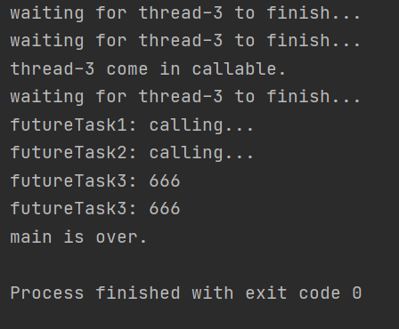


## 第8节 JUC辅助类

### 1 CountDownLatch锁存器

juc包中的一个辅助类，用来计数

使用方式：构造方法 + `await()` 方法 + `countDown()` 方法

`await()` 方法：线程阻塞直到计数器归零

`countDown()` 方法：减少计数器的计数


CountDownLatch代码演示：

```java
public class CountDownLatchDemo {

    public static void main(String[] args) throws InterruptedException {
        // 设置计数器初始值为6
        CountDownLatch countDownLatch = new CountDownLatch(6);

        for (int i = 1; i <= 6; i++) {
            new Thread(() -> {
                System.out.println(Thread.currentThread().getName() + "号同学离开了教室");
                // 计数-1
                countDownLatch.countDown();
            }, String.valueOf(i)).start();
        }
        countDownLatch.await();
        System.out.println("班长锁门走人了");
    }

}
```

运行结果：

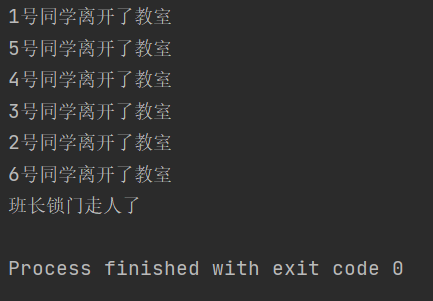


### 2 CyclicBarrier循环栅栏

juc包中的一个辅助类，用于使一组线程等待彼此都完成某种条件，然后可选执行某个Runnable接口的实现类

使用方式：构造方法 + `await()` 方法


CyclicBarrier代码演示：

```java
public class CyclicBarrierDemo {

    private static final int NUMBER = 10;

    public static void main(String[] args) {
        CyclicBarrier cyclicBarrier = new CyclicBarrier(NUMBER, () ->
                System.out.println("10个线程都已结束！")
        );
        for (int i = 1; i <= 10; i++) {
            new Thread(() -> {
                System.out.println(Thread.currentThread().getName() + "号线程结束");
                try {
                    cyclicBarrier.await();
                } catch (Exception e) {
                    e.printStackTrace();
                }
            }, String.valueOf(i)).start();
        }

    }

}
```

运行结果：

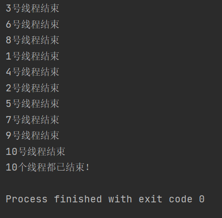


### 3 Semaphore信号量

juc包中的一个辅助类，用于维持一定量的线程许可

使用方式：构造方法设置许可量 + `acquire()` 方法 + `release()` 方法


Semaphore代码演示：

```java
/**
 * 6个线程抢3个执行机会
 */
public class SemaphoreDemo {

    public static void main(String[] args) {
        // 设置许可量为3
        Semaphore semaphore = new Semaphore(3);
        for (int i = 1; i <= 6; i++) {
            new Thread(() -> {
                try {
                    // 抢占
                    semaphore.acquire();
                    System.out.println(Thread.currentThread().getName() + "抢到了");
                    TimeUnit.SECONDS.sleep(new Random().nextInt(5));
                    System.out.println("---" + Thread.currentThread().getName() + "释放了");
                } catch (InterruptedException e) {
                    e.printStackTrace();
                } finally {
                    // 释放
                    semaphore.release();
                }
            }, String.valueOf(i)).start();
        }
    }

}
```

运行结果：

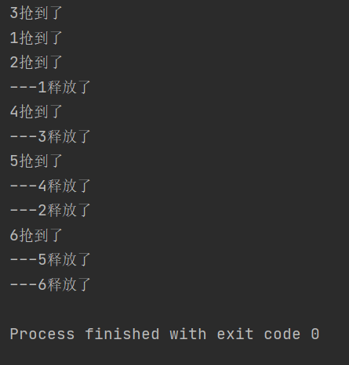


## 第9节 读写锁

### 1 悲观锁和乐观锁

悲观锁：

- 总是假设最坏的情况，共享资源每次只给一个线程使用，其它线程阻塞，用完后再把资源转让给其它线程
- 不支持并发，效率低

乐观锁：

- 总是假设最好的情况，每次去拿数据的时候都认为别人不会修改，所以不会上锁，但是在更新的时候会判断一下在此期间别人有没有去更新这个数据（比对版本）
- 支持并发


表锁：一把锁锁一张表，不会发生死锁

行锁：一把锁锁一行数据，可能发生死锁


### 2 读写锁

**读写锁**：一个资源可以同时被多个读线程访问，或者可以被一个写线程访问，但是不能同时存在读写线程，即**读写互斥**，**读读共享**

同一个线程可以先获取写锁，再获取读锁，反过来不行（读写互斥）

读写锁的优势：多线程可以同时读

读写锁的缺点：

- 一直读，影响写操作的执行
- 读的时候不能写


读锁（共享锁）：

- 同一个资源多个线程共享一把锁
- 可能发生死锁：线程1修改资源的时候，需要等待线程2读之后，反之亦然，可能互相等待

写锁（排他锁）：

- 对同一个资源只能有一把锁

- 可能发生死锁：线程1操作资源1时申请操作资源2，同时线程2操作2时申请操作资源1，造成互相等待


juc包中Lock接口的实现类ReentrantReadWriteLock的嵌套类ReentrantReadWriteLock.ReadLock和ReentrantReadWriteLock.WriteLock可用于实现读写锁


读写锁代码演示：

```java
class MyCache {

    // 共享map资源 往map里读或写
    private volatile Map<String, Object> map = new HashMap<>();

    // 初始化读写锁 向上转型
    private ReadWriteLock readWriteLock = new ReentrantReadWriteLock();

    public void put(String key, Object value) {
        readWriteLock.writeLock().lock();
        System.out.println(Thread.currentThread().getName() + "正在写" + key);
        try {
            TimeUnit.MILLISECONDS.sleep(500);
            map.put(key, value);
            System.out.println(Thread.currentThread().getName() + "写完了" + key);
        } catch (InterruptedException e) {
            e.printStackTrace();
        } finally {
            readWriteLock.writeLock().unlock();
        }
    }

    public Object get(String key) {
        readWriteLock.readLock().lock();
        System.out.println(Thread.currentThread().getName() + "正在读" + key);
        Object res = null;
        try {
            TimeUnit.MILLISECONDS.sleep(500);
            res = map.get(key);
            System.out.println(Thread.currentThread().getName() + "读完了" + key);
        } catch (InterruptedException e) {
            e.printStackTrace();
        } finally {
            readWriteLock.readLock().unlock();
        }
        return res;
    }

}


public class ReadWriteLockDemo {

    public static void main(String[] args) {
        MyCache myCache = new MyCache();
        // 5个线程开始写
        for (int i = 1; i <= 5; i++) {
            final String num = String.valueOf(i);
            new Thread(() -> myCache.put(num, num), String.valueOf(i)).start();
        }

        try {
            TimeUnit.MILLISECONDS.sleep(500);
        } catch (InterruptedException e) {
            e.printStackTrace();
        }

        // 5个线程开始读
        for (int i = 1; i <= 5; i++) {
            final String num = String.valueOf(i);
            new Thread(() -> System.out.println(myCache.get(num)), String.valueOf(i)).start();
        }
    }

}
```

运行结果：

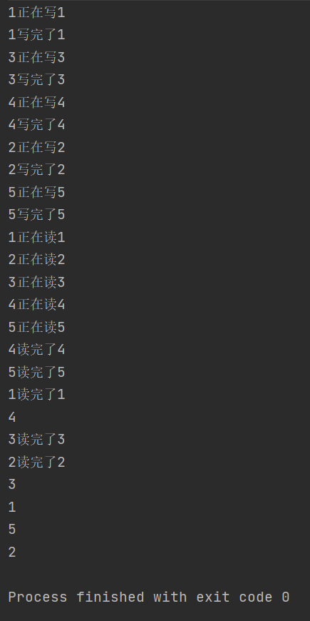


并发状态：

- 无锁状态：多线程抢夺资源
- 添加锁：
  - 使用synchronized或ReentrantLock：都是独占，每次只允许一个线程
  - 使用读写锁ReentrantReadWriteLock：读读可以共享


### 3 锁降级

JDK8以后，**写入锁可以降级为读锁**

同一个线程可以先获取写锁，再获取读锁，反过来不行（读写互斥）

写锁降级为读锁过程：获取写锁 ---> 获取读锁 ---> 释放写锁 ---> 释放读锁


锁降级代码演示：

```java
public class LockDegrade {

    public static void main(String[] args) {
        // 创建读写锁对象
        ReentrantReadWriteLock rwLock = new ReentrantReadWriteLock();
        ReentrantReadWriteLock.ReadLock readLock = rwLock.readLock();
        ReentrantReadWriteLock.WriteLock writeLock = rwLock.writeLock();

        // 锁降级
        writeLock.lock();
        System.out.println("获取了写锁");
        readLock.lock();
        System.out.println("获取了读锁");
        writeLock.unlock();
        System.out.println("释放了写锁");
        readLock.unlock();
        System.out.println("释放了读锁");
    }

}
```

运行结果：

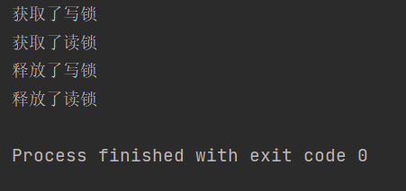


## 第10节 阻塞队列

### 1 BlockingQueue阻塞队列

阻塞队列是一个多线程共享队列

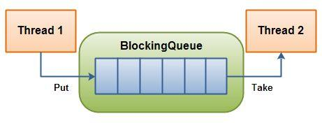

线程1往里放元素，线程2往外取元素

- 当队列为空时，take操作被阻塞
- 当队列已满时，put操作被阻塞


BlockingQueue是juc包中一个接口，继承了Queue接口

BlockingQueue的实现类：

- ArrayBlockingQueue是由**数组**结构组成的**有界**阻塞队列
- LinkedBlockingQueue是由**链表**结构组成的**有界**阻塞队列
- DelayQueue是由**优先队列**实现的**延迟无界**阻塞队列
- PriorityBlockingQueue是支持**优先级排序**的**无界**阻塞队列
- SynchronousQueue是只存储**单个元素**的阻塞队列
- LinkedTransferQueue是由**链表**组成的**无界**阻塞队列
- LinkedBlockingDeque是由**链表**组成的**双向**阻塞队列


阻塞队列代码演示：

```java
public class BlockingQueueDemo {

    public static void main(String[] args) throws InterruptedException {
        // 创建一个定长的阻塞队列
        BlockingQueue<String> blockingQueue = new ArrayBlockingQueue<>(3);

        blockingQueue.put("a");
        blockingQueue.put("b");
        blockingQueue.put("c");
        // 再put线程就会阻塞
        //blockingQueue.put("d");

        System.out.println(blockingQueue.take());
        System.out.println(blockingQueue.take());
        System.out.println(blockingQueue.take());
        // 再take线程就会阻塞
        //System.out.println(blockingQueue.take());

        System.out.println(blockingQueue.offer("a"));
        System.out.println(blockingQueue.offer("b"));
        System.out.println(blockingQueue.offer("c"));
        // offer和poll方法都可以设置超时时间
        // 阻塞超过3s则自动结束线程
        System.out.println(blockingQueue.offer("d", 3L, TimeUnit.SECONDS));
    }

}
```


## 第11节 线程池

### 1 ThreadPool线程池

线程池维护着多个线程，一定程度上避免了重复创建和销毁线程的代价

线程池的优势：

- 降低资源的消耗
- 提高响应速度
- 提高线程的可管理性


Java中的线程池通过Executor体系实现，包括Executors工具类

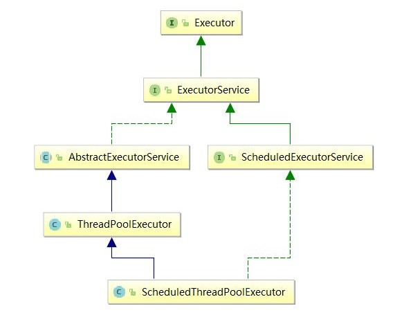


### 2 线程池的使用方式

线程池的使用方式：

1. Executors.newFixedThreadPool(int n)：一池N线程
2. Executors.newSingleThreadExecutor()：一池一线程
3. Executors.newCachedThreadPool()：可扩容

代码演示：

```java
public class ThreadPoolDemo1 {

    public static void main(String[] args) {
        // 1池5线程
        ExecutorService threadPool1 = Executors.newFixedThreadPool(5);
        // 10个业务
        for (int i = 1; i <= 10; i++) {
            threadPool1.execute(() -> System.out.println(Thread.currentThread().getName() + "正在处理业务..."));
        }
        // 关闭线程池 但是既不会强行终止正在执行的任务 也不会取消已经提交的任务
        threadPool1.shutdown();

        // 1池1线程
        ExecutorService threadPool2 = Executors.newSingleThreadExecutor();
        for (int i = 1; i <= 10; i++) {
            threadPool2.execute(() -> System.out.println(Thread.currentThread().getName() + "正在处理业务..."));
        }
        threadPool2.shutdown();

        // 可扩容线程池
        ExecutorService threadPool3 = Executors.newCachedThreadPool();
        for (int i = 1; i <= 10; i++) {
            threadPool3.execute(() -> System.out.println(Thread.currentThread().getName() + "正在处理业务..."));
        }
        threadPool3.shutdown();
    }

}
```

运行结果：

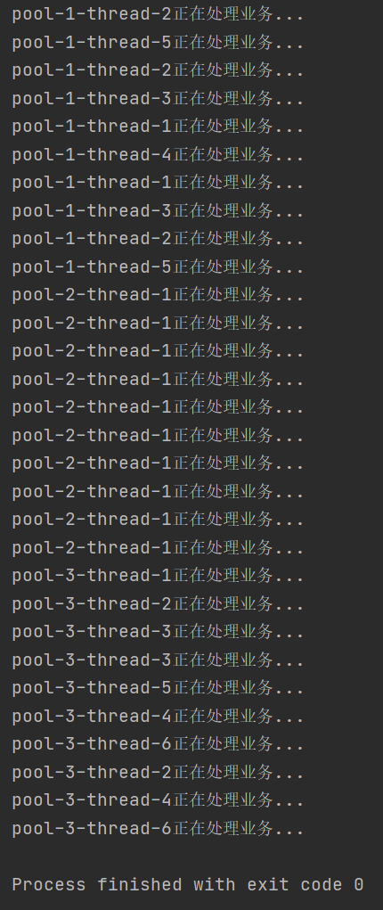


### 3 线程池底层原理

Executors的 `newFixedThreadPool(int n)`、`newSingleThreadExecutor()`、`newCachedThreadPool()` 底层都new了一个ThreadPoolExecutor类，作为执行操作的实体

ThreadPoolExecutor的构造方法最多有7个参数，源码：

```java
public ThreadPoolExecutor(int corePoolSize,//核心（常驻）线程数量
                              int maximumPoolSize,//最大线程数量
                              long keepAliveTime,//线程存活时间
                              TimeUnit unit,//存活时间单位
                              BlockingQueue<Runnable> workQueue,//阻塞队列 线程数量不够处理请求时将请求放入队列
                              ThreadFactory threadFactory,//线程工厂 用于创建线程
                              RejectedExecutionHandler handler) {//拒绝策略处理器
        if (corePoolSize < 0 ||
            maximumPoolSize <= 0 ||
            maximumPoolSize < corePoolSize ||
            keepAliveTime < 0)
            throw new IllegalArgumentException();
        if (workQueue == null || threadFactory == null || handler == null)
            throw new NullPointerException();
        this.acc = System.getSecurityManager() == null ?
                null :
                AccessController.getContext();
        this.corePoolSize = corePoolSize;
        this.maximumPoolSize = maximumPoolSize;
        this.workQueue = workQueue;
        this.keepAliveTime = unit.toNanos(keepAliveTime);
        this.threadFactory = threadFactory;
        this.handler = handler;
    }
```


主线程在调用 `execute()` 方法时线程才被创建


线程池底层创建线程的执行流程：

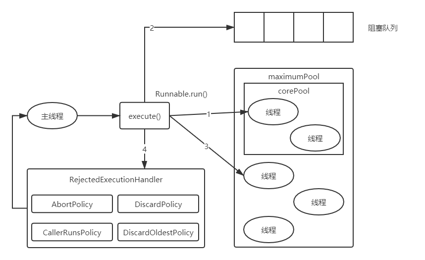


JDK内置的拒绝策略：

- AbortPolicy：抛出异常
- DiscardPolicy：丢弃无法处理的任务
- CallerRunsPolicy：将任务回退到调用者
- DiscardOldestPolicy：抛弃队列中等待最久的任务，然后将当前任务加入队列中


### 4 自定义线程池

自定义线程池在实际中更常用

自定义线程池代码演示：

```java
public class ThreadPoolDemo2 {

    public static void main(String[] args) {
        ExecutorService threadPool = new ThreadPoolExecutor(2, 5, 2L,
                TimeUnit.SECONDS, new ArrayBlockingQueue<>(3), Executors.defaultThreadFactory(),
                new ThreadPoolExecutor.AbortPolicy());
        for (int i = 1; i <= 10; i++) {
            threadPool.execute(() -> System.out.println(Thread.currentThread().getName() + "正在处理业务..."));
        }
        threadPool.shutdown();
    }

}
```

运行后会抛出RejectedExecutionException异常


## 第12节 分支合并框架

### 1 Fork/Join分支合并框架

ForkJoinPool于JDK7中加入

Fork/Join可以将一个大的任务拆分成多个子任务进行并行处理，最后将子任务结果合并成最后的计算结果，并进行输出

Fork：拆分

Join：合并


Fork/Join分支合并代码演示：

```java
class MyTask extends RecursiveTask<Integer> {

    // 拆分差值不能超过10
    private static final int VALUE = 10;
    // 拆分开始值
    private int begin;
    // 拆分结束值
    private int end;

    public MyTask(int begin, int end) {
        this.begin = begin;
        this.end = end;
    }

    // 拆分与合并过程
    @Override
    protected Integer compute() {
        int res = 0;
        if (end - begin <= VALUE) {
            for (int i = begin; i <= end; i++) {
                res += i;
            }
        } else {
            // 获取中间值
            int mid = (begin + end) / 2;
            // 拆分左边
            MyTask taskLeft = new MyTask(begin, mid);
            // 拆分右边
            MyTask taskRight = new MyTask(mid + 1, end);
            taskLeft.fork();
            taskRight.fork();
            // 合并结果
            res = taskLeft.join() + taskRight.join();
        }
        return res;
    }
}


public class ForkJoinDemo {

    public static void main(String[] args) throws ExecutionException, InterruptedException {
        // 创建MyTask对象
        MyTask myTask = new MyTask(0, 100);
        // 创建分支合并池对象
        ForkJoinPool forkJoinPool = new ForkJoinPool();
        ForkJoinTask<Integer> forkJoinTask = forkJoinPool.submit(myTask);
        // 获取最终合并之后的结果
        Integer res = forkJoinTask.get();
        System.out.println(res);
        // 关闭池对象
        forkJoinPool.shutdown();
    }

}
```

运行结果：

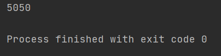


## 第13节 调用机制

### 1 CompletableFuture

模块之间总是存在着一定数量的接口，从调用方式上看，可以分为三类：**同步调用**、**回调**和**异步调用**：

- 同步调用是一种**阻塞式**调用，一段代码调用另一端代码时，必须等待这段代码执行结束并返回结果后，代码才能继续执行下去
- 回调是一种**双向**的调用模式，也就是说，被调用的接口被调用时也会调用对方的接口
- 异步调用是一种**非阻塞式**调用，一段异步代码还未执行完，可以继续执行下一段代码逻辑，当代码执行完以后，通过回调函数返回继续执行相应的逻辑，而不耽误其他代码的执行


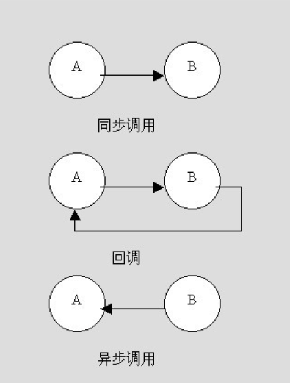


CompletableFuture实现同步调用和异步调用代码演示：

```java
public class CompletableFutureDemo {

    public static void main(String[] args) throws ExecutionException, InterruptedException {
        // 同步调用
        CompletableFuture<Void> completableFuture1 = CompletableFuture.runAsync(() ->
                System.out.println(Thread.currentThread().getName() + ": CompletableFuture1"));
        completableFuture1.get();

        // 异步调用
        CompletableFuture<Integer> completableFuture2 = CompletableFuture.supplyAsync(() -> {
            System.out.println(Thread.currentThread().getName() + ": CompletableFuture2");
            return 666;
        });
        completableFuture2.whenComplete((t, u) -> {
            System.out.println("t = " + t);//t为返回值
            System.out.println("u = " + u);//u为异常信息
        }).get();
    }

}
```

运行结果：

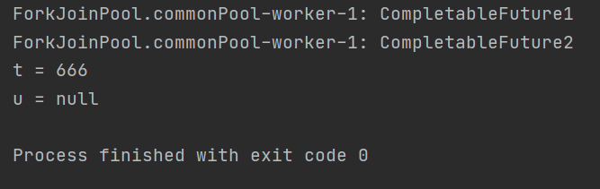


## 第14节 线程间变量的共享和独享

### 1 volatile

Java中，如果一个变量要被多线程访问，可以使用volatile关键字将它声明为“易变的”


### 2 ThreadLocal

#### 源码分析

ThreadLocal的作用主要是做**数据隔离**，填充的数据只属于当前线程，变量的数据对别的线程而言是相对隔离的，在多线程环境下，防止本线程的变量被其它线程篡改

**整体结构**：每个 Thread 对象 ---> 一个 ThreadLocalMap 对象(ThreadLocal 对象 - value)

ThreadLocal类即充当了创建ThreadLocalMap对象的工具类，也作为ThreadLocalMap中的key来获取独享资源

ThreadLocalMap类的内部是一个Entry数组

**设置线程独享资源**：创建ThreadLocal 对象，调用 `set()` 方法设置独享value，第一次程序会为当前线程生成一个ThreadLocalMap对象并设置相应节点；此后每次需要设置更多独享资源，则需创建更多ThreadLocal对象作为key去设置 k - v 对

**获取线程独享资源**：只需调用相应ThreadLocal对象的 `get()` 方法即可


Thread类中的ThreadLocalMap字段：

```java
	/* ThreadLocal values pertaining to this thread. This map is maintained
     * by the ThreadLocal class. */
    ThreadLocal.ThreadLocalMap threadLocals = null;

    /*
     * InheritableThreadLocal values pertaining to this thread. This map is
     * maintained by the InheritableThreadLocal class.
     */
    ThreadLocal.ThreadLocalMap inheritableThreadLocals = null;
```


ThreadLocal类set方法：

```java
public void set(T value) {
        Thread t = Thread.currentThread();
        ThreadLocalMap map = getMap(t);
        if (map != null)
            map.set(this, value);
        else
            createMap(t, value);
    }
```


ThreadLocal类get方法：

```java
public T get() {
        Thread t = Thread.currentThread();
        ThreadLocalMap map = getMap(t);
        if (map != null) {
            ThreadLocalMap.Entry e = map.getEntry(this);
            if (e != null) {
                @SuppressWarnings("unchecked")
                T result = (T)e.value;
                return result;
            }
        }
        return setInitialValue();
    }
```


ThreadLocal类getMap方法：

```java
ThreadLocalMap getMap(Thread t) {
        return t.threadLocals;
    }
```


ThreadLocal类createMap方法：

```java
void createMap(Thread t, T firstValue) {
        t.threadLocals = new ThreadLocalMap(this, firstValue);
    }
```


ThreadLocalMap中的Entry类：

```java
static class Entry extends WeakReference<ThreadLocal<?>> {
            Object value;

            Entry(ThreadLocal<?> k, Object v) {
                super(k);
                value = v;
            }
        }
```


#### InheritableThreadLocal类

由于ThreadLocalMap对象为当前线程的本地变量，所以当前线程的子线程是不能获取的

要实现子线程访问浮现出的独享资源，可以使用InheritableThreadLocal类代替ThreadLocal类

InheritableThreadLocal类继承了ThreadLocal类，并重写了childValue、getMap、createMap三个方法：

```java
public class InheritableThreadLocal<T> extends ThreadLocal<T> {
    
    protected T childValue(T parentValue) {
        return parentValue;
    }

    ThreadLocalMap getMap(Thread t) {
       return t.inheritableThreadLocals;
    }

    void createMap(Thread t, T firstValue) {
        t.inheritableThreadLocals = new ThreadLocalMap(this, firstValue);
    }
}
```

当线程通过InheritableThreadLocals实例的set或者get方法设置变量的时候，就会创建当前线程的inheritableThreadLocals变量。而父线程创建子线程的时候，ThreadLocalMap中的构造函数会将父线程的inheritableThreadLocals中的变量复制一份到子线程的inheritableThreadLocals变量中


#### 内存泄漏

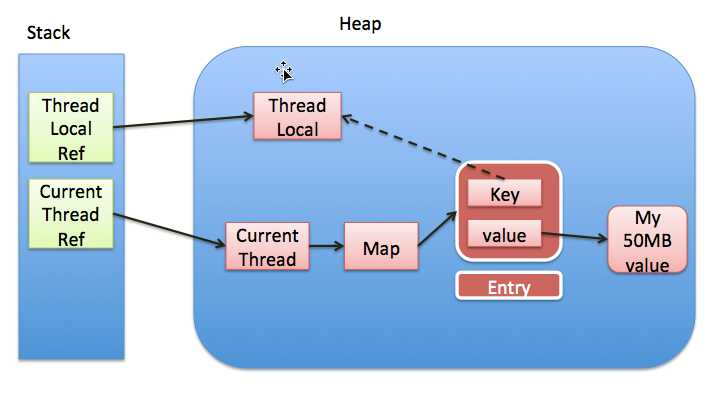

- 当ThreadLocal引用指向了其他地方或者null，如果上图虚线为实线即强引用，那么堆里的ThreadLocal就会造成内存泄漏，所以Entry设计成了保存ThreadLocal的弱引用，在gc时自动回收ThreadLocal对象
- 在上述情况下，value仍然存在内存泄漏的问题，所以在线程的某个ThreadLocal对象使用完时，一定要调用ThreadLocal的 `remove()` 方法
- 线程结束后，Current Thread引用就不会再存在于栈区，所以Current Thread、Map、Value等都会被gc回收
- 如果使用的线程池，线程使用完后回到线程池里而不会被销毁，这样就可能出现ThreadLocal的内存泄漏


#### 应用场景

ThreadLocal的应用场景：

- Spring采用Threadlocal的方式，来保证单个线程中的数据库操作使用的是同一个数据库连接
- 包装SimpleDataFormat
