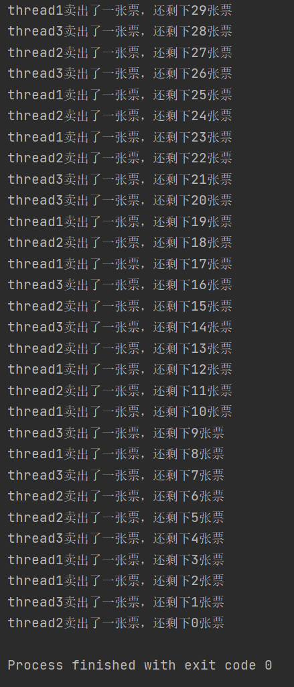
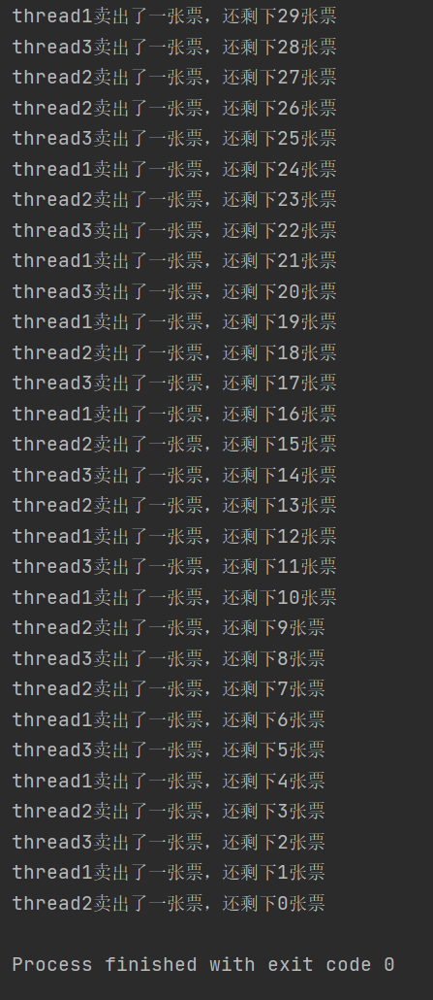
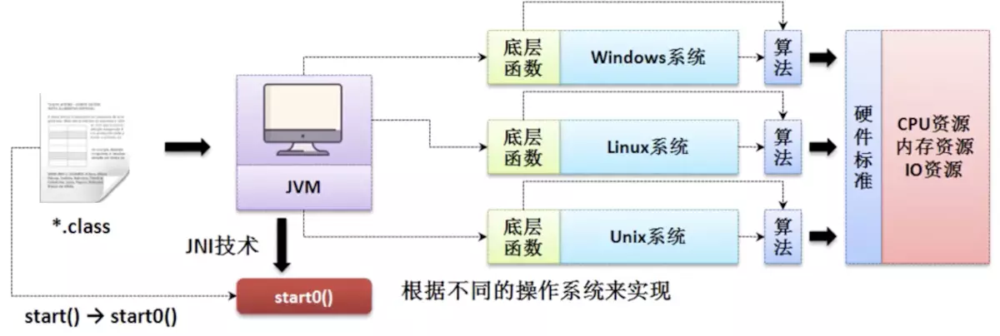
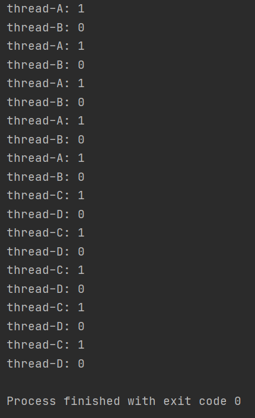
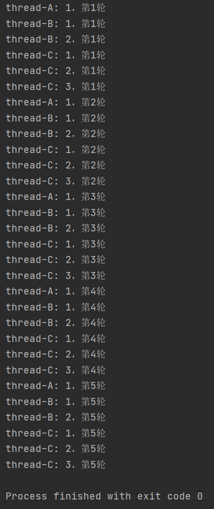
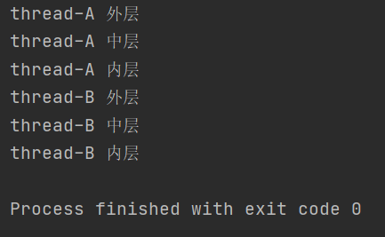

# Java并发编程

## 第1节 JUC概述

### 1 JUC简介

JUC是java.util.concurrent工具包的简称，一个用来处理线程的工具包，从JDK1.5开始出现


### 2 进程和线程

**进程**（process）：计算机中程序关于某数据集合上的一次运行活动

- **进程是系统进行资源分配和调度的最小单位**
- 进程是操作系统结构的基础
- 进程是程序在内存中的镜像
- 进程是线程的容器
- 每一个进程都有自己的内存空间和系统资源

**线程**（thread）：进程中的单个顺序控制流，是一条执行路径

- **线程是操作系统调度器可调度的最小执行单元**
- 进程的实际运作单位
- 一个进程至少包含一个线程，一个进程的多个线程共享内存空间


**管程**（Monitor）：监视器，即锁

管程一种同步机制，保证同一个时间，只有一个线程访问被保护的数据或者代码

JVM同步基于进入和退出，使用管程对象实现


**用户线程**：自定义线程

**守护线程**：后台运行的特殊线程，如垃圾回收器

主线程结束，若用户线程还在运行，JVM存活；若无用户线程运行了，只剩下守护线程，则JVM退出

守护线程代码演示：

```java
public class DaemonDemo {

    public static void main(String[] args) {
        // Lambda表达式实现Runnable接口
        Thread thread1 = new Thread(() -> {
            // true为守护线程 false为用户线程
            System.out.println(Thread.currentThread().getName() + ":" + Thread.currentThread().isDaemon());
            while (true) {
                // 主线程结束 若用户线程还在运行 JVM存活
                // 由于主线程被设为守护线程 故JVM退出
                try {
                    Thread.sleep(1000);
                } catch (InterruptedException e) {
                    e.printStackTrace();
                }
                System.out.println(Thread.currentThread().getName());
            }
        }, "thread1");
        // 设置守护线程
        thread1.setDaemon(true);
        thread1.start();
        System.out.println(Thread.currentThread().getName() + " is over.");
    }

}
```


### 3 线程状态

java.lang.Tread中的枚举类Sate枚举了6种线程状态：

```java
public enum State {
    /**
     * Thread state for a thread which has not yet started.
     */
    NEW,//新建

    /**
     * Thread state for a runnable thread.  A thread in the runnable
     * state is executing in the Java virtual machine but it may
     * be waiting for other resources from the operating system
     * such as processor.
     */
    RUNNABLE,//就绪

    /**
     * Thread state for a thread blocked waiting for a monitor lock.
     * A thread in the blocked state is waiting for a monitor lock
     * to enter a synchronized block/method or
     * reenter a synchronized block/method after calling
     * {@link Object#wait() Object.wait}.
     */
    BLOCKED,//阻塞

    /**
     * Thread state for a waiting thread.
     * A thread is in the waiting state due to calling one of the
     * following methods:
     * <ul>
     *   <li>{@link Object#wait() Object.wait} with no timeout</li>
     *   <li>{@link #join() Thread.join} with no timeout</li>
     *   <li>{@link LockSupport#park() LockSupport.park}</li>
     * </ul>
     *
     * <p>A thread in the waiting state is waiting for another thread to
     * perform a particular action.
     *
     * For example, a thread that has called <tt>Object.wait()</tt>
     * on an object is waiting for another thread to call
     * <tt>Object.notify()</tt> or <tt>Object.notifyAll()</tt> on
     * that object. A thread that has called <tt>Thread.join()</tt>
     * is waiting for a specified thread to terminate.
     */
    WAITING,//等待

    /**
     * Thread state for a waiting thread with a specified waiting time.
     * A thread is in the timed waiting state due to calling one of
     * the following methods with a specified positive waiting time:
     * <ul>
     *   <li>{@link #sleep Thread.sleep}</li>
     *   <li>{@link Object#wait(long) Object.wait} with timeout</li>
     *   <li>{@link #join(long) Thread.join} with timeout</li>
     *   <li>{@link LockSupport#parkNanos LockSupport.parkNanos}</li>
     *   <li>{@link LockSupport#parkUntil LockSupport.parkUntil}</li>
     * </ul>
     */
    TIMED_WAITING,//过时不候

    /**
     * Thread state for a terminated thread.
     * The thread has completed execution.
     */
    TERMINATED;//终结
}
```


### 4 wait和sleep

wait：

- wait是Object类的方法，所以任何对象实例都能调用
- wait会释放锁

sleep：

- sleep是Thread类的静态方法
- sleep不会释放锁，也不需要占用锁

wait()和sleep()都可以被Thread类的interrupt()方法中断


### 5 并发和并行

串行模式：多个任务按顺序单个执行

并行模式：多个任务同时执行


**并发**：同一时刻多个线程在访问同一个资源，多个线程对一个点

**并行**：多项工作一起执行，之后再汇总


## 第2节 Lock接口

### 1 synchronized关键字

synchronized是一种同步锁

synchronized作用范围：

1. 代码块：被大括号括起来的同步语句块
2. 方法：同步方法
3. 静态方法
4. 类


synchronized与Lock的不同点：

1. synchronized是内置语言实现的**关键字**，而Lock是一个**接口**
2. 发生异常时：
   - synchronized会**自动释放**线程占用的锁
   - Lock如果没有主动通过unLock()去释放锁，则可能造成死锁现象
3. Lock可以让等待的锁的线程**响应中断**，而synchronized不行
4. Lock可以知道**有没有成功获取锁**，而synchronized不行
5. Lock可以提高多个线程进行**读操作的效率**


创建多线程的方式：

1. 继承Thread类
2. 实现Runnable接口
3. 使用Callable接口
4. 使用线程池


多线程编程步骤：

1. 创建资源类，在资源类创建属性和操作方法
2. 创建多个线程，在线程中调用资源类的操作方法


#### 卖票案例1

多线程编程代码演示：

```java
public class SellTicket {

    static class Ticket {

        // 票数
        private int number = 30;

        // 操作方法：卖票
        public synchronized void sell() {
            // 判断是否有票 有则卖一张票
            if (number > 0) {
                System.out.println(Thread.currentThread().getName() + "卖出了一张票，还剩下" + (--number) + "张票");
            }
        }

    }

    public static void main(String[] args) {
        // 创建资源类
        Ticket ticket = new Ticket();
        // 创建三个线程
        for (int i = 1; i <= 3; i++) {
            new Thread(new Runnable() {
                @Override
                public void run() {
                    for (int i = 0; i < 40; i++) {
                        ticket.sell();
                        try {
                            Thread.sleep(100);
                        } catch (InterruptedException e) {
                            e.printStackTrace();
                        }
                    }
                }
            }, "thread" + i).start();
        }

    }

}
```

运行结果：




### 2 ReentrantLock

Lock接口是java.util.concurrent.locks包下的一个接口

synchronized上锁和解锁是自动的，而Lock需要手动上锁和解锁

Lock接口下有ReentrantLock，ReentrantReadWriteLock.ReadLock，ReentrantReadWriteLock.WriteLock三个实现类


ReentrantLock是一种**可重入锁**


#### 卖票案例2

ReentrantLock代码演示：

```java
public class SellTicketLock {

    static class Ticket {
        // 票数
        private int number = 30;

        // 创建可重入锁
        private final ReentrantLock lock = new ReentrantLock();

        // 卖票方法
        public void sell() {
            // 上锁
            lock.lock();
            try {
                // 判断是否有票可卖
                if (number > 0) {
                    System.out.println(Thread.currentThread().getName() + "卖出了一张票，还剩下" + (--number) + "张票");
                }
            } catch (Exception e) {
                e.printStackTrace();
            } finally {
                // 解锁
                lock.unlock();
            }
        }

    }

    public static void main(String[] args) {
        // 创建资源类
        Ticket ticket = new Ticket();
        // 创建三个线程
        for (int i = 1; i <= 3; i++) {
            new Thread(() -> {
                for (int j = 0; j < 40; j++) {
                    ticket.sell();
                    try {
                        Thread.sleep(100);
                    } catch (InterruptedException e) {
                        e.printStackTrace();
                    }
                }
            }, "thread" + i).start();
        }
    }

}
```

运行结果：




## 第3节 线程间通信

### 1 线程间通信

Thread的`start()`方法不会立即启动线程，而会先去调用native关键字修饰的`start0()`方法，将控制权交给操作系统，操作系统根据自身此时的资源分配情况决定什么时候启动线程




带线程间通信的多线程编程步骤：

1. 创建资源类，在资源类创建属性和操作方法
2. 在资源类按如下顺序编写操作方法：
   1. 判断
   2. 执行
   3. 通知
3. 创建多个线程，调用资源类的操作方法


### 2 线程通信案例

#### synchronized版

> 实现两个线程将一个初始值为0的变量分别+1和-1

syncronized版：

```java
class Share {

    // 初始值
    private int number = 0;

    // +1的方法
    public synchronized void incr() throws InterruptedException {
        // 判断 若非0则等待 是0则执行操作
        if (number != 0) {
            this.wait();
        }
        // 执行操作
        number++;
        System.out.println(Thread.currentThread().getName() + ": " + number);
        // 通知其他线程
        this.notifyAll();
    }

    // -1的方法
    public synchronized void decr() throws InterruptedException {
        if (number != 1) {
            this.wait();
        }
        number--;
        System.out.println(Thread.currentThread().getName() + ": " + number);
        this.notifyAll();
    }

}

public class ThreadDemo1 {
    // 创建多个线程 调用资源类的操作方法
    public static void main(String[] args) {
        Share share = new Share();
        new Thread(() -> {
            for (int i = 1; i <= 10; i++) {
                try {
                    share.incr();
                } catch (InterruptedException e) {
                    e.printStackTrace();
                }
            }
        }, "thread-A").start();
        new Thread(() -> {
            for (int i = 1; i <= 10; i++) {
                try {
                    share.decr();
                } catch (InterruptedException e) {
                    e.printStackTrace();
                }
            }
        }, "thread-B").start();
    }

}
```

运行结果：


创建多个线程，判断条件如果仍然用if会导致线程唤醒后不会判断而是继续执行，即所谓“虚假唤醒”

因此需将if改成while

```java
class Share {

    private int number = 0;

    public synchronized void incr() throws InterruptedException {
        // if改为while
        while (number != 0) {
            this.wait();
        }
        number++;
        System.out.println(Thread.currentThread().getName() + ": " + number);
        this.notifyAll();
    }

    public synchronized void decr() throws InterruptedException {
        // if改为while
        while (number != 1) {
            this.wait();
        }
        number--;
        System.out.println(Thread.currentThread().getName() + ": " + number);
        this.notifyAll();
    }

}
```


#### Lock版

> 实现四个线程将一个初始值为0的变量分别+1和-1

```java
class Share {

    private int number = 0;
    private Lock lock = new ReentrantLock();
    private Condition condition = lock.newCondition();

    public void incr() throws InterruptedException {
        lock.lock();
        try {
            while (number != 0) {
                condition.await();
            }
            number++;
            System.out.println(Thread.currentThread().getName() + ": " + number);
            condition.signalAll();
        } finally {
            lock.unlock();
        }
    }

    public void decr() throws InterruptedException {
        lock.lock();
        try {
            while (number != 1) {
                condition.await();
            }
            number--;
            System.out.println(Thread.currentThread().getName() + ": " + number);
            condition.signalAll();
        } finally {
            lock.unlock();
        }
    }

}

public class ThreadDemo2 {
    public static void main(String[] args) {
        Share share = new Share();
        new Thread(() -> {
            for (int i = 1; i <= 5; i++) {
                try {
                    share.incr();
                } catch (InterruptedException e) {
                    e.printStackTrace();
                }
            }
        }, "thread-A").start();
        new Thread(() -> {
            for (int i = 1; i <= 5; i++) {
                try {
                    share.decr();
                } catch (InterruptedException e) {
                    e.printStackTrace();
                }
            }
        }, "thread-B").start();
        new Thread(() -> {
            for (int i = 1; i <= 5; i++) {
                try {
                    share.incr();
                } catch (InterruptedException e) {
                    e.printStackTrace();
                }
            }
        }, "thread-C").start();
        new Thread(() -> {
            for (int i = 1; i <= 5; i++) {
                try {
                    share.decr();
                } catch (InterruptedException e) {
                    e.printStackTrace();
                }
            }
        }, "thread-D").start();
    }
}
```

运行结果：




## 第4节 线程间定制化通信

### 1 线程间定制化通信

线程间定制化通信：使多个线程按照规定的顺序执行

> 启动三个线程，使第一个线程打印1次，第二个线程打印2次，第三个线程打印3次，如此重复10轮。

代码演示：

```java
class ShareResource {

    // 定义标志位
    private int flag = 1;
    // 创建Lock锁
    private Lock lock = new ReentrantLock();
    // 创建三个condition
    private Condition c1 = lock.newCondition();
    private Condition c2 = lock.newCondition();
    private Condition c3 = lock.newCondition();

    // 打印1次，参数第loop轮
    public void print1(int loop) {
        lock.lock();
        try {
            // 判断
            while (flag != 1) {
                // 等待
                c1.await();
            }
            // 执行
            System.out.println(Thread.currentThread().getName() + ": " + 1 + "，第" + loop + "轮");
            flag = 2;
            c2.signal();
        } catch (InterruptedException e) {
            e.printStackTrace();
        } finally {
            // 释放锁
            lock.unlock();
        }
    }

    public void print2(int loop) {
        lock.lock();
        try {
            while (flag != 2) {
                c2.await();
            }
            for (int i = 1; i <= 2; i++) {
                System.out.println(Thread.currentThread().getName() + ": " + i + "，第" + loop + "轮");
            }
            flag = 3;
            c3.signal();
        } catch (InterruptedException e) {
            e.printStackTrace();
        } finally {
            lock.unlock();
        }
    }

    public void print3(int loop) {
        lock.lock();
        try {
            while (flag != 3) {
                c3.await();
            }
            for (int i = 1; i <= 3; i++) {
                System.out.println(Thread.currentThread().getName() + ": " + i + "，第" + loop + "轮");
            }
            flag = 1;
            c1.signal();
        } catch (InterruptedException e) {
            e.printStackTrace();
        } finally {
            lock.unlock();
        }
    }

}

public class ThreadDemo3 {

    public static void main(String[] args) {
        ShareResource shareResource = new ShareResource();
        new Thread(() -> {
            for (int i = 1; i <= 5; i++) {
                shareResource.print1(i);
            }
        }, "thread-A").start();
        new Thread(() -> {
            for (int i = 1; i <= 5; i++) {
                shareResource.print2(i);
            }
        }, "thread-B").start();
        new Thread(() -> {
            for (int i = 1; i <= 5; i++) {
                shareResource.print3(i);
            }
        }, "thread-C").start();
    }

}
```

运行结果：




## 第5节 集合的线程安全

### 1 List集合的线程安全

List集合线程不安全代码演示：

```java
public class ThreadDemo4 {

    public static void main(String[] args) {
        List<String> list = new ArrayList<>();
        for (int i = 0; i < 10; i++) {
            new Thread(() -> {
                list.add(UUID.randomUUID().toString().substring(0, 8));
                System.out.println(list);
            }, String.valueOf(i)).start();
        }
    }

}
```

运行后将抛出java.util.ConcurrentModificationException异常，即出现了并发修改问题


解决方案：

- 使用Vector类
   - JDK1.0时就出现的类
   - Vector类具有与ArrayList基本一致的功能，但在所有可能出现并发问题的方法上都加上了synchronized关键字
- 使用Collections工具类
   - 采用Collections类下的相应方法包装要使用的集合类
- 使用JUC中的CopyOnWriteArrayList类
   - 写时复制技术：写时复制，读写分离
     - 并发读正常读即可
     - 独立写时，先复制原集合到一块新的内存空间，往里写，再覆盖或合并原集合


List集合线程安全代码演示：

```java
public class ThreadDemo4 {

    public static void main(String[] args) {
        // 线程不安全
        //List<String> list = new ArrayList<>();

        // 解决方案一：Vector
        //List<String> list = new Vector<>();

        // 解决方案二：Collections
        //List<String> list = Collections.synchronizedList(new ArrayList<>());

        // 解决方案三：CopyOnWriteArrayList
        List<String> list = new CopyOnWriteArrayList<>();

        for (int i = 0; i < 10; i++) {
            new Thread(() -> {
                list.add(UUID.randomUUID().toString().substring(0, 8));
                System.out.println(list);
            }, String.valueOf(i)).start();
        }
    }

}
```


CopyOnWriteArrayList类add()方法源码：

```java
/**
     * Appends the specified element to the end of this list.
     *
     * @param e element to be appended to this list
     * @return {@code true} (as specified by {@link Collection#add})
     */
    public boolean add(E e) {
        final ReentrantLock lock = this.lock;
        lock.lock();
        try {
            Object[] elements = getArray();
            int len = elements.length;
            Object[] newElements = Arrays.copyOf(elements, len + 1);
            newElements[len] = e;
            setArray(newElements);
            return true;
        } finally {
            lock.unlock();
        }
    }
```


### 2 HashSet和HashMap的线程安全

HashSet和HashMap在前述List集合的多线程条件直接使用，同样可能抛出java.util.ConcurrentModificationException异常

HashSet线程安全解决方案：

- Collections.synchronizedSet(Set s)
- CopyOnWriteArraySet

```java
public class ThreadDemo5 {

    public static void main(String[] args) {
        //Set<String> set = new HashSet<>();
        Set<String> set = new CopyOnWriteArraySet<>();
        for (int i = 0; i < 30; i++) {
            new Thread(() -> {
                set.add(UUID.randomUUID().toString().substring(0, 8));
                System.out.println(set);
            }, String.valueOf(i)).start();
        }
    }

}
```

HashMap线程安全解决方案：

- Hashtable
- Collections.synchronizedMap(Map m)
- ConcurrentHashMap

```java
public class ThreadDemo6 {

    public static void main(String[] args) {
        //Map<String, String> map = new HashMap<>();
        Map<String, String> map = new ConcurrentHashMap<>();
        for (int i = 0; i < 30; i++) {
            String key = String.valueOf(i);
            new Thread(() -> {
                map.put(key, UUID.randomUUID().toString().substring(0, 8));
                System.out.println(map);
            }, String.valueOf(i)).start();
        }
    }

}
```


## 第6节 多线程锁

### 1 公平锁

sysnchronized实现同步的基础：Java中的每一个对象都可以作为锁

- 对于非静态同步方法，锁的是`this`，即当前实例对象
- 对于静态同步方法，锁的是Class字节码对象
- 对于同步方法块，锁的是synchronized括号里配置的对象


**非公平锁**：多线程之间竞争非公平，执行效率相对高

`ReentrantLock lock = new ReentrantLock()` 默认为非公平锁

源码中无参构造方法：

```java
public ReentrantLock() {
    sync = new NonfairSync();
}
```

**公平锁**：多线程之间竞争公平，执行效率相对低

`ReentranLock lock = new ReentrantLock(true)` 创建公平锁

源码中带参构造方法：

```java
public ReentrantLock(boolean fair) {
    sync = fair ? new FairSync() : new NonfairSync();
}
```


### 2 可重入锁

**可重入锁**：也叫递归锁，当被加锁的情况下还可以加锁

若有多层嵌套同步方法或代码块，则每一层都是用的同一把锁*（能进最外层则内部所有层都可以随意进入）*

可重入锁代码演示：

```java
public class SyncLockDemo {

    public synchronized void add() {
        // 递归调用演示递归锁
        add();
    }

    public static void main(String[] args) {
        // 递归调用会抛出异常java.lang.StackOverflowError
        //new SyncLockDemo().add();

        // synchronized演示可重入锁
        Object obj = new Object();
        new Thread(() -> {
            synchronized (obj) {
                System.out.println(Thread.currentThread().getName() + " 外层");
                synchronized (obj) {
                    System.out.println(Thread.currentThread().getName() + " 中层");
                    synchronized (obj) {
                        System.out.println(Thread.currentThread().getName() + " 内层");
                    }
                }
            }
        }, "thread-A").start();

        // Lock演示可重入锁
        Lock lock = new ReentrantLock();
        new Thread(() -> {
            try {
                lock.lock();
                System.out.println(Thread.currentThread().getName() + " 外层");
                try {
                    lock.lock();
                    System.out.println(Thread.currentThread().getName() + " 中层");
                    try {
                        lock.lock();
                        System.out.println(Thread.currentThread().getName() + " 内层");
                    } finally {
                        // 每次上锁必须对应有解锁
                        lock.unlock();
                    }
                } finally {
                    lock.unlock();
                }
            } finally {
                lock.unlock();
            }
        }, "thread-B").start();
    }

}
```

运行结果：




### 3 死锁

**死锁**：两个或两个以上进程在执行过程中，因为争夺资源而造成一种互相等待的现象，若无外部介入则无法继续执行

产生死锁的原因：

- 系统资源不足
- 进程运行推进顺序不合适
- 资源分配不当

死锁代码演示：

```java
public class DeadLockDemo {

    static Object a = new Object();
    static Object b = new Object();

    public static void main(String[] args) {
        new Thread(() -> {
            synchronized (a) {
                System.out.println(Thread.currentThread().getName() + "持有锁a，试图获取锁b");
                try {
                    TimeUnit.SECONDS.sleep(1);
                } catch (InterruptedException e) {
                    e.printStackTrace();
                }
                synchronized (b) {
                    System.out.println(Thread.currentThread().getName() + "获取到锁b");
                }
            }
        }, "thread-a").start();

        new Thread(() -> {
            synchronized (b) {
                System.out.println(Thread.currentThread().getName() + "持有锁b，试图获取锁a");
                try {
                    TimeUnit.SECONDS.sleep(1);
                } catch (InterruptedException e) {
                    e.printStackTrace();
                }
                synchronized (a) {
                    System.out.println(Thread.currentThread().getName() + "获取到锁a");
                }
            }
        }, "thread-b").start();
    }

}
```


验证是否死锁步骤：

1. 控制台输入`jps`命令（类似Linux中`ps -ef`），查看当前进程
2. 输入`jstack`命令（JVM自带堆栈跟踪工具），若有一个死锁可以看到打印出"Found 1 deadlock."


## 第7节 Callable接口

JDK1.5出现

使用Thread类或使用Runnable接口创建线程无法获得线程返回结果，而这一点Callable接口可以实现

Callable接口中只有一个`call()`方法，有返回值；若无法返回结果则抛出异常

使用Callable接口创建线程需要使用实现了Runnable接口的FutureTask类来包装

24
