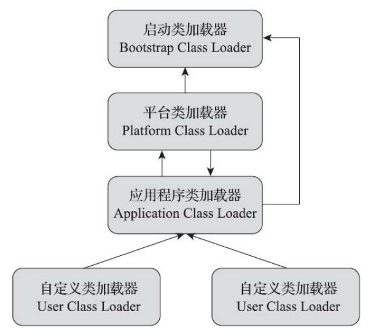

# 第一部分 自动内存管理

## 第1章 Java内存区域与内存溢出异常

### 1 运行时数据区域

#### 程序计数器

- 当前线程执行的字节码的**行号指示器**
- 线程私有


#### Java虚拟机栈

- 每个方法被执行时都会创建一个**栈帧**
- 线程私有
- 虚拟机栈 - 局部变量表 - 局部变量槽（Slot）
  - 1个变量槽32bit或64bit，甚至更多
  - long、double类型占用2个变量槽，其他数据类型占用1个
- HotSpot不支持动态扩展栈容量
- 栈深度溢出：StackOverFlowError
- 栈扩展失败（或申请栈空间失败）：OutOfMemoryError


#### 本地方法栈

- 本地方法栈为本地方法（`native` 修饰的方法）服务
- 线程私有
- 本地方法被执行的时候，在本地方法栈会创建一个栈帧，用于存放局部变量表、操作数栈、动态链接、出口信息等
- HotSpot将本地方法栈和虚拟机栈合二为一


#### Java堆

- 唯一目的：存放**对象实例**
- 物理空间可不连续，逻辑上连续
- 可选固定大小或者可扩展
- 无法再实例分配或扩展：OutOfMemoryError


#### 方法区

- 用于存储已被虚拟机加载的**类信息**、**常量**、**静态变量**、**即时编译器编译后的代码**等数据
- 实现方式：
  - **永久代**
    - JDK8以前
    - JVM用管理堆的办法管理方法区
  - **元空间**
    - JDK8及之后
    - 元空间位于本地内存中
    - 元空间存储类的元信息，静态变量和常量池等放入堆中
- 不需要连续的内存
- 可选固定大小或者可扩展
- 可选不实现垃圾收集
- 运行时常量池：
  - 加载Class文件中的常量池表（包含各种**字面量**与**符号引用**）
  - 动态性：运行期间也可以将新的常量放入池中
  - Byte、Short、Integer、Long、Character这5种整型的包装类在对应值大于等于-128并且小于等于127时会将值存入常量池
- 无法满足新的内存分配需求：OutOfMemoryError


#### 直接内存

- 不是虚拟机运行时数据区的一部分
- JDK1.4中引入，在一些场景中显著提高性能
- JDK 8以后元空间的运行位置


### 2 HotSpot虚拟机对象

**虚拟机创建对象的步骤：**

1. 检查这个指令的参数是否能在常量池中定位到一个类的符号引用，没有则先执行**类加载**
2. 为新生对象分配内存，分配方式：
   - **指针碰撞**（Bump The Pointer）：
     - 适合堆内存规整的情况
     - 用过的内存和没用过的内存中间有一个分界值指针
   - **空闲列表**（Free List）：
     - 适合堆内存不规整的情况
     - 虚拟机维护一个记录内存可用情况的列表
3. 将分配到的内存空间初始化为零值
4. 对对象进行必要的设置
5. 执行\<init\>方法，按规定的构造函数进行初始化


高并发下解决内存分配冲突问题的方法：

- CAS + 失败重试
- TLAB（本地线程分配缓冲）


对象在堆内存中的**存储布局**可以分为3个部分：

1. 对象头
   - 存储自身运行时数据（如HashCode、对象年龄计数器等）
   - 存储类型指针
2. 实例数据
   - 默认分配顺序
   - 相同宽度字段分配到一起
   - 满足上一个条件的情况下，父类中定义的变量出现在子类之前
3. 对齐填充
   - 对象起始地址必须为8字节的整数倍


**对象的访问方式：**

- 使用**句柄**访问（句柄池，实例池）


- 使用**直接指针**访问


## 第2章 垃圾收集器与内存分配策略

### 1 垃圾收集

垃圾收集（Garbage Collection，GC）

- **程序计数器**、**虚拟机栈**、**本地方法栈**的内存在<u>方法或线程结束时</u>就跟着回收了
- **Java堆**和**方法区**的内存的分配和回收是<u>动态</u>的

**对象回收判断方法：**

1. **引用计数算法**
   - 对象被引用一次，计数器值+1
   - 引用失效，计数器值-1
   - 计数器值=0将被GC回收
2. **可达性分析算法**（Java采用）
   - GC Roots：起始节点集，通常包括：
     - 虚拟机栈中局部变量表中引用的对象
     - 本地方法栈中 JNI 中引用的对象
     - 方法区中类静态变量和常量引用的对象
   - GC Roots到某个对象不可达，则此对象可回收
   - 回收对象的两次标记过程：
     1. 是否有与 GC Roots 相连接的<u>引用链</u>
     2. 对象是否覆盖 `finalize()` 方法或 `finalize()` 方法已被调用过
        - 未被覆盖或已被调用，则直接回收
        - 被覆盖且未被调用，则进入F-Queue，Finalizer线程在执行 `finalize()` 后做第二次标记
          - 与 GC Roots 建立联系，则被移出 F-Queue
          - 未建立联系，则被回收


引用类型强度：**强引用**>**软引用**>**弱引用**>**虚引用**

从JDK1.2版本开始，把对象的引用分为四种级别，从而使程序能更加灵活的控制对象的生命周期。这四种级别由高到低依次为：**强引用**、**软引用**、**弱引用**和**虚引用**

1. 强引用：
   - 最普遍，如 `Object obj = new Object()`
   - 只要引用关系还在，垃圾回收器**绝对不会回收**
2. 软引用：
   - 如果**内存空间不足**，垃圾回收器会回收
   - 设置软引用 `SoftReference<Object> sr = new SoftReference<>(new Object());`
   - 如高速缓存，浏览器的后退功能
3. 弱引用：
   - 一旦**被垃圾回收器线程扫描到**，就会被回收
   - 弱引用所引用的对象被垃圾回收**之后**，Java虚拟机就会把这个弱引用加入到与之关联的引用队列中
   - 设置弱引用 `WeakReference<Object> wr = new WeakReference<>(new Object());`
4. 虚引用：
   - 并不会决定对象的生命周期
   - 通常和引用队列结合使用，主要用来跟踪对象被垃圾回收的活动
   - 当垃圾回收器准备回收一个对象时，如果发现它还有虚引用，就会在回收对象的内存**之前**，把这个虚引用加入到与之关联的引用队列中


**回收方法区：**

- 判定回收常量的条件：当前系统没有任何一个字符串对象的值是该常量
- 判定回收类的条件：
  - 该类所有的<u>实例</u>都已经被回收
  - 加载该类的<u>类加载器</u>已经被回收
  - 该类对应的 java.lang.Class 对象没有在任何地方被引用*（反射）*


### 2 垃圾收集算法

**分代收集理论**：

- 建立在以下假说之上：
  1. 弱分代假说：绝大多数对象都是朝生夕灭的
  2. 强分代假说：熬过越多次垃圾收集过程的对象就越难以消亡
  3. 跨代引用假说：跨代引用相对于同代引用来说仅占极少数
- 在主流Java虚拟机里体现为Java堆被划分成：
  1. **新生代（Young Generation）：**大量将要被回收的对象
  2. **老年代（Old Generation）：**由未被回收的新生代对象逐步晋升，转而放入老年代存放

---

- Partial GC:
  - Minor GC: 收集新生代
  - Major GC: 收集老年代（CMS）
  - Mixed GC: 整个新生代+部分老年代（G1）
- Full GC: 整个Java堆+方法区

---

**标记-清除算法：**最基础的收集算法

**标记-复制算法：**半区复制算法 ---> Appel式回收算法

Appel式回收：

- 新生代内存分为Eden(80%)+2*Survivor(10%)
- 分配担保（Handle Promotion）：Survivor空间不足就需要其他内存区域

**标记-整理算法：**让所有存活对象都向内存空间一端移动，然后直接清理掉边界以外的内存

**分代收集算法：**根据分代收集理论将Java堆划分为新生代和老年代，新生代适合采用标记-复制算法，老年代适合采用标记-清除或标记-整理算法

在HotSpot中，Parallel Old收集器是基于标记-整理算法的，CMS收集器是基于标记-清除算法的


### 3 HotSpot的算法细节实现

所有收集器在**根节点枚举**这一步骤时都是必须暂停用户线程的*（所谓Stop The World）*

HotSpot使用**OopMap**的数据结构直接准确得到哪些地方存放着对象引用
--->为避免每条指令都生成OopMap，设置一定数量的**安全点（Safepoint）**，代码指令流到达安全点后才能够暂停程序并开始垃圾收集
--->抢先式中断*（全中断并检查是否在安全点上）*和主动式中断*（轮询标志位）*

**安全区域：**引用关系不发生变化的代码片段

**记忆集：**一种用于记录从非收集区域指向收集区域的指针集合的抽象数据结构

**卡表：**实现记忆集的一种方式，定义了记忆集的记录精度、与堆内存的映射关系等

HotSpot通过**写屏障**技术维护卡表状态

- 三色标记：黑色（存活）、灰色（正在扫描）、白色（不可达）
- 并发出现”对象消失“问题的条件（同时满足）：
  - 赋值器插入了一条或多条从黑色对象到白色对象的新引用
  - 赋值器删除了全部从灰色对象到该白色对象的直接或间接引用

增量更新：CMS采用

原始快照：G1采用


### 4 垃圾收集器

衡量垃圾收集器的三项最重要的指标：

- 内存占用（Footprint）
- 吞吐量（Throughput）
- 延迟（Latency）


#### 垃圾收集器介绍


1. **Serial收集器**
   - 单线程工作（进行垃圾收集时必须暂停其他所有工作线程）
   - 基于标记-复制算法的新生代收集器
   - 简单而高效
   - 多用在客户端
2. **ParNew收集器**
   - 实质上是Serial收集器的多线程并行版本
   - 通常与CMS收集器配合工作
   - 多用在服务端
3. **Parallel Scavenge收集器**
   - 并行多线程
   - 基于标记-复制算法的新生代收集器
   - 吞吐量优先收集器
   - 垃圾收集的自适应调节策略
4. **Serial Old收集器**
   - 实质上是Serial收集器的老年代版本
   - 基于标记-整理算法的实现
5. **Parallel Old收集器**
   - 实质上是Parallel Scavenge收集器的老年版本
   - 基于标记-整理算法实现
6. **CMS收集器**
   - CMS（Concurrent Mark Sweep），Mark Sweep 指的是标记-清除算法
   - 收集步骤：
     1. 初始标记
     2. 并发标记
     3. 重新标记
     4. 并发清除
   - 缺点：
     - 对处理器资源非常敏感（并发）
     - 无法处理浮动垃圾（并发清除阶段产生的新垃圾） ---> Serial Old 暂时替代
     - 收集结束时会产生大量空间碎片（标记-清除算法的缺陷）
7. **Garbage First收集器**
   - JDK6实验 ---> JDK8完全功能
   - 设计思路：面向局部收集
   - 内存布局形式：基于**Region**
     - 把Java堆划分为多个<u>大小相等</u>的独立区域
     - 不同的Region可以扮演不同角色
     - 收集器对不同的角色的Region采用不同的策略
     - Humongous区域用来存储大对象
     - Region是单次回收的最小单元
     - 可预测的<u>停顿时间模型</u> ---> 维护一个<u>优先级列表</u>（不同Region的回收价值大小）
   - 收集步骤：
     1. 初始标记
     2. 并发标记
     3. 最终标记
     4. 筛选回收
8. **Shenandoah收集器**
   - OpenJDK12新特性
   - 摒弃了记忆集，采用<u>连接矩阵</u>的全局数据结构来记录跨Region的引用关系
   - 工作过程：
     1. 初始标记
     2. **并发标记**
     3. 最终标记
     4. 并发清理
     5. **并发回收**
     6. 初始引用更新
     7. **并发引用更新**
     8. 最终引用更新
     9. 并发清理
   - 通过读屏障和转发指针*Brooks Pointers*来解决并发回收阶段的困难
9. **ZGC收集器**
   - JDK11新特性（仅支持Linux）
   - 低延迟，并发，标记-整理算法
   - 基于Region内存布局
   - 读屏障
   - 染色指针
   - 内存多重映射
   - 工作过程：
     1. 并发标记
     2. 并发预备重分配
     3. 并发重分配
     4. 并发重映射
10. **Epsilon收集器**
    - JDK11新特性
    - 运行负载小，**没有任何回收行为**（适合微服务化、无服务化等流行趋势）


> 对于大概4GB到6GB以下的堆内存，CMS一般能处理得比较好，而对于更大的堆内存，可重点考察一下G1

*CMS和G1都是低延迟垃圾收集器*


### 5 内存分配与回收策略

#### 垃圾收集器日志

JDK9统一了日志处理框架

HotSpot垃圾收集器日志级别：

1. Trace
2. Debug
3. Info
4. Warning
5. Error
6. Off


#### HotSpot内存分配与回收规则

- 当Eden区没有足够空间进行分配时，虚拟机将发起一次Minor GC
- 大于设定值的对象直接在老年代分配
- 对象头中的年龄计数器在每一次Minor GC之后会将年龄+1，当超过一定程度（默认15）后，对象从Survivor区晋升到老年代中
- 如果在Survivor空间中低于或等于某年龄的所有对象大小的总和大于Survivor空间的一半，年龄大于或等于该年龄的对象就可以直接进入老年代
- 老年代的连续空间大于新生代对象总大小或者历次晋升的平均大小，就会进行Minor GC，否则将进行Full GC


# 第二部分 虚拟机执行子系统

## 第3章 类文件结构

### 1 Class类文件的结构

> Java虚拟机不与包括Java语言在内的任何程序语言绑定，它只与"Class文件"这种特定的二进制文件格式所关联

Class文件中包含<u>Java虚拟机指令集</u>、<u>符号表</u>以及若干<u>其他辅助信息</u>

**任何一个Class文件**都对应着**唯一一个类或接口**的定义信息，但是反过来类或接口不一定都得定义在文件里*（可以动态生成）*

Class文件是一组以**字节**为基础单位的二进制流，各个数据项目严格按照顺序**紧凑**地排列在文件之中*（中间无分隔符等空隙）*

Class文件按**大端字节序**存储


Class文件的数据类型：

- **无符号数**：u1、u2、u4、u8代表1个字节、2个字节、4个字节、8个字节的无符号数
- **表**：表=多个无符号数（+其他表），以“_info”结尾


**Class文件结构**：

- **前4个字节**：魔数，即0xCAFEBABE
- **第5~6字节**：次版本号（JDK1.2~12全部固定为零）
- **第7~8字节**：主版本号（从45开始，大版本+1，如JDK 8为52.0）
- **第9~10字节**：常量池容量计数值，索引从1开始
- **常量池**：u1类型标志位tag+内容（**17种常量**类型数据结构各不相同）
- **2个字节**：访问标志，确认是类还是接口，是否有`public`，`abstract`，`final`等修饰符
- **2个字节**：类索引
- **2个字节**：父索引
- **2个字节**：接口计数器，表示接口索引表的容量
- **一组u2类型数据**：接口索引集合
- **字段表集合**：访问标志、名称索引、描述符索引、属性数量、属性表集合
- **方法表集合**：与字段表格式基本一致，方法的Java代码放在属性表的"Code"属性里


**类索引查找全限定名的过程：**

类索引--->常量池{类描述符常量（如CONSTANT_Class_info）--->全限定名字符串（如CONSTANT_Utf8_info）}


**方法重载**：要求名称相同，特征签名不同

特征签名：

- 字节码层面：方法的返回值、受查异常表
- Java代码层面：方法名称、参数顺序、参数类型


### 2 字节码指令

Java虚拟机指令长度为**一个字节**

Java虚拟机指令=**操作码**(Opcode)+**操作数**(Operand)

大多数指令都不包含操作数，后者都存放在**操作数栈**中


编译器会在编译期或运行期会：

- 将byte、short类型带符号扩展为int类型
- 将boolean、char类型零位扩展为int类型


JVM严格遵循IEEE 754标准


- 宽化类型转换：无须显式的转换指令（如int类型到long类型），安全转换
- 窄化类型转化：需要显式的转换指令（如int类型到short类型），可能有上限溢出、下限溢出、精度丢失和正负号转换的情况
  - float/double ---> int/long：
    - NaN ---> 0
    - 转换类型范围能够表示 ---> IEEE 754向零舍入模式取整
    - 无穷大或转换类型范围不够表示 ---> 转换类型的最大数或最小数
  - double ---> float：
    - 转换类型范围能够表示 ---> IEEE 754向零舍入模式取整
    - 转换结果绝对值太小 ---> 正负零
    - 转换结果绝对值太大 --->正负无穷大


#### 公有设计，私有实现

公有设计，私有实现指JVM规范统一，私有虚拟机实现在满足规范的前提下可以进行优化

《Java虚拟机规范》描绘了Java虚拟机应有的共同程序存储格式：**Class文件格式** + **字节码指令集**

虚拟机的2种实现方式：

1. 将输入的Java虚拟机代码在加载时或执行时翻译成另一种虚拟机的指令集
2. 将输入的Java虚拟机代码在加载时或执行时翻译成宿主机处理程序的本地指令集


Class文件格式具有平台中立、紧凑、稳定、可扩展的特点是Java技术体系实现平台无关、语言无关两项特性的重要支柱


## 第4章 虚拟机类加载机制

### 1 类加载的时机

Java代码的执行过程：

1. **编译**：编译器编译Java代码 ---> 生成Class文件
2. **类加载**：JVM将描述类的数据从Class文件加载到内存，并进行校验、转换解析和初始化
3. **运行**：动态加载 + 动态连接


一个类型（类或接口）的生命周期：

1. **加载**Loading
2. **连接**Linking - **验证**Verification
3. **连接**Linking - **准备**Preparation
4. **连接**Linking - **解析**Resolution*（某些情况下可以在初始化之后再开始）*
5. **初始化**Initialization
6. **使用**Using
7. **卸载**Unloading


对一个类型进行**主动引用**（必须立即初始化）的时机：

1. 遇到new关键字、读取静态字段或静态方法
2. 反射调用
3. 父类先初始化
4. 先初始化main主类
5. 解析结果为REF_getStatic、REF_puStatic、REF_invokeStatic、REF_newInvokeSpecial*（JDK 8）*
6. 遇到default关键字，接口需要在实现类之前初始化*（JDK 8）*


不会触发初始化的引用类型方式称为**被动引用**

被动引用举例：

1. 通过子类引用父类的静态字段，不会导致子类初始化
2. 通过数组定义来引用类，不会触发此类的初始化
   - 虚拟机自动生成一个继承Object的子类，封装数组应用的属性和方法（包括用户可以使用的 `length()` 和 `clone()`）
3. 常量在编译阶段会存入调用类的常量池中，本质上没有直接引用到定义常量的类，因此不会触发定义常量的类初始化


### 2 类加载过程

#### 加载

加载阶段，JVM的动作：

1. 通过一个类的**全限定名**来获取定义此类的**二进制字节流**
2. 将这个字节流所代表的**静态存储结构**转化为方法区的**运行时数据结构**
3. 在内存中生成一个代表这个类的**Class对象**，作为方法区这个类的各种数据访问入口


**非数组类型**由内置的引导类加载器或自定义的类加载器完成加载

**数组类型**遵循以下规则：

- 组件类型为引用类型：递归加载
- 组件类型为基本类型：引导类加载器
- 可访问性与其组件类型可访问性一致

*组件类型：数组去掉一个维度的类型*


#### 验证

验证阶段的目的：确保Class文件的字节流中包含的信息**符合**《Java虚拟机规范》的**全部约束要求**，保证运行后不会危害虚拟机自身的安全

验证阶段，JVM的动作：

1. 文件格式验证：是否符合Class文件结构的规范
2. 元数据验证：语义校验，保证不存在与《Java语言规范》定义相悖的元数据信息
3. 字节码验证：JDK 7以后，只需要检查方法表-属性表-Code属性-StackMapTable（由Javac编译器处理完成）中的属性是否合法
4. 符号引用验证：发生在符号引用转化为直接引用时


#### 准备

准备阶段，JVM将**静态变量放入内存**：

- JDK 7及之前，放入方法区
- JDK 7之后，放入Java堆

非final：此时只是开辟了内存空间，但由于Java方法还未执行，故并未赋值

final：如果有赋值，准备阶段根据编译时生成的ConstantValue属性，直接赋值；如果final变量是在构造器中赋值的，则在初始化阶段赋值


#### 解析

解析阶段：JVM将常量池内的**符号引用**替换为**直接引用**

符号引用（Synmbolic References）：以一组符号来描述所引用的目标

直接引用（Direct References）：直接指向目标的指针、相对偏移量或间接定位到目标的句柄


类或接口的解析步骤：

1. 不是数组：传递全限定名
2. 是数组
3. 符号引用验证

字段的解析步骤：

1. 类或接口本身有匹配的字段，直接返回
2. 否则，接口从下往上递归搜索
3. 否则，继承关系从下往上递归搜索
4. 否则，抛出java.lang.NoSuchFieldError异常
5. 返回引用后进行权限验证，不具备对字段的访问权限则抛出java.lang.IllegalAccessError异常

类方法的解析步骤：

1. 若是接口，直接抛出java.lang.IncompatibleClassChangeError
2. 类本身有匹配的方法，直接返回
3. 否则，继承关系从下往上递归搜索
4. 否则，接口从下往上递归搜索
5. 否则，抛出java.lang.NoSuchMethodError异常
6. 返回引用后进行权限验证，不具备对字段的访问权限则抛出java.lang.IllegalAccessError异常

接口方法的解析步骤：

1. 若是类，直接抛出java.lang.IncompatibleClassChangeError
2. 接口本身有匹配的方法，直接返回
3. 否则，接口从下往上递归搜索
4. 否则，继承关系从下往上递归搜索
5. 否则，抛出java.lang.NoSuchMethodError异常
6. JDK 9之后，返回引用后进行权限验证，不具备对字段的访问权限则抛出java.lang.IllegalAccessError异常


#### 初始化

初始化阶段，JVM**开始执行**类中的**Java代码**

初始化阶段就是执行类构造器\<clinit\>()方法的过程

关于\<clinit\>()方法：

- 由Java编译器收集**所有类变量的赋值动作** + **静态语句块**自动生成
- JVM保证子类的\<clinit\>()方法执行前，所有父类的\<clinit\>()方法已经执行完毕
- 由于以上一条，父类中的静态语句块优先于子类的变量赋值操作执行
- 如果类或接口中没有变量的赋值操作也没有静态语句块，编译器可以不生成\<clinit\>()方法
- 执行接口的\<clinit\>()方法不需要先执行父接口的\<clinit\>()方法
- JVM必须保证一个类的\<clinit\>()方法多线程环境中被正确地加锁同步，同一时间只会有一个线程去执行这个类的\<clinit\>()方法

存在继承的情况下，初始化顺序为：

1. 父类：静态变量、静态语句块
2. 子类：静态变量、静态语句块
3. 父类：实例变量、普通语句块
4. 父类：构造函数
5. 子类：实例变量、普通语句块
6. 子类：构造函数


### 3 类加载器

对于任意一个类，都必须由加载它的类加载器和这个类本身一起共同确立其在Java虚拟机中的唯一性


#### 双亲委派模型

类加载器分为：

- 启动类加载器（Bootstrap ClassLoader）：虚拟机内置，HotSpot中使用C++实现
- 其他所有的类加载器：虚拟器外部，继承自java.lang.ClassLoader


**三层类加载器架构**：

1. 启动类加载器（Bootstrap Class Loader）：加载\<JAVA_HOME\>\lib\目录下的类库
2. 扩展类加载器（Extension Class Loader）：加载\<JAVA_HOME\>\lib\ext\目录下的类库
3. 应用程序类加载器（Application Class Loader）：加载用户类路径上所有的类库，默认类加载器


**双亲委派模型**：自定义类加载器 ---> 应用程序类加载器 ---> 扩展类加载器 ---> 启动类加载器


双亲委派模型的工作过程：

1. 类加载器收到类加载请求
2. 将请求委派给父类加载器，一层层委派直到最顶层的启动类加载器
3. 若父类加载器没有找到所需的类，则再由子加载器加载


查看java.lang.ClassLoader.loadClass的源码：

```java
protected Class<?> loadClass(String name, boolean resolve)
        throws ClassNotFoundException
    {
        synchronized (getClassLoadingLock(name)) {
            // 首先，检查请求的类是否已经被加载过了
            Class<?> c = findLoadedClass(name);
            if (c == null) {
                long t0 = System.nanoTime();
                try {
                    if (parent != null) {
                        c = parent.loadClass(name, false);
                    } else {
                        c = findBootstrapClassOrNull(name);
                    }
                } catch (ClassNotFoundException e) {
                    // 如果父类加载器抛出ClassNotFoundException
                    // 说明父类加载器无法完成加载请求
                }

                if (c == null) {
                    // 在父类加载器无法加载时
                    // 再调用本身的findClass方法来进行类加载
                    long t1 = System.nanoTime();
                    c = findClass(name);

                    // this is the defining class loader; record the stats
                    sun.misc.PerfCounter.getParentDelegationTime().addTime(t1 - t0);
                    sun.misc.PerfCounter.getFindClassTime().addElapsedTimeFrom(t1);
                    sun.misc.PerfCounter.getFindClasses().increment();
                }
            }
            if (resolve) {
                resolveClass(c);
            }
            return c;
        }
    }
```


双亲委派模型被破坏的情况：

1. JDK1.2之前已有类加载器但还未引入双亲委派模型

   新建一个继承自ClassLoader的自定义类加载器后，想要破坏双亲委派模型，重写ClassLoader的 `loadClass()` 方法即可；不想破坏，重写 `findClass()` 方法即可

2. 上层的基础加载器需要调取用户代码

3. 代码热替换和模块热部署


### 4 Java模块化系统

Java模块化系统于JDK 9引入

启用模块化进行封装 ---> 模块声明对其他模块的显示依赖 --->JVM**启动时**即验证依赖关系是否完备*（避免了缺少依赖的运行时异常）*

模块化信息：module-info.class文件


模块分类：

- 匿名模块：所有类路径下的JAR文件等
- 具名模块：只能访问其以来路径中的模块和包
- 自动模块：不包含模块定义的JAR文件放置到模块路径后自动生成，默认依赖所有模块


JDK 9以后的类加载器委派关系：




## 第5章 虚拟机字节码执行引擎

### 1 运行时栈帧结构

**栈帧**（Stack Frame）：

- 方法调用 + 方法执行背后的数据结构
- 虚拟机栈的栈元素
- 每一个栈帧都包括**局部变量表** + **操作数栈** + **动态连接** + **方法返回地址** + 其他附加信息
- 栈顶的栈帧称为**当前栈帧**（Current Stack Frame），所关联的方法称为**当前方法**（Current Method）

*每一个方法从调用开始至执行结束的过程，都对应着一个栈帧在虚拟机栈里面从入栈到出栈的过程*

栈帧的概念结构：


#### 局部变量表

局部变量表用于存放方法参数和方法内部定义的局部变量

最大容量在编译时被写入 方法表 - Code属性 - max_locals项

局部变量表的容量以**变量槽**为最小单位

变量槽长度至少为32bit

JVM中引用类型reference长度：在32位虚拟机中长度为4字节；在64位虚拟机中，长度与是否开启某些对象指针压缩的优化有关

JVM通过引用可以做到：

1. 直接或间接地查找到对象在Java堆中地数据存放的起始地址或索引
2. 直接或间接地查找到对象所属数据类型在方法区中的存储的类型信息

long和double类型数据通常占2个变量槽（32位Java虚拟机）


#### 操作数栈

最大深度在编译时被写入 方法表 - Code属性 - max_stacks项

32位数据类型所占的栈容量为1，64位数据类型所占的栈容量为2

两个栈帧之间的数据共享：


#### 动态连接

静态解析：常量池中的一部分符号引用在类加载阶段或者第一次使用的时候被转化为直接引用

动态连接：另一部分在每一次运行期间转化为直接引用


#### 方法返回地址

方法正常退出时，主调方法的PC计数器的值作为返回地址，栈帧中很可能会保存这个计数器值

方法退出时JVM可能的操作：

- 恢复上层方法的局部变量表和操作数栈
- 把返回值（如果有的话）压入调用者栈帧的操作数栈中
- 调整PC计数器的值以指向方法调用指令后面的一条指令


#### 附加信息

不同虚拟机可能实现增加一些特有的信息到栈帧附加信息中

栈帧信息 = 动态连接 + 方法返回地址 + 其他附加信息


### 2 方法调用

方法调用阶段的唯一任务就是**确定被调用方法的版本**


**非虚方法**：在类加载的解析阶段就可以把符号引用**解析**为该方法的直接引用，无法被重写

包括静态方法、私有方法、实例构造器、父类方法、final方法


静态类型和实际类型

**静态分派**：所有依赖静态类型来决定方法执行版本的分派动作

静态分派的典型应用表现就是方法重载（Overload）

方法重载选择优先级：基本数据类型 ---> 安全的自动转换基本类型 ---> 包装类 ---> 从下往上找最近可用的父类


**动态分派**：在运行期根据实际类型确定方法执行版本的分派过程

方法重写（Override）的本质：invokevirtual指令的运行时解析机制 - **动态分派**

invokevirtual指令的运行时解析过程：

1. 找到操作数栈顶的第一个元素所指向的对象的**实际类型**，记作C
2. 如果在类型C中找到与常量中的描述符和简单名称都相符的方法，则进行访问权限校验
   - 如果通过则返回这个方法的直接引用，查找过程结束
   - 不通过则返回java.lang.IllegalAccessError异常
3. 否则，按照继承关系从下往上依次对C的各个父类进行第2步的搜索和验证过程
4. 如果始终没有找到合适的方法，则抛出java.lang.AbstractMethodError异常

Java里面字段永远不参与多态，原因在于字段并不使用invokevirtual指令


宗量：方法的接收者与方法的参数的统称

单分派：根据一个宗量对目标方法进行选择

多分派：根据多个宗量对目标方法进行选择

Java语言是一门静态多分派、动态单分派的语言


分派调用的优化手段：**虚方法表**、类型继承关系分析、守护内联、内联缓存等


### 3 动态类型语言支持

静态类型语言：在编译期就进行类型检查过程的语言

动态类型语言：类型检查的主体过程是在运行期


动态类型语言的核心特征：变量无类型而变量值才有类型


JDK 7新加入java.lang.invoke包提供了一种动态确定目标方法的机制，即**方法句柄**（Method Handle）

反射和方法句柄的区别：

- 前者是模拟Java代码层次的方法调用，后者是模拟字节码层次的方法调用
- 前者比后者所包含的信息更多
- 后者支持虚拟机的各种优化，而前者不支持


invokedynamic指令具有与MethodHandle一样的机制


### 4 基于栈的字节码解释执行引擎

**解释执行**：通过解释器执行

**编译执行**：通过即时编译器产生本地代码执行


编译过程和解释过程：


基于栈的指令集：

- 基于操作数栈，可移植
- 大部分指令都不带参数，指令集代码紧凑
- 指令数量多，出栈、入栈需要频繁访问内存，理论上解释执行的速度相对慢一些

基于寄存器的指令集：

- 寄存器由硬件直接提供，受硬件约束
- 理论上解释执行速度相对快一些


# 第三部分 高效并发

## 第6章 Java内存模型与线程

### 1 Java内存模型

物理机处理器、高速缓存、主内存间的交互关系：


优化措施：增加高速缓存、乱序执行、指令重排序（JVM即时编译器）等


虚拟机线程、主内存、工作内存间的交互关系：


交互操作的变量是实例字段、静态字段或构成数组对象的元素

线程对变量的所有操作都必须在工作内存中进行，而不能直接读写主内存中的数据

不同线程之间无法直接访问对方工作内存中的变量，线程间的变量传递均需要通过主内存来完成


内存间交互基本操作有8种：

- lock锁定：锁定主内存的变量
- unlock解锁：解锁主内存的变量
- read读取：主内存 ---> 工作内存（等待load）
- load载入：工作内存（等待load）---> 工作内存
- use使用：工作内存 ---> 执行引擎
- assign赋值：执行引擎 ---> 工作内存
- store存储：工作内存 ---> 主内存（等待write）
- write写入：主内存（等待write） ---> 主内存

上述8种基本操作**都具有原子性**，且必须满足以下规则：

1. read、load、store、write不能单独出现
2. 变量在工作内存中改变了之后必须同步回主内存
3. 新变量只能在主内存中出现
4. lock操作可重复多次，unlock数必须相同才能解锁
5. lock会清空工作内存中对应的值
6. 不能unlock还未lock的变量或被其他线程lock的对象


#### volatile关键字

volatile关键字修饰的变量将具备两项特性：

1. **保证此变量对所有线程的可见性**
   - 对volatile变量所有的写操作都能立刻反映到其他线程之中
   - Java内存模型中对volatile变量有特殊规则定义：
     - read ---> load ---> use必须连续且一起出现，故每次使用该变量前都必须先从主内存刷新最新的值
     - assign ---> store ---> write必须连续且一起出现，故每次修改该变量后都必须立刻同步回主内存中
   - 由于Java里的运算操作符并非原子操作，volatile变量的运算在并发下一样是**不安全的**
2. **禁止指令重排序优化**
   - 在汇编代码层面，对volatile变量的赋值操作最后会有一句 `lock addl $0x0, (%esp)` 指令
   - `lock`起到的作用是将本处理器的缓存写入了内存，该写入动作也会引起别的处理器或内核**无效化**其缓存
     - 达到了对其他线程立即可见的效果
     - 形成了指令重排序无法越过内存屏障的效果

关于volatile的性能：

- volatile变量读操作的性能消耗与普通变量几乎没有差别
- volatile变量写操作比普通变量可能要慢一些
- 大多数场景下volatile的总开销比锁更低


Java内存模型允许将没有被volatile修饰的64位数据（long和double）的读写操作划分为两次32位的操作来进行

实际上只会在32位虚拟机的极少数情况下会出现非原子性访问的风险


volatile和synchronized关键字都具有**原子性**、**可见性**、**有序性**

synchronized对一个变量执行unlock操作之前，必须把变量值同步回主内存

final关键字也具有可见性


Java语言具有**先行发生原则**，具体体现为以下规则：

- 程序次序规则
- 管程锁定规则
- volatile变量规则
- 线程启动规则
- 线程终止规则
- 线程中断规则
- 对象终结规则
- 传递性

时间先后顺序与先行发生原则之间基本没有因果关系


### 2 Java与线程

实现线程的三种方式：

1. 内核线程实现：1:1 轻量级进程：内核进程 （HotSpot虚拟机采用）
2. 用户线程实现：1:N 进程：用户线程
3. 混合实现：N:M 轻量级线程：用户线程

1:1线程模型：


1:N线程模型：


N:M线程模型：


线程调度是指系统为线程分配处理器使用权的过程

线程调度方式：

- 协同式调度：线程的执行时间由线程本身来控制*（程序阻塞容易导致系统崩溃）*
- 抢占式调度：每个线程将由系统来分配执行时间

Java采用抢占式调度

Java一共设置了10个级别的线程优先级，从Thread.MIN_PRIORITY到Thread.MAX_PRIORITY


Java线程状态转换关系：


## 第7章 线程安全与锁优化

### 1 线程安全

线程安全的定义：

> 当多个线程同时访问一个对象时，如果不用考虑这些线程在运行时环境下的调度和交替执行，也不需要进行额外的同步，或者在调用方进行任何其他的协调操作，调用这个对象的行为都可以获得正确的结果，那就称这个对象是线程安全的。


Java语言中各种操作共享的数据按线程安全程度分类排序：

1. 不可变
   - 由final修饰，在构造方法结束后就是不可变的
2. 绝对线程安全
   - 完全满足线程安全的定义
   - Java API中标注自己是线程安全的类大多数都不是绝对的线程安全，如java.util.Vector
3. 相对线程安全
   - 通常意义上的线程安全
   - 一些特定的连续调用情况下需要在调用端使用额外的同步手段
   - 如Vector、Hashtable、`Collections.synchronizedCollection()`返回的包装集合等
4. 线程兼容
   - 通常意义上的线程不安全
   - 可以通过在调用端正确地使用同步手段来保证并发环境下的安全
   - 如ArrayList、HashMap
5. 线程对立
   - 不管调用端是否采取了同步措施，都无法在多线程环境中并发使用代码
   - 如Thread类的 `suspend()` 和 `resume()` 方法


**同步**：指多个线程并发访问共享数据时，保证共享数据在同一个时刻只被一条（或者是一些，当使用信号量的时候）线程使用

常见的实现线程安全的方法有**互斥同步**和**非阻塞同步**


#### 互斥同步

互斥同步（Mutual Exclusion & Synchronization）是一种最常见也是最主要的并发正确性保障手段

互斥是实现同步的一种手段

常见的互斥实现方式：临界区、互斥量、信号量


**synchronized**关键字是一种**块结构**的同步语法，经过javac编译之后会在**同步块的前后**分别形成monitorenter和monitorexit这两个字节码指令

这两个指令都需要一个reference类型的参数来指明要锁定和解锁的对象：

- 可源码中指定
- 无明确指定则根据synchronized修饰的方法类型：
  - 实例方法，则取对象实例
  - 类方法，则取类型对应的Class对象

在执行monitorenter指令时，首先要尝试获取对象的锁，如果这个对象没有被锁定，或者当前线程已经持有了那个对象的锁，就把锁的计数器的值+1

在执行monitorexit指令时会将锁计数器的值-1

一旦计数器的值为0，锁随即就被释放了


java.util.concurrent.locks.Lock接口可使用户以**非块结构**来实现同步互斥，ReentrantLock是Lock接口最常见的一种实现

ReentranLock相比synchronized增加了一些高级功能：

- 等待可中断
- 公平锁
- 锁绑定多个条件（多个Condition对象）


#### 非阻塞同步

**非阻塞同步**是一种基于冲突检测的乐观并发策略：如果没有其他线程争用共享数据，那操作就直接成功了；如果共享的数据的确被争用，产生了冲突，那再进行其他的补偿措施，最常用的补偿措施是不断地重试，直到出现没有竞争的共享数据为止

使用非阻塞同步的代码也叫**无锁同步编程**


**CAS**，比较并交换（Compare-and-Swap），Java可以采用，一种靠硬件支持的**原子性操作**，一种处理器指令

CAS指令需要三个操作数：

1. 内存位置V
2. 旧的预期值A
3. 准备设置的新值B

**只有当V处的值等于A，才将V的值更新为B**

JUC包里面的整数原子类 AtomicInteger 的方法调用了 Unsafe 类的 CAS 操作

CAS无法解决ABA问题，即一个变量的值经过 A ---> B ---> A，会被CAS误以为没有改变过

JUC包提供了一个带有标记的原子引用类 AtomicStampedReference 来解决这个问题，它可以通过控制变量值的版本来保证 CAS 的正确性


#### 无同步方案

线程安全的代码：

- 可重入代码：一个方法的返回结果是可以预测的，即只要输入了相同的数据，就都能返回相同的结果
- 线程本地存储：共享数据的范围限制在同一个线程之内
  - java.lang.ThreadLocal类可实现
  - ThreadLocal类用来设置线程私有变量，本身不储存值，主要提供自身引用和操作ThreadLocalMap属性值的方法，使用ThreadLocal会通过ThreadLocal的引用定位到到堆中Thread的类ThreadLocalMap里散列表里的值，从而达到线程私有
  - ThreadLocalMap中使用开放地址法来处理散列冲突，如果当前位置已经存储了对象，那么就往后挪一个位置，依此类推，直到找到空的位置，再将对象存放


### 2 锁优化

JDK6中高效并发是一项重要改进，对synchronized实现了各种锁优化技术


**自旋锁**

概念：多个线程并行执行，让后面请求锁的线程**执行一个忙循环**（自旋），看持有锁的线程能否很快释放，若多次自旋后还未获得锁，则阻塞

自旋锁在JDK1.4.2中引入，自旋次数默认值是10

JDK6中引入了**自适应的自旋**，自旋时间由前一次在同一个锁上的自旋时间及锁的拥有者的状态来决定


**锁消除**

概念：虚拟机即时编译器在运行时，对一些代码要求同步，但是虚拟机又检测到不可能存在共享数据竞争，所以对锁进行消除


**锁粗化**

概念：如果虚拟机探测到有一系列零碎的操作都对同一个对象反复加锁、解锁，则会把加锁、解锁操作同步的范围扩展（粗化）到整个操作序列的外部


**轻量级锁**

概念：通过CAS操作将对象的 Mark Word（对象头的第一部分）更新为指向 Lock Record（在栈帧中）的指针以此加轻量级锁，否则说明有线程竞争，检查 Mark Word 是否指向此线程的栈帧，是则说明此线程已获取到锁，继续执行同步代码块即可，否则膨胀为重量级锁

轻量级锁的解锁也是通过CAS操作

如果没有竞争，轻量级锁通过CAS操作成功避免了使用互斥量的开销；若存在锁竞争，则除了互斥量本身的开销外，还发生了CAS操作的开销


**偏向锁**

概念：偏向于让第一个获取锁对象的线程在无竞争的情况下把整个同步都消除掉

偏向锁会偏向于第一个获得它的线程，而一旦出现另外一个线程取尝试获取这个锁的情况，偏向模式就马上结束


偏向锁、轻量级锁的状态转化及对象Mark Word的关系：


