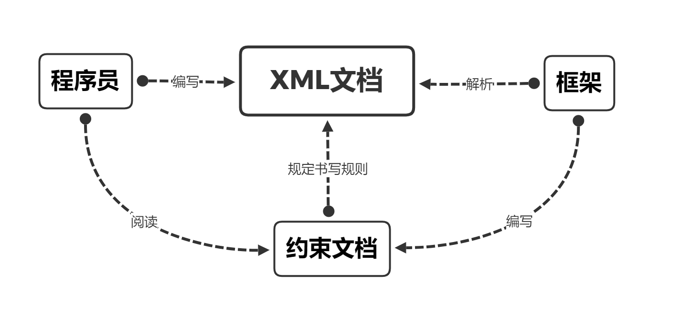
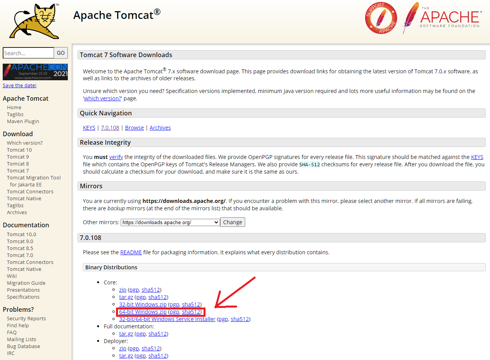
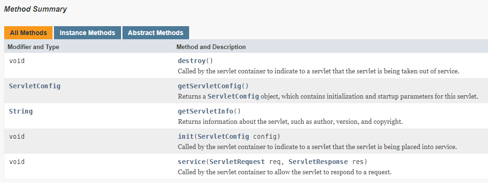
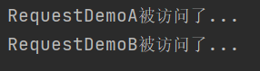
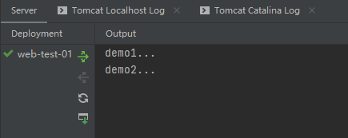
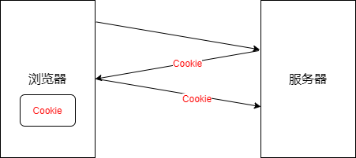
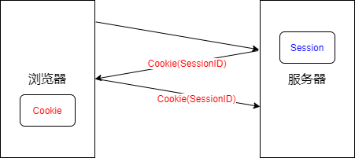

# 第一部分 前端语言

## 第1节 HTML基础

### 1 简介

HTML（Hyper Text Markup Language）：超文本标记语言

文本

超文本

htm是老的命名规范，html是新的

标签+内容体+/标签

空标签，例如`</br>`可以起到换行的作用

html标签不区分大小写

```html
<html>
	<head>
		<title> I am the title</title>
	</head>
	<body>
		<font color="red">Hello, world!</font>
	</body>
</html>
```


html建议**包裹嵌套**，不建议**交叉嵌套**

`size`大小

`color`色彩

`face`字体

```html
<!DOCTYPE html>
<html>
	<head>
		<meta charset="utf-8" />
		<title></title>
	</head>
	<body>
		<h1 align="center">静夜思</h1>
		<p align="center">李&nbsp;&nbsp;&nbsp;白</p></br>
		<p align="center">床前明月光，</p>
		<p align="center">疑是地上霜。</p>
		<p align="center">举头望明月，</p>
		<p align="center">低头思故乡。</p>
		<!--这是一行注释-->
	</body>
</html>
```


### 2 图片标签

``

`src`指明图片的路径（必有属性）

`width`宽度

`height`高度

设置方式：

- 像素设置（固定设置方式）
- 百分比设置（动态改变）


### 3 列表标签

- 无序列表`ul`
- 有序列表`ol`

`href`超链接跳转的路径


### 4 表格标签

1. 定义一个表格`<table></table>`
2. 定义表格中的一行`<tr></tr>`
3. 定义表格一行中定义单元格`<td></td>`

`border`边框

`<tr>`表头单元格，居中加粗

**单元格的合并：**

- 跨列合并`colspan`
- 跨行合并`rowspan`

块标签`<div></div>`展示大量信息，默认占一行

块标签`<span></span>`展示少量信息，有多少内容就占用多大空间


### 5 表单标签

`<form></form>`

表单输入项：

1. 输入项标签`<input/>`
   - `type`设置该标签的种类
   - `name`
   - `value`
   - 提交之后会生成参数列表
2. 选择框标签`<select/>`
   - `option`选项
   - `seleted`默认选中项
3. 文本域标签`<textarea></textarea>`

```html
<!DOCTYPE html>
<html>
	<head>
		<meta charset="utf-8">
		<title>form test</title>
	</head>
	<body>
		<from>
			用户名：<input type="text" name="username"/><br />
			密码：<input type="password" name="password"/><br />
			性别：<input type="radio" name="gender" value="male"/>男
				<input type="radio" name="gender" value="female"/>女
			<br />
			<input type="submit" value="登录"/>
		</from>
	</body>
</html>
```

`action`提交目的地：

- 默认本页
- 本机内网路径
- 互联网路径

`method`将数据以何种方式提交

- `get`把参数列表拼接到地址栏后，信息不安全，数据量有限
- `post`请求体，相对安全，理论上数据量无限


### 6 URL编码

保证提交表单时参数列表的数据完整性

**URL编码步骤：**

1. 普通编码，使用页面规定的字符集
2. 每一个元素从10进制转为16进制
3. 把已经转为16进制的字节数组以%进行拼接


## 第2节 CSS基础

### 1 简介

CSS（Cascading Style Sheets）：层叠样式表

HTML用来编写页面结构，CSS用来美化页面

在`<style>`标签内容体中书写css样式代码
`<style>`标签放置在`<head>`标签中

```html
<!DOCTYPE html>
<html>
	<head>
		<meta charset="utf-8">
		<title></title>
		<style>
			span{
				font-size:120px;
				color:red;
				border: 5px solid blue;
			}
		</style>
	</head>
	<body>
		<span>1111111111</span>
		<span>2222222222</span>
	</body>
</html>
```


### 2 CSS选择器

元素选择器

类选择器（.类名）

ID选择器（#ID）

ID在一个页面必须唯一

选择器层级关系


### 3 CSS样式

**边框属性：**

- `border`
- `width`
- `height`
- `background-color`背景颜色#红绿蓝

**布局：**浮动`float`

**转换：**`display`属性可以使得元素在行内元素和块元素之间相互转换

块元素：自动换行（常见的如`<h1>, <p>, <div>, <ul>`等）
行内元素：不会自动换行（常见的如`<span>, <a>`等）

- `block`转换为块元素
- `inline`转换为行内元素
- `none`

**字体：**

- `font-size`设置字体大小
- `color`设置字体颜色


### 4 CSS盒子模型

所有的HTML元素都可以看成一个四边形（盒子）

- 边框`border`
- 内边距`padding`
- 外边距`margin`


### 5 CSS和HTML的结合方式

1. 内部样式
   - 行内样式
   - `<style>`标签
2. 外部样式
   - `<link/>`引入.css文件
   - 适合不同页面进行样式复用


## 第3节 JavaScript基础

### 1 简介

JavaScript是Web上强大的脚本语言，是一种基于对象（Object-Based）和事件驱动（Event-Driven）的编程语言

JavaScript的组成：

- ECMAScript核心：规定了JS的语法和基本对象
- DOM文档对象模型：处理网页内容的方法和接口
- BOM浏览器的对象模型：与浏览器交互的方法和接口


### 2 语法及规则

内部脚本`<script></script>`

外部引入`<script src="">`引入.js文件

```html
<!DOCTYPE html>
<html>
	<head>
		<meta charset="utf-8">
		<title>JSTest</title>
		<script src="javascript1.js"></script>
		<script>
			alert("标签内部的你好");
		</script>
	</head>
	<body>
	</body>
</html>
```

javascript1.js

```javascript
alert("你好");
```


script标签理论上可以放置在html代码中的任何位置
开发规范规定，script标签的放置位置为：`</body>`标签前

注释方式跟Java一致

```javascript
var a;//默认值undefined
var a = 10;//赋值
//JavaScript严格区分大小写
```


**数据类型：**

- 基本数据类型
  - string 字符串类型（JavaScrip中没有单个字符，单引号和双引号使用效果一样）
  - boolean 布尔类型
  - number 数字类型
  - null 空
  - undefined 未定义类型（undefined==null）
- 引用数据类型：在JS中都是对象

```javascript
//引用数据类型声明方式
var str = new String();
var str = new String;
```


**运算符：**

== 逻辑等，仅仅对比值

=== 全等，**对比值并且对比类型**


**正则对象**

```javascript
var reg = new RegExp("表达式");//方式一
var reg = /^表达式$/;//方式二：直接量方式
```

test方法

直接量方式和普通方式的对比


JS数组可以看做Java中的ArrayList集合

```javascript
//JavaScript数组的创建方式
var arr = [1, 2, 3, "a", true];
var arr = new Array();
var arr = new Array(4);
var arr = new Array("a", "b", true);
```


JS数组常用方法：

`length()`

`join()`

`pop()`

`push()`

`reverse()`


全局函数

`eval()`方法


URL编码

`encode()`编码

`decode()`解码

URL和URI的区别


**字符串转数字**

- 转int `parseInt()`
- 转float `parseFloat()`


**自定义函数**

```javascript
// 举例，定义一个求a，b之和的函数
function getSum(a, b) {
    return a + b;
}
```


JS没有方法重载


**定义对象**

```html
<!DOCTYPE html>
<html>
	<head>
		<meta charset="utf-8">
		<title></title>
		<script>
			//对象直接量创建对象
			var person = {name:"Alice", age:18};
			alert(person.name);
			alert(person.age);
			person.name="Betty";
			alert(person.name);
		</script>
	</head>
	<body>
	</body>
</html>
```


### 3 BOM对象

BOM（Browser Object Model）：浏览器对象模型

一般情况下，window代表了BOM对象

**消息框：**

- `alert()`警告框
- `confirm()`确认框
  - 点击确定--->返回true
  - 点击取消--->返回false

**定时器：**

`setInterval()`设置循环定时器

`clearInterval(ID)`清除循环定时器

`setTimeout()`设置一次性定时器

`clearTimeout(ID)`清除一次性定时器

**location对象**

href：设置或返回完整的URL

`location.href()=xxx.html`设置URL跳转


### 4 DOM对象

DOM（Document Object Model）：文档对象模型

DOM树

一个HTML文档加载到内存中就会形成一个DOM对象

```html
<!DOCTYPE html>
<html>
	<head>
		<meta charset="utf-8">
		<title></title>
	</head>
	<body>
		<input type="text" id="t1" value="你好" />
		<script>
            // 获取对象value并修改
			var t1=document.getElementById("t1");
			alert(t1.value);
			t1.value="你好么";
		</script>
	</body>
</html>
```

value

className

checked

innerHTML获取或设置对象的内容体


### 5 JS事件

**JS事件驱动机制：**

- 事件源
- 事件
- 监听器
- 注册/绑定监听器

点击事件`onclick`

焦点事件：

- 一个页面默认只有一个焦点
- 焦点是用户的关注点或正在操作的组件
- 获取焦点事件`onfocus`
- 失去焦点事件`onblur` 

域内容改变事件`onchange`

- 元素组件的值改变时触发

加载完毕事件`onload`

- 对象（或标签）加载完毕后触发指定函数

表单提交事件`onsubmit`

- 表单按钮被点击后触发
- 表单提交`onsubmit="run()"`
- 表单校验`onsubmit="return run()"`，为`true`则返回

键位弹起事件`onkeyup`

鼠标移入事件`onmouseover`

鼠标移出事件`onmouseout`

元素事件句柄绑定：

- 绑定无参/有参函数
- 绑定多个函数

DOM绑定方式：

```javascript
// 方式一
window.onload=run1;
// 方式二
window.onload=function() {
    run1();
    run2();
    run3();
};
```


# 第二部分 前端框架

## 第1节 BootStrap

### 1 概述

BootStrap是基于HTML、CSS、JavaScript的前端框架

该框架已经预定义了一套CSS样式和与样式对应的JS代码，开发人员只需要编写HTML结构，添加BootStrap固定的class样式，就可以轻松完成指定效果的实现

BootStrap支持**响应式开发**，解决了移动互联网前端开发问题

**响应式布局**


### 2 BootStrap的环境搭建

参考资料：[BootStrap中文文档](https://v3.bootcss.com/)

**步骤：**

1. 创建JavaWeb项目
2. 复制下述其一至项目路径中
   - bootstrap预编译包中的css、js文件夹
   - bootstrap源码的dist路径下的css、js文件夹
3. 复制jquery.min.js文件
4. 修改html代码中的相应路径：
   - `<link href="../css/bootstrap.min.css" rel="stylesheet">`
   - `<script src="../js/jquery.min.js"></script>`
   - `<script src="../js/bootstrap.min.js"></script>`


### 3 布局容器

BootStrap至少需要一个布局容器

*布局容器相当于一个画板*

*推荐div*

常用布局容器：

1. container：居中，两端有留白
2. container-fluid：占据视口全部宽度


### 4 栅格系统

栅格系统将一行分为12列

栅格系统使开发人员更容易进行页面布局

基本书写方式：容器（container）---行（row）---列（col）
可以列-行-列-行-列...嵌套布局

响应式开发

| col  | 对应屏幕尺寸 |
| ---- | ------------ |
| lg   | PC大屏       |
| md   | PC小屏       |
| sm   | 平板屏幕     |
| xs   | 智能手机     |

如果设置了一个屏幕尺寸，比这个尺寸大的屏幕继承当前设置；比这个尺寸小的屏幕默认一个元素占一行（这意味着最简单的办法是直接设置一个xs尺寸，如`col-xs-4`）

列偏移`offset`

列表

按钮

导航条

轮播图

排版对齐方式

表单元素

分页条


# 第三部分 WEB

## 第1节 Web概述

### 1 Web的概念

WEB（World Wide Web）：全球广域网

JavaWeb：使用Java语言进行Web的开发


### 2 软件架构

**CS结构：**Client/Server客户端和服务器

- CS结构的软件往往需要安装
- 可以减轻服务器压力
- 分布式开发比较弱

**BS结构：**Browser/Server浏览器和服务器

- BS结构的软件不需要安装
- 分布式能力强
- 界面效果不如CS结构


### 3 WEB服务器

硬件：其实就是一台计算机

软件：需要安装web服务器的软件

常见的web服务器：

- Tomcat：开源，免费
- WebSphere：收费
- WebLogic：收费
- IIS：应用在.NET平台上
- Apache：应用在PHP平台上

WEB开发中的资源：

- 静态web资源：
  - HTML
  - CSS
  - JS
- 动态web资源：
  - Servlet、JSP
  - PHP
  - ASP


## 第2节 XML

### 1 XML概述

XML概念：可扩展标记语言（Extensible Markup Language）

*可扩展：标签都是自定义的*

xml由w3c（万维网联盟）制定，最初为替代html诞生


.properties格式：

```properties
name=Allen
age=21
gender=male

anem=Betty
age=23
gender=female
```

properties文件侧重**展示数据**

.xml格式：

```xml
<user id = '1'>
    <name>Allen</name>
    <age>21</age>
    <gender>male</gender>
</user>

<user id = '2'>
    <name>Betty</name>
    <age>23</age>
    <gender>female</gender>
</user>
```

xml文件侧重**存储数据**


xml文件功能：

1. 作为配置文件
2. 在网络中传输


### 2 XML语法

xml文档基本语法：

1. 后缀名.xml
2. 第一行必须写文档声明
3. xml文档有且只有一个根标签
4. 属性值必须使用单引号或双引号包起来
5. 标签必须正确闭合
6. xml标签区分大小写

xml文件格式演示：

```xml
<?xml version='1.0' encoding='utf-8' standalone='yes' ?>

<users>
    <user id='1'>
        <name>Allen</name>
        <age>21</age>
        <gender>male</gender>
        <br/>
    </user>
    
    <user id='2'>
        <name>Betty</name>
        <age>23</age>
        <gender>female</gender>
    </user>
</users>
```

编码方式默认ISO-8859-1

`standalone` 是否独立（`yes`表示不依赖其他文件）

> xml标签命名规则：
>
> - 名称可以包含字母、数字以及其他的字符
> - 名称不能以数字或者标点符号开始
> - 名称不能以字母 xml（或者 XML、Xml 等等）开始
> - 名称不能包含空格

xml文档属性：id属性值唯一

CDATA区的数据会被原样展示。格式：`<![CDATA[数据]]>`

约束：规定XML文档的书写规则



常见的格式约束文档有DTD、Schema等
引入方式：本地引入或网络引入

引入DTD（.dtd）文档`<!DOCTYPE students SYSTEM "sutdent.dtd">`

引入Schema（.xsd）文档


### 3 操作XML文档

**操作xml文档的方式：**

1. 解析（读取）：将文档中的数据读取到内存中
2. 写入：将内存中的数据保存到xml文档中

**解析xml的方式：**

1. DOM：将标记语言文档一次性加载进内存，在内存中形成一棵DOM树
2. SAX：逐行读取，基于事件驱动的

xml常见的解析器：JAXP，DOM4J，Jsoup，PULL

**Jsoup使用步骤：**

1. 导入jar包
2. 获取xml文件的path
3. 根据path解析xml文档，获取Document对象
4. 通过Document对象获取Element元素对象

**相关对象的使用：**

1. Jsoup：工具类，`parse()`方法可以解析html或xml文档，返回Document
2. Document：文档对象，代表内存中的DOM树
3. Elements：元素Element对象的集合，继承了ArrayList类
4. Element：元素对象
5. Node：节点对象，是Document和Element的父类


```java
// parse(URL url, int timeoutMillis)
// 通过网络路径获取指定的html或xml文档对象
URL url = new URL("http://xxx.xxx.xxx"); //代表网络中的一个资源路径
Document document = Jsoup.parse(url, 10000);
System.out.println(document);
```


快捷查询方式：

1. selector：选择器

   Elemetn类中`select()`方法

2. XPath：XML路径语言

   需要另外导入jar包，参考说明文档使用XPath的语法查询


## 第3节 Tomcat

### 1 Tomcat概述

Tomcat是Apache的Jakarta项目中的一个开源项目，纯Java编写

Tomcat就是一个Web服务器

官网：http://tomcat.apache.org

推荐下载版本7.x（Maven插件对8.x以上版本支持不好）



安装步骤：官网下载，解压，启动startup.bat

测试是否Tomcat正常运行：打开浏览器输入localhost:8080/

安装前提：

1. JRE正确配置（JAVA_HOME环境变量）
2. 8080端口没被占用（在Tomcat路径下\conf\server.xml可以修改默认端口号）


### 2 Tomcat的目录结构

Tomcat安装路径目录结构：

\bin\ 二进制文件

\conf\ 配置文件

\lib\ Tomcat需要的jar包

\logs\ 服务器日志文件

\temp\ Tomcat运行产生临时文件

\webapps\ 需要发布的项目放在该路径下

\work\ JSP翻译（编译）成Servlet产生的代码

**动态web资源目录结构：**

website

​		|------静态页面

​		|------JSP页面

​		|------WEB-INF

​				|------web.xml（必须有的）

​				|------classes

​				|------lib


### 3 Tomcat的项目发布方式

**方式一：直接将项目复制到tomcat\webapps\ **


**方式二：配置Tomcat的虚拟路径**

> 虚拟路径：配置一个名称与一个真实的路径进行绑定，然后访问这个名称从而找到真实路径。

在tomcat\conf\server.xml中进行配置

docBase：项目的根路径

path：虚拟路径

```html
<Host>
    <Context path="/test" docBase="E:\test1"></Context>
</Host>
```


**方式三（推荐）：在tomcat\comf\Catalina\localhost创建xml文件**

```xml
<?xml version='1.0' encoding='utf-8'?>
<Context docBase="E:\test1"/>
```


### 4 Tomcat虚拟主机的配置

网站访问的过程：在本地hosts文件中查找域名是否有匹配的IP地址，没有就去DNS服务器查找*（全世界DNS服务器大接力）*

> 虚拟主机：在电脑上设置一个目录，使用一个名称与该目录进行绑定，这个路径称为虚拟主机。主机是可以发布web项目的。

步骤：

1. 创建一个路径

2. 修改\tomcat\conf\server.xml，添加一段`<Host></Host>`，格式举例：

   ```xml
   <!--虚拟主机的配置-->
   <Host appBase="E:\test" autoDeploy="true" name="www.baidu.com" unpackWARs="true">
       <Value className="org.apache.catalina.valves.AccessLogValue" directory="logs" pattern="%h %l %u %t &quot;%r&quot; %s %b" prefix=:localhost_access_log." suffix=".txt"/>
       <!--虚拟路径的配置-->
       <Context path="/" docBase="test"/>
   </Host>
   ```

3. 打开C:\Windows\System32\drivers\etc\hosts，添加IP地址和对应域名

4. 在\tomcat\conf\web.xml可以修改默认主页

   ```xml
   <welcome-file-list>
           <welcome-file>index.html</welcome-file>
           <welcome-file>index.htm</welcome-file>
           <welcome-file>index.jsp</welcome-file>
       	<welcome-file>test.html</welcome-file>
   </welcome-file-list>
   ```


### 5 在IDE中配置Tomcat

**在Eclipse中配置Tomcat：** 

*Window*--->*Server*--->*Runtime Environments*--->*Add...*--->正确选择Tomcat的安装目录--->*Finish*
之后每次创建Dynamic Web Project的时候注意选择Tomcat作为*Server runtime environment*并勾选*Gernerate web.xml deployment descriptor*即可


**在IDEA中配置Tomcat：**

[IDEA添加Tomcat](https://blog.csdn.net/wsjzzcbq/article/details/89463304)


## 第4节 HTTP协议

### 1 HTTP协议概述

HTTP（HyperText Transfer Protocol）：超文本传输协议

规定了浏览器和服务器端的数据交互格式

**特性：**

- 基于TCP/IP的高级协议
- 默认端口号：80
- 基于**请求**和**响应**模型
  - 先有请求后有响应
  - 请求和响应必须成对出现
- 无状态的：每次请求之间相互独立，不能交互数据
- 简单快捷：发送请求=请求方式+请求路径
- 可扩展的：在HTTP/1.0中出现的HTTP headers让协议扩展变得非常容易，只要服务端和客户端就新headers达成语义一致，新功能就可以被轻松加入进来

**版本：**

- HTTP1.0：
  - 每一次请求响应结束后断开连接
  - 定义了三种请求方法： GET, POST 和 HEAD方法
- HTTP1.1:
  - 复用连接，长时间未响应则断开连接
  - 新增了五种请求方法：OPTIONS, PUT, DELETE, TRACE 和 CONNECT 方法


### 2 HTTP协议的消息结构

HTTPWatch：IE浏览器上的抓包分析工具

HTTP1.1有7种请求方式，其中常用的方法：

1. GET
   - 用于请求资源
   - 请求参数在请求行中，位于url后
   - 请求的url长度有限制
2. POST
   - 用于将实体提交到指定的资源位置
   - 请求参数在请求体中
   - 请求的url长度没有限制
3. PUT
   - 用于替换目标资源


请求消息结构：请求行+请求头+请求体

- 请求行=请求方式+请求路径+协议版本

  如`POST /web test/demo.html?id=123 HTTP1.1`

  GET有大小限制，POST没有大小限制

- 请求头=key+value

  常见请求头：

  1. User-Agent：浏览器信息
  2. Referer：当前请求的来源地

- 请求体：只有POST请求方式才有请求体

*请求头和请求体之间有一个请求空行*


响应消息结构：响应行+响应头+响应体

- 响应行
  - 如`HTTP/1.1 200 OK`
  - 组成：协议/版本 响应状态码 状态码描述
  - 常见状态码：
    - 200：代表响应成功
    - 302：需要进行重定向操作
    - 304：需要查找本地缓存
    - 404：请求资源不存在
    - 500：服务器内部错误
- 响应头
  - 一个key对应一个value或多个value
  - 常见响应头：
    - Content-Type：服务器告诉客户端本次响应体数据格式以及编码格式
    - Content-Disposition：服务器告诉客户端以什么格式打开响应体数据
- 响应体
  - 就是显示到浏览器上页面的代码

*响应头和响应体之间也有一个请求空行*


## 第5节 JSON

### 1 JSON概述

JSON（JavaScript Object Notation）：JavaScript对象表示法

JSON可以对Java数据进行封装，现在多用于存储和交换文本信息的语法

JSON比XML更小、更快、更易解析

> JSON 独立于语言：JSON 使用 Javascript语法来描述数据对象，但是 JSON 仍然独立于语言和平台。JSON 解析器和 JSON 库支持许多不同的编程语言。 目前非常多的动态（PHP，JSP，.NET）编程语言都支持JSON。

Java对象--->JSON字符串--->JS对象

常用于异步请求中


### 2 JSON语法

在JSON中，值必须是一下数据类型之一：

- 字符串（由双引号括起来）
- 数字（整数或浮点数）
- 对象（JSON对象，由大括号括起来）
- 数组（由中括号括起来）
- 布尔（true或false）
- null

JSON数据由**键值对**构成，即名称/值对；键值对由逗号隔开

如 `var person = {"name": "Alice", "age": 21, "gender": female}`

获取数据的方式：

- json对象.键
- json对象["键"]
- 数组对象[索引]


### 3 JSON使用

> JSON和XML最大的不同：XML 需要使用 XML 解析器来解析，JSON 可以使用标准的 JavaScript 函数来解析。
>
> - `JSON.parse()`：将一个JSON字符串转换为JavaScript对象
> - `JSON.stringify()`：将JavaScript值转换为JSON字符串

互联网传输中：Java对象<--->JSON

JSON解析器：Jsonlib，Gson，fastjson，jackson


Java对象转换JSON：

1. 导jackson包
2. 创建jackson核心对象ObjectMapper
3. `writeValue()` 或 `writeValueAsString()` 转换

注解：

- `@JsonIgnore` 忽略该属性
- `@JsonFormat` 属性值格式化


JSON转Java对象：ObjectMapper类的`readValue()`方法


# 第四部分 Servlet

## 第1节 Servlet

### 1 Servlet概述

Servlet（server applet）：一个运行在web服务器上的小型Java程序，用于处理从web客户端发送的请求并对请求作出响应。

Servlet就是一个**接口**，定义了Java类被浏览器访问到（Tomcat识别）的规则。

[Java EE 8 API](https://javaee.github.io/javaee-spec/javadocs/)

Servlet接口的方法（一共5个）：



使用Servlet的步骤：

1. 编写一个Java类实现Servlet接口
2. 在这个类中重写`service()`方法
3. 在web.xml中配置这个类
   - Servlet：名称，全路径
   - 映射：名称，访问路径

```xml
<?xml version="1.0" encoding="UTF-8"?>
<web-app xmlns="http://xmlns.jcp.org/xml/ns/javaee"
         xmlns:xsi="http://www.w3.org/2001/XMLSchema-instance"
         xsi:schemaLocation="http://xmlns.jcp.org/xml/ns/javaee http://xmlns.jcp.org/xml/ns/javaee/web-app_4_0.xsd"
         version="4.0">

    <servlet>
        <servlet-name>servlet1</servlet-name>
        <servlet-class>com.lxy.web.servlet.ServletDemo1</servlet-class>
    </servlet>
    
    <servlet-mapping>
        <servlet-name>servlet1</servlet-name>
        <url-pattern>/servlet1</url-pattern>
    </servlet-mapping>

</web-app>
```


**浏览器访问顺序：**url--->映射访问路径（url-pattern）--->映射名称（servlet-name）--->Servlet名称（servlet-name）--->Servlet全类名（servlet-class）--->Tomcat将全类名对应的字节码对象加载进内存`Class.forName()`--->创建对象`cls.newInstance()`--->调用`service()`方法


Servlet3.0及以上支持注解配置，可以不创建web.xml；在Servlet的实现类前加`@WebServlet(资源路径)`即可


### 2 Servlet的生命周期

**初始化：**Servlet对象被实例化时执行`init()`

- 在web.xml中`<servlet>`标签下，`<load-on-start-up>`为负数代表Servlet第一次被访问时创建（默认情况）
- `<load-on-start-up>`为非负数代表Servlet在服务器启动时创建
- `init()`方法只执行一次说明**Servlet是单例的**

**提供服务：**任何一次客户端请求即执行`service()`

**销毁：**从服务器中移出或者服务器关闭的时候执行`destroy()`方法，然后垃圾收集器会回收掉Servlet对象

Servlet接口中的其他方法：

`getServletConfig()` 获得Servlet对象

`getServletInfo()` 获得Servlet的一些信息，如版本，作者等等


### 3 Servlet的实现关系

Servlet接口

​		|---GenericServlet抽象类：通用

​				|---HttpServlet抽象类：封装了HTTP协议

GenericSeervlet类有`getServletConfig()`方法和`getServletContext()`方法

HttpServlet类有`doGet()`方法，`doPost()`方法对应GET请求和POST请求；HttpServlet类实现了判断请求方式，自动调用`doGet()`或`doPost()`等方法，所以只需要定义类继承HttpServlet类并重写`doGet()`和`doPost()`即可


ServletConfig一个接口，用于获取Servlet相关信息

一个Servlet可以定义多个访问路径


## 第2节 Request对象

### 1 API介绍

Request对象和Response对象是**由服务器创建的**

Request对象是来**获取请求消息**，Response对象是来**设置响应消息**


**Request对象继承体系结构：**

ServletRequest接口

​		|---HttpServletRequest接口

​				|---org.apach.catalina.connector.RequestFacade类（Tomcat）


**获取请求行数据的方法：**

`getMethod()` 获得请求的方式（如GET）

`getContextPath()` 获取虚拟目录

`getServletPath()` 获取Servlet路径

`getQueryString()` 获得请求路径后的提交参数的字符串

`getRequestURI()` 获取请求URI

`getRequestURL()` 获取请求URL

`getProtocaol()` 获取协议及版本（如HTTP1.1）

`getRemoteAddr()`获得客户端IP地址

**获取请求头数据的方法：**

`getHeader()` 获得一个key对应一个value的请求头

`getHeaders()` 获得一个key对应多个value的请求头

`getHeaderNames()` 获取所有的请求头名称

**获取请求体数据的方法：**

1. 获取流对象
2. 从流对象中拿数据

`getReader()` 获取输入字符流

`getInputStream()` 获取输入字节流

**其他常用方法：**

`getParameter()` 获得提交的参数（一个name对应一个value）

`getParameterValues()` 获得提交的参数（一个name对应多个value）

`getParameterNames()` 获取所有请求的参数名称

`getParameterMap()` 将提交的参数和对应的值存入到一个Map集合中

`getServletContext()` 获取ServletContext

`setAtrribute()` 向Request域中存储数据

`getAttribute()` 向Request域中获取数据

`removeAttribute()` 从Request域中移出数据

> **域对象：**一个有作用范围的对象，可以在范围内<u>共享数据</u>
>
> **request域：**代表一次请求的范围，一般用于请求转发的多个资源中<u>共享数据</u>


### 2 请求转发

请求转发：一种在服务器内部的资源跳转方式

**请求转发的特点：**

1. 浏览器地址栏路径不发生变化
2. 只能转发到当前服务器内部资源中
3. 转发是一次请求

请求转发代码演示：

RequestDemoA.java

```java
package com.lxy.request;

import javax.servlet.*;
import javax.servlet.http.*;
import javax.servlet.annotation.*;
import java.io.IOException;

@WebServlet(name = "RequestDemoA", value = "/requestdemoa")
public class RequestDemoA extends HttpServlet {
    @Override
    protected void doGet(HttpServletRequest request, HttpServletResponse response) throws ServletException, IOException {
        this.doPost(request, response);
    }

    @Override
    protected void doPost(HttpServletRequest request, HttpServletResponse response) throws ServletException, IOException {
        System.out.println("RequestDemoA被访问了...");
        request.getRequestDispatcher("/requestdemob").forward(request, response);
    }
}
```

RequestDemoB.java

```java
package com.lxy.request;

import javax.servlet.*;
import javax.servlet.http.*;
import javax.servlet.annotation.*;
import java.io.IOException;

@WebServlet(name = "RequestDemoB", value = "/requestdemob")
public class RequestDemoB extends HttpServlet {
    @Override
    protected void doGet(HttpServletRequest request, HttpServletResponse response) throws ServletException, IOException {
        this.doPost(request, response);
    }

    @Override
    protected void doPost(HttpServletRequest request, HttpServletResponse response) throws ServletException, IOException {
        System.out.println("RequestDemoB被访问了...");
    }
}
```

运行Tomcat，浏览器地址栏输入http://localhost:8080/webtest01/requestdemoa

Server-Output输出：




## 第3节 BeanUtils

### 1 BeanUtils简介

BeanUtils工具类，简化数据封装，用于封装JavaBean

> commons-beanutils 是apache commons子项目中的一个软件包，其主要目的是利用反射机制对 JavaBean 的属性进行处理。

导包`import org.apache.commons.beanutils.BeanUtils;`

*可以简化Servlet的编写*


### 2 JavaBean

**JavaBean：**标准的Java类，满足以下条件：

1. 类必须被public修饰
2. 必须提供空参的构造器
3. 成员变量必须使用private修饰
4. 提供公共setter和getter方法

功能：封装数据

概念：

- 成员变量
- 属性：setter和getter方法截取后的产物

方法：

- `setProperty()` 设置JavaBean的属性
- `getProperty()` 获取JavaBean的属性
- `populate(Object obj, Map map)` 将map集合的键值对信息封装到对应的JavaBean对象中


## 第4节 Response对象

### 1 API介绍

功能：设置响应消息


**设置响应行的方法：**

`setStatus()` 设置响应状态码

**设置响应头的方法：**

set系列方法：一个key对应一个value的情况

add系列方法：一个key对应多个value的情况

**设置响应体的方法：**

`getOutputStream()` 获得字节流

`getWriter()` 获得字符流

**其他常用方法：**

`setRedirect()` 重定向*（资源跳转的方式）*

`setHeader()` 设置浏览器默认打开的时候采用的字符集

`setCharacterEncoding()` 设置响应字符流缓冲区的字符集

`setContentType()` 综合以上两方法的简化设置方法

`addCookie()` 服务器向浏览器回写Cookie


### 2 重定向

重定向使用步骤：

1. 设置状态码
2. 完成重定向

*重定向：访问一个页面自动跳转到另一个页面*

**重定向的特点：**

1. 地址栏发生变化
2. 访问其他站点的资源
3. 重定向是两次请求

*注意与请求转发的区别*

重定向代码演示：

ResponseDemo1.java

```java
package com.lxy.response;

import javax.servlet.*;
import javax.servlet.http.*;
import javax.servlet.annotation.*;
import java.io.IOException;

@WebServlet("/responsedemo1")
public class ResponseDemo1 extends HttpServlet {
    @Override
    protected void doGet(HttpServletRequest request, HttpServletResponse response) throws ServletException, IOException {
        this.doPost(request, response);
    }

    @Override
    protected void doPost(HttpServletRequest request, HttpServletResponse response) throws ServletException, IOException {
        System.out.println("demo1...");

        // 动态获取虚拟目录
        String contextPath = request.getContextPath();

        /*
        间接的重定向方式
        response.setStatus(302);
        response.setHeader("location", contextPath + "/responsedemo2");
        */

        // 直接的重定向方式
        response.sendRedirect(contextPath + "/responsedemo2");
    }
}
```

ResponseDemo2.java

```java
package com.lxy.response;

import javax.servlet.*;
import javax.servlet.http.*;
import javax.servlet.annotation.*;
import java.io.IOException;

@WebServlet("/responsedemo2")
public class ResponseDemo2 extends HttpServlet {
    @Override
    protected void doGet(HttpServletRequest request, HttpServletResponse response) throws ServletException, IOException {
        this.doPost(request, response);
    }

    @Override
    protected void doPost(HttpServletRequest request, HttpServletResponse response) throws ServletException, IOException {
        System.out.println("demo2...");
    }
}
```

在浏览器地址栏输入http://localhost:8080/webtest01/responsedemo1

Server-Output输出：




### 3 输出流

获取的流的默认编码是ISO-8859-1

输出字节流：

```java
// 设置流和消息体的编码格式
// 方式一：
//response.setCharacterEncoding("utf-8");
//response.setHeader("content-type", "text/html;charset=utf-8");
// 方式二：
response.setContentType("text/html;charset=utf-8");
ServletOutputStream outputStream = response.getOutputStream();
outputStream.write("<h1>Hello!你好！<h1>".getBytes("utf-8"));
// 流会自动更新，并会随response的结束而关闭，所以不需要flush和close
```

输出字符流：

```java
response.setContentType("text/html;charset=utf-8");
PrintWriter pw = response.getWriter();
pw.write("<h1>Hello!你好！</h1>");
```


## 第5节 ServletContext

### 1 ServletContext

一个接口，Servlet的上下文对象

服务器启动时自动为每个web项目创建一个**唯一的**ServletContext对象

ServletContext代表整个web应用，可以和程序的容器（如Tomcat）来通信

获取方式：

1. 通过request对象获取`request.getServletContext()`
2. 通过HttpServlet获取`this.getServletContext()`

作用：

- 获取文件的MIME类型 `getMimeType()`
- 共享数据（域对象）：ServletContext对象范围为所有用户所有请求的数据
- 获取文件的真实路径 `getRealPath()`

> MIME类型：在互联网通信过程中定义的一种文件数据类型
>
> 格式：大类型/小类型，如text/html，image/jpeg


## 第6节 会话技术

### 1 会话技术概述

一次会话中包含多次请求和响应

因为HTTP是**无状态的协议**，不同请求与响应间信息独立；会话技术就是用来在一次会话范围内的**多次请求间共享数据**

方式：

1. 客户端会话技术：Cookie
2. 服务器端会话技术：Session


### 2 Cookie技术

概念：将数据以Cookie对象的形式保存在客户端的会话技术

> HTTP Cookie（也叫Web Cookie或浏览器Cookie）是服务器发送到用户浏览器并保存在本地的一小块数据，它会在浏览器下次向同一服务器再发起请求时被携带并发送到服务器上。通常，它用于告知服务端两个请求是否来自同一浏览器，如保持用户的登录状态。Cookie使基于无状态的HTTP协议记录稳定的状态信息成为了可能。



使用步骤：

1. 创建Cookie对象，绑定数据

   `new Cookie(String name, String value)`

2. 发送Cookie对象

   `response.addCookie(Cookie cookie)`

3. 获取Cookie，拿到数据

   `Cookie[] request.getCookies()`

服务器端--->客户端响应头：`set-cookie`

Cookie的分类：

1. 默认级别的Cookie：存到内存中，**关闭即销毁**

2. 持久级别的Cookie：存到硬盘中，有**有效时长**

   设置有效时长`setMaxAge(int maxAge)`，设置为0相当于手动删除Cookie

浏览器存放的Cookie的**大小**和**数量**是有限制的


### 3 Session技术

概念：服务器为每一个用户的浏览器创建一个独享的Ssession对象

服务器开辟一片内存空间，对应唯一标识ID，在每次响应时将该ID返回给客户端



服务器端--->客户端响应头：`set-cookie: sessionID=xxx`

Session作为域对象，作用范围就是一次会话的范围


# 第五部分 Filter和Listener

## 第1节 Filter

### 1 Filter概述

Filter：过滤器

当访问服务器的资源时，过滤器可以将请求拦截下来，完成一些特殊的功能。如：登陆验证，统一编码处理，敏感字符过滤...

JavaWeb三大组件：Servlet，Filter，Listener

Filter使用步骤：

1. 定义一个类实现Filter接口
2. 重写方法
3. 配置拦截路径
   - 注解
   - web.xml


### 2 配置拦截路径

过滤器代码演示：

```java
package com.lxy.filter;

import javax.servlet.*;
import javax.servlet.annotation.WebFilter;
import java.io.IOException;

/**
 * 过滤器程序：使用注解配置拦截路径
 */
@WebFilter("/*")//代表访问所有资源之前，都会执行该过滤器
public class FilterDemo1 implements Filter {
    /**
     * 每一次请求被拦截时则执行该方法
     * @param servletRequest
     * @param servletResponse
     * @param filterChain
     * @throws IOException
     * @throws ServletException
     */
    @Override
    public void doFilter(ServletRequest servletRequest, ServletResponse servletResponse, FilterChain filterChain) throws IOException, ServletException {
        System.out.println("FilterDemo1被执行了...");
        // 放行
        filterChain.doFilter(servletRequest, servletResponse);
        System.out.println("FilterDemo2回来了...");
    }

    /**
     * 在服务器启动后即创建Filter并执行init方法
     * @param filterConfig
     * @throws ServletException
     */
    @Override
    public void init(FilterConfig filterConfig) throws ServletException {
        System.out.println("filter1 init...");
    }

    /**
     * 在服务器关闭时，Filter对象被销毁，若服务器正常关闭则执行destroy方法
     */
    @Override
    public void destroy() {
        System.out.println("filter1 destroy...");
    }
}
```

修改web.xml以配置拦截路径：

```xml
<?xml version="1.0" encoding="UTF-8"?>
<web-app xmlns="http://xmlns.jcp.org/xml/ns/javaee"
         xmlns:xsi="http://www.w3.org/2001/XMLSchema-instance"
         xsi:schemaLocation="http://xmlns.jcp.org/xml/ns/javaee http://xmlns.jcp.org/xml/ns/javaee/web-app_4_0.xsd"
         version="4.0">

    <filter>
        <filter-name>demo2</filter-name>
        <filter-class>com.lxy.filter.FilterDemo2</filter-class>
    </filter>
    <filter-mapping>
        <filter-name>demo2</filter-name>
        <!--拦截路径-->
        <url-pattern>/*</url-pattern>
    </filter-mapping>

</web-app>
```


**拦截方式配置：**

- 注解：设置dispatcherTypes属性
- web.xml


**过滤器链：**配置了多个过滤器时的执行顺序

请求到达时，若通过注解配置，按Filter类名字典序执行；若通过web.xml配置，按`<filter-mapping>`先后顺序执行。返回时类似于栈


### 3 动态代理

**代理模式**是一种设计模式

> 代理模式的定义：为其他对象提供一种代理以控制对这个对象的访问。在某些情况下，一个对象不适合或者不能直接引用另一个对象，而代理对象可以在客户端和目标对象之间起到中介的作用。

**代理模式实现方式：**

1. 静态代理：有一个类文件描述代理模式
2. 动态代理：在内存中形成代理类

**动态代理的实现步骤：**

1. 代理对象和真实对象实现**相同的接口**
2. 代理对象 `Proxy.newInstance()`
3. 使用代理对象调用方法
4. 增强方法
   - 增强参数列表
   - 增强返回值类型
   - 增强方法体执行逻辑


## 第2节 Listener

### 1 Listener概述

Listener：监听器

事件监听机制：

- 事件
- 事件源
- 监听器
- 注册监听：将事件、事件源、监听器绑定在一起

当**事件源**上发生某个**事件**后，执行**监听器**代码


ServletContextListener接口的方法：

`contextDestroyed()` ServletContext对象被销毁之前会调用该方法

`contextInitialized()` ServletContext对象创建后会调用该方法


Listener使用步骤：

1. 定义一个类实现Listener接口
2. 重写方法
3. 配置拦截路径
   - 注解
   - web.xml

