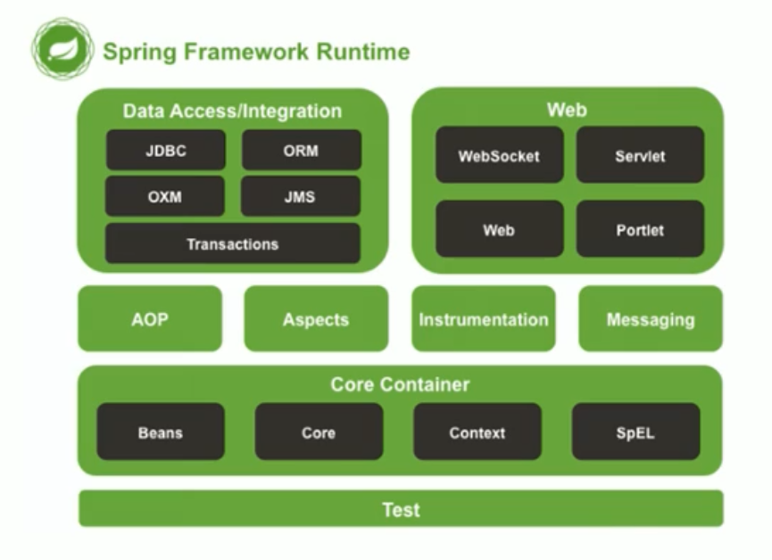

# 第一部分 Spring基础概念

## 1 Spring简介

Spring是分层的Java SE/EE应用full-stack轻量级开源框架，以**IoC**和**AOP（面向切面编程）**为内核

- 展现层：SpringMVC
- 持久层：Spring JDBCTemplate
- 业务层事务管理

**Spring的发展历程：**

1997年，IBM提出了EJB的思想

Rod Johnson（Spring之父）

2017年9月发布了Spring5.0（GA）

**Spring的体系结构：**

## 2 Spring快速入门

xml配置文件

`UserDao userDao = Spring客户端.getBean(id标识)`

步骤：

1. 导入Spring开发的基本包坐标
2. 编写Dao接口和实现类（创建Bean）
3. 创建Spring核心配置文件（创建applicationContext.xml）
4. 在配置文件中进行配置
5. 创建ApplicationContext对象getBean

## 3 Spring配置文件