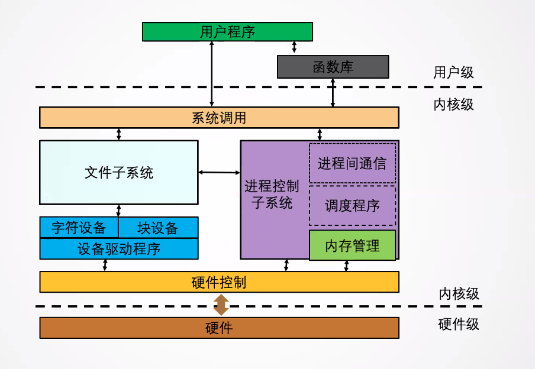
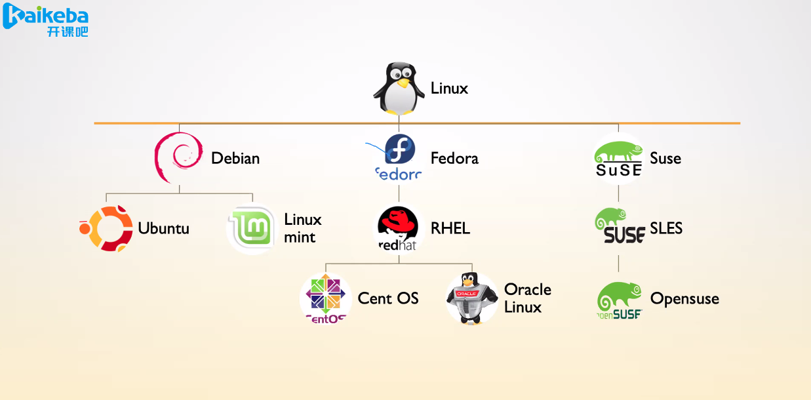
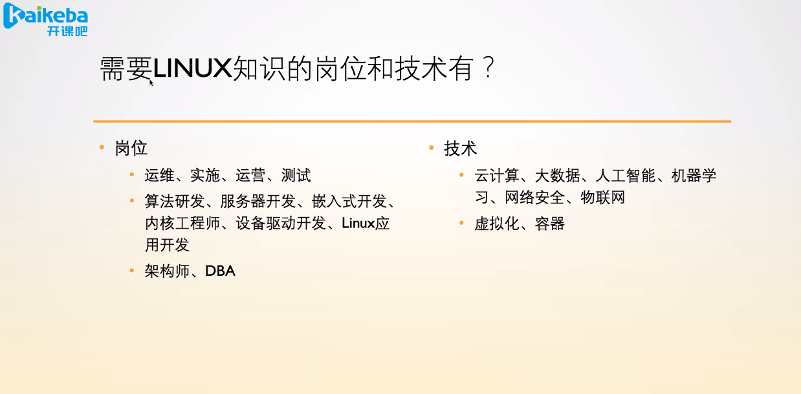
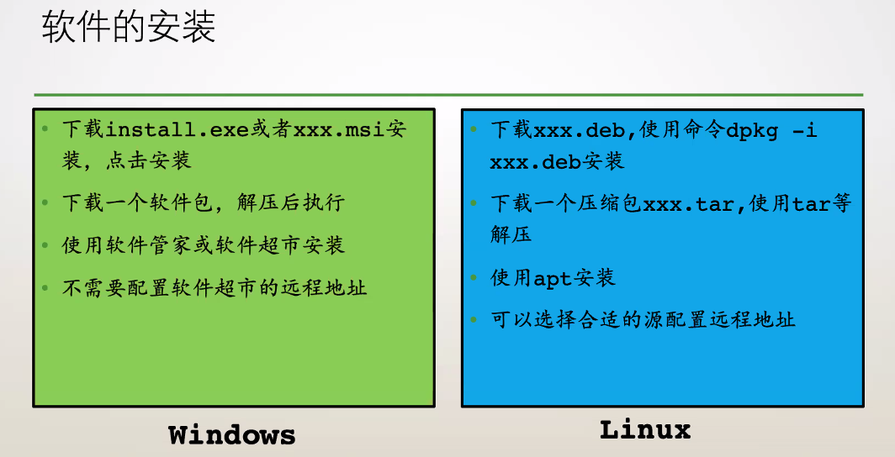
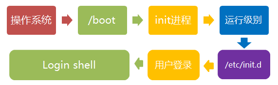

# 第一章 Linux背景介绍

*2020.9.15 课1*

操作系统结构：  


Linux分支：  


Linux应用广阔：  


---

*2020.9.17 课2*

> **不要**忽略屏幕输出，请**仔细看**系统给你的每一句回复。

软件的安装：  


源：类似于一个软件管家

## Linux常见命令

> 与软件安装相关的命令：
>
> - apt （软件管家）
> - apt update （同步软件信息：有哪些软件可用，哪些可以更新，哪些可以卸载）
> - apt upgrade （更新本地软件为最新版本）
> - apt-cache search XXX （搜索XXX软件）
> - apt remove XXX （卸载XXX软件）
> - dpkg -i xxx.deb （使用dpkg程序安装xxx.deb）（安装=install -> -i）
> - dpkg -r （使用dpkg卸载软件） （卸载=remove -> -r）

> 文件及目录相关命令：
>
> - ls （查看目录下内容）
> - cd （目录跳转）
> - pwd （打印工作目录）
> - cp （拷贝）
> - mv （移动文件及目录）
> - rm （删除文件及目录）
> - mkdir （创建目录）
> - tree （打印目录树）
> - tar （文件归档与压缩）
> - ln （创建连接文件）

> 文件内容的修改与查看：
>
> - touch （创建空白文件）
> - cat （查看文件内容）
> - vim （文本编辑器）
> - echo （打印文本）
> - more （分页查看文件）
> - less （分页查看文件）
> - head （查看文件头部）
> - tail （查看文件尾部）
> - diff （对比文件）
> - grep （检索信息）
> - wc （计数）

> 文件的查找与定位：
>
> - find （查找文件）
> - which （查找可执行文件）
> - whereis （查找可执行、源码、帮助手册）
> - locate （定位任何文件）

> 用户相关命令：
>
> - useradd （新建用户）
> - userdel （删除用户）
> - usermod （修改用户）
> - passwd （修改密码）
> - su （切换用户）
> - sudo （获取管理员权限）
> - chgrp （修改所属组）
> - chmod （文件权限修改）
> - chown （修改文件所属）
> - logout （退出用户）
> - exit （退出用户）

> 进程相关命令：
>
> - ps （打印进程）
>
> - kill （杀死进程）
>
> - pkill （批量杀死进程）
>
> - killall （批量杀死进程）
>
> - crotab （定时任务）
>
> - ctrl + z （挂起前台进程）
>
> - fg （将进程调至前台运行）
>
> - bg （让挂起的进程后台执行）
>
> - jobs （查看挂起和后台进程）

> 系统信息获取命令：
>
> - date （查看时间）
> - df （查看文件系统）
> - du （获取目录文件大小）
> - free （查看内存）
> - top （查看系统信息）
> - htop （查看系统信息）
> - dstat （查看系统信息）
> - nmon （查看系统信息）
> - ifconfig （查看IP信息）
> - uname （查看OS信息）
> - last （查看最近登录）
> - who （查看当前登录）

> 其他命令：
>
> - ssh
> - scp
> - wget
> - ping
> - poweroff （关闭计算机并切断电源）
> - reboot （重新启动计算机）

管道：|  （把前者的输出作为后者的标准输入）
输入`echo abc | ./a.out`这样就把abc输入给a.out  
或者输入`./a.out < abc`也能达到一样的效果（重定向）

`locate`：从database里查找文件

> Linux里**一切皆文件**


# 第二章 基本概念

*2020.9.19 课3*

## 文件类型

Linux共有7种文件类型

- -（普通文件）

  > Linux中最多的一种文件类型, 包括 纯文本文件(ASCII)；二进制文件(binary)；数据格式的文件(data);各种压缩文件.第一个属性为 [-]

- d（目录）

  > 就是目录， 能用 # cd 命令进入的。第一个属性为 [d]，例如 [drwxrwxrwx]

- l（符号链接）

  > 类似Windows下面的快捷方式。第一个属性为 [l]，例如 [lrwxrwxrwx]

- b（块设备）

  > 就是存储数据以供系统存取的接口设备，简单而言就是硬盘。例如一号硬盘的代码是 /dev/hda1等文件。第一个属性为 [b]

- c（字符设备）

  > 即串行端口的接口设备，例如键盘、鼠标等等。第一个属性为 [c]

- s（套接字）

  > 这类文件通常用在网络数据连接。可以启动一个程序来监听客户端的要求，客户端就可以通过套接字来进行数据通信。第一个属性为 [s]，最常在 /var/run目录中看到这种文件类型

- p（管道）

  > FIFO也是一种特殊的文件类型，它主要的目的是，解决多个程序同时存取一个文件所造成的错误。FIFO是first-in-first-out(先进先出)的缩写。第一个属性为 [p]


# 第三章 命令系统

*2020.9.19 课4*

- shell：一种命令解析器，它给用户提供了一个输入命令并接受机器返回结果的界面
- console：控制台
- terminal：终端。以前被称作teletypes(tty)

## 通配符

| 通配符                  | 含义                                     | 举例                                      |
| ----------------------- | ---------------------------------------- | ----------------------------------------- |
| ?                       | 代表单个任意字符                         | hellowor?d                                |
| *                       | 代表任意多个任意字符                     | he*rld                                    |
| [list]                  | 匹配list中的任意单一字符                 | a[xyz]b代表axb或ayb或azb                  |
| [!list]                 | 匹配除list中的任意单一字符               | a[!0-9]b代表a和b之间不能是0-9的数字       |
| [c1-c2]                 | 匹配c1-c2中的任意单一字符                | a[0-9]b代表a和b之间是0-9的其中一个数字    |
| {string1, string2, ...} | 匹配string1或string2（或更多）其一字符串 | a{abc, xyz, 123}b 代表aabcb或axyzb或a123b |

## 任务管理

> ;（顺序执行）  
> &&（与；前为真则执行后）  
> ||  （前为假则执行后）
> ``（命令替换符，优先执行中间的命令）  
> fg（前台）  
> bg（后台）  
> Ctrl + z（挂起，即保存现场，内存置换出外存）  
> kill（杀死进程）  
> pkill（批量杀死进程）

```
ls /etc1/ && echo "Success"
ls /etc1/ || echo "Failed"
```

## 管道与重定向

定向符
- `>` 重定向符（覆盖）
- `>>` 定向至末尾
- `<` 文件定向至命令（覆盖）
- `<<` 文件定向至命令末尾

转义符：忽略特殊字符的原有含义，把它们当作普通字符对待
- `\` 转义字符：使反斜杠后面的一个变量变为单纯的字符串
- `''` 硬转义：转义其中所有的变量为单纯的字符串
- `""` 软转义：保留其中的变量属性，不进行转义处理

管道
- `|` 如p1|p2代表将p1的标准输出作为p2的标准输入

Linux三剑客：`grep`, `sed`, `awk`


# 第四章 基本系统

*2020.9.22 课5*

## 系统启动

### 启动流程



开机→BIOS(检查固件是否完好等等)→MBR(读第一个分区)→GRUB(挂载虚拟文件系统)→Linux OS→RAM→/sbin/init(启动第一个进程)→Command Shell using getty→GUI

### 运行级别（run level）

- 0：系统关机
- 1：单用户模式，root权限，用于系统维护，禁止远程登陆
- 2：多用户，纯文本模式
- 3：完整的多用户纯文本模式
- 4：系统保留
- 5：X11控制台，在run level 3的基础上加载X windows
- 6：重启

**systemd方式**：提供了比UpStart更激进的**并行**启动能力，有**更快**的启动速度。  
*系统中所有进程都是由systemd进程克隆而来*

### 配置文件

全局配置文件  
用户配置文件

### 用户系统

- `/etc/passwd` 用户信息
- `/etc/shadow` 用户密码
- `/etc/group` 群组信息
- `/etc/gshadow` 群组密码
- `/etc/sudoers` sudoer列表

## Shell

如bash、zsh等；"sh"代表"shell"  
`vim .zshrc` 打开zsh的资源文件  
资源文件里的`source`表示配置环境  
先读全局配置再读个人配置(personal, individual)

## 软件安装

`vim /etc/apt/sources.list` 打开源路径（可修改源）  
`sudo apt update` 查看哪些软件可升级（更新缓存）  
`sudo apt upgrade` 升级软件  
`sudo apt install xxx` 安装xxx软件  
`sudo apt remove xxx` 卸载xxx软件

## 基本系统结构

### 目录结构

> root  
> /usr(用户)   /boot(开关机)   /dev(device装置)   /etc(全局目录)   /home(家目录)   /lib(库文件)   /media(媒体)   /mnt(mount挂载)   /opt(空)   /bin(binary可执行程序)   /sbin(system可执行文件)   /srv   /tmp(临时文件夹，用户只能删除自己创建的文件)   /var(动态数据，如日志、html)

挂载点：两个文件树，一个向另一个树挂载文件   
挂载相关命令`sshfs`（先安装sshfs）

#### 作业1

> 参考系统自带的`cat`实现自己的`cat`命令。  
>
> 1. 实现`-b`选项：输出文件，对空行不编号
> 2. 实现`-n`选项：输出文件，对所有行编号
> 3. 默认情况下：输出文件，不编号

```c
//实现cat命令
//命令格式：cat程序路径 要打开的文件路径 [-b|-n]
//格式举例：./a.out 1.c -b
#include <stdio.h>
#include <unistd.h>
#include <stdlib.h>
//cat_1函数默认输出不编号
void cat_1(const char *file) {
    char buff[1000];
    FILE *fp;
    if (!(fp = fopen(file, "r"))) {
        fprintf(stderr, "cannot open file.\n");
        exit(1);
    }
    while (fgets(buff, sizeof(buff), fp) != NULL) {
        printf("%s", buff);
    }
    return;
}
//cat_2函数输出文件，实现对空行不编号或者对所有行编号
void cat_2(const char *file, int b_swc, int n_swc) {
    int line_num = 0;
    char buff[1000];
    FILE *fp;
    if (!(fp = fopen(file, "r"))) {
        fprintf(stderr, "cannot open file.\n");
        exit(1);
    }
    if (n_swc && !b_swc) {
        while (fgets(buff, sizeof(buff), fp) != NULL) {
        	line_num++;
        	printf("%d %s", line_num, buff);
        }
    } else if (!n_swc && b_swc) {
        while (fgets(buff, sizeof(buff), fp) != NULL) {
            if (buff[0] != '\n') {
                line_num++;
                printf("%d %s", line_num, buff);
            } else {
                printf("\n");
            }
        }
    } else {
        while (fgets(buff, sizeof(buff), fp) != NULL) {
        	line_num++;
        	printf("%s\n", buff);
        }
    }
    return;
}

int main(int argc, char *argv[]) {
    char ch;
    int b_swc = 0, n_swc = 0;
    while ((ch = getopt(argc, argv, "bn")) != -1) {
        switch (ch) {
            case 'b':
                b_swc = 1;
                break;
            case 'n':
                n_swc = 1;
                break;
            default:
                fprintf(stderr, "Format : %s %s [-b|-n]\n", argv[0], argv[1]);
                exit(1);
        }
    }
    if (argc == 2) {
        cat_1(argv[1]);
    } else if (argc == 3) {
        cat_2(argv[2], b_swc, n_swc);
    } else {
        fprintf(stderr, "Format : %s %s [-b|-n]\n", argv[0], argv[1]);
    }
    return 0;
}
```


# 第五章 系统信息的获取

*2020.9.24 课6*

> `w` 打印当前登录用户列表及正在执行的任务  
> `uname` 打印当前系统信息，加 `-a` 打印全部信息  
> `date` 查看时间，加 `-d "string"` 显示字符串所指的日期  
> `uptime` 系统运行时长、负载  
> `who` = `who am i` ≠ `whoami` 最后的`whoami`只打印用户名  
> `last` 显示用户最近登录信息  
> `date` 显示时间；可加类似占位符的格式，如`date +%H:%M:%S`打印时：分：秒  
> `dstat` 显示cpu、磁盘、网络的即时信息

*注意：命令没必要全部记，运用tab键可以补全命令名称，用`man`或者`tldr`命令可以查看如何使用该命令*


# 第六章 文件与目录

目录  
> `cd` change directory 切换工作目录  
> `pwd`print working directory 打印工作目录  
> `mkdir` make directory 创建目录  
> `rmdir` remove directory 删除目录

> `cp [-irapdslu] <sour> <des> ` 复制  
> `rm` 删除 -i 互动模式  
> `mv [-ifu] <sour> <des>` 移动或修改名称

找文件时，block和inode的概念  
> `cat` 正向连续读 -b -n -A  
> `tac` 反向连续读  
> `nl` 输出行号显示文件

修改文件时间与新建文件  
> `mtime` 内容修改时间
> `ctime` 属性修改时间
> `atime` 访问时间

## 文件相关命令

*2020.9.26 课7*

光标停在一个函数名上  
按Ctrl + k 进入ctags查看函数原型  
再按Ctrl + o 返回

`int getopt(int argc, char *const argv[], const char *optstring)`函数的optind参数表示下一次运行getopt时将读取数组第optind个

## 文件的特殊权限

- set_uid 占位符s 用户在使用程序时获得程序所有者的权限
- set_gid 占位符s 用户在该目录新建文件时该文件的群组与该目录群组相同
- sticky bit 占位符t 在该目录下，用户只能删除自己创建的内容

几种**查找文件**命令的区别：  
`find`遍历磁盘查找，速度较慢  
`whereis`和`locate`查找数据库来寻找，速度快，但数据库默认一星期更新一次  
`which`在PATH变量指定的路径中，搜索某个系统命令的位置，并且返回第一个搜索结果


# 第七章 数据提取操作

*2020.9.26 课8*

- `cut`切分
- `sort`排序
- `wc`统计字符
- `uniq`去重
- `tee`双向重导项
- `split`文件切分 -b size（切分为size大小的文件） -l num（以num行为大小切分）
- `xargs`参数代换
- `tr`对标准输入的字符替换，压缩、删除


# 第八章 shell编程入门

*2020.9.29 课9*

shell脚本的创建

变量与局部变量

shell命令`a=123`和`a = 123`不一样，后者计算机会把`a`当作一个命令

特殊变量

> 约定俗成的return值：
>
> - 0 （成功）
> - 1 （小错误，如无法进入子目录）
> - 2 （严重错误，如无法取得命令行参数）

字符串展开

#### 作业2

> shell编程：求一定范围内的素数和，采用线性筛实现。  
>
> 1. 传入两个参数  
>    1) 第一个为起始数字`start_num`（包含该数字）  
>    2) 第二个为终止数字`end_num`（包含该数字）
> 2. 如果`start_num`小于`0`，则起始数从`0`开始
> 3. 输出该范围内的所有`素数的和`
> 4. 使用方式`bash Prime.sh 0 1000`

先用c实现：

```c
#include <stdio.h>
#include <string.h>

int main(int argc, char *argv[]) {
    char *ptr1 = argv[1], *ptr2 = argv[2];
    int start_num = 0, end_num = 0;
    int i;
    long int sum = 0;
    while (*ptr1) {
        if (*ptr1 == 45) { //45的ASCII码对应负号
            start_num = 0;
            break;
        }
        start_num = start_num * 10 + *ptr1 - 48;
        ptr1++;
    }
    while (*ptr2) {
        end_num = end_num * 10 + *ptr2 - 48;
        ptr2++;
    }
    int prime[end_num + 3];
    memset(prime, 0, sizeof(prime));
    for (i = 2; i <= end_num ; i++) {
        if (!prime[i]) prime[++prime[0]] = i;
        for (int j = 1; j <= prime[0]; j++) {
            if (prime[j] * i > end_num) break;
            prime[prime[j] * i] = 1;
            if (i % prime[j] == 0) break;
        }
    }
    for (i = prime[0]; prime[i] >= start_num && i > 0; i--) {
        sum += prime[i];
    }
    printf("sum = %ld\n", sum);
    return 0;
}
```

再用shell实现：

```bash
#!/bin/bash
start_num=$1
end_num=$2
if [ $start_num -lt 0 ]; then
    start_num=0
fi
for ((i = 0; i <= end_num; i++)); do
    prime[i]=0
done
for ((i = 2; i <= end_num; i++)); do
    if [ ${prime[i]} -eq 0 ]; then
        prime[++prime[0]]=$i
    fi
    for ((j = 1; j <= prime[0]; j++ )) do
        if [ `expr ${prime[j]} \* $i` -gt $end_num ]; then
            break
        fi
        prime[prime[j]*i]=1
        if [ `expr $i % ${prime[j]}` -eq 0 ]; then
            break
        fi
    done
done
sum=0
for ((i = prime[0]; prime[i] >= start_num && i > 0; i--)); do
    sum=`expr $sum + ${prime[i]}`
done
echo "$sum"
```


# 第九章 用户管理与进程管理

*2020.10.10 课10*


*2020.10.13 课11*

进程管理相关命令：  

- `free` 打印系统情况和内存情况 -g按G为单位显示 -m按M -b按byte
- `top` 显示当前系统进程情况，内存，CPU等信息
- `dstat` 实时监控磁盘，CPU，网络等
- `ps` 报告当前进程状态
- `pstree` 以树状显示进程派生关系
- `kill` 删除执行中的程序和工作
- `pkill` 批量按照进程名杀死进程

任务管理相关命令：  

- `cron` 定时任务
- `at` 在指定时间执行一个指定任务

