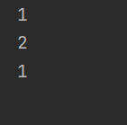
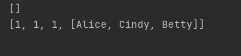
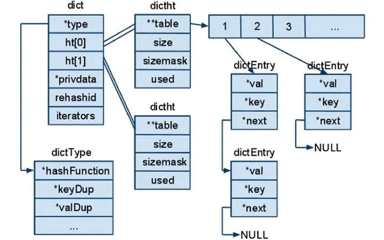

# Redis

## 第1节 Redis入门

### 1 Redis概述

Redis是用C语言开发的一款高性能的基于键值对的NoSQL系列的非关系型数据库

- 关系型数据库：
  1. 数据之间由关联关系
  2. 数据存储在硬盘的文件上
- 非关系型数据库（NoSQL）：
  1. 数据之间没有关联关系
  2. 数据存储在内存中

Redis将所有的数据都存放在**内存**中，所以读写性能非常高

Redis可以将内存中的数据以**快照**或**日志**的形式保存到硬盘上（持久化）

应用场景：缓存、计数器、查找表、消息队列、分布式锁实现、排行榜、社交网络等


### 2 下载与安装

[Redis官网](https://redis.io/)

[Redis中文网](http://www.redis.cn/)

以上都可以下载

下载--->解压--->开启服务器端（windows上是redis-server.exe）--->开启客户端（windows上是redis-cli.exe）


### 3 命令操作

Redis默认有16个库（索引0~15）

`select 1`选择索引为1的库

`flushdb`刷新库：清除该库里的所有数据


Redis的数据结构：key+value

**key都是字符串**

key可以为null

`incr key`将key对应的value值加1然后返回

`decr key`将key对应的value值减1然后返回

value的数据结构：

1. 字符串string
2. 哈希hash
3. 列表list
4. 集合set
5. 有序集合sortedset


字符串类型string：

- 存储：set key value
- 获取：get key
- 删除：del key


哈希类型hash：

- 存储：hset key field value
- 获取：
  - hget key feild value 获取指定的field对应的值
  - hgetall key 获取所有的field和value
- 删除：hdel key field


列表类型list：双端队列

- 添加：
  - lpush [key] [value] 左边加入
  - rpush [key] [value] 右边加入
- 获取：
  - lindex [key] [index]：索引获取
  - lrange [key] [start] [end]：范围获取
- 删除：
  - lpop key：删除列表最左边的元素，并将元素返回
  - rpop key：删除列表最右边的元素，并将元素返回


集合类型set：不允许重复元素

1. 存储：sadd key value
2. 获取：smembers key 获取set集合中的所有元素
3. 删除 ：srem key value 删除set集合中的某个元素


有序集合类型sorted set：不允许元素重复，且元素有序

sorted set给每个元素添加了score，按照score进行排序

1. 存储：zadd key score value
2. 获取：zrange key start end
3. 删除：zrem key value


### 4 通用命令

`keys *` 查询所有的键

`type key` 获取键对应的value的类型

`del key` 删除指定的key value


### 5 持久化

Redis是一个内存数据库，可以将Redis内存中的数据持久化保存到硬盘的文件中

Redis持久化机制：

1. RDB：在一定的间隔时间中，检测key的变化情况，满足触发条件则创建快照，快照可以在本地持久化（rdb.dump文件），也可以复制到其他服务器上

   *快照的形式，不需要进行配置，默认就使用这种机制*

2. AOF：将写命令添加到内存缓存中，然后再根据配置决定何时将其同步到硬盘中的 AOF 文件（Append Only File）的末尾

   *日志记录的方式，可以记录每一条命令的操作*

使用步骤：

1. 修改配置文件redis.windows.conf
2. 使用命令行重新启动redis服务器，并指定配置文件名称

Redis如果重启，内存中的数据会丢掉，但是只要开启了持久化，比如RDB，在退出Redis时会将所有数据保存到磁盘；Redis重启后RDB或AOF都会优先从磁盘里的相应文件导入数据


### 6 事件

Redis服务器是一个事件驱动程序

服务器运行流程：


## 第2节 Jedis

### 1 Jedis

Jedis：一款Java操作Redis数据库的工具

搭建Maven后，在pom.xml引入依赖：

```xml
<!-- https://mvnrepository.com/artifact/redis.clients/jedis -->
        <dependency>
            <groupId>redis.clients</groupId>
            <artifactId>jedis</artifactId>
            <version>2.9.0</version>
        </dependency>
```


Jedis操作数据结构代码演示：

```java
package com.lxy.jedis;

import org.junit.jupiter.api.Test;
import redis.clients.jedis.Jedis;

import java.util.List;
import java.util.Map;
import java.util.Set;

public class JedisTest {
    @Test
    public void test1() {
        // 获取连接
        Jedis jedis = new Jedis("localhost", 6379);
        // 操作
        jedis.set("username", "Alice");
        // 关闭连接
        jedis.close();
    }

    @Test
    public void test2() {
        // 获取连接
        // 空参构造默认值"localhost" 6379端口
        //Jedis jedis = new Jedis();
        Jedis jedis = new Jedis();
        // 操作
        jedis.set("username", "Alice");
        // 获取string
        String username = jedis.get("username");
        System.out.println(username);
        // setx()设置过期时间
        // 将activecode: hehe键值对存入redis，20秒后自动删除该键值对
        jedis.setex("activecode", 20, "hehe");
        // 关闭连接
        jedis.close();
    }

    @Test
    public void test3() {
        // 获取连接
        Jedis jedis = new Jedis();
        // 操作set
        jedis.hset("myhash", "name", "Alice");
        jedis.hset("myhash", "age", "21");
        jedis.hset("myhash", "gender", "female");
        // 获取hash
        String name = jedis.hget("myhash", "name");
        System.out.println(name);
        // 获取hash的所有map中的数据
        Map<String, String> map = jedis.hgetAll("myhash");
        Set<String> keySet = map.keySet();
        for (String key : keySet) {
            String value = map.get(key);
            System.out.println(key + ": " + value);
        }
        // 关闭连接
        jedis.close();
    }

    @Test
    public void test4() {
        // 获取连接
        Jedis jedis = new Jedis();
        // 操作list
        jedis.lpush("mylist", "a", "b", "c");
        jedis.rpush("mylist", "a", "b", "c");
        List<String> list = jedis.lrange("mylist", 0, -1);
        System.out.println(list);
        String element1 = jedis.lpop("mylist");
        String element2 = jedis.rpop("mylist");
        System.out.println(element1 + ", " + element2);
        List<String> listNew = jedis.lrange("mylist", 0, -1);
        System.out.println(listNew);
        // 关闭连接
        jedis.close();
    }

    @Test
    public void test5() {
        // 获取连接
        Jedis jedis = new Jedis();
        // 操作set
        jedis.sadd("myset", "c", "c++", "java");
        Set<String> set = jedis.smembers("myset");
        System.out.println(set);
        // 关闭连接
        jedis.close();
    }

    @Test
    public void test6() {
        // 获取连接
        Jedis jedis = new Jedis();
        // 操作sorted set
        jedis.zadd("mysortedset", 90, "Alice");
        jedis.zadd("mysortedset", 80, "Betty");
        jedis.zadd("mysortedset", 95, "Cindy");
        Set<String> sortedset = jedis.zrange("mysortedset", 0, -1);
        System.out.println(sortedset);
        // 关闭连接
        jedis.close();
    }
}
```


### 2 Jedis连接池

使用步骤：

1. 创建JedisPool连接池对象
2. 调用`getResource()`方法获取Jedis连接

Jedis连接池代码演示：

JedisPoolUtils.java

```java
package com.lxy.util;

import redis.clients.jedis.Jedis;
import redis.clients.jedis.JedisPool;
import redis.clients.jedis.JedisPoolConfig;

import java.io.IOException;
import java.io.InputStream;
import java.util.Properties;

public class JedisPoolUtils {
    private static JedisPool jedisPool;

    static {
        InputStream is = JedisPoolUtils.class.getClassLoader().getResourceAsStream("jedis.properties");
        Properties pro = new Properties();
        try {
            pro.load(is);
        } catch (IOException e) {
            e.printStackTrace();
        }
        JedisPoolConfig config = new JedisPoolConfig();
        config.setMaxTotal(Integer.parseInt(pro.getProperty("maxTotal")));
        config.setMaxIdle(Integer.parseInt(pro.getProperty("maxIdle")));
        jedisPool = new JedisPool(config, pro.getProperty("host"), Integer.parseInt(pro.getProperty("port")));
    }

    public static Jedis getJedis() {
        return jedisPool.getResource();
    }
}
```

JedisPoolTest.java

```java
package com.lxy.jedis;

import com.lxy.util.JedisPoolUtils;
import org.junit.jupiter.api.Test;
import redis.clients.jedis.Jedis;

public class JedisPoolTest {
    @Test
    public void test() {
        // 创建配置对象
        Jedis jedis = JedisPoolUtils.getJedis();
        // 使用
        jedis.set("username", "Alice");
        // 归还到连接池
        jedis.close();
    }
}
```


## 第3节 Spring Boot整合Redis

### 1 Spring Boot整合Redis的步骤

**引入依赖：**

```xml
<dependency>
    <groupId>org.springframework.boot</groupId>
    <artifactId>spring-boot-starter-data-redis</artifactId>
    <version>2.5.2</version>
</dependency>
```


**Spring-data-redis**是spring大家族的一部分，提供了在srping应用中通过简单的配置访问redis服务，对reids底层开发包(Jedis, JRedis, and RJC)进行了高度封装，**RedisTemplate**提供了redis各种操作、异常处理及序列化，支持发布订阅，并对spring 3.1 cache进行了实现。


**配置Redis：**

- 配置数据库参数（默认key类型是Object）
- 编写配置类，构造RedisTemplate（建议修改key类型为String）


修改application.properties：

```properties
# RedisProperties
# 使用索引为10的数据库
spring.redis.database=10
# 数据库的本机ip
spring.redis.host=localhost
# 端口号 默认是6379
spring.redis.port=6379
```


默认情况下，SpringBoot中配置的Redis序列化器为JdkSerializationRedisSerializer，其特点是在Redis中Key的值会带一个前缀，这个前缀在一些查询工具中会以乱码的形式展现，自然也没法用查询工具查的其中的值。因此，我们需要做默认的配置做一些变更。

编写配置类RedisConfig：

```java
@Configuration
public class RedisConfig {

    @Bean
    public RedisTemplate<String, Object> redisTemplate(RedisConnectionFactory factory) {
        RedisTemplate<String, Object> template = new RedisTemplate<>();
        template.setConnectionFactory(factory);

        // 设置key的序列化方式
        template.setKeySerializer(RedisSerializer.string());
        // 设置value的序列化方式（序列化为json）
        template.setValueSerializer(RedisSerializer.json());
        // 设置hash的key的序列化方式
        template.setHashKeySerializer(RedisSerializer.string());
        // 设置hash的value的序列化方式
        template.setHashValueSerializer(RedisSerializer.json());
        // 设置完后触发生效
        template.afterPropertiesSet();

        return template;
    }

}
```


**访问Redis：**

- 字符串string：`redisTemplate.opsForValue()`
- 哈希hash：`redisTemplate.opsForHash()`
- 列表list：`redisTemplate.opsForList()`
- 集合set：`redisTemplate.opsForSet()`
- 有序集合sorted set：`redisTemplate.opsForZSet()`


编写测试类RedisTest：

```java
@RunWith(SpringRunner.class)
@SpringBootTest
@ContextConfiguration(classes = RedisDemoApplication.class)
public class RedisTests {

    @Autowired
    private RedisTemplate redisTemplate;

    @Test
    public void testStrings() {
        String redisKey = "test:count";
        redisTemplate.opsForValue().set(redisKey, 1);
        System.out.println(redisTemplate.opsForValue().get(redisKey));
        System.out.println(redisTemplate.opsForValue().increment(redisKey));
        System.out.println(redisTemplate.opsForValue().decrement(redisKey));
    }

    @Test
    public void testHashes() {
        String redisKey = "test:user";
        redisTemplate.opsForHash().put(redisKey, "id", 1);
        redisTemplate.opsForHash().put(redisKey, "username", "zhangsan");
        System.out.println(redisTemplate.opsForHash().get(redisKey, "id"));
        System.out.println(redisTemplate.opsForHash().get(redisKey, "username"));
    }

    @Test
    public void testLists() {
        String redisKey = "test:ids";
        redisTemplate.opsForList().leftPush(redisKey, 101);
        redisTemplate.opsForList().leftPush(redisKey, 102);
        redisTemplate.opsForList().leftPush(redisKey, 103);
        System.out.println(redisTemplate.opsForList().size(redisKey));
        System.out.println(redisTemplate.opsForList().index(redisKey, 0));
        System.out.println(redisTemplate.opsForList().range(redisKey, 0, 2));
        System.out.println(redisTemplate.opsForList().leftPop(redisKey));
        System.out.println(redisTemplate.opsForList().leftPop(redisKey));
        System.out.println(redisTemplate.opsForList().leftPop(redisKey));
    }

    @Test
    public void testSets() {
        String redisKey = "test:teachers";
        redisTemplate.opsForSet().add(redisKey, "Alice", "Betty", "Cindy", "Dianna", "Emily");
        System.out.println(redisTemplate.opsForSet().size(redisKey));
        // 随机弹出一个值
        System.out.println(redisTemplate.opsForSet().pop(redisKey));
        System.out.println(redisTemplate.opsForSet().members(redisKey));
    }

    @Test
    public void testSortedSets() {
        String redisKey = "test:students";
        redisTemplate.opsForZSet().add(redisKey, "Flora", 80);
        redisTemplate.opsForZSet().add(redisKey, "Grace", 90);
        redisTemplate.opsForZSet().add(redisKey, "Hedy", 50);
        redisTemplate.opsForZSet().add(redisKey, "Isabel", 70);
        redisTemplate.opsForZSet().add(redisKey, "Jean", 60);
        System.out.println(redisTemplate.opsForZSet().zCard(redisKey));
        System.out.println(redisTemplate.opsForZSet().score(redisKey, "Hedy"));
        System.out.println(redisTemplate.opsForZSet().reverseRank(redisKey, "Hedy"));
        // 返回Set接口的内置实现类
        System.out.println(redisTemplate.opsForZSet().reverseRange(redisKey, 0, 2));
    }

    @Test
    public void testKeys() {
        redisTemplate.delete("test:user");
        System.out.println(redisTemplate.hasKey("test:user"));
        redisTemplate.expire("test:students", 10, TimeUnit.SECONDS);
    }

    // 多次访问同一个key 绑定key来简化代码
    @Test
    public void testBoundOperations() {
        String redisKey = "test:count";
        BoundValueOperations operations = redisTemplate.boundValueOps(redisKey);
        operations.increment();
        operations.increment();
        operations.increment();
        operations.increment();
        operations.increment();
        System.out.println(operations.get());
    }
    
}
```


右键运行测试方法`testStrings()`，控制台打印输出：




### 2 Redis的事务管理

> 事务是数据库管理系统执行过程中的一个逻辑单位，由一个有限的数据库操作序列构成。

Redis事务的三个状态：

1. 开始：以MULTI开始一个事务
2. 入队：将多个命令入队到事务中，接到这些命令并不会立即执行，而是放到等待执行的事务队列里面
3. 执行：由EXEC命令触发事务

Redis不支持事务回滚

查询命令应放在事务之前或之后

```java
// 编程式事务
@Test
public void testTransactional() {
    Object obj = redisTemplate.execute(new SessionCallback() {
        @Override
        public Object execute(RedisOperations redisOperations) throws DataAccessException {
            String redisKey = "redis:tx";
            redisOperations.multi();
            redisOperations.opsForSet().add(redisKey, "Alice");
            redisOperations.opsForSet().add(redisKey, "Betty");
            redisOperations.opsForSet().add(redisKey, "Cindy");
            // 事务内部做查询是无效的
            System.out.println(redisOperations.opsForSet().members(redisKey));
            return redisOperations.exec();
        }
    });
    System.out.println(obj);
}
```

右键运行测试方法，控制台打印输出：




## 第4节 Redis数据结构

Redis的这些数据结构，在底层都是使用 **redisObject** 来进行表示，通常为 16 字节

redisObject中有三个重要的属性，分别是：

- **type**：value的数据类型
- **encoding**：编码方式
- **ptr**：指针，指向value的内存区域


### 1 string字符串

常用命令： set、get、decr、incr、mget 等

string是redis中最常用的数据类型，字符串对象的编码有三种，分别是：**int**、**raw**、**embstr**

string编码方式的选择：

- 整数值，编码为int，存储 8 个字节的 long 整型
- 字符串值，并且这个字符串值的长度小于等于 44 字节，编码为embstr
- 字符串值 并且这个字符串值的长度大于 44 字节，编码为raw，采用 SDS 来保存这个字符串值

Redis是用 C 语言开发的，但是底层存储不是使用C语言的字符串类型，而是自己开发了一种数据类型 **SDS** 进行存储，SDS 即 Simple Dynamic String，是一种**动态字符串**，可以在 github 找到源码

```c
struct sdshdr{
    int len;//字符串长度
    int free;//未使用的字节长度
    char buf[];//保存字符串的字节数组 
}
```


SDS 与 C 语言字符串的区别：

- 字符串长度：C 语言获取字符串长度需要遍历，SDS 直接使用 `len` 属性记录长度
- 避免缓冲区溢出：扩容
- 空间预分配：`free` 属性记录多余空间
- 惰性释放：缩容后 `free` 属性记录剩余空间
- 二进制安全：C 语言字符串末尾有'\0'


Redis规定字符串长度不得超过512MB


### 2 hash字典

常用命令：hget、hset、hgetall 等

hash 是一个 string 类型的 field 和 value 的映射表

哈希对象的编码有两种，分别是：**ziplist**、**hashtable**

当哈希对象保存的键值对数量小于 512，并且所有键值对的长度都小于64字节时，使用 ziplist(压缩列表) 存储；否则使用 hashtable 存储

Redis中的hashtable跟Java中的HashMap类似，都是通过"数组+链表"的实现方式解决部分的哈希冲突

Redis的字典dict中包含两个哈希表dictht，主要是为了便于进行rehash操作




扩容：扩容为2倍

收缩：收缩为一半

扩容或收缩都是**渐进式rehash**：

- 在rehash时，会使用**rehashidx**字段保存**迁移的进度**，rehashidx为0表示迁移开始
- 在迁移过程中**ht[0]**和**ht[1]**会同时保存数据，ht[0]指向旧哈希表，ht[1]指向新哈希表，**每次对字典执行增删改查操作时，程序都会顺带将ht[0]的元素迁移到ht[1]中**
- 随着字典操作的不断执行，最终会在某个时间节点，ht[0]的所有键值都会被迁移到ht[1]中，rehashidx设置为-1，代表迁移完成。如果没有执行字典操作，redis也会通过**定时任务**去判断rehash是否完成，没有完成则继续rehash
- rehash完成后，ht[0]指向的旧表会被释放，之后会将新表的持有权转交给ht[0]，再重置ht[1]指向NULL


源码：

哈希表dictht：

```java
/* This is our hash table structure. Every dictionary has two of this as we
 * implement incremental rehashing, for the old to the new table. */
typedef struct dictht {
    dictEntry **table;
    unsigned long size;
    unsigned long sizemask;
    unsigned long used;
} dictht;
```

哈希节点dictEntry：

```java
typedef struct dictEntry {
    void *key;
    union {
        void *val;
        uint64_t u64;
        int64_t s64;
        double d;
    } v;
    struct dictEntry *next;
} dictEntry;
```

hash主结构dict：

```java
typedef struct dict {
    dictType *type;
    void *privdata;
    dictht ht[2];
    long rehashidx; /* rehashing not in progress if rehashidx == -1 */
    unsigned long iterators; /* number of iterators currently running */
} dict;
```


### 3 list链表

常用命令：lpush、rpush、lpop、rpop、lrange 等

链表对象的编码有两种，分别是：**ziplist**、**linkedlist**

当列表的长度小于512，并且所有元素的长度都小于64字节时，使用 ziplist 存储；否则使用 linkedlist 存储（规则类似于hash）

Redis中的list类似于Java中的LinkedList，是一个链表，底层的实现原理也和LinkedList类似。这意味着list的插入和删除操作效率会比较快，时间复杂度是O(1)


### 4 set集合

常用命令：sadd、spop、smembers、sunion 等

set类型的特点是**无序**、**不重复**，跟Java的HashSet类似

set可以实现**交集**、**并集**等操作，从而实现共同好友等功能

set的编码有两种，分别是**intset**和**hashtable**

如果value可以转成整数值，并且长度不超过512的话就使用intset存储，否则采用hashtable

set采用hashtable编码的话，其value都是NULL（类比HashSet和HashMap）

inset源码：

```c
typedef struct intset{
    uint32_t encoding;//编码方式

    uint32_t length;//集合包含的元素数量

    int8_t contents[];//保存元素的数组
}intset;
```


encoding有三种，分别是INTSET_ENC_INT16、INSET_ENC_INT32、INSET_ENC_INT64，代表着整数值的取值范围。Redis会根据添加进来的元素的大小，选择不同的类型进行存储，可以尽可能地节省内存空间

encoding类型升级过程：

1. 根据新元素的大小扩展数组contents的空间
2. 从尾部将该元素插入
3. 根据新的encoding格式重置之前的值，因为这时的contents存在着两种编码的值。从插入的数据的位置，也就是尾部，**从后到前**将之前的数据按照新的编码格式进行移动和设置。从后到前调整是为了防止数据被覆盖

*encoding升级是不可逆的*


### 5 zset有序集合

常用命令：zadd、zrange、zrem、zcard 等

zset有序集合和set一样，元素不可重复，但区别在于多了score值，用来代表排序的权重

zset的编码有两种，分别是：**ziplist**、**skiplist**

当 zset 的长度小于128，并且所有元素的长度都小于64字节时，使用 ziplist 存储；否则使用 skiplist（跳跃表） 存储

skiplist是基于多指针有序链表实现的，可以看成多个有序链表

在查找时，从上层指针开始查找，找到对应的区间之后再到下一层去查找

skiplist增删改查的时间复杂度为$O(logN)$，类似于二分查找


## 第5节 Redis应用

### 1 缓存击穿

**缓存击穿**（缓存穿透）就是大量请求的key不在缓存中，导致请求直接到了数据库上，可能导致黑客攻击

解决方法：

1. 前端设置请求格式、ID范围等限制
2. 缓存无效（缓存和数据库均无数据）的key，并设置较短的过期时间（适用于请求的key变化不频繁的情况）
3. 使用布隆过滤器，先判定请求值是否存在于布隆过滤器中，存在则再去查缓存，否则是无效请求
   - 布隆过滤器对请求的字符串计算出若干个哈希值
   - 添加元素：位数组中对应下标置为1
   - 查找元素：位数组中对应下标是否都为1，若有一个不为1则说明请求值一定不在数据库中
   - 布隆过滤器判断存在，有小概率误判，因为不同字符串可能哈希值对应的位数组下标完全相同


### 2 缓存雪崩

**缓存雪崩**指的是缓存在同一时间大面积的失效，后面的请求都直接落到了数据库上，造成数据库短时间内承受大量请求

解决方法：

1. 采用Redis集群，避免单个服务器宕机
2. 对大量请求限流
3. 随机设置缓存失效时间


### 3 数据一致性

**数据一致性**指数据库数据变动时保证缓存和数据库数据一致

解决方法：

1. 普通模式（无并发或低并发）：
   - 先删除cache，成功则更新DB，否则不断做失败重试，一段时间还未成功则返回更新失败的异常
     - 潜在的问题：A先发起改的请求接着B也请求改，A先删掉cache然后更新DB，C读cache没有则将DB写入cache，此时B再改DB ---> 不一致
   - 先删除cache，成功则更新DB，再将DB的值写入cache
     - 潜在的问题：A先发起改的请求接着B也请求改，A先改DB，B再改，然后B写入cache，A再写 ---> 不一致
2. 旁路缓存模式（低并发）：先更新DB，然后直接删除cache，为避免不一致需要增强
   - 增加cache更新重试机制，若不断更新失败则加入队列，直到cache服务可用后再将队列中的key删除
   - 定期全量更新
   - 给所有cache一个失效期
3. 其他模式（高并发）：异步的情况，先写入cache，就直接返回；定期或特定动作将数据保存到DB，可以做到多次更新，一次保存

[Redis怎么保持缓存与数据库一致性](https://blog.csdn.net/belalds/article/details/82078009)


## 第6节 BitMap
