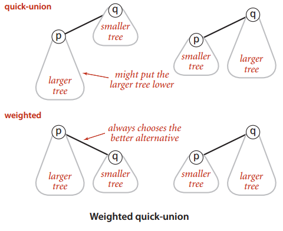

# 第一章 顺序表和链表

## 数据结构介绍

**程序**=**算法**+**数据结构** 
**程序设计**=**算法**+**数据结构**+**编程范式**

时间复杂度优化--->算法优化 
空间复杂度优化--->数据结构优化

数据结构=结构定义+结构操作


## 顺序表

顺序表的数据类型不能混合存储

顺序表的**逻辑空间**和**物理空间**（内存空间）均是连续的

> 3大属性：
> size = 9
> length = 5
> data_type = xxx

顺序表具有**插入**与**删除**、**扩容**的操作
*比数组更高级的地方在于“扩容”*

顺序表代码示例

```c
#include <stdio.h>
#include <stdlib.h>
#include <time.h>

typedef struct Vector { //顺序表的结构定义
    int *data;
    int size, length;
} Vector;

Vector *init(int n) { //顺序表的初始化
    Vector *vec = (Vector *)malloc(sizeof(Vector));
    vec->data = (int *)malloc(sizeof(int) * n);
    vec->size = n;
    vec->length = 0;
    return vec;
}

int expand(Vector *vec) { //扩容操作
    int extr_size = vec->size; //扩展跟原空间大小相同的内存空间
    int *p; //防止realloc失败返回NULL导致vec->data丢失从而内存泄漏
    while (extr_size) {
        p = (int *)realloc(vec->data, sizeof(int) * (vec->size + extr_size));
        if (p) break; //p不为NULL则说明开辟成功，停止while循环
        extr_size /= 2; //否则减小开辟的空间大小，继续realloc操作
    }
    if (extr_size == 0) return 0;
    vec->data = p;
    vec->size += extr_size;
    return 1;
}

int insert(Vector *vec, int ind, int val) { //插入操作
    if (vec == NULL) return 0; //不存在则直接return
    if (ind < 0 || ind > vec->length) return 0; //插入位置是否合法
    if (vec->length == vec->size) { //满了之后进行扩容操作
    	if (!expand(vec)) return 0;
    	printf("success to expand! the Vector size is %d\n", vec->size);
    }
    for (int i = vec->length; i > ind; i--) { //从后往前赋值
        vec->data[i] = vec->data[i - 1];
    }
    vec->data[ind] = val;
    vec->length += 1;
    return 1;
}

int erase(Vector *vec, int ind) { //删除操作
    if (vec == NULL) return 0;
    if (ind < 0 || ind >= vec->length) return 0;
    for (int i = ind + 1; i < vec->length; i++) {
        vec->data[i - 1] = vec->data[i];
    }
    vec->length -= 1;
    return 1;
}

void output(Vector *vec) { //顺序表的输出
    if (vec == NULL) return;
    printf("Vector : [");
    for (int i = 0; i < vec->length; i++) {
        i && printf(", "); //i为0的时候不会打印
        printf("%d", vec->data[i]);
    }
    printf("]\n");
    return;
}

void clear(Vector *vec) { //顺序表的销毁
    if (vec == NULL) return;
    free(vec->data); //释放内存，与malloc操作对应
    free(vec);
    return;
}

int main() { //主函数用于测试顺序表
    srand(time(0));
    #define max_op 20
    Vector *vec = init(max_op);
    for (int i = 0; i < max_op; i++) {
        int val = rand() % 100;
        int ind = rand() % (vec->length + 3) - 1;
        int op = rand() % 4;
        switch (op) { //75%的概率进行插入操作，25%的概率进行删除操作
            case 0:
            case 1:
            case 2: {
                printf("insert %d at %d to Vector = %d\n", val, ind, insert(vec, ind, val));
            } break;
            case 3: {
                printf("erase an item at %d from Vector = %d\n", ind, erase(vec, ind));
            } break;
            printf("\n");
        }
        output(vec);
        printf("\n");
    }
    clear(vec);
    #undef max_op
    return 0;
}
```


> `malloc`在堆区动态开辟一片内存空间，不初始化，成功则返回内存的首地址，否则返回NULL  
> `calloc`动态开辟一片内存空间并初始化为固定值，成功则返回内存的首地址，否则返回NULL  
> `realloc`在原空间的后面再次开辟内存空间，成功则返回原空间的首地址；否则复制原空间到新空间并开辟内存，返回新空间的首地址；如果再次失败则返回NULL  


## 链表

**链表**与**顺序表**统称为**线性表**（线性结构），其数据元素存在逻辑上的一对一连接关系

链表结构：[程序内部(head)]+[内存内部(node)]

链表的优势：无固定长度，不需要扩容；插入数据方便

链表的数据元素之间具有逻辑上的连接，但在物理层面通常不是相互连接的

链表具有**插入**、**删除**等操作

单向循环链表：把head看作整个单项循环链表的尾节点

链表代码示例

```c
#include <stdio.h>
#include <stdlib.h>
#include <time.h>

#define COLOR(a, b) "\033[" #b "m" a "\033[0m"
#define GREEN(a) COLOR(a, 32)

typedef struct ListNode { //链表的结构定义
    int data;
    struct ListNode *next;
} ListNode;

typedef struct List { //链表的属性定义
    ListNode head; //链表头
    int length;
} List;

ListNode *getNewNode(int);
List *getLinkList();
void clear_node(ListNode *);
void clear(List *);
int insert(List *, int, int);
int erase(List *, int);
void output(List *);
void reverse(List *l);

int main() { //主函数用于测试链表
    srand(time(0));
    #define max_op 20
    List *l = getLinkList();
    for (int i = 0; i < max_op; i++) {
        int val = rand() % 100;
        int ind = rand() % (l->length + 3) - 1;
        int op = rand() % 4;
        switch (op) {
            case 0:
            case 1: {
                printf("insert %d at %d to list = %d\n", val, ind, insert(l, ind, val));
            } break;
            case 2: {
                printf("erase an iterm at %d from List = %d\n", ind, erase(l, ind));
            } break;
            case 3: {
                printf(GREEN("reverse the List !") "\n");
                reverse(l);
            } break;
        }
        output(l);
        printf("\n");
    }
    #undef max_op
    clear(l);
    return 0;
}

ListNode *getNewNode(int val) { //创建新链表节点
    ListNode *p = (ListNode *)malloc(sizeof(ListNode));
    p->data = val;
    p->next = NULL;
    return p;
}

List *getLinkList() { //创建新链表
    List *l = (List *)malloc(sizeof(List));
    l->head.next = NULL;
    l->length = 0;
    return l;
}

int insert(List *l, int ind, int val) { //插入操作
    if (l == NULL) return 0;
    if (ind < 0 || ind > l->length) return 0;
    ListNode *p = &(l->head), *node = getNewNode(val); //定义指向链表头的指针p，然后创建新链表节点node
    while (ind--) p = p->next; //从链表头遍历至插入位置
    node->next = p->next; //使新链表节点指向插入位置的后一个节点
    p->next = node; //断开原链接并指向新链表节点
    l->length += 1;
    return 1;
}

int erase(List *l, int ind) { //删除操作
    if (l == NULL) return 0;
    if (ind < 0 || ind >= l->length) return 0;
    ListNode *p = &(l->head), *q; //定义指向链表头的指针p，然后创建临时指针q
    while (ind--) p = p->next; //从链表头遍历至删除位置
    q = p->next; //使临时指针q指向删除位置
    p->next = q->next; //断开原链接并指向下下个节点
    free(q); //释放q的内存
    l->length -= 1;
    return 1;
}

void reverse(List *l) { //链表的翻转（头插法）
    ListNode *p = l->head.next, *q; //定义指向链表第一个节点的指针p，然后创建临时指针q
    l->head.next = NULL;
    while (p) {
        q = p->next; //临时指针指向p的下一个节点
        p->next = l->head.next; //翻转p指向的节点的指向
        l->head.next = p; //链表头向后移动
        p = q; //指针p向后移动
    }
    return;
}

void output(List *l) { //链表的输出
    if (l == NULL) return;
    printf("List(%d) = [", l->length);
    for (ListNode *p = l->head.next; p; p = p->next) {
        printf("%d->", p->data);
    }
    printf("NULL]\n");
    return;
}

void clear_node(ListNode *node) { //链表节点的销毁
    if (node == NULL) return;
    free(node);
    return;
}

void clear(List *l) { //链表的销毁
    if (l == NULL) return;
    ListNode *p = l->head.next, *q;
    while (p) {
        q = p->next;
        clear_node(p);
        p = q;
    }
    free(l);
    return;
}
```


# 第二章 栈与队列

## 队列

**先进先出**的数据结构；**FIFO**(first in first out)

**假溢出**--->**循环队列**解决，新元素下标通过%length取到head前面的位置

队列是连续的存储空间，数据元素均是相同数据类型
*本质是对数组的功能性扩展*

> 循环队列结构：  
>
> 1. length = 9 （队列总长度）
> 2. head = 3 （队首元素下标；通常初始化从0开始）
> 3. tail = 8 （队尾元素或队尾元素的下一个位置的下标）
> 4. count = 6 （循环队列里的实际元素个数；普通队列没有count）
> 5. data_type = xxx （数据类型）

队列有入队、出队、扩容等操作

队列代码示例

```c
#include <stdio.h>
#include <stdlib.h>
#include <time.h>

#define COLOR(a, b) "\033[" #b "m" a "\033[0m"
#define GREEN(a) COLOR(a, 32)

typedef struct Queue { //循环队列结构定义
    int *data; //由于队列是连续的内存空间，所以数据以数组的形式存储
    int head, tail, length, cnt;
} Queue;

Queue *init(int n) { //队列的初始化
    Queue *q = (Queue *)malloc(sizeof(Queue));
    q->data = (int *)malloc(sizeof(int) * n);
    q->length = n;
    q->head = q->tail = q->cnt = 0;
    return q;
}

int front(Queue *q) { //返回队列的首元素
    return q->data[q->head];
}

int empty(Queue *q) { //检查队列是否为空
    return q->cnt == 0;
}

int expand(Queue *q) { //扩容操作
    int extr_size = q->length;
    int *p;
    while (extr_size) {
        p = (int *)malloc(sizeof(int) * (q->length + extr_size));
        if (p) break;
        extr_size >>= 1; //若开辟空间失败则使开辟空间的大小减半
    }
    if (p == NULL) return 0; //若完全无法开辟空间则直接返回0
    for (int i = q->head, j = 0; j < q->cnt; j++) { //将原队列的所有数据元素依次赋值到新扩容的队列里
        p[j] = q->data[(i + j) % q->length];
    }
    free(q->data);
    q->length += extr_size;
    q->head = 0;
    q->tail = q->cnt;
    return 1;
}

int push(Queue *q, int val) { //入队操作
    if (q == NULL) return 0;
    if (q->cnt == q->length) { //实际数据元素个数若超过队列长度，则执行扩容操作
        if (!expand(q)) return 0;
        printf(GREEN("expand successfully ! Queue->size(%d)") "\n", q->length);
    }
    q->data[q->tail++] = val; //于队尾的下一个的位置添加入队元素val，并使tail加1
    if (q->tail == q->length) q->tail = 0; //处理假溢出
    q->cnt += 1;
    return 1;
}

int pop(Queue *q) { //出队操作
    if (q == NULL) return 0;
    if (empty(q)) return 0;
    q->head++; //队首位置向后移
    if (q->head == q->length) q->head = 0; //处理假溢出
    q->cnt -= 1;
    return 1;
}

void output(Queue *q) { //队列的输出
    printf("Queue : [");
    for (int i = q->head, j = 0; j < q->cnt; i++, j++) {
        j && printf(", ");
        printf("%d", q->data[i % q->length]);
    }
    printf("]\n");
    return;
}

void clear(Queue *q) { //队列的销毁
    if (q == NULL) return;
    free(q->data);
    free(q);
    return;
}

int main() {
    srand(time(0));
    #define max_op 20
    Queue *q = init(max_op);
    for (int i = 0; i < max_op * 2; i++) {
        int val = rand() % 100;
        int op = rand() % 4;
        switch (op) {
            case 0:
            case 1:
            case 2: {
                printf("push %d to the Queue = %d\n", val, push(q, val));
            } break;
            case 3: {
                printf("pop %d from the Queue = %d\n", front(q), pop(q));
            } break;
        }
        output(q), printf("\n");
    }
    #undef max_op
    clear(q);
    return 0;
}
```


## 栈

**先进后出**的数据结构；**FILO**(first in last out)

栈是一段**连续**的内存空间，存储相同的数据类型

> 栈的结构定义：
>
> 1. size = 5 （栈的总容量）
> 2. top = 3 （栈顶；-1代表栈为空）
> 3. data_type = xxx （栈的数据类型）

栈的结构操作：**压栈**、**弹栈**

栈可以处理具有**完全包含**关系的问题

> LeetCode 20：括号匹配
>
> "()" "[]" "{}"为合法的括号匹配

系统栈（递归）也能解决栈问题，但是存储容量不能超过8MB否则发生爆栈

栈的代码示例

```c
#include <stdio.h>
#include <stdlib.h>
#include <time.h>

typedef struct Stack { //栈的结构定义
    int *data;
    int size, top;
} Stack;

Stack *init(int);
void clear(Stack *);
int top(Stack *);
int empty(Stack *);
int push(Stack *, int);
int pop(Stack *);
void output(Stack *);

int main() {
    srand(time(0));
    #define max_op 20
    Stack *s = init(max_op);
    for (int i = 0; i < max_op; i++) {
        int val = rand() % 100;
        int op = rand() % 4;
        switch (op) {
            case 0:
            case 1:
            case 2: {
                printf("push %d to the Stack = %d\n", val, push(s, val));
            } break;
            case 3: {
                printf("pop %d from the Stack = %d\n", top(s), pop(s));
            } break;
        }
        output(s), printf("\n");
    }
    #undef max_op
    clear(s);
    return 0;
}

Stack *init(int n) { //栈的初始化
    Stack *s = (Stack *)malloc(sizeof(Stack));
    s->data = (int *)malloc(sizeof(int) * n);
    s->size = n;
    s->top = -1; //-1代表栈为空
    return s;
}

void clear(Stack *s) { //栈的销毁
    if (s == NULL) return;
    free(s->data);
    free(s);
    return;
}

int top(Stack *s) { //取栈顶元素
    return s->data[s->top];
}

int empty(Stack *s) { //检查是否为空栈
    return s->top == -1;
}

int push(Stack *s, int val) { //压栈操作
    if (s == NULL) return 0;
    if (s->top == s->size - 1) return 0; //检查是否满栈
    s->data[++(s->top)] = val;
    return 1;
}

int pop(Stack *s) { //弹栈操作
    if (s == NULL) return 0;
    if (empty(s)) return 0;
    s->top -= 1;
    return 1;
}

void output(Stack *s) { //栈的输出
    printf("Stack(%d) = [", s->top + 1);
    for (int i = 0; i <= s->top; i++) {
        i && printf(", ");
        printf("%d", s->data[i]);
    }
    printf("]\n");
    return;
}
```


# 第三章 树和二叉树

## 树

非线性结构（一对多）

树的**深度**、**高度**和**度**：  

- 深度：顶部往下数，至节点的层数
- 高度：底部往上数，至节点的层数
- 度：节点连接的子节点
- 树（整体）的深度等于高度
- **节点数量=边数+1**

> 树的节点：代表集合
>
> 树的边：代表关系

**二叉树**的性质：  

- 每个节点度最多为2
- 度为0的节点比度为2的节点多1个

任何n叉树都可以转化成二叉树（从节点数量=边数+1可推得）

**叶子节点**：度为0的节点

**深度优先遍历：**借助栈实现

| 遍历方式 | 输出顺序 |
| -------- | -------- |
| 前序遍历 | 根左右   |
| 中序遍历 | 左根右   |
| 后序遍历 | 左右根   |

**广度优先遍历：**借助队列实现

**完全二叉树**（从上至下，从左至右没有空节点）、**满二叉树**（所有非叶子节点的度都是2）=**完美二叉树**

> 完全二叉树：
>
> 1. 编号为$i$的子节点：左节点编号$2*i$，右节点编号$2*i+1$（根节点从1开始编号）
> 2. 可以用连续空间存储（数组）
> 3. 若一棵完全二叉树深度为$k$，节点数为$2^k-1$，则为满二叉树

二叉树-**广义表**：二叉树的表示方法

遇到左括号入栈，遇到右括号出栈

广义表转二叉树的代码示例

```c
#include <stdio.h>
#include <stdlib.h>
#include <string.h>

typedef struct Node { //类链表的结构定义
    char data;
    struct Node *lchild, *rchild;
} Node;

typedef struct Tree {
    Node *root;
    int n;
} Tree;

typedef struct Stack {
    Node **data; //注意这里栈存储的是指针变量
    int top, size;
} Stack;

Node *getNewNode(char val) {
    Node *p = (Node *)malloc(sizeof(Node));
    p->data = val;
    p->lchild = p->rchild = NULL;
    return p;
}

Tree *getNewTree() {
    Tree *tree = (Tree *)malloc(sizeof(Tree));
    tree->root = NULL;
    tree->n = 0;
    return tree;
}

Stack *init_stack(int n) {
    Stack *s = (Stack *)malloc(sizeof(Stack));
    s->data = (Node **)malloc(sizeof(Node *) * n);
    s->top = -1;
    s->size = n;
    return s;
}

Node *top(Stack *s) {
    return s->data[s->top]; //返回栈顶的元素，即某字符所在链表的地址
}

int empty(Stack *s) {
    return s->top == -1; //若为空栈则返回1否则返回0
}
//压栈
int push(Stack *s, Node *val) {
    if (s == NULL) return 0;
    if (s->top == s->size - 1) return 0; //满栈则无法再压栈
    s->data[++(s->top)] = val;
    return 1;
}
//弹栈
int pop(Stack *s) {
    if (s == NULL) return 0;
    if (empty(s)) return 0;
    s->top -= 1;
    return 1;
}

void clear_stack(Stack *s) {
    if (s == NULL) return;
    free(s->data); //注意data是二重指针
    free(s);
    return;
}

void clear_node(Node *node) {
    if (node == NULL) return;
    clear_node(node->lchild);
    clear_node(node->rchild);
    free(node);
    return;
}

void clear_tree(Tree *tree) {
    if (tree == NULL) return;
    clear_node(tree->root);
    free(tree);
    return;
}

Node *build(const char *str, int *node_num) {
    Stack *s = init_stack(strlen(str));
    Node *temp = NULL, *p = NULL;
    int flag = 0;
    while (str[0]) {
        switch (str[0]) {
            case '(':
                push(s, temp);
                flag = 0;
                break;
            case ')':
                p = top(s); //最后出栈的即为根
                pop(s);
                break;
            case ',': //逗号表明下一个是右子节点，改变flag的值
                flag = 1;
                break;
            case ' ': break;
            default:
                temp = getNewNode(str[0]); //将字符存进临时链表节点
            if (!empty(s) && flag == 0) {
                top(s)->lchild = temp; //把此时读取的字符作为左子节点连上栈顶元素
            } else if (!empty(s) && flag == 1) {
                top(s)->rchild = temp; //把此时读取的字符作为右子节点连上栈顶元素
            }
            ++(*node_num); //每读一个字符，节点数加1
            break;
        }
        ++str; //每读取一个字符则str指针向后移一个char位
    }
    clear_stack(s);
    if (temp && !p) p = temp; //若只有一个字符被读入节点，则直接给指针p赋根的地址
    return p;
}

void pre_order_node(Node *node) {
    if (node == NULL) return;
    printf("%c ", node->data);
    pre_order_node(node->lchild);
    pre_order_node(node->rchild);
    return;
}
//前序遍历
void pre_order(Tree *tree) {
    if (tree == NULL) return;
    printf("pre_order : ");
    pre_order_node(tree->root);
    printf("\n");
    return;
}

void in_order_node(Node *node) {
    if (node == NULL) return;
    in_order_node(node->lchild);
    printf("%c ", node->data);
    in_order_node(node->rchild);
    return;
}
//中序遍历
void in_order(Tree *tree) {
    if (tree == NULL) return;
    printf("in_order : ");
    in_order_node(tree->root);
    printf("\n");
    return;
}

void post_order_node(Node *node) {
    if (node == NULL) return;
    post_order_node(node->lchild);
    post_order_node(node->rchild);
    printf("%c ", node->data);
    return;
}
//后序遍历
void post_order(Tree *tree) {
    if (tree == NULL) return;
    printf("post_order : ");
    post_order_node(tree->root);
    printf("\n");
    return;
}

int main() {
    char str[1000] = {0};
    int node_num = 0;
    scanf("%[^\n]s", str); //读取除\n之外的字符串
    Tree *tree = getNewTree();
    tree->root = build(str, &node_num);
    tree->n = node_num;
    pre_order(tree);
    in_order(tree);
    post_order(tree);
    clear_tree(tree);
    return 0;
}
```

输入：`A(B(, D), C(E, ))`
输出：  

```c
pre_order : A B D C E 
in_order : B D A E C 
post_order : D B E C A
```


二叉树的代码示例：

```c
#include <stdio.h>
#include <stdlib.h>
#include <time.h>

typedef struct Node { //定义节点
    int data;
    struct Node *lchild, *rchild;
} Node;

typedef struct Tree { //定义树
    Node *root; //根节点
    int n; //n为节点数
} Tree;
//初始化节点
Node *init_node(int val) {
    Node *p = (Node *)malloc(sizeof(Node));
    p->data = val;
    p->lchild = p->rchild = NULL;
    return p;
}
//初始化树
Tree *init_tree() {
    Tree *tree = (Tree *)malloc(sizeof(Tree));
    tree->root = NULL;
    tree->n = 0;
    return tree;
}
//销毁节点
void clear_node(Node *node) {
    if (node == NULL) return;
    clear_node(node->lchild);
    clear_node(node->rchild);
    free(node);
    return;
}
//销毁树
void clear_tree(Tree *tree) {
    if (tree == NULL) return;
    clear_node(tree->root);
    free(tree);
    return;
}
//按照顺序二叉树的形式插入节点，使左节点小于右节点
Node *insert_node(Node *root, int val, int *flag) {
    if (root == NULL) {
        *flag = 1;
        return init_node(val);
    }
    if (root->data == val) return root; //防止二叉树中有相同的两个元素
    if (val < root->data) root->lchild = insert_node(root->lchild, val, flag);
    else root->rchild = insert_node(root->rchild, val, flag);
    return root;
}
//插入树
void insert(Tree *tree, int val) {
    int flag = 0; //flag变量用于增加二叉树的节点数
    tree->root = insert_node(tree->root, val, &flag); //初始化根节点
    tree->n += flag;
    return;
}

void pre_order_node(Node *node) {
    if (node == NULL) return;
    printf("%d ", node->data);
    pre_order_node(node->lchild);
    pre_order_node(node->rchild);
    return;
}

void pre_order(Tree *tree) {
    if (tree == NULL) return;
    printf("pre_order : ");
    pre_order_node(tree->root);
    printf("\n");
    return;
}

void in_order_node(Node *node) {
    if (node == NULL) return;
    in_order_node(node->lchild);
    printf("%d ", node->data);
    in_order_node(node->rchild);
    return;
}

void in_order(Tree *tree) {
    if (tree == NULL) return;
    printf("in_order : ");
    in_order_node(tree->root);
    printf("\n");
    return;
}

void post_order_node(Node *node) {
    if (node == NULL) return;
    post_order_node(node->lchild);
    post_order_node(node->rchild);
    printf("%d ", node->data);
    return;
}

void post_order(Tree *tree) {
    if (tree == NULL) return;
    printf("post_order : ");
    post_order_node(tree->root);
    printf("\n");
    return;
}

void output_node(Node *node) {
    if (node == NULL) return;
    printf("%d", node->data);
    if (node->lchild == NULL && node->rchild == NULL) return;
    printf("(");
    output_node(node->lchild);
    printf(",");
    output_node(node->rchild);
    printf(")");
    return;
}
//输出广义表形式的二叉树
void output(Tree *tree) {
    if (tree == NULL) return;
    printf("tree(%d) : ", tree->n);
    output_node(tree->root);
    printf("\n");
    return;
}

int main() {
    srand(time(0));
    Tree *tree = init_tree();
    #define max_op 10
    for (int i = 0; i < max_op; i++) {
        int val = rand() % 100;
        insert(tree, val);
        output(tree);
    }
    pre_order(tree); //前序遍历
    in_order(tree); //中序遍历
    post_order(tree); //后序遍历
    #undef max_op
    clear_tree(tree);
    return 0;
}
```


# 第四章 排序与查找

## 稳定排序

稳定排序：相同数字在排序后不改变相对位置
如插入、冒泡、归并

按内存分类：内部排序（插入、冒泡）、外部排序（归并）


### 插入排序

基本思想：将一个元素插入一个有序数组，使之成为一个更长的有序数组。

1. 将数组分成**已排序区**和**待排序区**

2. 将**待排序区**第一个元素向前插入到**已排序区**中

3. 直到**待排序区**没有元素为止

关键词：由后往前排，已排在前，待排在后

时间复杂度：O($n^2$)


### 冒泡排序

1. 将数组分成**已排序区**和**待排序区**
2. 从头到尾扫描**待排序区**，若前面元素比后面元素大，则交换
3. 每一轮都会将**待排序区**中最大的放到**已排序区**的开头
4. 直到**待排序区**没有元素为止

关键词：逐个比较，逐个交换

时间复杂度：O($n^2$)


### 归并排序

**分治**的思想：将一个大问题分为两个没有交集的小问题

不断分治，直到最后每个子数组只剩2个或3个的元素

时间复杂度：O($n\log n$)

空间复杂度：O($n$)

**分治**、**排序**、**合并**、**拷贝**


稳定排序代码示例：

```c
#include <stdio.h>
#include <stdlib.h>
#include <string.h>
#include <time.h>
//交换a和b的宏定义
#define swap(a, b) {\
    __typeof(a) __temp = a;\
    a = b; b = __temp;\
}
//用于测试其中一个排序功能的宏
#define TEST(arr, n, func, args...) {\
    int *num = (int *)malloc(sizeof(int) * n);\
    memcpy(num, arr, sizeof(int) * n);\ //从arr的地址拷贝sizeof(int) * n个字节到num的地址来
    output(num, n);\
    printf("%s = ", #func);\
    func(args);\
    output(num, n);\
    free(num);\
}
//插入排序
void insert_sort(int *num, int n) {
    for (int i = 1; i < n; i++) {
        for (int j = i; j > 0 && num[j] < num[j - 1]; j--) {
            swap(num[j], num[j - 1]);
        }
    }
    return;
}
//冒泡排序
void bubble_sort(int *num, int n) {
    int times = 1;
    for (int i = 1; i < n && times; i++) {
        times = 0;
        for (int j = 0; j < n - i; j++) {
            if (num[j] <= num[j + 1]) continue;
            swap(num[j], num[j + 1]);
            times++;
        }
    }
    return;
}
//归并排序
void merge_sort(int *num, int l, int r) { //l和r分别为子数组的左右端在原数组中的角标号
    if (r - l <= 1) { //子数组是否只剩1个或2个数
        if (r - l == 1 && num[r] < num[l]) {
            swap(num[l], num[r]);
        }
        return;
    }
    int mid = (l + r) >> 1; //否则继续分治
    merge_sort(num, l, mid); //递归
    merge_sort(num, mid + 1, r);
    int *temp = (int *)malloc(sizeof(int) * (r - l + 1)); //声明一个用于临时合并数组的变量空间
    int p1 = l, p2 = mid + 1, k = 0;
    while (p1 <= mid || p2 <= r) {
        if (p2 > r || (p1 <= mid && num[p1] <= num[p2])) {
            temp[k++] = num[p1++]; //将左子数组的元素写入合并数组
        } else {
            temp[k++] = num[p2++]; //将右子数组的元素写入合并数组
        }
    }
    memcpy(num + l, temp, sizeof(int) * (r - l + 1)); //将子数组复制进上一级数组
    free(temp);
    return;
}
//产生n个0到99的随机数
void randint(int *num, int n) {
    while (n--) num[n] = rand() % 100;
    return;
}
//输出数组
void output(int *num, int n) {
    printf("[");
    for (int i = 0; i < n; i++) {
        printf(" %d", num[i]);
    }
    printf("]\n");
    return;
}

int main() {
    srand(time(0));
    #define max_op 20
    int arr[max_op];
    randint(arr, max_op);
    TEST(arr, max_op, insert_sort, num, max_op);
    TEST(arr, max_op, bubble_sort, num, max_op);
    TEST(arr, max_op, merge_sort, num, 0, max_op - 1);
    return 0;
}
```


## 不稳定排序

### 选择排序

1. 将数组分成**已排序区**和**待排序区**
2. 每一轮从**待排序区**中选择一个最小的元素放到**已排序区**的尾部
3. 直到**待排序区**没有元素为止

时间复杂度：O($n^2$)

但是对于一个相对有序的数组而言，选择排序比冒泡排序等方法操作数量更少


### 快速排序

步骤：

1. 选择**基准值**（基数，一般选择第一个数），并将其复制到一个临时变量
2. 使用两个变量指向数组**头部和尾部**
3. 尾“指针”**向前**移动找小于基准值的值，找到后放到头“指针”的位置
4. 头“指针”**向后**移动找大于基准值的值，找到后与尾“指针”的的位置
5. 头“指针”与尾“指针”相遇后，将临时变量中的基准值放于**相遇的位置**
6. 在基准值的**左右部分子数组重复**上述步骤

时间复杂度：O($n\log n$)~O($n^2$)

空间复杂度：O($\log n$)

在数组刚好是倒序时，时间复杂度将退化成O($n^2$)


非稳定排序代码示例：

```c
#include <stdio.h>
#include <stdlib.h>
#include <string.h>
#include <time.h>

#define swap(a, b) {\
    __typeof(a) __temp = a;\
    a = b; b = __temp;\
}

#define TEST(arr, n, func, args...) {\
    int *num = (int *)malloc(sizeof(int) * n);\
    memcpy(num, arr, sizeof(int) * n);\
    output(num, n);\
    printf("%s = ", #func);\
    func(args);\
    output(num, n);\
    free(num);\
    printf("\n");\
}
//选择排序
void select_sort(int *num, int n) {
    for (int i = 0; i < n - 1; i++) {
        int ind = i;
        for (int j = i + 1; j < n; j++) {
            if (num[ind] > num[j]) ind = j;
        }
        swap(num[i], num[ind]);
    }
    return;
}
//快速排序
void quick_sort(int *num, int l, int r) {
    if (l > r) return;
    int x = l, y = r, z = num[x];
    while (x < y) {
        while (x < y && num[y] > z) --y;
        if (x < y) num[x++] = num[y];
        while (x < y && num[x] < z) ++x;
        if (x < y) num[y--] = num[x];
    }
    num[x] = z;
    quick_sort(num, l, x - 1);
    quick_sort(num, x + 1, r);
    return;
}

void randint(int *num, int n) {
    while (n--) num[n] = rand() % 100;
    return;
}

void output(int *num, int n) {
    printf("arr = [");
    for (int i = 0; i < n; i++) {
        printf(" %d", num[i]);
    }
    printf("]\n");
    return;
}

int main() {
    srand(time(0));
    #define max_op 20
    int arr[max_op];
    randint(arr, max_op);
    TEST(arr, max_op, select_sort, num, max_op);
    TEST(arr, max_op, quick_sort, num, 0, max_op - 1);
    #undef max_op
    return 0;
}
```


快速排序有多种优化方法，比如其中一种：基准数选择数组中间的值，使用循坏结构代替左子数组的递归

优化的快速排序代码示例：

```c
#include <stdio.h>
#include <time.h>
#include <stdlib.h>

#define max_n 20
#define swap(a, b) {\
    __typeof(a) __temp = a;\
    a = b; b = __temp;\
}

void quick_sort(int *num, int l, int r) {
    while (l < r) {
        int x = l, y = r, z = num[(l + r) >> 1]; //基准值在中间取
        do {
            while (x <= y && num[x] < z) x++;
            while (x <= y && num[y] > z) y--;
            if (x <= y) {
                swap(num[x], num[y]);
                x++, y--;
            }
        } while (x <= y);
        quick_sort(num, x, r); //分治到最后x>=r的情况（只剩一个元素的子数组或没有元素），调用quick_sort即立刻返回
        r = y;
    }
    return;
}

int arr[max_n + 5];

void randint(int *num, int n) {
    while (n--) num[n] = rand() % 100;
    return;
}

void output(int *num, int n) {
    printf("arr = [");
    for (int i = 0; i < n; i++) {
        printf(" %d", num[i]);
    }
    printf("]\n");
}

int main() {
    srand(time(0));
    randint(arr, max_n);
    output(arr, max_n);
    quick_sort(arr, 0, max_n - 1);
    output(arr, max_n);
    return 0;
}
```


## 查找算法

### 二分查找

前提：待查找的数组具有单调性

时间复杂度：O($\log_2n$)

二分查找代码示例：

```c
#include <stdio.h>

#define P(func) {\
    printf("%s = %d\n", #func, func);\
}

int binary_search1(int *num, int n, int x) {
    int head = 0, tail = n - 1, mid;
    while (head <= tail) {
        mid = (head + tail) >> 1;
        if (num[mid] == x) return mid;
        if (num[mid] < x) head = mid + 1;
        else tail = mid - 1;
    }
    return -1;
}
//特殊二分查找——查找最后一个1
int binary_search2(int *num, int n) {
    int head = -1, tail = n - 1, mid;
    while (head < tail) {
        mid = (head + tail + 1) >> 1;
        if (num[mid] == 1) head = mid;
        else tail = mid - 1;
    }
    return head;
}
//特殊二分查找——查找第一个1
int binary_search3(int *num, int n) {
    int head = 0, tail = n, mid;
    while (head < tail) {
        mid = (head + tail) >> 1;
        if (num[mid] == 1) tail = mid;
        else head = mid + 1;
    }
    return head == n ? -1 : head;
}

int main() {
    int arr1[10] = {1, 3, 5, 7, 9, 11, 13, 17, 19, 21};
    int arr2[10] = {1, 1, 1, 1, 0, 0, 0, 0, 0, 0};
    int arr3[10] = {0, 0, 0, 0, 0, 1, 1, 1, 1, 1};
    P(binary_search1(arr1, 10, 7));
    P(binary_search2(arr2, 10));
    P(binary_search3(arr3, 10));
    return 0;
}
```


### 三分查找

三分查找用来找凸/凹函数的极值

前提：极值存在

时间复杂度：O($\log_2n$)

二分查找效率比三分查找略高一些，因为二分每次缩小1/2范围，而三分每次缩小1/3范围

步骤：

1. 查找范围[L, R]，m1是[L, R]的1/3处，m2是[L, R]的2/3处
2. 如果f(m1) < f(m2)，L = m1
3. 如果f(m2) <= f(m1)，R = m2
4. 如果|m1 - m2| < exp，找到结果


## 哈希表

一种数据结构，作用跟数组类似，时间复杂度接近O(1)

一种利用哈希函数将任意类型映射成整数值的顺序表

> 一种构造哈希函数的方法：val%size

前后存储的数据位置相同--->冲突--->**冲突处理方法** ：

1. 开放定址法（存在后面一位）
2. 拉链法（在此位置建一个链表）
3. 再哈希（设计多个哈希函数）
4. 建立公共溢出区

哈希表代码示例：

```c
#include <stdio.h>
#include <stdlib.h>
#include <string.h>
//拉链法做冲突处理需要定义链表结构
typedef struct Node {
    char *str;
    struct Node *next;
} Node;
//定义存储字符串的哈希表
typedef struct HashTable {
    Node **data; //data为指向若干个链表的二重指针
    int size;
} HashTable;
//初始化链表节点
Node *init_node(char *str, Node *head) {
    Node *p = (Node *)malloc(sizeof(Node));
    p->str = strdup(str); //动态开辟一片内存空间并将str复制进去，然后返回首地址，最后需要free
    p->next = head;
    return p;
}
//初始化哈希表
HashTable *init_hashtable(int n) {
    HashTable *h = (HashTable *)malloc(sizeof(HashTable));
    h->size = n << 1; //防止哈希函数产生堆聚现象，故扩大一倍容量
    h->data = (Node **)calloc(h->size, sizeof(Node *)); //将开辟的内存空间size个Node *的元素初始化为0
    return h;
}
//一种哈希函数
int BKDRHash(char *str) {
    int seed = 31, hash = 0;
    for (int i = 0; str[i]; i++) hash = hash * seed + str[i];
    return hash & 0x7fffffff; //0x7ffffff代表int的最大值
}
//定义插入元素的函数
int insert(HashTable *h, char *str) {
    int hash = BKDRHash(str);
    int ind = hash % h->size;
    h->data[ind] = init_node(str, h->data[ind]);
    return 1;
}

int search(HashTable *h, char *str) {
    int hash = BKDRHash(str);
    int ind = hash % h->size;
    Node *p = h->data[ind];
    while (p && strcmp(p->str, str)) p = p->next; //最后一个链表节点指向NULL
    return p != NULL;
}

void clear_node(Node *node) {
    if (node == NULL) return;
    Node *p = node, *q;
    while (p) {
        q = p->next;
        free(p->str);
        free(p);
        p = q;
    }
    free(q);
    return;
}

void clear_hashtable(HashTable *h) {
    if (h == NULL) return;
    for (int i = 0; i < h->size; i++) clear_node(h->data[i]);
    free(h->data);
    free(h);
    return;
}

int main() {
    int op;
    #define max_n 100
    char str[max_n + 5] = {0};
    HashTable *h = init_hashtable(max_n + 5);
    while(~scanf("%d%s", &op, str)) {
        switch (op) {
            case 0:
                printf("insert %s to hash table\n", str);
                insert(h, str);
                break;
            case 1:
                printf("search %s form HashTable result = %d\n", str, search(h, str));
                break;
        }
    }
    #undef max_n
    clear_hashtable(h);
    return 0;
}
```


# 第五章 堆与优先队列

## 堆

**堆**又叫做**优先队列**，是一种特殊的**完全二叉树**，规则与队列类似，通常可用**数组**实现

**大顶堆**：所有三元组根节点的数值最大
**小顶堆**：所有三元组根节点的数值最小

尾部插入调整：在尾部插入一个新元素，如果大小排序有问题则从下往上调整，直到满足堆的规则
头部弹出调整：弹出头部的元素（根节点），将尾部元素放置于头部，如果大小排序有问题则从上往下调整，直到满足堆的规则
堆排序：将堆顶元素与堆尾元素交换，接着按照头部元素弹出后的策略调整堆

通常从数组$i=1$开始排序，这样一个节点的左子节点将是$2*i$，右子节点将是$2*i+1$

大顶堆代码示例

```c
#include <stdio.h>
#include <stdlib.h>
#include <time.h>

#define swap(a, b) {\
    __typeof(a) __temp = a;\
    a = b; b = __temp;\
}

typedef struct priority_queue {
    int *data;
    int cnt, size;
} priority_queue;

priority_queue *init(int n) {
    priority_queue *q = (priority_queue *)malloc(sizeof(priority_queue));
    q->data = (int *)malloc(sizeof(int) * (n + 1));
    q->cnt = 0;
    q->size = n;
    return q;
}
//检查优先队列是否为空
int empty(priority_queue *q) {
    return q->cnt == 0;
}
//返回队首元素
int top(priority_queue *q) {
    return q->data[1]; //角标为0的位置没有元素
}
//入队
int push(priority_queue *q, int val) {
    if (q == NULL) return 0;
    if (q->cnt == q->size) return 0;
    q->data[++(q->cnt)] = val;
    int ind = q->cnt;
    while (ind >> 1 && q->data[ind] > q->data[ind >> 1]) { //如不满足大顶堆的规则，则依次向上调整
        swap(q->data[ind], q->data[ind >> 1]);
        ind >>= 1;
    }
    return 1;
}
//出队
int pop(priority_queue *q) {
    if (q == NULL) return 0;
    if (empty(q)) return 0;
    q->data[1] = q->data[q->cnt--];
    int ind = 1;
    while ((ind << 1) <= q->cnt) { //如不满足大顶堆的规则，则依次向左下或右下调整，取决于更大的一个
        int temp = ind, l = ind << 1, r = ind << 1 | 1;
        if (q->data[l] > q->data[temp]) temp = l;
        if (r <= q->cnt && q->data[r] > q->data[temp]) temp = r;
        if (temp == ind) break;
        swap(q->data[temp], q->data[ind]);
        ind = temp;
    }
    return 1;
}

void clear(priority_queue *q) {
    if (q == NULL) return;
    free(q->data);
    free(q);
    return;
}

int main() {
    srand(time(0));
    #define max_op 20
    priority_queue *q = init(max_op);
    for (int i = 0; i < max_op; i++) {
        int val = rand() % 100;
        push(q, val);
        printf("insert %d to the priority_queue\n", val);
    }
    for (int i = 0; i < max_op; i++) {
        printf("%d ", top(q));
        pop(q);
    }
    printf("\n");
    clear(q);
    #undef max_op
    return 0;
}
```


## 线性建堆法

自上向下建堆

**线性建堆法**将建堆操作的时间复杂度从 $O(NlogN)$ 降为 $O(N)$ ，但整体堆排序的复杂度仍是 $O(NlogN)$

线性建堆法代码示例

```c
#include <stdio.h>
#include <stdlib.h>
#include <time.h>

#define swap(a, b) {\
    __typeof(a) __temp = a;\
    a = b; b = __temp;\
}
//从上向下调整以建堆
void downUpdate(int *arr, int n, int ind) {
    while ((ind << 1) <= n) {
        int temp = ind, l = ind << 1, r = ind << 1 | 1;
        if (arr[l] > arr[temp]) temp = l;
        if (r <= n && arr[r] > arr[temp]) temp = r;
        if (temp == ind) break;
        swap(arr[temp], arr[ind]);
        ind = temp;
    }
    return;
}

void heap_sort(int *arr, int n) {
    arr -= 1; //使得原本访问arr[0]变为访问arr[1]
    for (int i = n >> 1; i >= 1; i--) { //实现n个整数的建堆
        downUpdate(arr, n, i); //从倒数第二层(i)开始逐个调整所有三元组节点
    }
    for (int i = n; i > 1; i--) { //堆排序
        swap(arr[i], arr[1]);
        downUpdate(arr, i - 1, 1); //从第1层开始调整
    }
    return;
}

void output(int *arr, int n) {
    printf("[");
    for (int i = 0; i < n; i++) {
        printf(" %d", arr[i]);
    }
    printf("]\n");
    return;
}

int main() {
    srand(time(0));
    #define max_n 20
    int *arr = (int *)malloc(sizeof(int) * max_n);
    for (int i = 0; i < max_n; i++) {
        arr[i] = rand() % 100;
    }
    output(arr, max_n);
    heap_sort(arr, max_n);
    output(arr, max_n);
    free(arr);

    return 0;
}
```


# 第六章 森林与并查集

## quick-find算法

建议参考：[Java实现并查集](https://blog.csdn.net/qq_42011541/article/details/83378709)

连通性判断：调用查找操作find

查找操作find：查找某个元素的根节点

合并操作union：把某两个元素的集合合并

通常使用**数组**作为存储结构

时间复杂度：

- 查找操作：O(1) 数组存的是每个元素的根节点，所以可以直接查找到
- 合并操作：O(n) 每次合并都需要遍历数组

**并查集**有n个根节点，则有n棵树，所以称为**森林**

quick-find代码示例

```c
#include <stdio.h>
#include <stdlib.h>

typedef struct UnionSet {
    int *color;
    int n;
} UnionSet;

UnionSet *init(int n) {
    UnionSet *u = (UnionSet *)malloc(sizeof(UnionSet));
    u->color = (int *)malloc(sizeof(int) * (n + 1)); //角标为0的位置不放置元素所以为n+1
    u->n = n;
    for (int i = 1; i <= n; i++) {
        u->color[i] = i;
    }
    return u;
}
//搜索操作
int find(UnionSet *u, int x) {
    return u->color[x];
}
//合并操作
int merge(UnionSet *u, int a, int b) {
    if (find(u, a) == find(u, b)) return 0;
    int color_a = u->color[a];
    for (int i = 1; i <= u->n; i++) {
        if (u->color[i] - color_a) continue;
        u->color[i] = u->color[b]; //将所有是颜色a的元素染为颜色b
    }
    return 1;
}

void clear(UnionSet *u) {
    if (u == NULL) return;
    free(u->color);
    free(u);
    return;
}

int main() {
    int n, m;
    scanf("%d%d", &n, &m);
    UnionSet *u = init(n);
    for (int i = 0; i < m; i++) {
        int a, b, c;
        scanf("%d%d%d", &a, &b, &c);
        switch (a) {
            case 1: merge(u, b, c); break;
            case 2: printf("%s\n", find(u, b) == find(u, c) ? "Yes" : "No");
                    break;
        }
    }
    clear(u);
    return 0;
}
```


## quick-union算法

初始每个元素即是根，把某两个根与根相连通，逐渐形成若干个集合

时间复杂度：

- 查找操作：O(H) 这里的H指的是树的高度
- 合并操作：O(H) 取决于查找操作

quick-union代码示例

```c
#include <stdio.h>
#include <stdlib.h>

typedef struct UnionSet {
    int *father;
    int n;
} UnionSet;

UnionSet *init(int n) {
    UnionSet *u = (UnionSet *)malloc(sizeof(UnionSet));
    u->father = (int *)malloc(sizeof(int) * (n + 1));
    u->n = n;
    for (int i = 1; i <= n; i++) {
        u->father[i] = i;
    }
    return u;
}
//搜索操作
int find(UnionSet *u, int x) {
    if (u->father[x] == x) return x;
    return find(u, u->father[x]); //通过递归的方式找到树的根
}
//合并操作
int merge(UnionSet *u, int a, int b) {
    int fa = find(u, a), fb = find(u, b);
    if (fa == fb) return 0;
    u->father[fa] = fb;
    return 1;
}

void clear(UnionSet *u) {
    if (u == NULL) return;
    free(u->father);
    free(u);
    return;
}

int main() {
    int n, m;
    scanf("%d%d", &n, &m);
    UnionSet *u = init(n);
    for (int i = 0; i < m; i++) {
        int a, b, c;
        scanf("%d%d%d", &a, &b, &c);
        switch (a) {
            case 1: merge(u, b, c); break;
            case 2: printf("%s\n", find(u, b) == find(u, c) ? "Yes" : "No");
                    break;
        }
    }
    clear(u);
    return 0;
}
```


### 优化的quick-union算法



**weighted优化**：在合并操作时，树高的作为根

**路径压缩(path compression)优化**：把所有元素直系代表元素的节点作为其直接的上一层父节点

通常只做路径压缩即可大大提高效率

quick-union算法weighted优化+路径压缩优化代码示例

```c
#include <stdio.h>
#include <stdlib.h>

#define swap(a, b) {\
    __typeof(a) __temp = a;\
    a = b; b = __temp;\
}

typedef struct UnionSet {
    int *father, *size; //增加了size这个指针，代表每个元素下的节点数量
    int n;
} UnionSet;

UnionSet *init(int n) {
    UnionSet *u = (UnionSet *)malloc(sizeof(UnionSet));
    u->father = (int *)malloc(sizeof(int) * (n + 1));
    u->size = (int *)malloc(sizeof(int) * (n + 1));
    u->n = n;
    for (int i = 1; i <= n; i++) {
        u->father[i] = i;
        u->size[i] = 1;
    }
    return u;
}

int find(UnionSet *u, int x) {
    return u->father[x] = (u->father[x] == x ? x : find(u, u->father[x])); //将根元素逐级返回到要搜索的数（路径压缩优化）
}

int merge(UnionSet *u, int a, int b) {
    int fa = find(u, a), fb = find(u, b);
    if (fa == fb) return 0;
    if (u->size[fa] < u->size[fb]) swap(fa, fb); //保持fa始终比fb大，即合并时使节点多的作为根节点（weighted优化）
    u->father[fb] = fa;
    u->size[fa] += u->size[fb];
    return 1;
}

void clear(UnionSet *u) {
    if (u == NULL) return;
    free(u->father);
    free(u->size);
    free(u);
    return;
}

int main() {
    int n, m;
    scanf("%d%d", &n, &m);
    UnionSet *u = init(n);
    for (int i = 0; i < m; i++) {
        int a, b, c;
        scanf("%d%d%d", &a, &b, &c);
        switch (a) {
            case 1: merge(u, b, c); break;
            case 2: printf("%s\n", find(u, b) == find(u, c) ? "Yes" : "No");
                    break;
        }
    }
    clear(u);
    return 0;
}
```


# 第七章 哈夫曼树

## 信息传输问题

**网络带宽**：衡量信息传输的速度，一秒可以传输的比特数，如100bit/s

传输[a-z]，原总信息量800bit；传输前先**编码**为每个字母5bit，一共100个字母，共500bit，因此传输所用时间更少；接受后再**解码**


### 定长与变长编码

**定长编码**：如26个字母，2^5^=32，每个字母固定5bit即可完成编码，称为定长编码

**变长编码**：如给最常出现的字母编码为0，剩余的其他字母编码为1xxxxx


### 平均编码长度

平均编码长度用来衡量变长编码的质量，约小说明编码方式越好
$$
E=\sum_{i=1}^np_{i}l_{i}
$$


## 哈夫曼编码与哈夫曼树

### 哈夫曼编码

一类变长编码

在哈夫曼树中，编码位置的上下直系都不会有其他编码位置

哈夫曼树代码示例：

```c
#include <stdio.h>
#include <stdlib.h>
#include <string.h>
#define max_n 1000

#define swap(a, b) {\
    __typeof(a) __temp = a;\
    a = b; b = __temp;\
}

typedef struct Node {
    char ch;
    double p;
    struct Node *next[2]; //0代表左子节点，1代表右子节点
} Node;
//定义要编码的字母的结构体
typedef struct Data {
    char ch; //字符
    double p; //出现的频次
} Data;
//定义编码结构体
typedef struct Code {
    char ch; //编码前的字符
    char *str; //编码后的字符串（编码串）
} Code;
//定义哈夫曼树结构体
typedef struct Huffman_Tree {
    Node *root; //哈夫曼树的根节点
    int n; //节点数
    Code *codes; //编码前后的内容，最后编码的信息存储在这
} Huffman_Tree;

Data arr[max_n + 5]; //声明Data型数组

Node *getNewNode(Data *obj) {
    Node *p = (Node *)malloc(sizeof(Node));
    p->ch = (obj ? obj->ch : 0); //obj为空指针则赋值为0
    p->p = (obj ? obj->p : 0);
    p->next[0] = p->next[1] = NULL;
    return p;
}

Huffman_Tree *getNewTree(int n) {
    Huffman_Tree *tree = (Huffman_Tree *)malloc(sizeof(Huffman_Tree));
    tree->codes = (Code *)malloc(sizeof(Code) * n);
    tree->n = n;
    tree->root = NULL;
    return tree;
}
//用插入排序使arr数组按频次从高到低排序
void insertOnce(Node **arr, int n) {
    for (int j = n; j>= 1; j--) {
        if (arr[j]->p > arr[j - 1]->p) {
            swap(arr[j], arr[j - 1]);
            continue;
        }
        break;
    }
    return;
}
//编码操作，delta和k用于确定编码的次序，l用于确定编码的内容
int extract_Codes(Node *root, Code *arr, int k, int l, char *buff) {
    buff[l] = 0;
    if (root->next[0] == NULL && root->next[1] == NULL) { //递归到叶子节点（待编码的字符）时，进行赋值操作
        arr[k].ch = root->ch; //赋值编码前的字符
        arr[k].str = strdup(buff); //赋值编码后的字符串
        return 1;
    }
    int delta = 0;
    buff[l] = '0';
    delta += extract_Codes(root->next[0], arr, k + delta, l + 1, buff);
    buff[l] = '1';
    delta += extract_Codes(root->next[1], arr, k + delta, l + 1, buff);
    return delta;
}

Huffman_Tree *build(Data *arr, int n) {
    Node **nodes = (Node **)malloc(sizeof(Node *) * n);
    for (int i = 0; i < n; i++) { //初始化所有要编码的字符节点
        nodes[i] = getNewNode(&arr[i]);
    }
    for (int i = 1; i < n; i++) {
        insertOnce(nodes, i);
    }
    for (int i = n - 1; i >= 1; i--) {
        Node *p = getNewNode(NULL);
        p->next[0] = nodes[i - 1];
        p->next[1] = nodes[i];
        p->p = nodes[i - 1]->p + nodes[i]->p; //将同层的两个节点合并为一个，频次相加
        nodes[i - 1] = p; //左子节点的指针重新指向其父节点
        insertOnce(nodes, i);
    }
    char *buff = (char *)malloc(sizeof(char *) * n);
    Huffman_Tree *tree = getNewTree(n);
    tree->root = nodes[0]; //完成哈夫曼树的构建
    extract_Codes(tree->root, tree->codes, 0, 0, buff); //进行编码操作
    free(nodes);
    free(buff);
    return tree;
}

int main() {
    int n;
    char str[10];
    scanf("%d", &n); //n为要编码的字符数量
    for (int i = 0; i < n; i++) {
        scanf("%s%lf", str, &arr[i].p); //str为要编码的字符，p为其出现频次
        arr[i].ch = str[0];
    }
    Huffman_Tree *tree = build(arr, n);
    for (int i = 0; i < tree->n; i++) { //按频次大小依次输出字符和其编码成的字符串
        printf("%c : %s\n", tree->codes[i].ch, tree->codes[i].str);
    }
    return 0;
}
```


# 第八章 其他常用算法

## 欧几里得算法

**欧几里得算法**又名**辗转相除法**，用于求两个整数的最大公约数

```java
/**
 * 欧几里得算法
 * 用于求a和b的最大公约数
 */
public class EuclideanAlgorithm {

    private static int gcd(int a, int b) {
        return b == 0 ? a : gcd(b, a % b);
    }

    public static void main(String[] args) {
        Scanner sc = new Scanner(System.in);
        while (sc.hasNext()) {
            int a = sc.nextInt();
            int b = sc.nextInt();
            System.out.println(gcd(a, b));
        }
    }

}
```


## 线性筛

**素数筛**：

- 标记一个范围内的数字是否是合数，没有被标记的则为素数
- 基本思想是用素数去标记掉不是素数的数字，例如若知道了$i$是素数，那么$2*i$、$3*i$、$4*i$... 就都不是素数
- 算法的时间复杂度为$O(NloglogN)$，空间复杂度为$O(N)$

**线性筛**：

- 素数筛的优化，保证了每个合数只被自己最小的素因子标记一次
- 算法的时间复杂度为$O(N)$，空间复杂度为$O(N)$


> 对于一个数c=a\*b(b为c的最小质因数），当通过该算法的循环循环至c\*b时，易得此时`c % b == 0`,如果此时继续循环至b后面的一个素数d，则有：c\*d=a\*b\*d=(a\*d)\*b，因为d>b,所以a\*d>c。当循环从c继续查找到a\*d时我们发现当a\*d再次与素数b相乘时，就又对c\*d进行了一次操作，出现了冗余，所以在`if (i % prime[j] == 0)`成立时要将该层循环break掉。


```java
public class PrimeSieve {

    /**
     * 素数筛
     * 遍历范围内的素数 将该数乘积得到合数标记为1
     * nums[0]记录筛到的素数个数
     * 从1往后依次覆盖筛到的素数值
     *
     * @param nums 操作数组
     */
    private static void primeSieve(int[] nums) {
        int n = nums.length - 1;
        for (int i = 2; i <= n; i++) {
            if (nums[i] != 0) continue;
            nums[++nums[0]] = i;
            for (int j = i * i; j <= n; j += i) {
                nums[j] = 1;
            }
        }
    }

    /**
     * 线性筛
     * 关键在于if (i % nums[j] == 0)这里及时break了循环 避免了重复标记
     *
     * @param nums
     */
    private static void linearSieve(int[] nums) {
        int n = nums.length - 1;
        for (int i = 2; i <= n; i++) {
            if (nums[i] == 0) {
                nums[++nums[0]] = i;
            }
            for (int j = 1; j <= nums[0] && nums[j] * i <= n; j++) {
                nums[nums[j] * i] = 1;
                if (i % nums[j] == 0) break;
            }
        }
    }


    public static void main(String[] args) {
        Scanner sc = new Scanner(System.in);
        while (sc.hasNext()) {
            int n = sc.nextInt();
            int[] nums = new int[n + 1];
            primeSieve(nums);
            System.out.println("素数筛：");
            for (int i = 1; i <= nums[0]; i++) {
                System.out.print(nums[i] + " ");
            }
            System.out.println();
            Arrays.fill(nums, 0);
            linearSieve(nums);
            System.out.println("线性筛：");
            for (int i = 1; i <= nums[0]; i++) {
                System.out.print(nums[i] + " ");
            }
            System.out.println();
        }
    }

}
```


## 回溯算法

**回溯算法**是一种采用**深度优先遍历**的方式得到**所有解**的算法

回溯算法=树形问题+深度优先遍历+状态重置+剪枝

排序通常是剪枝的前提

```java
/**
* Leetcode第46题：全排列
*/
class Solution {
    public List<List<Integer>> permute(int[] nums) {
        int len = nums.length;
        List<List<Integer>> res = new ArrayList<>();
        if (len == 0) return res;
        // Java的布尔数组在初始化的时候所有元素都为false，所以可以不显示初始化
        Deque<Integer> path = new ArrayDeque<>(len);
        boolean[] used = new boolean[len];
        // 调用深度优先遍历方法
        dfs(nums, len, 0, res, path, used);
        return res;
    }

    /**
    * @param nums 候选数字列表
    * @param len 列表长度
    * @param index 当前需要确定的path中的元素的下标
    * @param res 记录结果集的列表
    * @param path 已经选择的元素列表
    * @param used 快速判断某个数是否已经被选择
    */
    private void dfs(int[] nums, int len, int index, List<List<Integer>> res, Deque<Integer> path, boolean[] used) {
        // 递归终止条件
        if (index == len) {
            //注意参数传递的机制，需要new一片内存区域存path目前的值
            res.add(new ArrayList<>(path));
            return;
        }
        for (int i = 0; i < len; i++) {
            if (used[i]) continue;
            used[i] = true;
            path.addLast(nums[i]);
            // index + 1 的含义是进入下一层搜索
            dfs(nums, len, index + 1, res, path, used);
            // 状态重置
            path.removeLast();
            used[i] = false;
        }
        return;
    }
}
```


## 投票算法

Boyer-Moore投票算法

适用情况：数据结构中要找的元素数量比其他所有元素数量总和还多

投票算法=遍历+计票

```java
/**
* Leetcode第169题：多数元素
*/
class Solution {
    public int majorityElement(int[] nums) {
        int candidate = nums[0], cnt = 0;
        for (int num : nums) {
            if (cnt == 0) {
                candidate = num;
            }
            cnt += (candidate == num) ? 1 : -1;
        }
        return candidate;
    }
}
```


## 贪心算法

**概述：**贪心算法是一种只关注眼前的利益，不从全局考虑的特定算法，可以高效地完成任务

**贪心算法**与**动态规划**的关系：

- 相同点：完成一件事情分多个步骤，每一个步骤有多种选择
- 不同点：**动态规划**每个阶段需要解决所有的子问题，而**贪心算法**每个阶段只需要解决其中一个子问题

**贪心选择性质：**从局部最优解可以推导出全局最优解

*要证明一个问题不具有贪心选择性质，只需要举出一个反例即可*

代码演示：

```java
/**
* 零钱兑换问题：
* 给定不同面额的硬币 coins 和一个总金额 amount。
* 编写一个函数来计算可以凑成总金额所需的最少的硬币个数。
* 如果没有任何一种硬币组合能组成总金额，返回 -1。
* （coins一定包含面值为1的硬币）
*/
class Solution {
    public int coinChange(int[] coins, int amount) {
        if (amount == 0) return 0;
        int n = coins.length;
        // 将coins正序排列
        Arrays.sort(coins);
        int res = 0;
        // 贪心的点：尽可能多的优先选择面值大的纸币
        for (int i = n - 1; i >= 0; i--) {
            // 算出当前面值的纸币需要使用多少张并将其加入总数
            res += amount / coins[i];
            // 扣除了当前使用掉额硬币以后还剩下多少金额
            amount %= coins[i];
            // 刚好兑换完总额
            if (amount == 0) return res;
        }
        // 遍历完硬币还未兑换完则返回-1
        return -1;
    }
}
```


