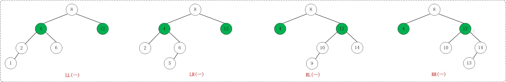
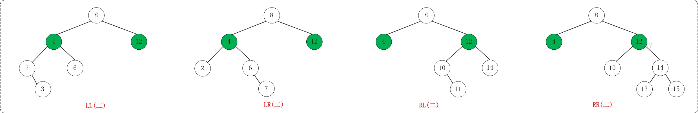
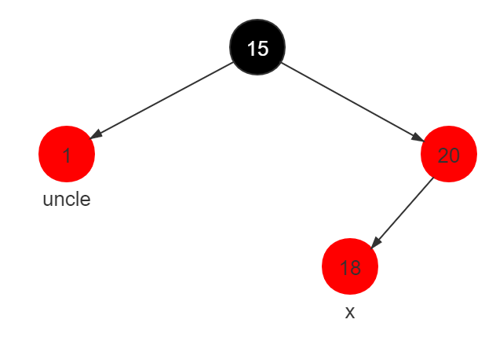
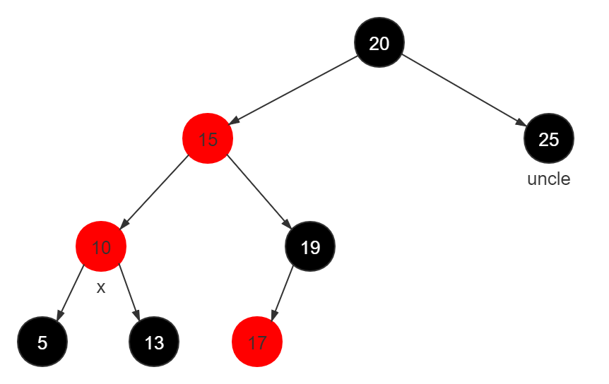
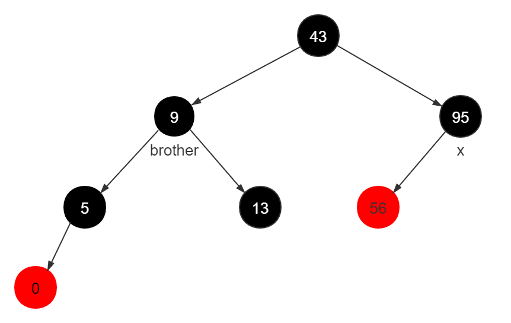
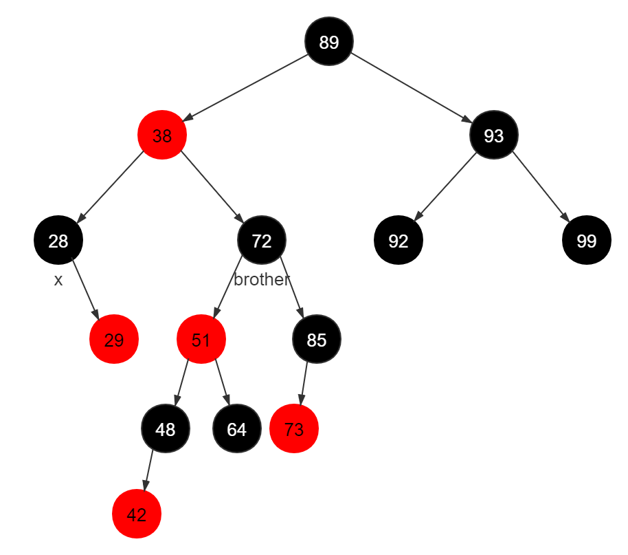
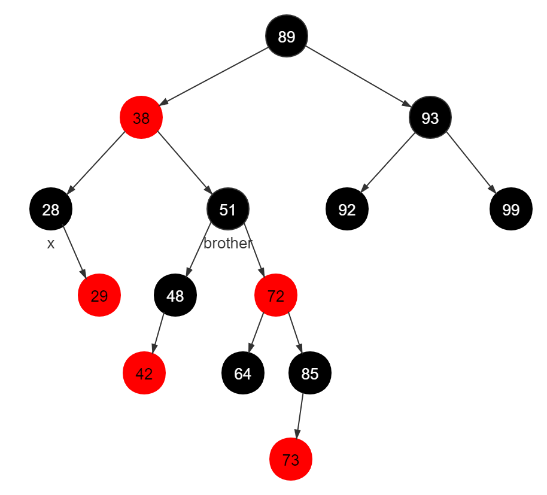
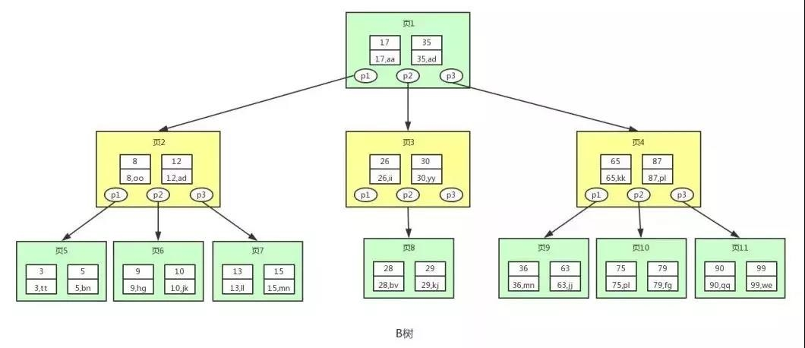
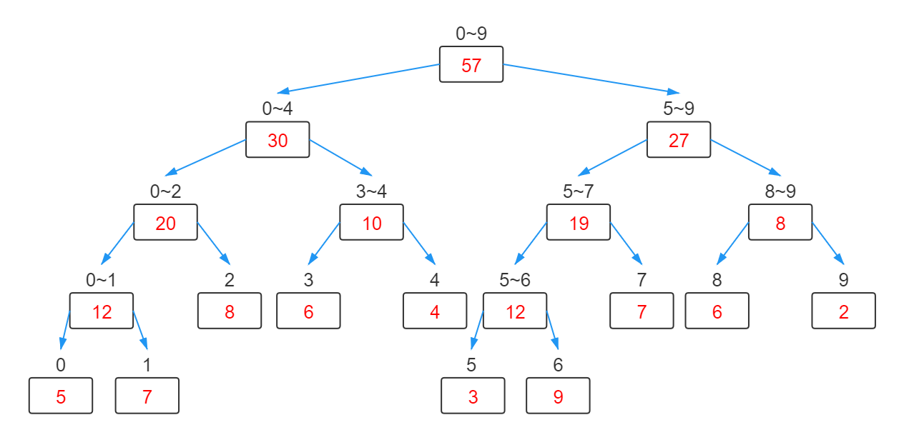

# 第一章 平衡二叉查找树

## 第1节 二叉排序树

**二叉排序树**（Binary Sort Tree），又称**二叉查找树**（Binary Search Tree），亦称**二叉搜索树**。是数据结构（二叉树）中的一类。

### 性质

- 若左子树不空，则**左子树**上所有结点的值均**小于**它的**根结点**的值；
- 若右子树不空，则**右子树**上所有结点的值均**大于**它的**根结点**的值；
- 左、右子树也分别为二叉排序树；
- 没有键值相等的节点


### 特点

- 空树也可以算是二叉排序树
- 中序遍历出来的一定是一个有序序列（对此有序序列中某一个节点，排在其前的一个节点为**前驱**，后一个节点为**后继**；前驱和后继一定度为0或1）


### 用途

- 解决与<u>排名</u>相关的检索需求


### 操作

二叉排序树5大操作：**初始化**，**查找**，**插入**，**删除**，**销毁**

**插入操作：**

1. 插入的新节点，一定会作为叶子节点
2. 新节点比根节点小，则往左子树插入；比根节点大，则往右子树插入

**删除操作：**

1. 删除度为0的节点：直接删除
2. 删除度为1的节点：把孤儿子树挂到其父节点上面去
3. 删除度为2的节点：找到前驱或者后继替换后，可以转化成删除度为1的节点或叶子节点的问题

对于度为2的节点：

1. 前驱：左子树最大值
2. 后继：右子数最小值

平均查找效率：每个节点的查找次数的数学期望（每个节点的查找次数的和除以节点数）

*数据结构，就是定义一种性质，并且维护这种性质*

度为1的节点可能也有前驱和后继


#### 二叉排序树操作代码演示

```c
#include <stdio.h>
#include <stdlib.h>
#define KEY(n) (n ? n->key : 0) //节点地址为真则返回节点的值，否则返回0（防止访问到空指针）
//定义二叉树节点结构体
typedef struct Node {
    int key;
    struct Node *lchild, *rchild;
} Node;
//初始化操作
Node *getNewNode(int key) {
    Node *p = (Node *)malloc(sizeof(Node));
    p->key = key;
    p->lchild = p->rchild = NULL; //新节点为叶子节点
    return p;
}
//查找操作
int search(Node *root, int val) {
    if (root == NULL) return 0;
    if (root->key == val) return 1;
    if (val < root->key) return search(root->lchild, val); //要查找的值比此节点小，则向左子节点递归
    return search(root->rchild, val); //要查找的值比此节点大，则向右子节点递归
}
//插入操作
Node *insert(Node *root, int key) {
    if (root == NULL) return getNewNode(key); //创建叶子节点（或根节点）
    if (root->key == key) return root; //有相同值则不再插入，直接返回
    if (key < root->key) root->lchild = insert(root->lchild, key);
    else root->rchild = insert(root->rchild, key);
    return root;
}
//搜索左子树中的最大值节点
Node *predecessor(Node *root) {
    Node *temp = root->lchild;
    while (temp->rchild) temp = temp->rchild;
    return temp;
}
//删除操作
Node *erase(Node *root, int key) {
    if (root == NULL) return NULL;
    if (key < root->key) {
        root->lchild = erase(root->lchild, key);
    } else if (key > root->key) {
        root->rchild = erase(root->rchild, key);
    } else {
        if (root->lchild == NULL && root->rchild == NULL) { //叶子节点
            free(root);
            return NULL;
        } else if (root->lchild == NULL || root->rchild == NULL) { //度为1
            Node *temp = root->lchild ? root->lchild : root->rchild;
            free(root);
            return temp;
        } else { //度为2
            Node *temp = predecessor(root);
            root->key = temp->key;
            root->lchild = erase(root->lchild, temp->key); //在左子树中删除替换的节点，返回值是左子树的根节点
        }
    }
    return root;
}
//销毁操作
void clear(Node *root) {
    if (root == NULL) return;
    clear(root->lchild);
    clear(root->rchild);
    free(root);
    return;
}

void output(Node *root) {
    if (root == NULL) return;
    output(root->lchild);
    printf("(%d, %d, %d)\n", KEY(root), KEY(root->lchild), KEY(root->rchild));
    output(root->rchild);
    return;
}

int main() {
    int op, val;
    Node *root =  NULL;
    while (~scanf("%d%d", &op, &val)) {
        switch (op) {
            case 0: printf("search %d, result : %d\n", val, search(root, val)); break;
            case 1: root = insert(root, val); break;
            case 2: root = erase(root, val); break;
            case 3: printf("search k = %d, result : %d\n", val, search_k(root, val)); break;
        }
        if (op) {
            output(root);
            printf("------------\n");
        }
    }
    return 0;
}
```


### 扩展内容

1. 二叉排序树的删除代码优化
   删除掉处理度为0的代码逻辑，不影响代码整体功能
2. 如何解决==排名==相关的检索需求  
   - 修改二叉排序树的结构定义，增加size字段，记录每棵树的节点数量
   - $k=LS-1$，根节点就是排名第k位的元素
   - $k \leqslant LS$，排名第k位的元素在左子树中
   - $k>LS，search_k(root->rchild, k-LS-1)$
3. 解决Top-K问题（找到小于第k位的所有元素）  
   - 根节点就是第k位元素的话，就把左子树中的值全部输出出来
   - 第k位在左子树中，前k位元素全都在左子树中
   - 第k位在右子树中，说明根节点和左子树中的元素，都是前k位元素里面的值
4. 二叉排序树和快速排序的关系  
   - 二叉排序树是快速排序树在思维逻辑结构层面用的数据结构
   - 思考1：快速排序的时间复杂度和二叉排序树建树时间复杂度之间的关系
   - 思考2：快速选择算法和二叉排序树之间的关系
   - 程序=算法+数据结构

*所谓算法设计及分析能力：分类讨论及归纳总结的能力*


#### 扩展内容代码演示

```c
#include <stdio.h>
#include <stdlib.h>
#define KEY(n) (n ? n->key : 0) //节点地址为真则返回节点的值，否则返回0（防止访问到空指针）
#define SIZE(n) (n ? n->size : 0)
#define L(n) (n ? n->lchild : NULL)
//定义二叉树节点结构体
typedef struct Node {
    int key, size;
    struct Node *lchild, *rchild;
} Node;
//初始化操作
Node *getNewNode(int key) {
    Node *p = (Node *)malloc(sizeof(Node));
    p->key = key;
    p->size = 1;
    p->lchild = p->rchild = NULL; //新节点为叶子节点
    return p;
}
//更新二叉树节点数量为左子树节点加右子数节点再加本节点
void update_size(Node *root) {
    root->size = SIZE(root->lchild) + SIZE(root->rchild) + 1;
    return;
}
//查找操作-查找某一个数
int search(Node *root, int val) {
    if (root == NULL) return 0; 
    if (root->key == val) return 1;
    if (val < root->key) return search(root->lchild, val); //要查找的值比此节点小，则向左子节点递归
    return search(root->rchild, val); //要查找的值比此节点大，则向右子节点递归
}
//查找操作-查找第k个节点（中序遍历序列）
int search_k(Node *root, int k) {
    if (root == NULL) return -1;
    if (SIZE(L(root)) == k - 1) return root->key;
    if (k <= SIZE(L(root))) { //若左子树节点大于等于序号
        return search_k(root->lchild, k); //递归-在左子树中继续查找
    }
    return search_k(root->rchild, k - SIZE(L(root)) - 1); //递归-在右子树中继续查找
}
//插入操作
Node *insert(Node *root, int key) {
    if (root == NULL) return getNewNode(key); //创建叶子节点（或根节点）
    if (root->key == key) return root; //有相同值则不再插入，直接返回
    if (key < root->key) root->lchild = insert(root->lchild, key);
    else root->rchild = insert(root->rchild, key);
    update_size(root); //更新节点数量
    return root;
}
//搜索左子树中的最大值节点
Node *predecessor(Node *root) {
    Node *temp = root->lchild;
    while (temp->rchild) temp = temp->rchild;
    return temp;
}
//删除操作
Node *erase(Node *root, int key) {
    if (root == NULL) return NULL;
    if (key < root->key) {
        root->lchild = erase(root->lchild, key);
    } else if (key > root->key) {
        root->rchild = erase(root->rchild, key);
    } else {
        if (root->lchild == NULL || root->rchild == NULL) { //度为0或1
            Node *temp = root->lchild ? root->lchild : root->rchild;
            free(root);
            return temp;
        } else { //度为2
            Node *temp = predecessor(root);
            root->key = temp->key;
            root->lchild = erase(root->lchild, temp->key); //在左子树中删除替换的节点，返回值是左子树的根节点
        }
    }
    update_size(root);
    return root;
}
//销毁操作
void clear(Node *root) {
    if (root == NULL) return;
    clear(root->lchild);
    clear(root->rchild);
    free(root);
    return;
}

void print(Node *root) {
    printf("(%d[%d], %d, %d)\n", 
           KEY(root), SIZE(root), 
           KEY(root->lchild), KEY(root->rchild)
    );
    return ;
}
//中序遍历-左根右
void output(Node *root) {
    if (root == NULL) return;
    output(root->lchild);
    print(root);
    output(root->rchild);
    return;
}
//依次输出到第k个节点
void output_k(Node *root, int k) {
    if (k == 0 || root == NULL) return;
    if (k <= SIZE(L(root))) {
        output_k(root->lchild, k);
    } else {
        output(root->lchild);
        print(root);
        output_k(root->rchild, k - SIZE(L(root)) - 1);
    }
    return;
}

int main() {
    int op, val;
    Node *root =  NULL;
    while (~scanf("%d%d", &op, &val)) {
        switch (op) {
            case 0: printf("search %d, result : %d\n", val, search(root, val)); break;
            case 1: root = insert(root, val); break;
            case 2: root = erase(root, val); break;
            case 3: {
                printf("search k = %d, result : %d\n", 
                    val, search_k(root, val)); 
            } break;
            case 4: {
                printf("output top-%d elements\n", val);
                output_k(root, val); 
                printf("------------\n");
            } break;
        }
        if (op == 1 || op == 2) {
            output(root);
            printf("------------\n");
        }
    }
    return 0;
}
```


## 第2节 AVL树

**平衡二叉排序树**，缩写**AVL树**，用来解决二叉排序树查找性能退化的问题（可能退化成链表）

### 性质

平衡二叉树是一棵空树，或者具有以下性质：

- 它的任何结点的左子树和右子树高度最多相差1，即$|H(left)-H(right)|<=1$
- 它的左右两个子树也分别是平衡二叉树

*平衡二叉排序树本质上也是二叉排序树，所以拥有二叉排序树的所有性质*


### 优点

- 由于对每个结点的左右子树的树高做了限制，所以整棵树不会退化成一个链表
- AVL树改进的是节点数量的下限

左旋、右旋：用来解决树高失衡问题


### 失衡类型

LL型、LR型、RL型、RR型





#### LL型和RR型

若将AVL树分为4个子树，LL型指向最左子树插入一个新节点（即最左子树高度+1）后AVL树失衡。LL型失衡满足：

$h_1=max(h_3,h_4)+2=h_2+1$  
其中$h_1$、$h_2$、$h_3$、$h_4$分别是四棵子树的高度

**右旋**即可使LL型AVL树重新平衡

同理**左旋**可以使RR型AVL树重新平衡

#### LR型和RL型

若将AVL树分为4个子树，LR型指向根节点的左子树的右子树插入一个新节点后AVL树失衡。LR型失衡满足：

$max(h_2,h_3)=h_4=h_1$

重新平衡的方法：先使根节点的左子树**左旋**（此时变为LL型），再整棵树**右旋**

同理，RL型先小**右旋**（使根节点的右子树右旋，此时变为RR型），再大**左旋**（整棵树左旋）

#### 总结

AVL树的4个子树中哪一个高度因插入元素变得过高，即为对应位置的失衡

调整原则：每次旋转的总节点数总是最少（即从下往上最早失衡的位置开始调整）

应对策略：

| 失衡类型 | 平衡方法           |
| -------- | ------------------ |
| LL型     | 大右旋             |
| LR型     | 先小左旋，再大右旋 |
| RL型     | 先小右旋，再大左旋 |
| RR型     | 大左旋             |


### 操作

操作代码演示注意事项：

1. 插入和删除以后，注意重新计算树高字段
2. 引入了NIL节点，代替NULL，NULL不可访问，NIL是一个实际节点，可访问

#### AVL树操作代码演示

```c
#include <stdlib.h>
#include <stdio.h>
#define L(n) (n->lchild)
#define R(n) (n->rchild)
#define H(n) (n->h)
//定义AVL树节点
typedef struct Node {
    int key, h; //h是树高
    struct Node *lchild, *rchild;
} Node;
//实现NIL-假的空节点
Node __NIL;
#define NIL (&__NIL)
__attribute__((constructor)) //设置函数属性，使init_NIL函数总在main()函数执行之前被自动执行
void init_NIL() {
    NIL->key = 0, NIL->h = 0;
    NIL->lchild = NIL->rchild = NIL;
    return;
}
//初始化新节点（叶子节点）
Node *getNewNode(int key) {
    Node *p = (Node *)malloc(sizeof(Node));
    p->key = key;
    p->h = 1;
    p->lchild = p->rchild = NIL;
    return p;
}
//更新树的高度
void update_height(Node *root) {
    root->h = (H(L(root)) > H(R(root)) ? H(L(root)) : H(R(root))) + 1;
    return;
}
//左旋
Node *left_rotate(Node *root) {
    Node *temp = root->rchild;
    root->rchild = temp->lchild;
    temp->lchild = root;
    update_height(root); //从下往上更新高度
    update_height(temp);
    return temp;
}
//右旋
Node *right_rotate(Node *root) {
    Node *temp = root->lchild;
    root->lchild = temp->rchild;
    temp->rchild = root;
    update_height(root);
    update_height(temp);
    return temp;
}
//平衡操作
Node *maintain(Node *root) {
    if (abs(H(L(root)) - H(R(root))) <= 1) return root; //已平衡则直接返回
    if (root->lchild->h > root->rchild->h) { //是否是LL型或LR型
        if (root->lchild->lchild->h < root->lchild->rchild->h) { //是否是LR型
            root->lchild = left_rotate(root->lchild); //LR型先左旋
        }
        root = right_rotate(root); //LL型或LR型都会右旋
    } else { //RR型或RL型
        if (root->rchild->rchild->h < root->rchild->lchild->h) { //是否是RL型
            root->rchild = right_rotate(root->rchild); //RL型先右旋
        }
        root = left_rotate(root); //RR型或RL型都会左旋
    }
    return root;
}
//插入操作
Node *insert(Node *root, int key) {
    if (root == NIL) return getNewNode(key); //空的位置插入叶子节点
    if (root->key == key) return root; //树中有相同值则不再插入
    if (key < root->key) {
        root->lchild = insert(root->lchild, key);
    } else {
        root->rchild = insert(root->rchild, key);
    }
    update_height(root);
    return maintain(root);
}
//寻找前驱
Node *predecessor(Node *root) {
    Node *temp = root->lchild;
    while (temp->rchild != NIL) temp = temp->rchild;
    return temp;
}
//删除操作
Node *erase(Node *root, int key) {
    if (root == NIL) return NIL; //无此节点则立即返回
    if (key < root->key) {
        root->lchild = erase(root->lchild, key);
    } else if (key > root->key) {
        root->rchild = erase(root->rchild, key);
    } else { //要删除的节点数值与此节点相等，执行删除操作
        if (root->lchild == NIL || root->rchild == NIL) { //度为1或0的情况
            Node *temp = root->lchild != NIL ? root->lchild : root->rchild;
            free(root);
            return temp;
        } else { //度为2的情况
            Node *temp = predecessor(root);
            root->key = temp->key;
            root->lchild = erase(root->lchild, temp->key);
        }
    }
    update_height(root); //通过递归的方法逐级往上更新高度
    return maintain(root); //通过递归的方法逐级平衡
}
//销毁操作
void clear(Node *root) {
    if (root == NIL) return ;
    clear(root->lchild);
    clear(root->rchild);
    free(root);
    return;
}

void print(Node *root) {
    printf("(%d[%d], %d, %d)\n", 
        root->key, root->h,
        root->lchild->key,
        root->rchild->key
    );
    return;
}
//前序遍历-根左右
void output(Node *root) {
    if (root == NIL) return;
    print(root);
    output(root->lchild);
    output(root->rchild);
    return;
}

int main() {
    int op, val;
    Node *root = NIL;
    while (~scanf("%d%d", &op, &val)) {
        switch (op) { //输入0为删除操作，输入1为插入操作
            case 0: root = erase(root, val); break;
            case 1: root = insert(root, val); break;
        }
        output(root);
        printf("------------\n");
    }
    return 0;
}
```


## 扩展知识 SB树

SB树=节点平衡树（SBT=Size Balanced Tree）

[数据结构SBT](https://my.oschina.net/u/4579195/blog/4682860)

举例：广义表T(L(A, B), R(C, D))

### 性质

- 每棵子树的大小不小于其兄弟的子树大小，即

  $L.size \geqslant C.size, D.size$

  $R.size \geqslant A.size, B.size$

- SBT的高度为$O(log_2n)$

- `maintain`的平摊运行时间是$O(1)$


### 失衡类型

**Case 1:** $A.size > R.size$

右旋T，再按顺序递归调用`maintai(T)`，`maintain(L)`

**Case2:** $B.size > R.size$

左旋L，右旋T，按顺序递归调用`maintain(L)`，`maintain(T)`，`maintain(B)`

**Case 3:** $C.size>L.size$

与Case 1对称

**Case 4:** $D.size>L.size$

与Case 2对称


## 第3节 红黑树

红黑树（Red Black Tree）

### 性质

红黑树是具有以下性质的二叉搜索树：

- 每个节点非黑即红
- 根节点是黑色
- 叶子节点（NIL）是黑色
- 如果一个节点是红色，则它的两个子节点都是黑色的*（两个红色节点不能互为父子）*
- 从任一节点出发到其所有叶子节点路径上，黑色节点数量相同*（一个红黑树中理论最长路径是理论最短路径节点数量的2倍）*

*红黑树也是通过树高来控制平衡条件，相比AVL树树高规则不那么严格，从而平衡调整次数可能更少，树的结构也可能更松散*


### 调整策略

1. 插入调整站在**祖父节点**看

2. 删除调整站在**父节点**看

3. 插入的新节点一定是**红色** *（因为如果插入黑色节点必然会需要调整）*

4. 插入调整一共两种情况，插入调整主要就是为了解决**双红**的情况，并满足调整前后的路径上黑色节点数量相同

5. 删除调整只会在删除**黑色**节点后进行*（因为删除红色节点不会对平衡造成影响）*

6. 删除调整一共三种情况，删除调整主要就是为了解决**双黑**的情况


### 插入调整

红黑树插入的新节点一定是**红色**（因为如果插入黑色节点必然会需要调整）

#### 情况一

uncle为红色



处理办法：1和20修改成黑色，15修改成红色（所谓的红色上浮）

即黑红红--->红黑黑

#### 情况二

uncle为黑色



处理办法：

LL型（图为LL型）：大右旋，20调整成红色，15调整成黑色

LR型：小左旋，变为LL型

RL型、RR型可以据此类推

即先参考AVL树的调整策略，再进行红色上浮或者红色下沉


### 删除调整

删除红色节点，不会对红黑树的平衡产生影响  
删除度为2的黑色节点，可以转化为删除度为0或1的黑色节点  
删除度为1的黑色节点，其唯一子节点一定是红色  
删除度为0的黑色节点，会产生一个双重黑的NIL节点

**如果兄弟节点为红色，通过旋转，可转变成兄弟节点是黑色的情况**

以下只讨论兄弟节点是黑色的三种情况

#### 情况一

双重黑节点的兄弟节点是黑色，兄弟节点下面的两个子节点也是黑色



处理办法：x和brother减少一重黑色，father增加一重黑色

#### 情况二

RL型或LR型

RL中的R指brother在右，L指brother下红色子节点在左



处理办法：（图为RL型）brother右旋，51变黑，72变红，转成处理情况三

即先小右旋，红黑交换，转变为RR型

LR型可以类推

#### 情况三

RR型或LL型



解决办法：（图为RR型）38左旋，由于无法确定48的颜色，所以38改成黑色，51改成38颜色，x减少一重黑色，72改成黑色

即大左旋，再修改三角顶点为原顶点颜色，底边两点改为黑色，x减少一重黑色


### 总结

| 操作       | 情况                                                    | 平衡调整对策                                                 |
| ---------- | ------------------------------------------------------- | ------------------------------------------------------------ |
| 插入情况一 | uncle为红                                               | 红色上浮                                                     |
| 插入情况二 | uncle为黑                                               | 旋转（参考AVL），红色上浮                                    |
| 删除情况一 | brother为黑，其子节点都为黑                             | x和brother减黑，father加黑                                   |
| 删除情况二 | brother在右（左）为黑，其子节点左红右黑（左黑右红）     | 小右（左）旋，红黑交换，变为情况三                           |
| 删除情况三 | brother在右（左）为黑，其子节点左任意右红（左红右任意） | father左（右）旋，brother变为father的颜色，father和brother的右（左）子节点变黑，x减一重黑 |


### 红黑树实现代码演示

```c
#include <stdlib.h>
#include <stdio.h>

typedef struct Node {
    int key;
    int color; // 0 red, 1 black, 2 double black
    struct Node *lchild, *rchild;
} Node;

Node __NIL;
#define NIL (&__NIL)
__attribute__((constructor))
void init_NIL() {
    NIL->key = 0;
    NIL->color = 1;
    NIL->lchild = NIL->rchild = NIL;
    return ;
}

Node *getNewNode(int key) {
    Node *p = (Node *)malloc(sizeof(Node));
    p->key = key;
    p->color = 0; //新插入的节点一定为红色
    p->lchild = p->rchild = NIL;
    return p;
}
//检查该节点是否有红色子节点，有则返回1
int has_red_child(Node *root) {
    return root->lchild->color == 0 || root->rchild->color == 0;
}
//左旋，右子节点上浮，root下沉
Node *left_rotate(Node *root) {
    Node *temp = root->rchild;
    root->rchild = temp->lchild;
    temp->lchild = root;
    return temp;
}
//右旋，左子节点上浮，root下沉
Node *right_rotate(Node *root) {
    Node *temp = root->lchild;
    root->lchild = temp->rchild;
    temp->rchild = root;
    return temp;
}
//插入调整操作
Node *insert_maintain(Node *root) {
    if (!has_red_child(root)) return root; //没有红色子节点则直接返回
    int flag = 0;
    if (root->lchild->color == 0 && root->rchild->color == 0) goto insert_end; //满足则为情况一，执行goto语句，否则为情况二
    if (root->lchild->color == 0 && has_red_child(root->lchild)) flag = 1; //root为祖父节点，从左边调整
    if (root->rchild->color == 0 && has_red_child(root->rchild)) flag = 2; //root为祖父节点，从右边调整
    if (flag == 0) return root; //无需调整
    if (flag == 1) {
        if (root->lchild->rchild->color == 0) { //LR型先小左旋再大右旋
            root->lchild = left_rotate(root->lchild);
        }
        root = right_rotate(root); //LL型直接大右旋
    } else {
        if (root->rchild->lchild->color == 0) {
            root->rchild = right_rotate(root->rchild); //RL型先小右旋再大左旋
        }
        root = left_rotate(root); //RR型直接大左旋
    }
insert_end: //红色上浮
    root->color = 0;
    root->lchild->color = root->rchild->color = 1;
    return root;
}

Node *__insert(Node *root, int key) {
    if (root == NIL) return getNewNode(key);
    if (root->key == key) return root;
    if (key < root->key) {
        root->lchild = __insert(root->lchild, key);
    } else {
        root->rchild = __insert(root->rchild, key);
    }
    return insert_maintain(root);
}
//插入操作的外包装，使根节点保持黑色
Node *insert(Node *root, int key) {
    root = __insert(root, key);
    root->color = 1;
    return root;
}
//寻找前驱
Node *predecessor(Node *root) {
    Node *temp = root->lchild;
    while (temp->rchild != NIL) temp = temp->rchild;
    return temp;
}
//删除调整操作
Node *erase_maintain(Node *root) {
    if (root->lchild->color != 2 && root->rchild->color != 2) return root; //没有双黑子节点则直接返回
    if (has_red_child(root)) { //对于brother节点为红的情况，通过旋转转变为黑的情况
        int flag = 0;
        root->color = 0;
        if (root->lchild->color == 0) {
            root = right_rotate(root); flag = 1;
        } else {
            root = left_rotate(root); flag = 2;
        }
        root->color = 1;
        if (flag == 1) root->rchild = erase_maintain(root->rchild); //由于到右子树路径上多了一个黑所以需要maintain
        else root->lchild = erase_maintain(root->lchild); //同理
        return root;
    }
    if ((root->lchild->color == 2 && !has_red_child(root->rchild)) ||
        (root->rchild->color == 2 && !has_red_child(root->lchild))) { //删除情况一
        root->lchild->color -= 1;
        root->rchild->color -= 1;
        root->color += 1;
        return root;
    }
    if (root->lchild->color == 2) { //双黑节点在左
        if (root->rchild->rchild->color != 0) { //情况二
            root->rchild->color = 0; //brother变红
            root->rchild = right_rotate(root->rchild);
            root->rchild->color = 1; //原brother左子节点变黑（红黑交换）
        }
        root = left_rotate(root);
        root->color = root->lchild->color; //三角形顶点变为左下角的颜色
    } else { //双黑节点在右
        if (root->lchild->lchild->color != 0) {
            root->lchild->color = 0;
            root->lchild = left_rotate(root->lchild);
            root->lchild->color = 1;
        }
        root = right_rotate(root);
        root->color = root->rchild->color;
    }
    root->lchild->color = root->rchild->color = 1; //三角形底边变黑
    return root;
}

Node *__erase(Node *root, int key) {
    if (root == NIL) return NIL;
    if (key < root->key) {
        root->lchild = __erase(root->lchild, key);
    } else if (key > root->key) {
        root->rchild = __erase(root->rchild, key);
    } else {
        if (root->lchild == NIL || root->rchild == NIL) { //要删除的节点度为0或1
            Node *temp = root->lchild != NIL ? root->lchild : root->rchild;
            temp->color += root->color;
            free(root);
            return temp;
        } else { //要删除的节点度为2
            Node *temp = predecessor(root); //寻找到前驱替换
            root->key = temp->key;
            root->lchild = __erase(root->lchild, temp->key); //转变为删除前驱（度为0或1)
        }
    }
    return erase_maintain(root);
}
//删除操作的外包装，使根节点保持黑色
Node *erase(Node *root, int key) {
    root = __erase(root, key);
    root->color = 1;
    return root;
}

void clear(Node *root) {
    if (root == NIL) return ;
    clear(root->lchild);
    clear(root->rchild);
    free(root);
    return ;
}

void print(Node *root) {
    printf("(%d| %d, %d, %d)\n", 
        root->color, root->key,
        root->lchild->key,
        root->rchild->key
    );
    return ;
}
//前序遍历
void output(Node *root) {
    if (root == NIL) return ;
    print(root);
    output(root->lchild);
    output(root->rchild);
    return ;
}

int main() {
    int op, val;
    Node *root = NIL;
    while (~scanf("%d%d", &op, &val)) {
        switch (op) {
            case 1: root = insert(root, val); break;
            case 2: root = erase(root, val); break;
        }
        output(root);
        printf("------------\n");
    }
    return 0;
}
```


## 第4节 B树和B+树

### B树

#### B树的定义

B树（B-tree）是一棵多路平衡查找树



- 根节点关键字数$k$满足：$1 \le k \le m-1$，非根节点关键字数$k$满足：$m/2 \le k\le m-1$
- 每个关键字的左子树中的所有关键字都小于它，而右子树中的所有关键字都大于它
- 所有叶子节点都位于同一层*（根节点到每个叶子节点的长度都相同）*
- 每个节点都存有索引和数据

其中m是阶数，关键字是可以存储的键值对

阶数：描述一棵B树时提前指定，表示了一个节点最多有多少个子节点

#### B树插入节点

**插入规则：**判断当前节点key的个数是否小于等于m-1，如果满足，直接插入即可；如果不满足，将节点的中间的key将这个节点分为左右两部分，中间的节点放到父节点中即可。

#### B树删除节点

**删除规则：**先删除，如果此时$k<m/2$，再先从子节点取*（前驱或后继）*，若没有符合条件的就从父节点取


### B+树

#### B+树与B树的不同点


- 非叶子节点只存储索引，数据都存储在叶子节点
- 每个叶子节点都存有相邻叶子结点的指针，按顺序排列和链接

在MySQL中B+树的非叶子节点的子节点数=关键字数

#### B+树插入节点

**插入规则：**插入节点后，若元素数量大于m-1，按中间元素分裂成左右两部分，中间元素的索引复制到父节点存储，中间元素归属于右部分

#### B+树删除节点

**删除规则：**删除节点后，若元素数量小于m/2，则向兄弟节点借元素（前提是兄弟节点的元素数量大于m/2），然后更新父节点的索引；如果兄弟节点的元素数量不大于m/2，则将当前节点和兄弟节点合并，并且删除父节点中的索引

#### B+树相对于B树的优势

1. 单一非叶子节点存储的元素更多，树的层级更少，所以查询更快
2. 所有数据都存在叶子节点上，每次查找的次数相同，所以查询速度更稳定
3. 叶子节点构成了一个有序链表，缓存命中率更高
4. 遍历整棵树只需要遍历叶子节点即可*（有利于数据库做全表扫描）*


# 第二章 哈夫曼树与哈夫曼编码

## 第1节 哈夫曼编码

### 前置知识

#### 什么是编码

在ASCII编码中  
'a'=97=$(0110\ 0001)_2$  
'0'=48=$(0011\ 0000_2)$

任何信息，在计算机中，都是二进制存储的

信息：“aa00"=$01100001、01100001、00110000、00110000$  
一台计算机传输到另外一台计算机，传输32个比特位  
假设：计算机的网络是32bit/s，所以用时：1s

特定场景：只有a,b,0,1四种字符需要传输  
假设一种编码方式：a: 0, b: 01, 0: 01, 1: 11  
"aa00"=00001010  
在带宽不变的情况下，当前只需要传输0.25s

#### 定长与变长编码

ASCII编码属于一种定长编码  
对于每一个字符，编码长度相同，这就是**定长编码**  
UTF-8编码是变长编码，UTF-16是定长编码

对于每一个字符，编码长度不相同，这就是**变长编码**

可以将定长编码看成是变长编码的特例

通常变长编码比定长编码更优

#### 变长编码应用场景

特定场景：

1. 只有四种字符：ab01
2. 各字符出现概率a: 0.8, b: 0.05, 0: 0.1, 1: 0.05

平均编码长度：

$avg(l)=\sum{l_i}\times{p_i}$

$l_i$：第$i$种字符，编码长度  
$p_i$：第$i$种字符，出现的概率  
$avg$：**平均编码长度**（期望值）

假设，平均编码长度：1.16，估算传输100各字符，需要传输116个比特位

如果使出现概率大的字符编码长度短，使出现概率小的字符编码长度长，理论上可以节省编码长度


### 哈夫曼树

> 给定N个权值作为N个叶子结点，构造一棵二叉树，若该树的带权路径长度达到最小，称这样的二叉树为最优二叉树，也称为哈夫曼树(Huffman Tree)。

[哈夫曼树](https://baike.baidu.com/item/%E5%93%88%E5%A4%AB%E6%9B%BC%E6%A0%91/2305769?fr=aladdin#5)

#### 哈夫曼树的构造

假设有$n$个权值，则构造出的哈夫曼树有$n$个叶子结点。$n$个权值分别设为 $w_1,\ w_2,\ ...,\ w_n$，则哈夫曼树的构造规则为：

1. 将$w_1,\ w_2,\ ...,\ w_n$看成是有$n$棵树的森林(每棵树仅有一个结点)
2. 在森林中选出两个根结点的权值最小的树合并，作为一棵新树的左、右子树，且新树的根结点权值为其左、右子树根结点权值之和
3. 从森林中删除选取的两棵树，并将新树加入森林
4. 重复2、3步，直到森林中只剩一棵树为止，该树即为所求得的哈夫曼树


### 哈夫曼编码

哈夫曼编码（Huffman Coding)是一种前缀编码

> 前缀码：任何一个字符的编码都不能是其他字符编码的前缀，此即前缀码特性。具有前缀码特性的编码即为前缀码。

生成规则：

1. 首先，统计得到每一种字符的概率
2. 将n个字符，建立成一棵哈夫曼树
3. 每一个字符，都落在叶子节点上*（从而不会造成解析冲突）*
4. 按照左0右1的形式，将编码读取出来

举例：

$p(a)=0.8,\ p(b)=0.05,\ p(0)=0.1,\ p(1)=0.05$

按照哈夫曼编码处理后：

a: 0 | b: 110 | 0: 10 | 1: 111

平均编码长度：$1\times0.8+3\times0.05+2\times0.1+3\times0.05=1.3$

**哈夫曼编码是最优的变长编码**

[哈夫曼编码是最优变长编码的证明](https://zhuanlan.zhihu.com/p/42682935)

#### 哈夫曼编码代码演示

```c
#include <stdio.h>
#include <stdlib.h>

#define swap(a, b) {\
    __typeof(a) __c = a;\
    a = b, b = __c;\
}

typedef struct Node {
    char ch;
    double p;
    struct Node *lchild, *rchild;
} Node;

Node *getNewNode(char ch, double per) {
    Node *p = (Node *)malloc(sizeof(Node));
    p->ch = ch;
    p->p = per;
    p->lchild = p->rchild = NULL;
    return p;
}
//结合两个权值最近的节点并返回结合后的根节点地址
Node *CombineNode(Node *a, Node *b) {
    Node *p = getNewNode(0, a->p + b->p); //哈夫曼树中的路径节点不包含字符，权值为两个子节点之和
    p->lchild = a;
    p->rchild = b;
    return p;
}
//把权值最小的节点放于二维数组的第n位
void pick_min(Node **arr, int n) {
    for (int j = n - 1; j >= 0; --j) {
        if (arr[n]->p > arr[j]->p) {
            swap(arr[n], arr[j]);
        }
    }
    return;
}
//建立哈夫曼树
Node *getHuffmanTree(Node **arr, int n) {
    for (int i = 1; i < n; i++) { //n个节点的哈夫曼树需要n-1次结合
        pick_min(arr, n - i); //权值最小的节点放于最后
        pick_min(arr, n - i - 1); //权值倒数第二小的节点放于倒数第二位
        arr[n - i -1] = CombineNode(arr[n - i], arr[n - i - 1]); //注意n-i位地址被丢弃，对应合并后森林只存储新节点地址
    }
    return arr[0]; //返回最终的根节点
}

void __output_encode(Node *root, char *str, int k) {
    str[k] = 0; //字符串结尾'\0'
    if (root->lchild == NULL && root->rchild == NULL) { //叶子节点为编码的字符
        printf("%c %s\n", root->ch, str); //str为字符的编码
        return;
    }
    str[k] = '0';
    __output_encode(root->lchild, str, k + 1);
    str[k] = '1';
    __output_encode(root->rchild, str, k + 1);
    return;
}

void output_encode(Node *root) {
    char str[100]; //声明储存编码的字符串
    __output_encode(root, str, 0);
    return;
}

void clear(Node *root) {
    if (root == NULL) return;
    clear(root->lchild);
    clear(root->rchild);
    free(root);
    return;
}

int main() {
    int n;
    Node **arr;
    scanf("%d", &n); //读入字符个数
    arr = (Node **)malloc(sizeof(Node *) * n);
    for (int i = 0; i < n; i++) {
        char ch[10];
        double p;
        scanf("%s%lf", ch, &p); //以字符串形式读入字符更安全
        arr[i] = getNewNode(ch[0], p);
    }
    Node *root = getHuffmanTree(arr, n);
    output_encode(root);
    clear(root);
    free(arr);
    return 0;
}
```


# 第三章 线段树

## 第1节 线段树



### 问题背景

1. 单点修改，区间查询（基础版）
2. 区间修改，区间查询（进阶版）
3. 单点修改，单点查询（直接使用数组即可）
4. 区间修改，单点查询（第2种情况的特例）

区间修改及查询：

- 修改：`Modify(m，n)` 将数组位置m的数值修改为n
- 查询：`Query(m，n)` 输出从位置m到位置n的所有数值的和


### 性质

线段树（Segment Tree）是一种数据结构

采用了**集合**与**分治**的思想

将数组**分治**为2个**段**，每个段又分治为2个段，如此直到分治到**单个数组**元素为止；每个段的**数值等于**它的**两个子段数值之和**

线段树的特性使得其可以提升区间查询求和的效率

#### 关键词

- 完全二叉树
- 区间
- 向上更新
- 向下标记

#### 时间复杂度

1. 单点修改：$log(n)$
2. 区间查询：$log(n)$
3. 区间修改：$log(n)$


### 基础版线段树

1. 线段树是对于**一维序列**的一种维护结构
2. 采用的**分治**的思想，将总区间分成左右两部分，一直进行下去，直到区间中只剩下一个节点为止
3. 线段树的**叶子节点**，代表了原序列中的单个位置的值
4. 若采用**完全二叉树**的存储结构，通常需要至少$4n$的存储空间
5. 当面对区间修改的时候，基础版的线段树效率上不如直接在一维序列上修改
6. 适用于单点修改、区间查询

#### 代码演示

线段树单点修改与区间查询（最大值）代码演示（c++）

```c++
#include <iostream>
#include <climits>

using namespace std;
#define MAX_N 10000
//定义线段树节点
struct {
    int max_num;
} tree[MAX_N << 2];

int arr[MAX_N + 5]; //声明存储原一维序列的全局变量数组
//更新节点的最大值
void update(int ind) {
    tree[ind].max_num = max(tree[ind << 1].max_num, tree[ind << 1 | 1].max_num);
    return;
}

void build_tree(int ind, int l, int r) {
    if (l == r) {
        tree[ind].max_num = arr[l];
        return;
    }
    int mid = (l + r) >> 1;
    build_tree(ind * 2, l, mid); //ind*2表示线段树的下一层标号
    build_tree(ind * 2 + 1, mid + 1, r);
    update(ind);
    return;
}
//单点修改：从数组的标号ind位开始查找到标号k位，将其修改为val
void modify(int ind, int l, int r, int k, int val) {
    if (l == r) { //叶子节点代表了原序列中单个位置的值
        tree[ind].max_num = val;
        return;
    }
    int mid = (l + r) >> 1;
    if (k <= mid) {
        modify(ind << 1, l, mid, k, val); //位操作ind<<1当于更高效的ind*2运算
    } else {
        modify(ind << 1 | 1, mid + 1, r, k, val); //位操作ind<<1相当于更高效的ind*2+1运算
    }
    update(ind);
    return;
}
//区间查询
int query(int ind, int l, int r, int x, int y) {
    if (l >= x && r <= y) {
        return tree[ind].max_num;
    }
    int ans = INT_MIN;
    int mid = (l + r) >> 1;
    if (mid >= x) { //注意mid在build_tree时被分到了左子树，所以要在左边找最大值
        ans = max(ans, query(ind << 1, l, mid, x, y));
    }
    if (mid < y) {
        ans = max(ans, query(ind << 1 | 1, mid + 1, r, x, y));
    }
    return ans;
}

int main() {
    int n, m, a, b, c;
    scanf("%d%d", &n, &m);
    for (int i = 1; i <= n; i++) {
        scanf("%d", arr + i);
    }
    build_tree(1, 1, n);
    for (int i = 0; i < m; i++) {
        scanf("%d%d%d", &a, &b, &c);
        switch (a) {
            case 1: modify(1, 1, n, b, c); break;
            case 2: {
                if (b > c) {
                    cout << "-2147483648" << endl; //输出INT_MIN
                    break;
                }
                printf("%d\n", query(1, 1, n, b, c));
            } break;
        }
    }
    return 0;
}
```


### 进阶版线段树

1. 适用于区间修改、区间查询
2. 增加了用于区间更新的标记
3. 标记在遍历或查询时需要下沉
4. 标记下沉发生在递归之前，向上更新发生在具有修改操作的递归之后

#### 代码演示

进阶版线段树区间修改与区间查询（元素数值之和）代码演示（c++）

```c++
#include <iostream>

using namespace std;

#define MAX_N 10000
#define define_mid int mid = (l + r) >> 1 //声明区间中点变量的宏定义

struct {
    int sum;
    int tag;
} tree[MAX_N << 2];

int arr[MAX_N + 5];
//向上更新
void update(int ind) {
    tree[ind].sum = tree[ind << 1].sum + tree[ind << 1 | 1].sum;
    return;
}
//标记下沉
void down(int ind, int l, int r) {
    if (tree[ind].tag) {
        int val = tree[ind].tag;
        define_mid;
        tree[ind << 1].sum += val * (mid - l + 1);
        tree[ind << 1].tag += val;
        tree[ind << 1 | 1].sum += val * (r - mid);
        tree[ind << 1 | 1].tag += val;
        tree[ind].tag = 0; //消除父节点的标记
    }
    return;
}

void build_tree(int ind, int l, int r) {
    if (l == r) {
        tree[ind].sum = arr[l]; //叶子节点
        return;
    }
    define_mid;
    build_tree(ind << 1, l, mid); //注意mid在build_tree时被分到了左子树
    build_tree(ind << 1 | 1, mid + 1, r);
    update(ind);
    return;
}
//区间修改
void modify(int ind, int l, int r, int x, int y, int val) {
    if (x <= l && r <= y) {
        tree[ind].sum += val * (r - l + 1); //直接在区间上修改总和的大小
        tree[ind].tag += val; //做标记
        return;
    }
    down(ind, l, r);
    define_mid;
    if (mid >= x) {
        modify(ind << 1, l, mid, x, y, val);
    }
    if (mid < y) {
        modify(ind << 1 | 1, mid + 1, r ,x, y, val);
    }
    update(ind);
    return;
}
//区间查询
int query(int ind, int l, int r, int x, int y) {
    if (x <= l && r <= y) {
        return tree[ind].sum;
    }
    down(ind, l, r);
    define_mid;
    int ans = 0;
    if (mid >= x) {
        ans += query(ind << 1, l, mid, x, y);
    }
    if (mid < y) {
        ans += query(ind << 1 | 1, mid + 1, r, x, y);
    }
    return ans;
}

int main() {
    int n, m;
    scanf("%d%d", &n, &m);
    for (int i = 1; i <= n; i++) {
        scanf("%d", arr + i);
    }
    build_tree(1, 1, n);
    int a, b, c, d;
    for (int i = 0; i < m; i++) {
        scanf("%d%d%d", &a, &b, &c);
        switch (a) {
            case 1: {
                scanf("%d", &d);
                modify(1, 1, n, b, c, d);
            } break;
            case 2: {
                if (b > c) {
                    printf("0\n");
                    break;
                }
                printf("%d\n", query(1, 1, n, b, c));
            } break;
        }
    }
    return 0;
}
```


# 第四章 从递推到动规

## 第1节 递推

### 斐波那契数列

> 兔子繁殖问题
>
> 如果有一对小兔，每一个月都生下一对小兔，而所生下的每一对小兔在出生后的第三个月也都生下一对小兔。那么，由一对兔子开始，满一年时一共可以繁殖成多少对兔子？
>
> 设第n个月的兔子总对数为$f(n)$，则满足斐波那契数列$f(n+2)=f(n+1)+f(n)$
>
> 两种程序实现方式：
>
> 1. 正向：递归（从n递归到1）
> 2. 逆向：循环（从1循环到n）

[斐波那契数列](https://baike.baidu.com/item/%E6%96%90%E6%B3%A2%E9%82%A3%E5%A5%91%E6%95%B0%E5%88%97/99145?fr=aladdin)


### 求解递推问题的步骤

1. 确定递推状态
2. 确定递推公式
3. 程序实现

确定递推状态：确定自变量和因变量等

**容斥原理**——确定递推公式的常用方法


### 练习题

练习题1

> **爬楼梯**
>
> 一个人每次只能走2节楼梯或者3节楼梯，问走到第N节楼梯一共有多少种方法？
>
> 1. 确定递推状态
>
>    f(n)代表走到第n节台阶的方法总数
>
> 2. 确定递推公式
>
>    $f(n)=f(n-2)+f(n-3)$
>
> 3. 程序实现

练习题2

> **墙壁涂色**
>
> 给一个环形的墙壁涂颜色，颜色一共有三种，分别是红、黄、蓝，墙壁被竖直地划分成wallsize个部分，相邻的部分颜色不能相同。请你写出函数paintWallCounts计算出一共有多少种给房间上色的方案。
>
> 方法一：将环形看成条形，首尾颜色不一样；设总共有$n$个部分，第一个部分颜色为$i$，最后一个部分颜色为$j$，$f(n,i,j)$为此条件下的方案数。则方案总数为
> $$
> \sum_{i=1}^n\sum_{j=1}^nf(n,i,j) \ (i \neq j)
> $$
> 方法二：$f(n,i)$表示第一个部分为第$0$种颜色，共$n$个部分，最后一个部分为颜色$i$的方案总数。则方案总数为$3\times(f(n,1)+f(n,2))$
>
> 方案三：$f(n)$代表首尾颜色不同的方案总数，共$n$个部分。按照容斥原理，$f(n)$可以分为第一块和倒数第二块颜色相同和不同两种情况，则有$f(n)=2 \times f(n-2)+f(n-1)$。推广到$k$种颜色，有$f(n)=f(n-2)\times(k-1)+f(n-1)\times(k-2)$

练习题3

> **钱币问题**
>
> 现在给你1、2、5、10、20、50、100、200元若干张，问你想要凑足N元钱，一共有多少种不同的方法？
>
> 设$i$从0到6循环，代表钱币类型；$j$从$value(i)$开始循环到N结束，代表目标金额；$f(i,n)$为使用前$i$种钱币凑足目标金额$j$的方法总数。则$f(i,n)$可以分为使用钱币$i$和不使用钱币$i$两种情况。所以有$f(i,j)=f(i-1,j)+f(i,j-value(i))$


## 第2节 动态规划

### 动态规划

动态规划（Dynamic Programming, DP）

> **数字三角形**
>
> 有一个由数字组成的三角形，站在上一层的某个点，只能到达其下方左右的两个点。现在请找到一条从上到下的路径，使得路径上所有数字相加之和最大。
>
> 方法一：从下往上走
>
> 1. 确定递推状态
>
>    $f(i,j)$代表从底边走到$(i,j)$点所能获得的最大值
>
> 2. 确定递推公式
>
>    $f(i,j)=max[f(i+1,j),f(i+1,j+1)]+val(i,j)$
>
> 3. 递推公式解读
>
>    程序实现时不用做边界判断，最终结果可直接存储在一个变量里
>
> 方法二：从上往下走
>
> 1. 确定递推状态
>
>    $f(i,j)$代表从顶点走到9i,j)点所能获得的最大值
>
> 2. 确定递推公式
>
>    $f(i,j)=max[f(i-1,j),f(i-1,j-1)]+val(i,j)$
>
> 3. 递推公式解读
>
>    程序实现时需要做边界判断，最终结果存储在一组数据中

动态规划是一种求极值的递推问题

[数学归纳法](https://baike.baidu.com/item/%E6%95%B0%E5%AD%A6%E5%BD%92%E7%BA%B3%E6%B3%95/5155524?fr=aladdin)


### 求解动态规划问题的步骤

1. 确定动规状态
2. 确定状态转移方程
3. 正确性证明：数学归纳法
4. 程序实现


### 拓扑序

图形结构是最抽象的数据结构

拓扑序是一种图形结构上的依赖顺序，一个图的拓扑序不唯一

拓扑序的本质作用：把图形结构变长一个一维序列*（原因之一：图形结构不能用循环遍历而一维序列可以）*

所有递推问题的更新过程，本质上满足拓扑序

动态规划状态之间的求解需要满足一定要求的拓扑序


### 练习题

练习题1

> **最长上升子序列**
>
> 有一个数字序列，求其中最长上升子序列的长度。*(上升子序列：从一个序列中挑选出不一定连续的若干数字形成的递增序列)*
>
> 设$f(i)$为以$i$结尾的最长上升序列长度，则有状态转移方程$f(i)=max\{f(j)\}+1$，其中$j<i$且$val(j)<val(i)$
>
> 状态转移的时间复杂度：$O(n^2)$

练习题2

> **最长公共子序列**
>
> 两个字符串，求其两个的最长公共子序列长度。
>
>  设$f(i,j)$为第1个字符串取前$i$位，第2个取前$j$位的最长公共子序列长度，则有状态转移方程：
> $$
> f(i,j)=\{\begin{aligned} & max[f(i-1,j),f(i,j-1)] &val(i) \neq val(j)\\ & f(i-1,j-1)+1 &val(i) = val(j)\end{aligned}
> $$
> 状态转移的时间复杂度：$O(n \times m)$

练习题3

> **切割回文**
>
> 给出一个字符串S，问对字符串S最少切几刀，使得分成的每一部分都是一个回文串。（注意：单一字符是回文串）

练习题4

> **0/1背包**
>
> 给一个能承重$V$的背包，和$n$件物品，我们用重量和价值的二元组来表示一个物品，第i件物品表示为$(V_i,W_i)$，问：在背包不超重的情况下，得到物品的最大价值是多少？
>
> 设$dp[i][j]$代表前$i$个物品，背包最大承重为$j$的情况下，能得到的最大价值。则有状态转移方程：
> $$
> dp[i][j] = max\{\begin{aligned}&dp[i-1][j]\\&dp[i-1][j-v[i]]+w[i]\end{aligned}
> $$
> 时间复杂度：$O(nm)$

代码示例

```c++
#include <iostream>
using namespace std;
#define MAX_N 100
#define MAX_V 10000
int v[MAX_N + 5], w[MAX_N + 5];
int dp[2][MAX_V + 5]; //使用滚动数组的方法优化了dp数组的大小

int main() {
    int V, n;
    cin >> V >> n;
    for (int i = 1; i <= n; i++) cin >> v[i] >> w[i];
    for (int i = 1; i <= n; i++) {
        for (int j = 1; j <= V; j++) {
            dp[i % 2][j] = dp[(i - 1) % 2][j];
            if (j >= v[i]) {
                dp[i % 2][j] = max(dp[i % 2][j], dp[(i - 1) % 2][j - v[i]] + w[i]);
            }
        }
    }
    cout << dp[n % 2][V] << endl;
    return 0;
}
```

进一步优化后的代码

```c++
#include <iostream>
using namespace std;
#define MAX_N 100
#define MAX_V 10000
int dp[MAX_V + 5];

int main() {
    int V, n, v, w;
    cin >> V >> n;
    for (int i = 1; i <= n; i++) {
        cin >> v >> w;
        for (int j = V; j >= v; j--) { //从后往前遍历避免了上个循环的数据丢失
            dp[j] = max(dp[j], dp[j - v] + w);
        }
    }
    cout << dp[V] << endl;
    return 0;
}
```

练习题5

> **完全背包**
>
> 有$N$种物品和一个容量为$V$的背包，每种物品都有无限件可用。第$i$种物品的体积是$C_i$，价值是$W_i$。求解在不超过背包容量的情况下，能够获得的最大价值。
>
> 设$dp[i][j]$代表前$i$个物品，背包最大承重为$j$的情况下，能得到的最大价值。则有状态转移方程：
> $$
> dp[i][j] = max\{\begin{aligned}&dp[i-1][j]\\&dp[i-1][j-v[i]]+w[i]\end{aligned}
> $$
> 时间复杂度：$O(nm)$
> *程序实现只需在练习题4的优化后的代码中将$j$的遍历顺序倒过来即可*

练习题6

> **多重背包**
>
> 有一个能承重$V$的背包，和$n$种物品，每种物品的数量有限多，我们用重量、价值和数量的三元组来表示一个物品，第$i$件物品表示为$(V_i,W_i,S_i)$，问在背包不超重的情况下，得到物品的最大价值是多少？
>
> 使用单一拆分法，把数量为$S_i$件的物品转化为$S_i$件价格相同的物品，从而转化为了0/1背包问题

练习题7

> **扔鸡蛋**
>
> 定义鸡蛋的硬度为$k$，则代表鸡蛋最高从$k$楼扔下来不会碎掉，现在给你$n$个硬度相同的鸡蛋，楼高为$m$，问最坏情况下需要测多少次，可以测出鸡蛋的硬度。
> 
> 设$dp[n][m]$为用$n$个鸡蛋，测$m$层楼，最坏情况下最少测的次数。则按照碎了和没碎两种情况，有状态转移方程：
> $$
> dp[n][m] = min\{max\{\begin{aligned}&dp[n-1][k-1]+1\\&dp[n][m-k]+1\end{aligned}\}
> $$
> 其中$k$为此时测试的楼层


## 第3节 动态规划的优化

### 动态规划优化的分类

1. 状态转移过程的优化：不改变状态定义，使用一些特殊的数据结构或者算法专门优化转移过程
2. 程序实现的优化：例如：01背包问题。状态定义没有变、转移过程也没变
3. 状态定义的优化：从源头进行优化

- 状态定义--->源头
- 转移过程--->过程
- 程序实现--->结果


### 练习题的优化

程序优化举例：01背包，钱币问题，滚动数组

练习题7的优化：

1. 状态转移的优化：通过观察$k$与$dp[n-1][k-1]$与$dp[n][m-k]$之间的关系，最优的转移$k$值，一定发生在两个函数的交点处。优化掉`min`以后，总体时间复杂度变成了$O(n \times m)$
2. 状态定义的优化：
   - 原状态定义所需存储空间与$m$相关，若$m$值域大，可能计算机难以存储
   - 注意到本题中$k$的值域小（当$n=2$时，$k \le \sqrt{2m}$)
   - 当发现某个**自变量**与**因变量**之间存在**相关性**的时候，两者即可对调，本题中可把$dp[n][m]=k$重定义为$dp[n][k]=m$（代表$n$个鸡蛋扔$k$次最多可以测多少层楼），从而实现优化
   - 重定义后的状态转移方程：$dp[n][k]=dp[n-1][k-1]+dp[n][k-1]+1$
   - 优化后动态规划问题转变为普通递推问题

练习题6的优化：

- 对重复物品使用二进制拆分法
- 二进制拆分法，拿14举例，按二进制的形式拆分：1，2，4，7份物品，等同于4份价值递增的物品
- 时间复杂度：$O(n \times m \times \sum_{i=1}^{i=n}{logs_i})$；最优时间复杂度（使用单调队列）：$O(nm)$

练习题1的优化：

- 声明一个`len[i]`数组用以表示长度为$i$的序列的末尾最小值
- 原`dp[i]`数组仍用于存储末尾为$i$的最长上升长度，通过二分法在`len`数组中查找最小的大于等于原序列元素的值，$dp[i]=k$
- 更新$len[k]=val_i$
- 容易证明`len`数组是单调的
- 时间复杂度：$O(nlogl)$

练习题3的优化：

- 提前处理得到`mark`数组，`mark[i]`存储的是所有以$i$位置作为结尾的回文串的起始坐标，避免了大量无用循环遍历过程
- 时间复杂度：$O(n+m)$，其中m是字符串中回文串的数量


# 第五章 单调栈与单调队列

## 第1节 单调队列

单调队列是一种队列内元素具有单调性的特殊队列

最小元素在队首--->递增单调队列
最大元素在队首--->递减单调队列

*如不特别说明，单调队列默认指单调递增队列*

单调队列可以满足：
- 对一些序列的特定查询需求（如一种函数`RMQ(m,n)`查询数组m位到n位的最小值）
- 维护滑动窗口内部的区间最值

**入队操作**：队尾入队，会把之前破坏单调性的元素都从队尾移出（维护单调性）

**出队操作**：如果队首元素超出区间范围，就将元素从队首出队

**元素性质**：队首元素，永远是当前所维护区间的最大/最小值

单调队列均摊时间复杂度：$O(1)$

> **滑动窗口**
>
> 给出一个长度为N的数组，一个长为K的滑动窗口从最左移动到最右，输出窗口在各个位置时的最小值和最大值

代码示例

```c++
#include <iostream>
using namespace std;

#define MAX_N 300000
int q[MAX_N + 5], head = 0, tail = 0;
int val[MAX_N + 5];

int main() {
    int n, k;
    cin >> n >> k;
    for (int i = 1; i <= n; i++) {
        cin >> val[i];
    }
    for (int i = 1; i <= n; i++) {
        while (tail - head && val[q[tail - 1]] > val[i]) --tail; //保证单调性
        q[tail++] = i; //入队操作，注意本程序单调队列用于记录下标
        if (q[head] <= i - k) head++; //保证head指针向前移动即出队操作
        if (i >= k) {
            i > k && cout << " ";
            cout << val[q[head]]; //输出最小值
        }
    }
    cout << endl;
    head = tail = 0;
    for (int i = 1; i <= n; i++) {
        while (tail - head && val[q[tail - 1]] < val[i]) --tail;
        q[tail++] = i;
        if (q[head] <= i - k) head++;
        if (i >= k) {
            i > k && cout << " ";
            cout << val[q[head]]; //输出最大值
        }
    }
    cout << endl;
    return 0;
}
```

> **最大子序和**
>
> 输入一个长度为$n$的整数序列，从中找出一段不超过$M$的连续子序列，使得整个序列的和最大。

代码示例：

```c++
#include <iostream>
#include <climits>
using namespace std;
#define MAX_N 300000
int s[MAX_N + 5], n, m; //s为前i个的整数和
int q[MAX_N + 5], head, tail; //q为单调队列
//读入数据
void read() {
    cin >> n >> m; //n为序列中整数的个数，m为最大连续子序列长度
    for (int i = 1; i <= n; i++) {
        cin >> s[i];
        s[i] += s[i - 1];
    }
    return;
}
//维护s数组的单调队列
int solve() {
    int ans = INT_MIN;
    head = tail = 0;
    q[tail++] = 0;
    for (int i = 1; i <= n; i++) {
        if (i - q[head] > m) head++; //保持区间宽度为m，出队
        ans = max(ans, s[i] - s[q[head]]); //当前位置减单调队列队首元素即为最大和
        while (tail - head && s[q[tail - 1]] > s[i]) --tail;
        q[tail++] = i; //入队
    }
    return ans;
}

int main() {
    read();
    cout << solve() <<endl;
    return 0;
}
```


## 第2节 单调栈

单调栈是一种栈内元素具有单调性的特殊栈

*单调队列看队首，单调栈看栈顶*

- 单调队列擅长维护**区间**最大/最小值
- 单调栈擅长维护**最近**大于/小于关系

单调栈均摊时间复杂度：$O(1)$

> **最大矩形面积**
>
> 给定从左到右多个矩形，已知矩形的宽度都为1，长度不完全相等。这些矩形项链排成一排，求在这些矩形包括的范围内能得到面积最大的矩形，打印出该面积。所求矩形可以横跨多个矩形，但不能超出原由矩形所确定的范围。输入N代表矩形的个数，接下来输入的数分别表示矩形的大小；输出最大矩形面积。
>
> - 左上角坐标和右下角坐标可以唯一确定一个子矩形
> - 确定单独一行，每个矩形右下角坐标落在固定的一行上，可以将问题转化为子问题，即求每个点能构成的合法子矩形数量
> - 可用递增单调栈维护每个矩形的左/右侧最近的小于其高度的矩形位置
> - 设$f(x)$为代表以$x$为右下角坐标所能构成的合法子矩形数量，则有$f(x)=h_x \times (x-i)+f(i)$

代码示例：

```c++
#include <iostream>
using namespace std;
#define MAX_N 100000
int s[MAX_N + 5], top;
int h[MAX_N + 5], n;
int l[MAX_N + 5], r[MAX_N + 5];
//读入所有矩形的高度数据
void read() {
    cin >> n;
    for (int i = 1; i <= n; i++) cin >> h[i];
    return;
}

int solve() {
    h[0] = h[n + 1] = -1; //创建两端高度为-1的矩形方便操作
    top = -1; //栈顶
    s[++top] = 0; //初始化单调栈
    for (int i = 1; i <= n; i++) {
        while (top != -1 && h[s[top]] >= h[i]) --top; //弹栈
        l[i] = s[top]; //把栈顶元素存入左数组，即记录的当前矩形左侧最近的小于其高度的矩形位置
        s[++top] = i; //压栈
    }
    top = -1;
    s[++top] = n + 1;
    for (int i = n; i >= 1; i--) {
        while (top != -1 && h[s[top]] >= h[i]) --top;
        r[i] = s[top]; //把栈顶元素存入右数组
        s[++top] = i;
    }
    int ans = 0;
    for (int i = 1; i <= n; i++) {
        ans = max(ans, h[i] * (r[i] - l[i] - 1));
    }
    return ans;
}

int main() {
    read();
    cout << solve() << endl;
    return 0;
}
```

> **古老的打字机**
>
> 有一台古老的打字机和一篇待打印的文章，文章中有$n$个字符，每个字符会有一个消耗值$C_i$。打字机工作一次会打印若干连续的$k$个字符，同时打字机会有磨损，打字机的单次磨损计算公式为：$(\sum_{i=begin}^{begin+k-1}{C_i})^2+M$，其中$M$是打字机启动一次的固定磨损值，现在给你$n$个字符的消耗值，问你打字机顺序打印出这$n$个字符的最小磨损值为多少？
>
> 设$dp[i]$代表打印前$i$字符的最小消耗，则有状态转移方程：
> $$
> dp[i]=min\{dp[j]+(\sum_{k=j+1}^{i}{C_k})^2+M\}\\=min\{dp[j]+(\sum_{k=1}^{i}{C_k}-\sum_{k=1}^{j}{C_k})^2+M\}
> $$
> 通过枚举$j$作为转移的策略。令$S_i=\sum_{k=1}^{i}{C_k}$，则
> $$
> dp[i]=min\{(dp[j]+S_j^2)-(2S_iS_j)+(S_i^2+M)\}
> $$
> 即dp[i]=转移项+混合项+定值项。若$j$是最优的位置，则对于其他任意的$k$有
> $$
> dp[j]+S_j^2-2S_iS_j<dp[k]+S_k^2-2S_iS_k
> $$
> 设$f(i)=dp[i]+S_i^2$，则有
> $$
> f(j)-f(k)<2S_i(S_j-S_k)\\ \Rightarrow \frac{f(j)-f(k)}{S_j-S_k}<2S_i
> $$
> 进行斜率优化，需要使用单调队列，时间复杂度可以优化为$O(n)$

代码示例：

```c++
#include <iostream>
using namespace std;
#define MAX_N 1000000
#define S(a) ((a) * (a))
long long s[MAX_N + 5], f[MAX_N + 5], dp[MAX_N + 5];
int n, M;
int q[MAX_N + 5], head, tail;

double slope(int i, int j) {
    return 1.0 * (f[i] - f[j]) / (s[i] - s[j]);
}

void read() {
    cin >> n >> M;
    for (int i = 1; i <= n; i++) {
        cin >> s[i];
        s[i] += s[i - 1];
    }
    return;
}

void set_dp(int i, int j) {
    dp[i] = dp[j] + S(s[i] - s[j]) + M;
    f[i] = dp[i] + S(s[i]);
    return;
}

long long solve() {
    head = tail = 0;
    q[tail++] = 0;
    for (int i = 1; i <= n; i++) {
        while (tail - head >= 2 && slope(q[head + 1], q[head]) < 2 * s[i]) ++head;
        set_dp(i, q[head]);
        while (tail - head >= 2 && slope(i, q[tail - 1]) < slope(q[tail - 2], q[tail - 1])) --tail;
        q[tail++] = i;
    }
    return dp[n];
}

int main() {
    read();
    cout << solve() << endl;
    return 0;
}
```


# 第六章 树状数组

## 第1节 前缀和数组

### 概念

原数组：$a_i,\ i=0,1,2,...$
前缀和数组：$S_i= \sum _{j=0}^ia_j, \ i=0,1,2,...,a_i=S_i-S_{i-1}$
差分数组：$x_i=a_i-a_{i-1}, \ i=1,2,3,...$

$a_i$数组是$S_i$数组的差分数组，是$x_i$数组的前缀和数组

### 性质

1. 原数组区间求和操作：
   - $a_i$数组上操作的时间复杂度：$O(n)$
   - $S_i$数组上操作的时间复杂度：$O(1),\ S_i-S_{j-1}= \sum _{k=j}^ia_k$
2. 原数组区间元素修改：
   - $a_i$数组时间复杂度：$O(n)$
   - $x_i$数组时间复杂度：$O(1)$（若$j$为区间左端点$i$为右端点则只需修改$x_j$和$x_i$）

> lowbit函数
>
> 定义：`lowbit(i)`代表`i`这个数字以二进制表示的最后一位1的位权
>
> 则有`lowbit(x) = x & (-x)`
>
> 改进前缀和
> 
> `C[i]`代表前`lowbit(i)`项的和


## 第2节 树状数组

树状数组（即改进前缀和数组C[i]）：用数组来模拟树形结构，用以高效地解决基于区间上的更新和求和问题

### 基本操作

**前缀和查询**：$S[i]=S[i-lowbit(i)]+C[i]$
如：$S[7]=S[6]+C[7]=S[4]+C[6]+C[7]=C[4]+C[6]+C[7]$
时间复杂度：$O(logn)$

**单点修改**：修改$a_i$后再修改$C[i]$，往上修改$C[i+lowbit(i)]$直至修改完毕
时间复杂度：$O(logn)$

> **弱化的整数问题**
>
> 给定长度为$N(N \leq 100000)$的序列$A(0 \leq A_i \leq 100000)$，然后输入$m(m \leq 10^5)$行操作指令。第一类指令形如$C \ l \ r \ d(1 \leq l \leq r \leq N)$，表示把数列中第$l...r$之间的数都加$d(0 \leq d \leq 100000)$；第二类指令形如$Q \ x(x \leq N)$，表示询问序列中第$x$个数的值。
>
> 建立序列$A$的差分数组$x[i]$，使用树状数组$C[i]$维护$x[i]$即可

代码示例

```c++
#include <iostream>
using namespace std;
#define MAX_N 100000
int c[MAX_N + 5];
#define lowbit(x) (x & -x)
void add(int i, int x, int n) { //修改操作
    while (i <= n) {
        c[i] += x;
        i += lowbit(i);
    }
}
//查询操作
int query(int i) {
    int sum = 0;
    while (i) {
        sum += c[i];
        i -= lowbit(i);
    }
    return sum;
}

int main() {
    int m, n, pre = 0, a;
    cin >> n;
    for (int i = 1; i <= n; i++) { //录入每个新的a相当于改变了同位置的差分数组元素，所以进行单点修改
        cin >> a;
        add(i, a - pre, n);
        pre = a;
    }
    cin >> m;
    char s[10];
    int l, r, x;
    for (int i = 0; i < m; i++) {
        cin >> s;
        switch (s[0]) {
            case 'C': { //只需修改差分数组区间两端的元素
                cin >> l >> r >> x;
                add(l, x, n);
                add(r + 1, -x, n);
            } break;
            case 'Q': {
                cin >> x;
                cout << query(x) << endl;
            } break;
        }
    }
    return 0;
}
```

