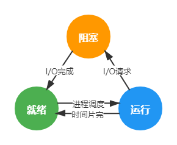
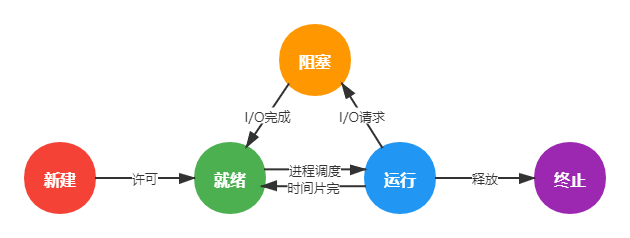
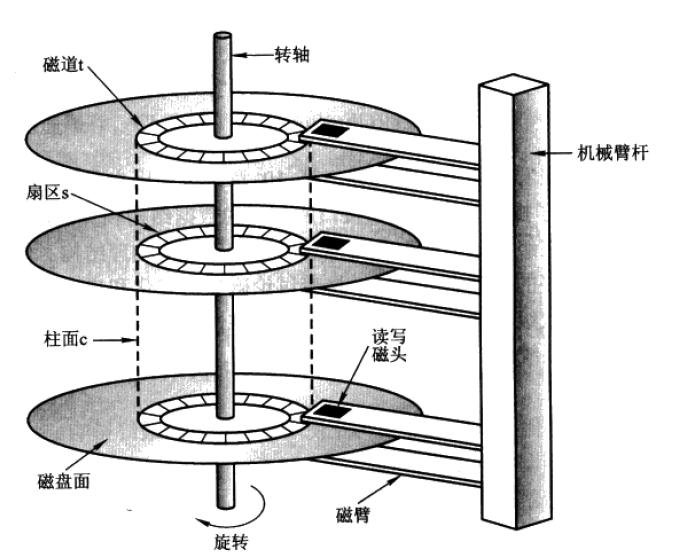

# 计算机操作系统

## 基本概念

**进程**：一个正在执行的程序的实例

进程内容：程序计数器、寄存器、变量值...

**守护进程**（daemon）：具有某些专门功能的后台进程

并发和并行：

- **并发**：宏观上在一段时间内能同时运行多个程序，通常多个线程同时在访问同一个资源
- **并行**：同一时刻能运行多个指令，之后再汇总任务结果

共享：

- **互斥共享**：资源（被称为**临界资源**）在同一时刻只允许一个进程访问，需要同步机制
- **同时共享**：资源在同一时刻允许多个进程访问

虚拟：物理实体---*(虚拟技术)*--->多个逻辑实体

- **时分复用技术**：时分复用技术让每个进程轮流占用处理器，每次只执行一小个时间片并快速切换
- **空分复用技术**：虚拟内存使用了空分复用技术，将物理内存抽象为进程独享的地址空间

**异步**：进程不是一次性执行完毕

操作系统的基本功能：

1. 进程管理
2. 内存管理
3. 文件管理
4. 设备管理

**系统调用**：用户态---*(系统调用)*--->内核态

Linux的系统调用：

1. 进程控制
2. 进程通信
3. 文件操作
4. 设备操作
5. 信息维护
6. 安全

内核结构分类：

- **宏内核**：操作系统主要功能作为一个整体作为内核
  - 优点：高性能
  - 缺点：结构庞大，难以维护
- **微内核**：只保留基本功能在内核
  - 优点：结构简单，便于维护
  - 缺点：频繁在用户态和内核态之间切换，性能低
- **混合内核**：宏内核 + 微内核

中断分类：

1. **外中断**：如I/O中断、时钟中断、控制台中断等
2. **异常**：CPU内部异常，如非法操作码、地址越界、算术溢出等
3. **陷入**：在用户程序中使用系统调用

**文件**：一种对磁盘的抽象建模，是进程创建的信息逻辑单元，提供了一种在磁盘上保存信息而且方便以后读取的方法

## 进程管理

在UNIX系统中，只有一个系统调用可以创建新的进程：`fork`

在调用`fork`后，父进程与子进程之间：

- 相同：
  1. 内存映像
  2. 环境字符串
  3. 打开文件
- 不同：地址空间

UNIX中父子进程之间共享不可写的内存区，或者通过写时复制（copy-on-write）共享所有内存区

UNIX中所有进程都属于以init进程为根的一棵树

**PCB**（Process Control Block）：即**进程控制块**（也叫进程表），描述进程的基本信息和运行状态的一张表，由操作系统维护，所谓的创建进程和撤销进程，都是指对 PCB 的操作

### 进程状态模型

进程三态模型：

进程五态模型：

### 进程与线程

不同进程**不共享**地址空间，同个进程下的线程**共享**地址空间

多线程可以大大提高多I/O任务的处理速度

线程的实现方式：

1. **用户级线程**——用户空间中实现，性能更好、限制少，但不利于阻塞系统调用
2. **内核线程**——内核中实现，便于系统调用，但创建和撤销线程的代价大
3. 用户级线程与内核线程**多路复用**——混合实现，多对一

### 进程调度算法

- 批处理系统：传统大、中型计算机
  1. **先来先服务**（FCFS）：非抢占式，结合一个就绪进程的单一队列
  2. **最短作业优先**（SJF）：非抢占式，只有在所有的作业都可同时运行的情形下才是最优
  3. **最短剩余时间优先**（SRTN）：抢占式，新进程所需时间少则挂起当前进程，运行新进程
- 交互式系统（分时操作系统）：如Linux
  1. **时间片轮转**：所以就绪进程组成一个队列FCFS，每次执行一个时间片
  2. **优先级调度**：为每个进程分配一个优先级，每个时钟中断则降低当前运行进程的优先级，或给每个进程分配一个最大允许时间片
  3. **多级反馈队列**：维护多个时间片大小不同的队列，时间片最小的优先级越高，可以看成时间片轮转 + 优先级调度的结合
  4. 最短进程优先：类似SRTN，运行时间可以通过多次运行时间加权得到
  5. 保证调度：对用户作出明确的性能保证
  6. 彩票调度：拥有抽中"彩票"的进程获得系统资源，更重要的进程可以获得更多"彩票"
  7. 公平共享调度：倾向于对所有用户平分CPU时间
- 实时系统：如CD播放器、飞机自动驾驶系统等
  1. 硬实时：满足截止时间
  2. 软实时：可以一定地超时

### 进程同步

**临界区**：对临界资源进行访问的那段代码

同步与互斥：

- **同步**(synchronization)：多个进程之间因为合作产生的制约关系
- **互斥**(mutex)：多个进程在同一时刻只有一个进程能进入临界区

**信号量**：一个整型变量，大于等于0，等于0则阻塞

PV操作：down和up操作都是**原语**（不可分割的操作）

- P操作(down)：-1
- V操作(up)：+1

信号量底层实现通常为<u>屏蔽中断</u>，多核CPU还需加上<u>锁总线</u>

信号量可以用来实现管程

**互斥量**：简化版的信号量，只有<u>加锁</u>和<u>解锁</u>两种状态

**条件变量**：允许线程由于一些未达到的条件阻塞（原子性地调用并解锁它持有的互斥量）

> 条件变量与互斥量经常一起使用。这种模式用于让一个线程锁住一个互斥量，然后当它不能获得它期待的结果时等待一个条件变量。最后另一个线程会向它发出信号，使它可以继续执行。

**管程**(monitor)：一个编程语言概念

- 任意时刻管程中只能有一个活跃线程
- 互斥由编译器负责
- 通过条件变量 `condition` 和 `wait()` 、`signal()` 操作来实现同步

### 进程通信

为了能够达到进程同步的目的，需要让进程之间进行通信

进程间的7种通信方式：

1. **管道**pipe：
   - 只支持半双工
   - 只能在父子进程或兄弟进程中使用
2. **有名管道**FIFO：去除了管道只能在父子进程或兄弟进程中使用的限制
3. **信号**signal：不同信号用不同的值表示，每个信号设置相应的函数，一旦进程发送某一个信号给另一个进程，另一进程将执行相应的函数进行处理
4. **消息队列**message queue：生产者给MQ发消息，MQ存消息，消费者取消息
5. **信号量**semaphore：一个计数器
6. **共享存储**shared memory：
   - 进程之间可以访问同一块内存空间
   - 最快的一种IPC
   - 需要使用信号量
7. **套接字**socket：网络通信的基本操作单元，实现不同机器间的进程通信

## 死锁

### 必要条件

1. **互斥**：有临界资源
2. **占有和等待**：进程占有一个资源再请求另外的资源
3. **不可抢占**：已被占有的资源不能被抢占
4. **环路等待**：两个及以上的进程组成环路，每个进程都在等待下一个进程

### 处理方法

1. **鸵鸟策略**
   - 死锁造成的**影响小**或发生死锁**概率低**，所以忽略死锁
2. **死锁检测**与**死锁恢复**
   - 死锁检测方式：
     - DFS如果有重复访问，则有死锁
     - 利用两个向量（资源总量和资源剩余量）和两个矩阵（进程占有资源和进程请求资源）做进程标记的搜索
   - 死锁恢复方式：
     - 抢占
     - 回滚
     - 杀死进程
3. **死锁预防**
   - 破坏互斥条件
   - 破坏占有和等待条件
   - 破坏不可抢占条件
   - 破坏环路等待条件
4. **死锁避免**
   - 安全状态
   - 单个资源的银行家算法*（与死锁检测方式一类似）*
   - 多个资源的银行家算法*（与死锁检测方式二类似）*

## 内存管理

### 虚拟内存

虚拟内存的作用：

1. 让物理内存扩充成**更大的**逻辑内存
2. 为每个进程提供了一个**私有的**、**连续的**地址空间

虚拟内存的实现方式：

- **分页**
- **分段**
- **段页式**

**内存管理单元**（MMU）是CPU的一部分或单独的一个芯片，包含**页表**（逻辑地址）和**页框**（物理地址）

逻辑（虚拟）地址 --->TLB（MMU中）--->页表（内存中）---> 物理地址

逻辑地址 = （多级）页面号 + 偏移量

程序通过 MMU 在<u>页表</u>中查<u>页面号</u>对应的位置，该位置页表项最后一位为1代表数据在内存中，0代表不在；若在内存中，则将该页表项的<u>页框号</u>和逻辑地址中的<u>偏移量</u>拼接成**物理地址**，再到物理内存中查找数据；否则发生**缺页中断**

### 页面置换算法

> 虚拟地址空间按照固定大小划分成称为**页面**（page）的若干单元。在物理内存中对应的单元称为**页框**（page frame）

发生**缺页中断**时需要在磁盘中将该页调入内存，如果内存不够则需要采取页面置换算法，将一个页置换到磁盘上

页面置换算法：

1. **最佳OPT**
   - 换出的页面是最长时间内不被访问的页面
   - 理论上存在，实际不存在
3. **最近未使用NRU**
   - 每个页面有两个状态位：R（referenced） 和 M（modified）
   - 被访问则 R = 1，被修改则 M = 1
   - 优先换出 R = 0 且 M = 1 的页面
4. **先进先出FIFO**
   - 换出最先进入的页面
5. **第二次机会**
   - FIFO的改进，页面有状态位 R
   - 队首的页面若 R = 0 则被换出，若 R = 1 则放到队尾，即获得第二次机会
6. **时钟Clock**
   - 第二次机会算法的改进
   - 环形链表，指针指向最老的页面
6. **最近最久未使用LRU**
   - 每次访问需将被访问的页面放置于链表头
   - 页面置换时淘汰的是链表尾的页面
   - 实现方式：
     - 硬件：64位计数器C
     - 软件：
       1. NFU
       2. 老化算法
       3. 哈希表 + 双向链表
7. **工作集算法**
   - 一个进程当前正在使用的页面集合称为它的**工作集**
   - 基本思路是找出一个不在工作集中的页面并淘汰它
   - 实现方式：硬件置R位和M位 + 时钟中断清除R位 + 缺页中断更换候选者
   - 优化版本：结合了Clock算法的**工作集时钟算法WSClock**

**分段管理**：把每个表分成**段**，一个段构成一个独立的地址空间，每个段的长度可以不同，并且可以**动态增长**

**段页式管理**：程序的地址空间划分成多个拥有独立地址空间的段，每个段上的地址空间划分成大小相同的页

## 设备管理

磁盘结构：

一个扇区的大小为512byte或4K，一个页大小通常是4K

寻道时间 > 旋转时间 > 数据传输时间

磁盘调度算法：

1. **先来先服务**FCFS
2. **最短寻道时间优先**SSTF
3. **电梯算法**SCAN：总是按一个方向来进行磁盘调度，直到该方向上没有未完成的磁盘请求，然后改变方向

## 链接

预处理阶段 ---> 编译阶段 ---> 汇编阶段 ---> 链接阶段