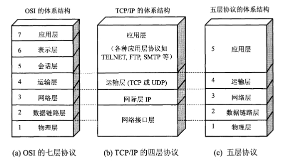
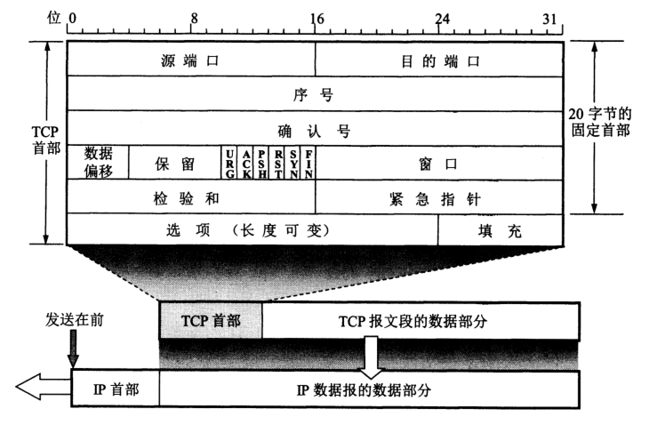
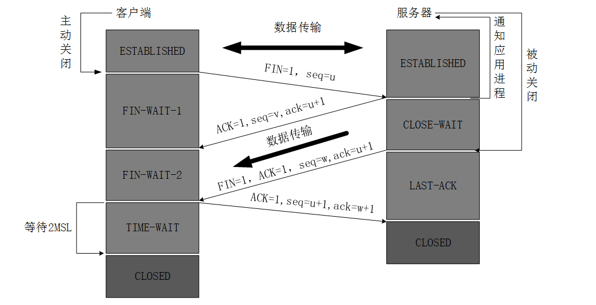

# 计算机网络基础

## 计算机网络体系结构

## 应用层

### HTTP1.0/1.1/2.0的区别

HTTP1.1：

- 更多缓存控制策略：header中有更多相关字段
- 默认长连接：默认开启Connection: keep-alive
- 支持流水线：允许在前一个响应收到之前就发送下一个请求，以降低通信延迟
- 支持同时打开多个TCP连接
- 支持虚拟主机
- 新增状态码，如100、409等
- 新增5中请求方法：OPTIONS、PUT、PATCH、DELETE、TRACE、CONNECT

HTTP2.0：

- 基于二进制格式解析：HTTP1.x的解析是基于文本
- 多路复用：一个连接上可以有多个request
- header压缩：通讯双方各自cache一份header fields表实现了对header的编码
- 服务器推送：服务器给客户端提前发送可能的请求内容到缓存

### HTTPS

HTTPS 并不是新协议，而是让 HTTP 先和 SSL（Secure Sockets Layer）通信，再由 SSL 和 TCP 通信

HTTPS的特点：

- 加密
  - 对称密钥加密：加密和解密使用同一密钥
  - 非对称密钥加密：加密和解密使用不同密钥
  - HTTPS采用混合的加密机制，使用非对称密钥加密方式，传输对称密钥加密方式所需要的 Secret Key，从而保证安全性
  - 获取到 Secret Key 后，再使用对称密钥加密方式进行通信，从而保证效率
- 认证
  - 接收方通过收到的证书对发送方进行验证
  - 证书由数字证书认证机构（CA）分配
- 完整性保护
  - 结合加密和认证这两个操作，避免了报文遭到篡改

## 运输层

### TCP首部格式

TCP首部长度20~60字节

### 三次握手和四次挥手

三次握手

第一次和第二次握手不能携带数据，而且要消耗一个序号；第三次握手可以携带数据，若不携带数据则不消耗序号

四次挥手

MSL（Maximum Segment Lifetime）：报文在网络中最长存活时间

等待2MSL的作用：

1. 确保最后一个ACK报文能到达服务器（没到达服务器会重发FIN）
2. 确保这一次连接中的所有包在网络中都已失效

### TCP协议如何保证可靠传输

1. **分块**：数据分块 ---> 报文段
2. **重排序**：发送端堆包编号，接收端重排序
3. **重复丢弃**：每个数据包都有一个序号，重复序号的包会被接收端丢弃
4. **校验和**：如果收到报文段的校验和有差错，TCP将丢弃这个报文段且不发送ACK，即希望发送端超时重发
5. **流量控制**：TCP利用滑动窗口协议实现流量控制
6. **拥塞控制**：TCP通过维持拥塞窗口（cwnd, congestion window）的状态变量来实现拥塞控制，当网络拥塞时，减少数据的发送；控制算法：慢开始、拥塞避免、快重传、快恢复
7. **超时重传**：如果一个已经发送的报文段在超时时间内没有收到确认，那么就重传这个报文段

### ARQ协议

ARQ协议（Automatic Repeat-reQuest，即自动重传请求）通过使用确认和超时这两个机制，在不可靠服务的基础上实现可靠的信息传输，分为：

- 停止等待ARQ协议
  - 实现了**超时重传**机制
  - 优点是简单，缺点是信道利用率低，等待时间长
- 连续ARQ协议
  - 接收方一般采用累计确认，对按序到达的**最后一个分组**发送确认，表明到这个分组为止的所有分组都已经正确收到了
  - 优点是信道利用率高，缺点是不能向发送方反映出接收方已经正确收到的所有分组的信息

### UDP如何变得可靠

直接从网络结构出发改动UDP协议，**改动量会很大**，最终变得类似TCP协议才能变得可靠，TCP的缺点，包括影响传输速度的**超时重传**和**慢启动**就无法避免

因此可以直接在**应用层**对UDP做优化，关键在于实现**超时重传**和**请求重发**机制

**QUIC**（Quick UDP Internet Connection）：Google对UDP优化的一种解决方案，一种新传输协议

QUIC的优点：

1. 自定义连接机制

   第一次建立连接需要至少2次握手，但重复建立连接只需要一次握手，只要SYN cookie不变就不需要重新建立连接

2. 避免前序包阻塞

   多个数据在TCP连接上传输时，若一个数据包出现问题，TCP需要等待该包重传后，才能继续传输其它数据包；但在QUIC中，因为其基于UDP协议，UDP数据包在出问题需要重传时，并不会对其他数据包传输产生影响

3. FEC前向纠错

   在少量丢包的情况下，可以使用其他数据包的冗余数据完成数据组装而无需重传

4. 关键包发送多次

5. 快速重启会话

   例如手机端切换了无线网会改变本身的IP，这就导致TCP连接必须重新创建；而QUIC协议使用特有的UUID来标记每一次连接，在网络环境发生变化的时候，只要UUID不变，就能不需要握手，继续传输数据

应用：Youtube、Google.com

## 网络层

网络层任务：选择合适的网间路由和交换结点

IP协议、地址解析协议ARP、虚拟专用网VPN、网络地址转换NAT

IP数据报

路由器

## 数据链路层

数据链路层任务：IP数据报 ---> 帧

交换机

在OSI模型中ARP协议属于链路层

## 物理层

物理层任务：实现相邻计算机节点之间比特流的透明传送，尽可能屏蔽掉具体传输介质和物理设备的差异

集线器和中继器