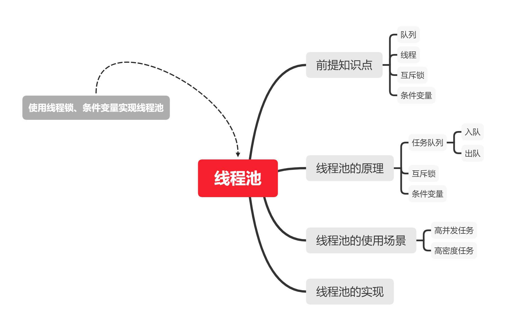

# 第一章 进程间通信

## 基于文件的进程间通信

> **需求描述**
>
> 1. 设置一个并发度`INS`，表示要开的进程数量
> 2. 使用这`INS`个进程，计算从`start`到`end`之间的数字累加和
> 3. `start`和`end`使用`getopt`解析命令行参数
> 4. 输出一个整型`sum`
>
> **注意事项**
>
> 1. 使用`文件`进行数据共享，需要考虑数据竞争`data race`
> 2. 尝试使用`文件锁`来模拟线程之间的互斥锁
> 3. 通过`文件锁`实现了`临界数据`的同步访问
>
> **需要学习的函数及接口**
>
> 1. `flock`

[flock函数：锁定/解锁某一文件的文件锁](https://blog.csdn.net/cywosp/article/details/30083015)  
头文件`#include <sys/file.h>`  
原型`int flock(int fd, int operation);`  
返回0表示成功，返回-1表示错误

代码示例

```c
#include <stdio.h>
#include <unistd.h>
#include <string.h>
#include <stdlib.h>
#include <sys/wait.h>
#include <sys/types.h>
#include <sys/file.h>

#define INS 5
//创建的文件为隐藏文件
char num_file[] = "./.num";
char lock_file[] = "./.lock";

struct Num {
    int now;
    int sum;
};
//声明全局结构体num
struct Num num;
//写文件（覆盖）
size_t set_num(struct Num *num) {
    FILE *f = fopen(num_file, "w");
    size_t nwrite = fwrite(num, sizeof(struct Num), 1, f); //写的元素的个数
    fclose(f);
    return nwrite;
}
//读文件
size_t get_num(struct Num *num) {
    FILE *f = fopen(num_file, "r");
    if (f == NULL) {
        fclose(f);
        perror("fopen()");
        return -1;
    }
    size_t nread = fread(num, sizeof(struct Num), 1, f); //读的元素的个数
    if (nread < 0) {
        fclose(f);
        return -1;
    }
    fclose(f);
    return nread;
}

void do_add(int end, int pid_num) {
    while (1) {
        FILE *lock = fopen(lock_file, "w");
        flock(lock->_fileno, LOCK_EX); //建立相互排斥锁定，其他进程在这步被阻塞
        if (get_num(&num) < 0) { //把文件中的信息读入num
            fclose(lock);
            continue;
        }
        if (num.now > end) {
            fclose(lock);
            break;
        }
        printf("Child <%d> :now = %d, sum = %d\n", pid_num, num.now, num.sum);
        num.sum += num.now;
        num.now++;
        set_num(&num); //把num的信息写入文件
        flock(lock->_fileno, LOCK_UN); //解锁
        fclose(lock);
    }
    return;
}

int main(int argc, char **argv) {
    int opt, start, end;
    while ((opt = getopt(argc, argv, "s:e:")) != -1) {//getopt循环读入参数，读完返回-1
        switch (opt) {
            case 's':
                start = atoi(optarg);//字符串转整型
                break;
            case 'e':
                end = atoi(optarg);
                break;
            default:
                fprintf(stderr, "Usage : %s -s start -e end!\n", argv[0]);
                exit(1);
        }
    }
    printf("start = %d, end = %d!\n", start, end);
    num.now = 0;
    num.sum = 0;
    set_num(&num);
    int pid_num = 0;
    pid_t pid;
    for (int i = 0; i < INS; i++) {
        pid_num = i;
        if ((pid = fork()) < 0) {
            perror("fork()");
            exit(1);
        }
        if (pid == 0) {
            break;
        }
    }
    if (pid == 0) {
        do_add(end, pid_num);
        exit(0);
    }
    int ins = INS;
    while (ins) {
        wait(NULL);
        ins--;
    }
    get_num(&num);
    printf("sum = %d\n", num.sum);
    return 0;
}
```


#### 作业1

> **需求描述**
>
> 1. 设置一个并发度`INS`，表示要开的进程数量
>
> 2. 使用这`INS`个进程，计算从`start`到`end`之间的数字累加和
>
> 3. `start`和`end`使用`getopt`解析命令行参数
>
>    例：
>
>    ```bash
>    ./add -s 12 -e 24
>    ```
>    
> 4. 输出一个整型`sum`
>
> **注意事项**
>
> 1. 使用`共享内存`进行进程间通讯，需要考虑数据竞争`data race`
> 2. 尝试使用**线程之间的互斥锁**来实现进程间同步
> 3. 在共享内存中使用线程锁，应该怎么做？
> 
> **需要学习的函数及接口**
> 
> 1. 共享内存相关接口`shmget`，`shmat`，`...`


# 第二章 进程间通信-共享内存

> 进程：操作系统中资源分配与调度的最小单位

进程间通信（Inter-Process Communication）  
共享内存（shared memory）

[Linux下进程间通信方式——共享内存](https://www.cnblogs.com/wuyepeng/p/9748889.html)

共享内存是IPC通信当中传输速度最快的通信方式

通过**信号量**来实现对共享内存同步访问控制

`shmget`函数：shared memory segment  
创建共享内存，成功则返回共享内存的ID，否则返回-1  
函数原型：  

```c
#include <sys/ipc.h>
#include <sys/shm.h>
int shmget(key_t key, size_t size, int shmflg);
```

`ftok`函数：生成一个`key_t key`从而拿到共享ID

`shmat`函数：将标识符为`shmid`的段和call space的地址空间附着(attach)在一起  
成功返回指向共享存储段的指针，出错返回-1

`shmdt`函数：分离当前进程与共享内存（与`shmat`对应）  
成功返回0，出错返回-1

共享内存代码示例

```c
#include <stdio.h>
#include <stdlib.h>
#include <unistd.h>
#include <sys/types.h>
#include <sys/ipc.h>
#include <sys/shm.h>
#include <string.h>
#include <sys/wait.h>

struct Msg {
    char name[20];
    int age;
};

struct Msg *share_memory = NULL;

int main() {
    int shmid;
    pid_t pid;
    key_t key = ftok(".", 2020); //获取IPC的ID
    if ((shmid = shmget(key, 4096, IPC_CREAT | 0666)) < 0) { //获取共享内存ID(0666代表权限为所有用户可读可写)
        perror("shmget()");
        exit(1);
    }
    if ((share_memory = (struct Msg *)shmat(shmid, NULL, 0)) < 0) { //获取共享段的指针
        perror("shmat()");
        exit(1);
    }
    if ((pid = fork()) < 0) { //创建子进程
        perror("fork()");
        exit(1);
    }
    if (pid == 0) { //子进程对共享内存执行写操作
        memset(share_memory, 0, 4096);
        share_memory->age = 18;
        strcat(share_memory->name, "abc");
    } else { //父进程读共享内存
        wait(NULL);
        printf("%s and %d\n", share_memory->name, share_memory->age);
        shmdt(share_memory);
    }
    return 0;
}
```


## 基于共享内存的聊天室程序

头文件`head.h`

```c
#ifndef _HEAD_H
#define _HEAD_H
#include <stdlib.h>
#include <stdio.h>
#include <unistd.h>
#include <string.h>
#include <sys/types.h>
#include <sys/ipc.h>
#include <sys/shm.h>
#include <sys/wait.h>
#include <pthread.h>
#endif
```

定义信息数据结构的文件`chat.h`

```c
#ifndef _CHAT_H
#define _CHAT_H
#include "head.h"

struct Msg {
    char name[20];
    char msg[1024];
    pid_t server_pid;
    pthread_mutex_t mutex; //锁必需共享
};

#endif
```

服务器端源文件`server.c`

```c
#include "chat.h"

struct Msg *share_memory = NULL;

void print(int signum) {
    pthread_mutex_lock(&share_memory->mutex);
    printf("<%s> : %s\n", share_memory->name, share_memory->msg);
    memset(share_memory->msg, 0, sizeof(share_memory->msg));
    pthread_mutex_unlock(&share_memory->mutex);
}

int main() {
    int shmid;
    key_t key = ftok(".", 20201119);
    if ((shmid = shmget(key, sizeof(struct Msg), IPC_CREAT | 0666)) < 0) {
        perror("shmget()");
        exit(1);
    }
    if ((share_memory = (struct Msg *)shmat(shmid, NULL, 0)) < 0) {
        perror("shmat");
        exit(1);
    }
    memset(share_memory, 0, sizeof(struct Msg));
    pthread_mutexattr_t attr;
    pthread_mutexattr_init(&attr);
    pthread_mutexattr_setpshared(&attr, PTHREAD_PROCESS_SHARED);
    pthread_mutex_init(&share_memory->mutex, &attr); //初始化锁
    strcat(share_memory->name, "server");
    share_memory->server_pid = getpid();
    signal(SIGUSR1, print);
    while (1) {
        sleep(10);
    }
    return 0;
}
```

用户端源文件`client.c`

```c
#include "chat.h"

struct Msg *share_memory = NULL;

int main(int argc, char **argv) {
    int opt;
    char name[20] = {0};
    while ((opt = getopt(argc, argv, "n:")) != -1) {
        switch(opt) {
            case 'n':
                strcpy(name, optarg);
                break;
            default:
                fprintf(stderr, "%s -n name!\n", argv[0]);
                exit(1);
        }
    }
    int shmid;
    key_t key = ftok(".", 20201119);
    if ((shmid = shmget(key, sizeof(struct Msg), IPC_CREAT | 0666)) < 0) {
        perror("shmget");
        exit(1);
    }
    share_memory = shmat(shmid, NULL, 0);
    printf("%s\n", share_memory->name);
    while (1) {
        printf("In while!\n");
        pthread_mutex_lock(&share_memory->mutex); //加锁
        printf("In lock!\n");
        strcpy(share_memory->name, name);
        scanf("%[^\n]s", share_memory->msg);
        pthread_mutex_unlock(&share_memory->mutex); //解锁
        kill(share_memory->server_pid, SIGUSR1); //发送一个信号
        usleep(10000);
        getchar();
    }
    return 0;
}
```

线程锁`pthread_mutex`函数族  
一个进程加锁`pthread_mutex_lock`之后，另外的进程在访问锁时会一直阻塞，直到之前加锁的进程解锁`pthread_mutex_unlock`

[多线程的同步与互斥](https://blog.csdn.net/daaikuaichuan/article/details/82950711)


## 条件变量

`pthread_cond`函数族

`pthread_mutexattr`[互斥量属性](https://blog.csdn.net/qq_41453285/article/details/90904833)

程序流程图



### 在共享内存中使用条件变量

基于聊天室的代码示例

*服务端进程应该先启动*

信息结构体定义文件`chat.h`

```c
#ifndef _CHAT_H
#define _CHAT_H
#include "head.h"

struct Msg {
    char name[20];
    char msg[1024];
    pid_t server_pid;
    pthread_mutex_t mutex;
    pthread_cond_t cond;
};

#endif
```

客户端`client.c`

```c
#include "chat.h"

struct Msg *share_memory = NULL;

int main(int argc, char **argv) {
    int opt;
    char name[20] = {0};
    //获取name参数
    while ((opt = getopt(argc, argv, "n:")) != -1) {
        switch(opt) {
            case 'n':
                strcpy(name, optarg);
                break;
            default:
                fprintf(stderr, "%s -n name!\n", argv[0]);
                exit(1);
        }
    }
    int shmid;
    key_t key = ftok(".", 20201119); //与server使用相同的key
    if ((shmid = shmget(key, sizeof(struct Msg), IPC_CREAT | 0666)) < 0) {
        perror("shmget()");
        exit(1);
    }
    share_memory = shmat(shmid, NULL, 0);
    while (1) {
        char msg[1024] = {0};
        scanf("%[^\n]s", msg); //读取除换行符外的字符串
        getchar();
        if (!strlen(msg)) continue;
        while (1) { //避免客户端在服务端之前抢到锁
            if (!strlen(share_memory->msg)) {
                pthread_mutex_lock(&share_memory->mutex);
                break;
            }
        }
        strcpy(share_memory->name, name);
        strcpy(share_memory->msg, msg);
        printf("Sending : %s\n", share_memory->msg);
        pthread_cond_signal(&share_memory->cond);
        pthread_mutex_unlock(&share_memory->mutex);
        printf("Thread signaled cond!\n");
    }
    return 0;
}
```

服务端`server.c`

```c
#include "chat.h"
//创建共享内存
struct Msg *share_memory = NULL;

int main() {
    int shmid;
    key_t key = ftok(".", 20201119);
    //初始化共享内存数据
    if ((shmid = shmget(key, sizeof(struct Msg), IPC_CREAT | 0666)) < 0) {
        perror("shmget()");
        exit(1);
    }
    if ((share_memory = (struct Msg *)shmat(shmid, NULL, 0)) < 0) {
        perror("shmat()");
        exit(1);
    }
    //初始化互斥锁
    memset(share_memory, 0, sizeof(struct Msg));
    pthread_mutexattr_t attr; //互斥量属性结构体
    pthread_mutexattr_init(&attr); //创建互斥量属性
    pthread_mutexattr_setpshared(&attr, PTHREAD_PROCESS_SHARED); //修改进程共享属性
    pthread_mutex_init(&share_memory->mutex, &attr); //以attr定义的属性初始化一个互斥锁
    //初始化条件变量
    pthread_condattr_t c_attr;
    pthread_condattr_init(&c_attr);
    pthread_condattr_setpshared(&c_attr, PTHREAD_PROCESS_SHARED);
    pthread_cond_init(&share_memory->cond, &c_attr);

    strcat(share_memory->name, "server");
    share_memory->server_pid = getpid();
    while (1) {
        pthread_mutex_lock(&share_memory->mutex);
        printf("Thread got mutex!\n");
        pthread_cond_wait(&share_memory->cond, &share_memory->mutex);
        printf("Thread got a cond signal!\n");
        printf("<%s> : %s\n", share_memory->name, share_memory->msg);
        memset(share_memory->msg, 0, sizeof(share_memory->msg));
        pthread_mutex_unlock(&share_memory->mutex);
    }
    return 0;
}
```


# 第三章 进程间通信-管道

## 管道

`popen()`函数：通过创建一个管道、创建子进程或者调用shell来打开一个路径。

**管道**是另一种进程间通信的方式

`pipe()`函数：创建一个管道，用于进程间的单向信息传输。  
函数原型：`int pipe(int pipefd[2])`  
`pipefd`数组是2个指向管道的文件描述符，其中`pipefd[0]`指向读端的结尾，`pipefd[1]`指向写端的结尾  
成功返回0，出错返回-1

`dup()`函数族：

> duplicate a file descriptor.

复制一个文件描述符。  
`dup()`复制到未被占用的最低的文件描述符，`dup2()`复制到指定的新文件描述符，`dup3()`带flag  
成功则返回新的文件描述符，错误返回-1

### popen()函数

函数定义

```c
#include <stdio.h>
FILE *popen(const char *command, const char *type);
int pclose(FILE *stream);
```

> popen()函数通过创建一个管道，调用fork()产生一个子进程，执行一个shell以运行命令来开启一个进程。这个管道必须由pclose()函数关闭。

type参数只能是"r"或"w"

> 如果type参数不合法，errno将返回EINVAL。

> command参数是一个指向以NULL结束的shell命令字符串的指针。

成功则返回标准I/O流，失败则返回NULL

**open()**、**fopen()**、**popen()**的区别：

- open：打开设备文件
- fopen：打开普通文件
- popen：打开管道

#### 作业2

> 实现自己的`popen`和`pclose`函数
>
> **可能用到的接口和知识点**
>
> 1. fork
> 2. pipe
> 3. close
> 4. exec
> 5. fdopen
> 6. fileno
>
> 关注一下popen的errno
>
> **接口定义**
>
> ```c
> FILE *my_popen(const char *cmd, const char *type);
> int my_pclose(FILE *fp);
> ```
>
> **测试方法**
>
> 1. 写一个单独的主函数，调用自己的`my_popen`执行一条Linux命令，比如`man ls`
>
> ```c
> int main() {
>     FILE *fp;
>     char buff[1024] = {0};
>     if ((fp = my_popen("man ls", "r")) == NULL) {
>         perror("my_popen()");
>         exit(1);
>     }
>     while (fread(buff, 1, 1024, fp) > 0) { //从给定流fp读取数据到buff所指向的数组中
>     	printf("%s", buff);
>         bzero(buff, sizeof(buff)); //将字符串buff的前sizeof(buff)个字节写为0
>     }
>     int status = my_pclose(fp);
>     printf("Exit status : %d\n", status);
>     return 0;
> }
> ```
>

作业2代码示例：

```c
#include "head.h"

static pid_t *childpid = NULL; //childpid数组用来存储子进程的process ID
static int maxsize;

FILE *my_popen(const char *cmd, const char *type) {
    int pfd[2];
    FILE *fp;
    pid_t pid;
    if (type[0] != 'r' && type[0] != 'w' || type[1] != '\0') {
        errno = EINVAL; //如果type参数不合法，errno将返回EINVAL
        return NULL;
    }
    if (childpid == NULL) {
        maxsize = sysconf(_SC_OPEN_MAX); //获取一个进程可同时打开的文件最大数
        if ((childpid = (pid_t *)calloc(maxsize, sizeof(pid_t))) == NULL) {
            return NULL;
        }
    }
    //创建管道
    if (pipe(pfd) < 0) {
        return NULL;
    }
    //创建子进程
    if ((pid = fork()) < 0) {
        return NULL;
    }
    //子进程
    if (pid == 0) {
        if (type[0] == 'r') {
            close(pfd[0]); //pfd[0]是读，pfd[1]是写
            if (pfd[1] != STDOUT_FILENO) {
                dup2(pfd[1], STDOUT_FILENO); //将标准输出重定向至pfd[1]
                close(pfd[1]);
            }
        } else {
            close(pfd[1]);
            if (pfd[0] != STDIN_FILENO) {
                dup2(pfd[0], STDIN_FILENO);
                close(pfd[0]);
            }
        }
        //在/bin/sh目录执行sh，同时命令行参数为-c cmd（NULL表示命令行参数结束）
        execl("/bin/sh", "sh", "-c", cmd, NULL);
        exit(0);
    }
    //父进程获取管道的文件指针赋给fp
    if (type[0] == 'r') {
        close(pfd[1]);
        if ((fp = fdopen(pfd[0], type)) == NULL) {
            return NULL;
        }
    } else {
        close(pfd[0]);
        if ((fp = fdopen(pfd[1], type)) == NULL) {
            return NULL;
        }
    }
    childpid[fileno(fp)] = pid; //记录对应文件描述符的子进程进程ID
    return fp;
}

int my_pclose(FILE *fp) {
    int status, pid, fd;
    if (childpid == NULL) {
        errno = EINVAL;
        return -1;
    }
    fd = fileno(fp);
    pid = childpid[fd];
    if (pid == 0) {
        errno = EINVAL;
        return -1;
    }
    fflush(fp); //刷新fp的输出缓冲区
    close(fd); //关闭fd对应的管道写端或读端
    waitpid(pid, &status, 0); //等待进程ID为pid的子进程退出，将退出状态写进&status
    return status;
}
```


# 第四章 线程池的实现

## 线程池


### 线程池的概念

> 线程池就是首先创建一些线程，它们的集合称为线程池。使用线程池可以很好地提高性能，线程池在系统启动时即创建大量空闲的线程，程序将一个任务传给线程池，线程池就会启动一条线程来执行这个任务，执行结束以后，该线程并不会死亡，而是再次返回线程池中成为空闲状态，等待执行下一个任务。

### 线程池的工作机制

> 1. 在线程池的编程模式下，任务是提交给整个线程池，而不是直接提交给某个线程，线程池在拿到任务后，就在内部寻找是否有空闲的线程，如果有，则将任务交给某个空闲的线程。
> 2. 一个线程同时只能执行一个任务，但可以同时向一个线程池提交多个任务。

### 使用线程池的原因

> 多线程运行时间，系统不断的启动和关闭新线程，成本非常高，会过渡消耗系统资源，以及过渡切换线程的危险，从而可能导致系统资源的崩溃。这时，线程池就是最好的选择了。


# 第五章 进程间通信-socket

## socket编程基础


计算机网络5层结构模型：物理层--->链接层--->网络层--->运输层--->应用层

**TCP**：传输控制协议，面向连接，可靠的数据传输协议  
**UDP**：用户数据报协议，无连接，不可靠的数据传输协议

**IP**：尽力而为交付服务

**socket**：进程和运输层之间的接口，进程要发送网络数据，必需经由socket，交给运输层去交付

`socket()`创建套接字。函数原型：  
`#include <sys/socket.h>`  
`int socket(int domain, int type, int protocol);`  
成功则返回文件描述符，出错返回-1

`bind()`绑定IP和端口  
成功返回0，出错返回-1

`listen()`监听socket  
成功返回0，出错返回-1

`accept()`接受链接  
成功返回新的sockfd  
阻塞式模式下，服务端会在`accept()`处进入睡眠状态直到有客户端连接；非阻塞模式下，服务端在`accept()`将立即返回

`connect()`建立连接  
成功返回0，出错返回-1

`send()`发送数据  
成功返回发送的字节数，出错返回-1

`recv()`接受数据  
成功返回实际读入缓冲的数据的字节数，出错返回-1

`close()`关闭连接

TCP服务端通常的流程：socket--->bind--->listen--->accept--->send/recv--->close   
TCP客户端通常的流程：socket--->connect--->send/recv--->close

端口和IP的数据结构：`struct sockaddr`  
IP地址为无符号32位整型

> sockaddr_in结构体（在netinet/in.h中定义）：
>
> ```c
> struct sockaddr_in {
> 	short int sin_family;   /* Address family */
> 	unsigned short int sin_port;   /* Port number */
> 	struct in_addr sin_addr;   /* Internet address */
> 	unsigned char sin_zero[8];   /* Same size as struct sockaddr */
> };
> 
> struct in_addr {
> 	unsigned long s_addr;
> };
> 
> typedef struct in_addr {
> 	union {
>         struct{
>             unsigned char s_b1, s_b2, s_b3, s_b4;
>         } S_un_b;
>         struct {
>             unsigned short s_w1, s_w2;
>         } S_un_w;
>         unsigned long S_addr;
>     } S_un;
> } IN_ADDR;
> ```
>
> sin_family指代协议族，在socket编程中只能是AF_INET
> sin_port存储端口号（使用网络字节顺序）
> sin_addr存储IP地址，使用in_addr这个数据结构
> sin_zero是为了让sockaddr与sockaddr_in两个数据结构保持大小相同而保留的空字节。
> s_addr按照网络字节顺序存储IP地址

### socket网络通讯服务端的实现

代码示例：

```c
#include "head.h"

int main(int argc, char **argv) {
    int port, sockfd;
    if (argc != 2) {
        fprintf(stderr, "Usage: %s port\n", argv[0]);
        exit(1);
    }
    port = atoi(argv[1]); //将端口号字符串转换为int型
    //创建套接字，IPv4
    if ((sockfd = socket(AF_INET, SOCK_STREAM, 0)) < 0) {
        perror("socket");
        exit(1);
    }
    struct sockaddr_in addr;
    addr.sin_port = htons(port); //将port转换为网络字节序（大端存储）并赋值给端口号变量
    addr.sin_addr.s_addr = htonl(0); //IP地址
    addr.sin_family = AF_INET; //AF_INET代表TCP/IP协议族
	//将本地协议地址与套接字绑定
    if (bind(sockfd, (struct sockaddr *)&addr, sizeof(addr)) < 0) {
        perror("bind");
        exit(1);
    }
	//让套接字处于监听状态（10代表请求队列的最大长度）
    if (listen(sockfd, 10) < 0) {
        perror("lesten");
        exit(1);
    }

    while(1) {
        int newfd;
        char buff[1024] = {0};
        if ((newfd = accept(sockfd, NULL, NULL)) < 0) {
            perror("accept");
            continue;
        }
        recv(newfd, buff, sizeof(buff), 0);
        printf("<recv> : %s\n", buff);
        close(newfd);
    }

    return 0;
}
```


### socket网络编程客户端的实现

代码示例：

```c
#include "head.h"

int main(int argc, char **argv) {
    int sockfd, port;
    char ip[20] = {0};
    if (argc != 3) {
        fprintf(stderr, "Usage : %s ip port\n", argv[0]);
        exit(1);
    }
    strcpy(ip, argv[1]);
    port = atoi(argv[2]);
	//创建IPv4套接字
    if ((sockfd = socket(AF_INET, SOCK_STREAM, 0)) < 0) {
        perror("socket");
        exit(1);
    }

    struct sockaddr_in server;
    server.sin_family = AF_INET;
    server.sin_addr.s_addr = inet_addr(ip); //将IP地址格式转换为无符号长整型
    server.sin_port = htons(port);

    if (connect(sockfd, (struct sockaddr *)&server, sizeof(server)) < 0) {
        perror("connect");
        exit(1);
    }
    send(sockfd, "I'm Here!", 10, 0);
    close(sockfd);

    return 0;
}
```

> `htons()`函数：将一个无符号**短**整型数转换为网络字节序，即大端模式；  
> `htonl()`函数：将一个无符号**长**整型转换为网络字节序。


#### 作业3-AutoTask001

> TCP客户端的实现
>
> 需要满分通过本测试
>
> 测试地址：123.57.102.65:8888

**测试说明：**

1. 实现自己的客户端，连接到测评地址
2. 无需发送任何信息
3. 循环收取服务端返回的数据，服务端会发送**整型**的数给你：
   1. 当收到`1`的时候，发送自己的手机号`+25分`
   2. 当收到`2`的时候，发送自己的真实姓名`+25分`
   3. 当收到`3`的时候，发送自己的真实姓名和手机号，用下面的结构体封装`+50分`
   4. 当收到`4`的时候，关闭连接，没有关闭连接则`-15分`

```c
struct UserInfo{
    char name[50];
    char phone[20];
};
```

**注意事项：**

本次测评时间截止到：2020-11-30 20:00:00

2020-11-29 00:00:00起：总分下降为`90%`

2020-11-29 12:00:00起：总分下降为`80%`

2020-11-29 20:00:00起：总分下降为`70%`


**作业3代码示例**

**客户端：**

tcp_client.h

```c
#ifndef _TCP_CLIENT_H
#define _TCP_CLIENT_H

int socket_connect(char *ip, int port);

#endif
```

tcp_client.c建立socket并连接服务端的方法有复用的可能性，所以写成独立代码文件

```c
#include "head.h"

int socket_connect(char *ip, int port) {
    int sockfd;
    if ((sockfd = socket(AF_INET, SOCK_STREAM, 0)) < 0) {
        return -1;
    }
    struct sockaddr_in server;
    server.sin_family = AF_INET;
    server.sin_port = htons(port);
    server.sin_addr.s_addr = inet_addr(ip);

    if (connect(sockfd, (struct sockaddr *)&server, sizeof(server)) < 0) {
        return -1;
    }
    return sockfd;
}
```

client.c

```c
#include "head.h"

struct UserInfo {
    char name[50];
    char phone[20];
};


int main(int argc, char **argv) {
    int sockfd;
    char name[50] = {0};
    char phone[20] = {0};
    char ip[20] = {0};
    int port;
    struct UserInfo info;

    if (argc != 3) {
        fprintf(stderr, "Usage : %s ip port!\n", argv[0]);
        exit(1);
    }

    strcpy(ip, argv[1]);
    port = atoi(argv[2]);

    if ((sockfd = socket_connect(ip, port)) < 0) {
        perror("socket_connect");
        exit(1);
    }

    strcpy(name, "李歆飏");
    strcpy(phone, "18845782818");
    strcpy(info.name, name);
    strcpy(info.phone, phone);

    while (1) {
        int num;
        if (recv(sockfd, &num, sizeof(num), 0) != 4) { //recv函数返回接收到的字节数，整型为4字节
            fprintf(stderr, "Data Error!\n"); //返回值不等于4则报错
            exit(1);
        }
        if (num == 1) {
            send(sockfd, (void *)phone, strlen(phone), 0);
        } else if (num == 2) {
            send(sockfd, (void *)name, strlen(name), 0);
        } else if (num == 3) {
            send(sockfd, (void *)&info, sizeof(info), 0);
        } else {
            close(sockfd);
            return 0;
        }
    }
    return 0;
}
```

**服务端：**

tcp_server.h

```c
#ifndef _TCP_SERVER_H
#define _TCP_SERVER_H

int socket_create(int port);

#endif
```

tcp_server.c

```c
#include "head.h"

int socket_create(int port) {
    int server_listen;
    if ((server_listen = socket(AF_INET, SOCK_STREAM, 0)) < 0) {
        return -1;
    }
    struct sockaddr_in server;
    server.sin_family = AF_INET;
    server.sin_port = htons(port);
    server.sin_addr.s_addr = inet_addr("0.0.0.0"); //0.0.0.0代表允许任何IP地址连接

    if (bind(server_listen, (struct sockaddr *)&server, sizeof(server)) < 0) {
        return -1;
    }
    if (listen(server_listen, 20) < 0) { //使服务端开始监听客户端请求
        return -1;
    }

    return server_listen;
}
```

server.c

```c
#include "head.h"

struct UserInfo {
    char name[50];
    char phone[20];
};

int main(int argc, char **argv) {
    int server_listen, sockfd, port;
    char name[50] = {0}, phone[20] = {0};
    struct UserInfo info;
    bzero(&info, sizeof(info));
    if (argc != 2) {
        fprintf(stderr, "Usage : %s port!\n", argv[0]);
    }
    port = atoi(argv[1]);
	//创建套接字
    if ((server_listen = socket_create(port)) < 0) {
        perror("socket_create");
        exit(1);
    }

    while (1) {
        struct sockaddr_in client;
        bzero(&client, sizeof(client));
        socklen_t len = sizeof(client);
        //接收客户端的IP和端口等信息，并返回客户端的套接字标识
        if ((sockfd = accept(server_listen, (struct sockaddr *)&client, &len))) {
            perror("accept");
            exit(1);
        }
        
        int tmp = 1;
        send(sockfd, (void *)&tmp, sizeof(int), 0);
        recv(sockfd, (void *)phone, sizeof(phone), 0);
        printf("Phone = %s\n", phone);
        tmp = 2;
        send(sockfd, (void *)&tmp, sizeof(int), 0);
        recv(sockfd, (void *)name, sizeof(name), 0);
        printf("Name = %s\n", name);
        tmp = 3;
        send(sockfd, (void *)&tmp, sizeof(int), 0);
        recv(sockfd, (void *)&info, sizeof(info), 0);
        printf("Phone = %s\n", info.phone);
        tmp = 4;
        send(sockfd, (void *)&tmp, sizeof(int), 0);

        if (recv(sockfd, (void *)&tmp, sizeof(tmp), 0) == 0) {
            printf("Connection Close!\n");
            close(sockfd);
        }
    }

    return 0;
}
```


#### 作业4-AutoTask002

> TCP`并发`服务端的实现
>
> 需要满分通过本测试
>
> 测试地址：123.57.102.65 9000

**测试说明**

1. 实现自己的服务端，基于多进程或者多线程实现
2. 服务端不能主动断开连接，所有连接由测评机先断开
3. 测评机会发起`100`个并发连接
4. 每个连接会给你发一个字符串，字符串长度不超过`1024`字节
5. 在你收到字符串之后，应该`原封不动`地将数据返回给测评机
6. 当你感知到测评机断开连接之后，关闭自己的连接

**测评方式**

> 本次测评，需要使用`船长`写好的辅助测评工具

1. 将辅助测评工具(`可能缺少部分缺口`)，调试，编译，并安装到本地（可在任何地方执行）`checkme`
2. 运行自己的待测程序（需要提前解除阿里云`端口`限制）
3. 执行`checkme 123.57.102.65 9000`
4. 按照`checkme`的引导完成测评即可（需要输入自己的`端口`）
5. 测评结果将通过终端直接公布，同时也在站点公布：http://123.57.102.65/pages/2020/test002_score.html

**注意事项**

本次测评时间截至搭配：2020-11-30 20:00:00

2020-12-4 18:00:00起：总分下降为`90%`

2020-12-7 12:00:00起：总分下降为80%

讲解后：总分下降为`70%`


# 第六章 高级进程管理

## 高级进程管理


# 第七章 计算机网络概论

## 计算机网络概论

多种网络模型

### OSI七层参考模型


1. 物理层
2. 数据链路层（含网卡）
3. 网络层
4. 传输层
5. 会话层
6. 表示层
7. 应用层

### TCP/IP五层模型


本地局域网通信不需要IP地址

网络协议的组成要素：**语法**、**语义**、**同步**

## 分组交换

UDP比TCP更具时效性


## 电路交换


# 第八章 应用层

## 应用层协议

### 网络应用程序的体系结构

1. **CS结构**：客户端-服务器体系结构

   家庭网络、移动网络-数据中心

2. **P2P结构**：端到端结构

P2P的特点与挑战  
**特点：**两主机为对等方，有良好的扩展性  
**挑战：**ISP友好、安全性、合适的激励

进程通信：P2P结构中没有明确的客户端和服务端

进程与计算机网络之间的接口

可供应用程序使用的运输服务：  
应用程序服务要求：  

- 可靠数据传输
- 吞吐量
- 定时
- 安全性

运输层协议：TCP、UDP

## WEB与HTTP协议

HTTP：超文本传输协议(HyperText Transfer Protocol)

HTTP是一个无状态协议，服务器不存储关于客户的状态信息

HTTP默认端口80

客户端发起TCP连接--->客户端请求文件--->服务端传送文件--->客户端接收整个文件

WEB缓存器（代理服务器）

HTTPS(SECURE HTTP)：比HTTP多一步加密/解密  
HTTPS默认端口443

## FTP协议

FTP的TCP连接：

- TCP控制连接端口21
- TCP数据连接端口20

## SMTP、POP3、IMAP协议


## DNS协议


## TCP协议

TCP报文


# 第九章 运输层

## 可靠传输协议的实现


#### 作业5-AutoTask003-文件传输

**接受文件数据**

1. 测评机会发送一个文件给你，请你保存在本地，并在后面回传给测评机
   1. 首先测评机会发送一个`uint64_t`的整型，告诉你这个文件的大小
   2. 接着，测评机会直接发送数据给你，你需要自己判断文件什么时候发送结束
   3. 并关闭数据连接
2. 文件为普通的文本文件，收到后，可以用`vim`，`cat`等查看是否接受完全
3. 接受的数据，如果不能保证完全正确，后续的测评将无法得分

**发送文件数据到测评服务器**

1. 连接到测评机后，直接发送文件
2. 发送完毕后关闭连接
3. 长时间未有数据到达，测评机会直接关闭连接，不得分


# 第十章 网络层

## 网络层协议

IP地址

IP地址的分类

ARP协议的作用


# 第十一章 链路层

## 链路层


# 第十二章 IO多路复用

## IO多路复用


# 第十三章 mmap与信号量

## mmap与信号量


# P2P聊天室

## P2P聊天室